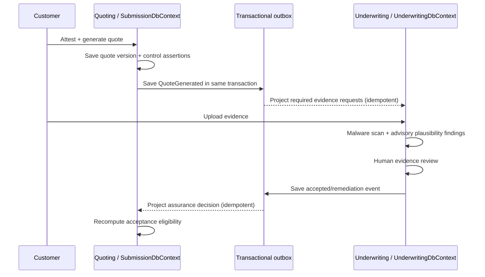

# Architecture Overview

LIAnsureProtect is designed as a modular, production-style cyber specialty insurance platform.

The core idea is simple:

- PostgreSQL is the system of record, like the official filing cabinet.
- pgvector extends PostgreSQL later for AI/RAG embeddings so vector search stays in the same PostgreSQL system of record.
- Redis is the fast cache, like a sticky note for data we can rebuild.
- DynamoDB is used later for notification read models, like a fast mailbox for each user.
- S3 is used later for private document storage.
- SNS and SQS are used later for durable event processing.

## High-Level Shape

```text
React Frontend
  |
  | HTTPS
  v
ASP.NET Core Web API
  |
  |-- PostgreSQL + pgvector: system of record and later vector search
  |-- Redis: cache
  |-- Local/S3 storage: documents
  |-- Outbox: domain events
  |
Workers
  |
  |-- SQS consumers
  |-- Notification processing
  |-- Audit processing
  |-- AI review processing later
```

## Control assurance across Quoting and Underwriting

Quoting owns what the customer claimed and how it affected rating. Underwriting owns the evidence
used to test that claim. They do not write each other's tables:



This is a two-ledger design: the Quote lifecycle (`Quoted`, `Referred`, `Accepted`, `Bound`) is not
overwritten by assurance (`SelfAttested`, `EvidenceRequired`, `Verified`, `Rejected`). Like a passport
application, the submitted form and the verification result are related but not the same record.
Every projector deduplicates by source outbox-message id, so retrying delivery cannot create duplicate
requests or count one review twice.

## Backend Layers

- Domain: business entities, enums, value objects, and domain rules.
- Application: use cases, DTOs, validators, interfaces, and authorization-friendly business workflows.
- Infrastructure: EF Core, PostgreSQL, Redis, DynamoDB, S3, messaging, and other external services.
- Api: HTTP endpoints, authentication, authorization, middleware, Swagger/OpenAPI, and health checks.
- Workers: background processors and queue consumers.

Application and Infrastructure each expose a dependency-registration extension method. API and Worker startup call those methods so future use cases, repositories, storage services, caches, and messaging adapters can be registered inside their owning layer instead of being scattered through each host.

Current architecture guard tests read the project files and verify the intended project-reference direction:

- Platform.Abstractions references no project (the shared-kernel ports depend on nothing).
- Platform references Platform.Abstractions only.
- Domain references Platform.Abstractions (for the shared domain-event base).
- Application references Domain, plus the Underwriting module Application during the strangler read/write seams.
- Infrastructure references Application, Domain, selected module Application projects, the Underwriting module Domain for centralized event deserialization during the M37 cut-over, and Platform.Abstractions.
- Api references Application, Infrastructure, module Infrastructure projects, and Platform.
- Worker references Application, Infrastructure, module Infrastructure projects, and Platform.

A module-boundary ratchet test also discovers any `src/Modules/*` project and proves no module
references another module or a legacy layer.

## Modular Monolith And Platform (Milestone 32)

Starting in Milestone 32 the project evolves from a single layered solution into a **modular
monolith of bounded contexts** with a **Local ⇄ AWS deploy switch**, one always-green milestone at
a time. The architecture rests on three ideas, each documented richly under `docs/concepts/`:

- **[Clean Architecture](../concepts/clean-architecture.md)** — layering *inside* each unit
  (Domain → Application → Infrastructure → host).
- **[Modular Monolith](../concepts/modular-monolith.md)** — many bounded-context modules in one
  deployable, each its own projects and [its own DB schema](../concepts/schema-per-module.md).
- **[Ports & Adapters](../concepts/ports-and-adapters.md)** — every infrastructure concern is a
  port with swappable Local/AWS adapters, selected by the
  [`Platform:Profile` switch](../concepts/deployment-profiles-local-aws-switch.md).

```text
src/
├─ Platform/
│  ├─ LIAnsureProtect.Platform.Abstractions   ← shared-kernel PORTS (domain-event base, IClock,
│  │                                             PlatformProfile/PlatformOptions); references nothing
│  └─ LIAnsureProtect.Platform                 ← shared-kernel ADAPTERS + base infra
│                                                (ModuleDbContext base, SystemClock, AddPlatform switch)
├─ Modules/<Context>/{Domain,Application,Infrastructure}   ← carved one per milestone (M33+)
├─ LIAnsureProtect.Domain / Application / Infrastructure   ← legacy layers, strangled over time
└─ LIAnsureProtect.Api / Worker                            ← composition roots; AddPlatform + profile
```

Milestone 32 is **behavior-preserving**: it builds the Platform shared kernel, the `Modules/`
placeholder, the profile switch (first proven on document storage), the schema-per-module
`ModuleDbContext` template, and the architecture-test ratchet. It deliberately does **not** split the
existing `SubmissionDbContext` or move any table — because the transactional outbox is captured inside
that context's `SaveChangesAsync`, the first real context carve (Notifications) waits for Milestone 33.
See [schema-per-module](../concepts/schema-per-module.md) for the full reasoning.

Milestone 33 performs that **first carve**: the Notifications context moves into
`src/Modules/Notifications/{Domain,Application,Infrastructure}` with its own `NotificationsDbContext`
owning a dedicated `notifications` schema. The outbox dispatcher (still in legacy Infrastructure,
because it knows other contexts' domain events) feeds the module through the `INotificationProjector`
port using **idempotent ordered projection** — project to the inbox (idempotent on the source outbox
id) → publish → mark the outbox row processed — so the cross-context handoff needs no distributed
transaction. Because there are now two `DbContext`s, every `dotnet ef` command takes `--context` and
the dev scripts + CI apply both contexts' migrations.

Milestones 35 through 37 carve the Underwriting module in slices instead of one risky move. The module
already owns `UnderwritingDbContext` and the `underwriting` schema. Advisory AI review moved first,
then referral operations, then evidence request/review state. M37 also adds a module-owned outbox table
inside `UnderwritingDbContext`; the legacy dispatcher now drains all registered `IOutboxSource`s and
merge-orders pending messages by `CreatedAtUtc`. That lets a module evidence event and a legacy quote
decision event flow through notifications/referral projection in causal order even while the overall
outbox mapping remains centralized in legacy Infrastructure.

Milestone 39 introduces the Quoting module boundary without moving quote tables yet:

```text
src/Modules/Quoting/
├─ LIAnsureProtect.Modules.Quoting.Domain
├─ LIAnsureProtect.Modules.Quoting.Application      ← final referral decision commands + port
└─ LIAnsureProtect.Modules.Quoting.Infrastructure   ← module composition root
```

The final approve/decline/adjust command contracts now live in Quoting Application, and the API sends
those commands while keeping the existing underwriting workbench routes. The legacy Infrastructure layer
implements the Quoting-owned `IQuoteReferralDecisionService` port until the `Quote` aggregate and quote
tables can move in a later, larger Quoting carve. This keeps the module rule intact: Quoting does not
reference legacy layers; legacy Infrastructure references the module Application port while it still owns
the current persistence adapter.

Milestone 40 decouples the dispatcher consumer side. `OutboxDispatcher` no longer directly calls
central static mapper switches. It drains every registered `IOutboxSource`, merge-orders rows by
`CreatedAtUtc`, and hands each row to registered `IOutboxMessageConsumer` implementations:

```text
OutboxDispatcher
  -> ReferralOperationOutboxMessageConsumer
       -> OutboxMessageMapperRegistry<ReferralOperationEvent>
       -> IReferralOperationProjector
  -> NotificationOutboxMessageConsumer
       -> OutboxMessageMapperRegistry<NotificationMessage>
       -> INotificationProjector
       -> INotificationPublisher
```

The event-specific mapping logic is now split into registered mapper classes keyed by the existing
outbox `Type` string. This preserves current ordering, retry, poison, notification, and referral
projection behavior while making the dispatcher open to new integration consumers without editing its
core loop. It also keeps the milestone narrow: no quote/rating/policy tables moved, no public routes
changed, and no EF migration was needed.

Milestone 41 adds the first production-shaped observability baseline around the host and dispatcher
path without introducing a telemetry backend yet. The Platform shared-kernel contracts define stable
observability names (`ActivitySource`, `Meter`, metric names, and `X-Correlation-ID`). The API adds
request correlation middleware that echoes or generates `X-Correlation-ID`, places correlation details
in the request log scope, keeps `/api/v1/health` stable, and adds explicit probe routes:

```text
GET /api/v1/health/live
GET /api/v1/health/ready
```

Readiness checks all four current EF Core contexts: `SubmissionDbContext`, `NotificationsDbContext`,
`UnderwritingDbContext`, and `ClaimsDbContext`. The dispatcher now emits native .NET activities, structured logs, counters
for batches/pending/processed/failed messages, and a duration histogram. Exporters and dashboards
remain later infrastructure work; M41 exposes the signals that OpenTelemetry, CloudWatch, X-Ray, or
Datadog can subscribe to later.

The July 2026 customer-error and notification hardening slice builds on that baseline at both host
edges. The API has a central exception handler and Problem Details filter: reviewed 4xx contracts keep
stable public codes and actionable text, while unknown 5xx internals are logged with correlation and
replaced by safe customer output. `RequestOutcomeMiddleware` emits route-template/status-class/duration
signals and Production/Aws composition roots use JSON console logs. React feature clients share one
Zod-validated error boundary and an application error boundary; optional browser telemetry is
disabled by default and accepts only sanitized categories through a deployment-provided RUM adapter.

Evidence and quote navigation now distinguish collection from identity:

```text
GET /api/v1/evidence-requests                     -> owner cursor-paged summaries, no documents
GET /api/v1/evidence-requests/{evidenceRequestId} -> one owner detail with documents
GET /api/v1/submissions/{submissionId}/quotes/{quoteId} -> exact owner quote version
```

Notification actions carry those exact IDs. The creating Quoting/Underwriting transaction adds safe
display snapshots to the existing domain event and transactional outbox; the Notifications projector
stores the snapshot. Inbox reads therefore remain self-contained and do not cross into another
context to decorate a title. The production collector, CloudWatch resources, alarms, and RUM identity
remain Terraform-owned infrastructure described in the production observability runbook.

## Role-aware contextual search and human references

The July 2026 navigation/search hardening adds one immutable human-facing alternate key to a
Submission while retaining its UUID as the technical key:

```text
Submission.Id        = UUID used by routes, joins, events, and id-only context seams
Submission.Reference = SUB-2026-8A9B7C6D5E4F3210 used by people, lists, and support
```

Search remains context-local. Each Application query first obtains the complete owner-scoped or
role/team-scoped read set and only then narrows it with search and workflow filters. Customer pages
cannot request adjuster/underwriter filters, and an Admin uses the widest filter set only on an
operational route the Admin policy already authorizes. There is deliberately no global search service
or cross-schema search join.

The Underwriting referral queue illustrates the cache rule: the existing unfiltered, shared 10-second
queue remains the sole cached value; `SearchQuoteReferralsQuery` filters that complete cached result.
Creating one cache key per filter combination would make invalidation incomplete.

Evidence requests add `EvidenceDocumentRequirement` in the Underwriting Domain. Automatic control
assurance requests are `Required`; manual Underwriting requests choose Required/Optional/NarrativeOnly.
The command handler enforces the contract, while React only mirrors it for early guidance. Submission
reference and company name are copied as read/display snapshots across the existing port; Underwriting
does not take ownership of the Submission aggregate.

## Application Use Case Pattern

Milestone 4 - Application Use Case Foundation introduced practical CQRS with MediatR and FluentValidation.

Use practical CQRS inside the modular monolith:

- Commands model Application requests that change state.
- Queries model Application requests that read state.
- Command and query handlers live in the Application layer.
- PostgreSQL remains the single system of record; do not split read and write databases at this stage.

Use MediatR as the in-process dispatcher:

```text
API Controller or Worker
  -> MediatR
  -> pipeline behaviors
  -> command/query handler
```

Use FluentValidation for request validation before handlers run. Validation should check request shape and input rules. Domain objects should still protect business invariants.

Use Moq in unit tests only when a handler depends on an interface that should be replaced with a test double. Do not add Moq unless a test needs it.

The first Milestone 4 submission slice uses this flow:

```text
POST /api/v1/submissions
  -> SubmissionsController
  -> CreateSubmissionCommand
  -> validation pipeline behavior
  -> CreateSubmissionCommandHandler
  -> Submission.CreateDraft(...)
  -> ISubmissionRepository.AddAsync(...)
  -> IUnitOfWork.SaveChangesAsync(...)
```

`ISubmissionRepository` lives in Application because the use case needs a storage promise, not a database detail. `IUnitOfWork` also lives in Application because the use case needs a commit promise without knowing that EF Core performs the actual database save.

Simple analogy:

```text
Application:
  "I need a filing tray for submissions."

Infrastructure today:
  "Here is the real PostgreSQL filing cabinet."
```

Milestone 5 - Persistence Foundation replaced the temporary in-memory repository with EF Core and PostgreSQL persistence in Infrastructure. The current persistence flow is:

```text
CreateSubmissionCommandHandler
  -> ISubmissionRepository.AddAsync(...)
  -> EfCoreSubmissionRepository
  -> SubmissionDbContext.Submissions.AddAsync(...)
  -> IUnitOfWork.SaveChangesAsync(...)
  -> EfCoreUnitOfWork
  -> SubmissionDbContext.SaveChangesAsync(...)
  -> PostgreSQL
```

Local development runs PostgreSQL as a Docker Compose dependency using a pgvector-enabled image. The first persistence migration creates the `vector` extension now so the database is ready for later AI/RAG vector tables without changing the system-of-record decision.

Simple analogy:

```text
Repository:
  "Put this submission into the filing tray."

Unit of Work:
  "Commit everything in the tray to the filing cabinet."
```

The first public business endpoint is:

```text
POST /api/v1/submissions
```

Milestone 6 - Authentication Foundation protects this endpoint with the `Submissions.Create` policy. Anonymous callers receive `401 Unauthorized`, and authenticated callers without an allowed role receive `403 Forbidden`.

Allowed roles for creating submissions:

```text
Customer
Broker
Admin
```

The controller is intentionally thin. It translates HTTP JSON into an Application command and translates Application validation failures into `400 Bad Request` validation problem details. Authentication and authorization run before the Application use case begins.

Recommended Application folder shape once the first business slice exists:

```text
src/LIAnsureProtect.Application/
  Common/
    Behaviors/
      ValidationBehavior.cs
    Exceptions/
      ValidationException.cs

  Submissions/
    Commands/
      CreateSubmission/
        CreateSubmissionCommand.cs
        CreateSubmissionCommandHandler.cs
        CreateSubmissionCommandValidator.cs
    Queries/
      GetSubmissionDetails/
        GetSubmissionDetailsQuery.cs
        GetSubmissionDetailsQueryHandler.cs
```

Recommended request flow:

```text
API/Worker
  -> MediatR
    -> pipeline behaviors
      -> FluentValidation
      -> command/query handler
        -> Domain rules
        -> Application interfaces
          -> Infrastructure implementations
            -> PostgreSQL/storage/cache/messaging later
```

Milestone 10 - Submission List And Detail Foundation uses the same pattern for read workflows.

The project will use REPR-style thinking for the read endpoints:

```text
Request -> Endpoint -> Response
```

This does not mean replacing the existing controller-based API. It means each controller action should still have a clear request shape, a thin endpoint method, an Application query, and an explicit response shape.

Milestone 10 read flows:

```text
GET /api/v1/submissions
  -> SubmissionsController
  -> ListSubmissionsQuery
  -> ListSubmissionsQueryHandler
  -> ISubmissionRepository.ListAsync(...)
  -> EfCoreSubmissionRepository
  -> SubmissionDbContext.Submissions.AsNoTracking()
  -> PostgreSQL
```

```text
GET /api/v1/submissions/{submissionId}
  -> SubmissionsController
  -> GetSubmissionDetailQuery
  -> GetSubmissionDetailQueryHandler
  -> ISubmissionRepository.GetDetailAsync(...)
  -> EfCoreSubmissionRepository
  -> SubmissionDbContext.Submissions.AsNoTracking()
  -> PostgreSQL
```

Milestone 11 - Submission Ownership Foundation keeps the same read flow shape, but adds the first row-level ownership boundary. The authenticated user's stable user id from `ICurrentUser.UserId` is stored on new submissions as `OwnerUserId`, persisted in PostgreSQL as `owner_user_id`, and passed explicitly into list/detail repository reads.

Milestone 11 owner-scoped read flows:

```text
GET /api/v1/submissions
  -> Submissions.Read authorization policy
  -> ListSubmissionsQueryHandler
  -> ICurrentUser.UserId
  -> ISubmissionRepository.ListAsync(ownerUserId, ...)
  -> SubmissionDbContext.Submissions.AsNoTracking()
  -> Where(submission => submission.OwnerUserId == ownerUserId)
  -> PostgreSQL
```

```text
GET /api/v1/submissions/{submissionId}
  -> Submissions.Read authorization policy
  -> GetSubmissionDetailQueryHandler
  -> ICurrentUser.UserId
  -> ISubmissionRepository.GetDetailAsync(submissionId, ownerUserId, ...)
  -> SubmissionDbContext.Submissions.AsNoTracking()
  -> Where(submission => submission.Id == submissionId)
  -> Where(submission => submission.OwnerUserId == ownerUserId)
  -> PostgreSQL
```

These read flows intentionally do not add a separate read database, cache, domain events, outbox, API Gateway, or BFF. Those are useful patterns for later milestones when the product has a concrete need for them.

The EF Core read implementation uses LINQ intentionally:

- `AsNoTracking()` because list/detail pages only display data and do not need EF Core change tracking.
- `OrderByDescending(...)` so the list shows newest submissions first.
- `Where(...)` so list/detail queries filter by owner id and the detail query also filters by submission id in the database.
- `Select(...)` so each query projects only the fields needed by the response.

The read implementation does not use `Include(...)`, `AsSplitQuery()`, lazy loading, or eager-loading navigation graphs because `Submission` currently has no related entity collection to load. It also does not use `HasQueryFilter(...)` yet because this milestone is intentionally teaching the ownership boundary explicitly at the repository methods where list/detail reads are introduced. A future milestone can revisit global query filters if many owned aggregates need the same rule and the project has enough tests to make hidden filters safe.

Domain events and a transactional outbox are planned later for reliable asynchronous workflows. Event sourcing is not part of the initial architecture. It may be considered later only for selected workflows if replayable history provides enough value to justify the added complexity.

Milestone 12 - Submission Submit And Domain Events Foundation introduces the first domain event, but deliberately does not persist or dispatch it yet.

Submit flow:

```text
POST /api/v1/submissions/{submissionId}/submit
  -> Submissions.Submit authorization policy
  -> SubmitSubmissionCommandHandler
  -> ICurrentUser.UserId
  -> ISubmissionRepository.GetOwnedForUpdateAsync(submissionId, ownerUserId, ...)
  -> Submission.Submit()
  -> SubmissionSubmittedDomainEvent recorded on the aggregate
  -> IUnitOfWork.SaveChangesAsync(...)
  -> PostgreSQL status update
```

The repository uses a tracked EF Core entity for submit because the status changes from `Draft` to `Submitted`. This is different from the list/detail reads, which still use `AsNoTracking()` because they only display data.

Domain events are currently stored only on the in-memory aggregate instance:

```text
Submission.DomainEvents
```

That is a temporary milestone boundary, not the final production async design. The next durable step is:

```text
SubmissionSubmittedDomainEvent
  -> transactional outbox row in PostgreSQL
  -> Worker-hosted dispatcher
  -> SNS/SQS or another downstream adapter later
```

The existing `LIAnsureProtect.Worker` project is the right host shape for future background dispatch work because it is a .NET Worker Service that already composes Application and Infrastructure through the same dependency-registration methods as the API. Milestone 12 does not use it yet because there is no outbox table or pending durable work to process.

Milestone 13 - Transactional Outbox Foundation adds that first durable event table:

```text
Submission.Submit()
  -> SubmissionSubmittedDomainEvent
  -> SubmissionDbContext.SaveChangesAsync(...)
  -> submissions row status changes to Submitted
  -> outbox_messages row is inserted
  -> one PostgreSQL transaction
```

The outbox table lives in the same PostgreSQL database as `submissions`.

It is not a separate PostgreSQL database and it is not a NoSQL store.

Why:

- The outbox row must be committed atomically with the business change.
- A separate database would need cross-database/distributed transaction coordination.
- A NoSQL store would be useful for later read models or notification inboxes, but not for the first write-side outbox guarantee.
- PostgreSQL can efficiently handle the outbox shape because rows are small, append-oriented, and indexed for future pending-message dispatch.

Current outbox flow:

```text
outbox_messages
  id
  type
  payload jsonb
  occurred_at_utc
  created_at_utc
  processed_at_utc
  publish_attempt_count
  last_publish_attempt_at_utc
  next_attempt_at_utc
  provider_message_id
  failed_at_utc
  error
```

Milestone 13 writes pending rows only. Milestone 14 - Outbox Dispatcher Foundation adds the first local Worker-side consumer path. Milestone 21 - Notification And Outbox Publishing Foundation turns selected quote and policy outbox rows into provider-shaped local notification messages before marking them processed.

```text
outbox_messages where processed_at_utc is null
  -> OutboxDispatcher
  -> map selected domain events to NotificationMessage
  -> INotificationPublisher
  -> local provider-shaped publisher
  -> mark published rows processed
  -> leave transient failures retryable
  -> record poison failures for investigation
  -> SubmissionDbContext.SaveChangesAsync(...)
  -> processed_at_utc, provider_message_id, retry, or failure metadata is updated
```

Simple analogy:

```text
Milestone 13:
  Put sealed envelopes in the outgoing mail tray.

Milestone 14:
  Teach the office clerk to pick up envelopes from the tray
  and stamp them as handled.

Milestone 21:
  Teach the clerk to hand selected envelopes to a local mail provider,
  record the provider receipt, and only stamp the envelope handled after
  the provider accepts it.
```

The current dispatcher is still intentionally local and in-process. It publishes provider-shaped notification messages through an Application-owned boundary and a local Infrastructure implementation. It does not publish to production SNS/SQS, send real email/SMS, write a notification inbox, manage user notification preferences, execute webhooks, use a circuit breaker, generate quotes, or enqueue underwriting work. Those features need their own milestones because each one adds a new responsibility and new failure modes.

Current notification event coverage:

- `QuoteGeneratedDomainEvent`
  - `Quoted` quotes map to a customer/broker quote-ready notification.
  - `Referred` quotes map to an underwriting-operations review-needed notification.
- `QuoteUnderwritingDecisionRecordedDomainEvent` maps to a customer/broker underwriting decision notification.
- `QuoteAcceptedDomainEvent` maps to a binding-operations notification.
- `PolicyBoundDomainEvent` maps to a customer/broker policy-bound notification that includes the policy number.
- `QuoteEvidenceRequestCreatedDomainEvent` maps to a customer/broker evidence-request notification.
- `QuoteEvidenceRequestRespondedDomainEvent` maps to an underwriting-operations evidence-response notification.
- `QuoteEvidenceRequestAcceptedDomainEvent` and `QuoteEvidenceRequestCancelledDomainEvent` map to customer/broker evidence-review outcome notifications.
- `QuoteEvidenceRequestFollowUpSentDomainEvent` maps to a customer/broker evidence follow-up reminder notification.
- `QuoteEvidenceRequestRemediationRequiredDomainEvent` maps to a customer/broker remediation-required notification for `Insufficient` and `NeedsClarification` review outcomes.

Milestone 31 - Notification Inbox Read Model Foundation adds the missing receiving half. Until now the dispatcher only *published* notifications (to a local provider) and then forgot them, so no user could read them. The dispatcher now also drops a per-recipient copy into a PostgreSQL `notification_inbox_entries` read model:

```text
outbox_messages (pending)
  -> OutboxDispatcher maps the event to a NotificationMessage (unchanged)
  -> if Audience == customer-or-broker:
       write a notification_inbox_entries row (idempotent on source outbox message id)
  -> publish + mark processed (unchanged)
  -> one SubmissionDbContext.SaveChangesAsync(...)   <- inbox row commits with the outbox state

GET  /api/v1/notifications              -> owner-scoped list (newest first) + unread count
POST /api/v1/notifications/{id}/read    -> owner-scoped, idempotent mark-as-read
```

Only person-addressed (`customer-or-broker`) notifications are persisted to the inbox in this milestone; team-addressed audiences (`underwriting-operations`, `binding-operations`) need a different fan-out model and are deferred to a later "team inbox" milestone. The inbox is intentionally PostgreSQL-first behind the Application-owned `INotificationInboxRepository`; a DynamoDB read-model implementation can replace it later behind the same interface, mirroring how document storage started local before S3. Reads are owner-scoped through `ICurrentUser` and guarded by the new `Notifications.Read` policy.

The Worker flow is:

```text
LIAnsureProtect.Worker
  -> create dependency-injection scope
  -> resolve IOutboxDispatcher
  -> DispatchPendingMessagesAsync(...)
  -> delay briefly
  -> repeat until the Worker stops
```

Why the Worker creates a scope each loop:

- `SubmissionDbContext` is scoped.
- The dispatcher depends on `SubmissionDbContext`.
- A long-running background service should not keep one database context alive forever.
- Creating a small scope per polling pass gives each pass a clean database unit of work.

Milestone 15 - Idempotent Submission Actions Foundation adds the first retry-safety layer for protected write endpoints.

Current idempotent endpoints:

```text
POST /api/v1/submissions
POST /api/v1/submissions/{submissionId}/submit
```

The API supports an optional request header:

```text
Idempotency-Key: client-generated-unique-key
```

When the header is present, the controller builds an idempotency request from:

```text
key
owner user id
action name
request fingerprint
```

The request fingerprint is a SHA-256 hash of the HTTP method, route template, and request body or route data.

Current idempotency flow:

```text
Client POST with Idempotency-Key
  -> authorization policy
  -> SubmissionsController
  -> IIdempotencyService
  -> idempotency_records row reserved as InProgress
  -> MediatR command runs
  -> submission/outbox changes are saved
  -> response is stored on idempotency_records
  -> transaction commits
  -> API returns the response
```

Safe retry flow:

```text
Client retries same POST with same Idempotency-Key
  -> IIdempotencyService finds completed record
  -> owner/action/fingerprint match
  -> API replays stored response
  -> command is not run again
```

Unsafe reuse flow:

```text
Same key with different user, action, body, or submission id
  -> owner/action/fingerprint mismatch
  -> 409 Conflict
  -> no business command runs
```

The idempotency table lives in PostgreSQL:

```text
idempotency_records
  id
  key
  owner_user_id
  action_name
  request_fingerprint
  status
  response_status_code
  response_body jsonb
  response_content_type
  response_location
  created_at_utc
  completed_at_utc
```

Why PostgreSQL:

- idempotency records protect durable writes, so they should be durable too
- the reservation, business write, outbox row, and stored response can use one database transaction
- a unique index on `key` gives the database a hard duplicate-key guard
- Redis remains a cache direction, not the official retry-safety record
- a separate NoSQL database would add cross-store consistency concerns before the project needs them

Simple analogy:

```text
Idempotency-Key is a claim ticket.
idempotency_records is the receipt book.

The receipt book belongs beside the official submission and outbox paperwork,
not in a temporary cache.
```

Future important protected POST endpoints should be reviewed for this same pattern. If retrying the endpoint can create duplicate state or duplicate side effects, it should opt into idempotency.

Milestone 16 - Idempotency Operational Hardening Foundation adds the first table-maintenance path for this receipt book.

Completed idempotency records are not useful forever. They are needed long enough for realistic client retries, but old completed receipts should eventually be removed so the table does not grow without bound.

Current cleanup rule:

```text
Worker polling loop
  -> IIdempotencyRecordCleanup
  -> delete Completed idempotency_records older than 7 days
  -> keep recent Completed records
  -> keep InProgress records for explicit recovery handling later
```

Why only completed rows:

- `Completed` rows already have a stored response and are safe to expire after the retention window.
- `InProgress` rows may represent an active or abandoned request, so deleting or replaying them needs a separate recovery rule.
- The cleanup query has an index on `status` and `completed_at_utc` so table maintenance can stay efficient as records grow.

Milestone 17 - Cyber Rating And Quote Foundation adds the first realistic local quote/rating path.

The current quote flow is:

```text
POST /api/v1/submissions/{submissionId}/quotes
  -> Quotes.Create authorization policy
  -> owner-scoped submitted submission load
  -> cyber rating strategy selector
  -> baseline or high-risk cyber rating strategy
  -> Quote persisted in PostgreSQL
  -> QuoteGeneratedDomainEvent persisted to outbox_messages
```

The rating model is synthetic and portfolio-safe. It does not copy any insurer's proprietary rate tables, forms, underwriting manuals, or policy wording. It still models real cyber underwriting concerns:

- industry class
- annual revenue band
- requested limit
- retention
- MFA
- EDR
- backup maturity
- incident response planning
- prior cyber incidents
- sensitive data exposure

Quote creation uses the same idempotency pattern as earlier protected write actions because retrying quote creation could otherwise create duplicate quote records and duplicate downstream outbox messages.

Milestone 18 - Underwriting Referral Foundation adds the first human underwriting workflow around referred quotes.

The current underwriting referral flow is:

```text
GET /api/v1/underwriting/quote-referrals
  -> Quotes.Underwrite authorization policy
  -> list pending Referred quotes oldest first
```

```text
POST /api/v1/underwriting/quote-referrals/{quoteId}/approve
POST /api/v1/underwriting/quote-referrals/{quoteId}/decline
POST /api/v1/underwriting/quote-referrals/{quoteId}/adjust
  -> Quotes.Underwrite authorization policy
  -> tracked quote load
  -> Quote approve/decline/adjust domain method
  -> current decision snapshot on quotes
  -> quote_underwriting_reviews audit row
  -> QuoteUnderwritingDecisionRecordedDomainEvent persisted to outbox_messages
```

This keeps customer/broker ownership separate from underwriter review authority. Customers and brokers can create owned submissions and quotes through their own policies, but they cannot approve, decline, or adjust referred quotes. Underwriters and admins use a separate policy and leave a reasoned audit trail for each decision.

Milestone 19 - External Rating Provider Adapter And Resilience Foundation adds the first provider-shaped rating integration boundary.

The current external rating flow is:

```text
POST /api/v1/submissions/{submissionId}/quotes
  -> local cyber rating remains authoritative
  -> Quote.Generate(...)
  -> IRatingProviderClient
  -> Infrastructure typed HttpClient
  -> Microsoft.Extensions.Http.Resilience retry/timeout/circuit breaker
  -> simulated provider market indication
  -> quote_rating_provider_attempts audit row
  -> safe provider indication in API response
```

This milestone treats the external provider as a market indication, not as the system of record. The local quote row still controls the current LIAnsureProtect quote premium, risk tier, status, referral reasons, and later underwriting workflow. The provider indication is captured beside the quote so the system can answer operational and audit questions such as:

```text
Which market did we ask?
Did the call succeed?
What reference did the provider return?
Was the provider unavailable?
Did the circuit breaker stop calls temporarily?
What sanitized reason can support troubleshooting without exposing secrets?
```

The provider attempt table is:

```text
quote_rating_provider_attempts
  id
  quote_id
  provider_name
  status
  market_disposition
  provider_reference
  provider_quote_number
  indicated_premium
  indicated_limit
  indicated_retention
  http_status_code
  failure_category
  failure_reason
  attempt_count
  duration_ms
  request_payload_hash
  created_at_utc
  completed_at_utc
```

Why this is separate from `quotes`:

- The `quotes` row answers the business question: "What is LIAnsureProtect's current quote?"
- The provider attempt row answers the integration question: "What happened when we contacted a market/provider?"
- Multiple provider attempts or multiple markets could be added later without changing the main quote shape every time.
- Sensitive provider details can be kept out of API responses while still preserving safe operational evidence.

Retry and circuit breaker are intentionally placed only around the outbound provider HTTP call. They are not wrapped around EF Core queries or local rating because database persistence and local business rules have different failure semantics. A retry can make sense when a provider returns a transient `500` or `502`; retrying a local database transaction needs separate idempotency and transaction rules.

Simple analogy:

```text
Local rating engine:
  LIAnsureProtect's internal pricing desk.

External rating provider:
  A carrier or market desk we ask for an indication.

quote_rating_provider_attempts:
  The call log that records who was contacted and what safe result came back.

Circuit breaker:
  Temporarily stop calling a market that is repeatedly failing,
  so the app does not keep hammering a broken external dependency.
```

The quote, underwriting, and provider-adapter milestones still deliberately keep quote acceptance, policy binding, notification delivery, and AI assistance in later milestones. Those are real specialty-insurance concerns, but each adds separate business state, authorization, audit, and operational failure modes.

Milestone 22 - AI Underwriting Assistant Foundation adds advisory-only AI support beside the existing human underwriting referral workflow.

The current AI review flow is:

```text
POST /api/v1/underwriting/quote-referrals/{quoteId}/ai-review
  -> Quotes.Underwrite authorization policy
  -> GenerateAiUnderwritingReviewCommandHandler
  -> load referred quote context only
  -> IAiReviewService
  -> Infrastructure local simulated AI review provider
  -> ai_underwriting_reviews audit row
  -> no quote or policy state changes
```

The AI review output is a structured advisory packet, not a decision. It can include an executive summary, positive and negative risk signals, cyber control gaps, suggested underwriting questions, suggested subjectivity candidates, citations/context references, limitations, and an advisory disclaimer. Suggested subjectivities are only candidates for a human underwriter to consider.

The `ai_underwriting_reviews` table stores:

```text
ai_underwriting_reviews
  id
  quote_id
  requested_by_user_id
  provider_name
  status
  prompt_version
  output_schema_version
  input_snapshot_hash
  executive_summary
  positive_risk_signals jsonb
  negative_risk_signals jsonb
  control_gaps jsonb
  suggested_underwriting_questions jsonb
  suggested_subjectivity_candidates jsonb
  citations jsonb
  limitations jsonb
  advisory_disclaimer
  failure_reason
  feedback
  created_at_utc
  completed_at_utc
```

This table lives in PostgreSQL because AI review output is underwriting audit evidence. It is not cache data. The input snapshot hash, prompt version, and output schema version make later governance and troubleshooting possible without adding real model credentials or prompt-management UI yet.

AI output must never call `Quote.ApproveReferral(...)`, `Quote.DeclineReferral(...)`, `Quote.AdjustReferral(...)`, `Quote.Accept(...)`, `Quote.MarkBound(...)`, or policy binding behavior. Human underwriting commands remain the only path that can approve, decline, adjust, accept, or bind insurance state.

Milestone 23 - Underwriting Workbench UI Foundation adds the first protected underwriter-facing React workflow on top of the existing referral and advisory AI endpoints.

The current frontend underwriting flow is:

```text
/underwriting/quote-referrals
  -> RequireAuth
  -> Auth0 access token
  -> GET /api/v1/underwriting/quote-referrals
  -> underwriter triage queue
  -> optional POST /ai-review for advisory support
  -> manual POST /approve, /decline, or /adjust for human decision
```

This is a UI and API-consumption milestone, not a backend authority change. The workbench helps an underwriter triage by risk tier and quote expiry, inspect referral reasons and subjectivities, view advisory AI output, and submit a manual decision. The backend still owns authorization, validation, persistence, quote state changes, underwriting audit rows, outbox capture, and the rule that AI cannot make insurance decisions.

Milestone 24 - Underwriting Referral Operations Foundation adds durable operational workflow state around referred quotes.

The referral operations flow is:

```text
New quote is generated with Referred status
  -> QuoteReferralOperation.CreateDefault(...)
  -> priority is High for high/severe risk, otherwise Normal
  -> SLA due date is 2 days for high priority, 5 days otherwise
  -> due date is capped by quote expiry
  -> quote_referral_operations row is persisted
  -> quote_referral_timeline_entries records the operations start
```

Underwriters and admins can then use the existing `Quotes.Underwrite` policy for operational actions:

```text
POST /api/v1/underwriting/quote-referrals/{quoteId}/operations/assign-to-me
POST /api/v1/underwriting/quote-referrals/{quoteId}/operations/release-assignment
POST /api/v1/underwriting/quote-referrals/{quoteId}/operations/triage
POST /api/v1/underwriting/quote-referrals/{quoteId}/operations/notes
POST /api/v1/underwriting/quote-referrals/{quoteId}/operations/tasks
POST /api/v1/underwriting/quote-referrals/{quoteId}/operations/tasks/{taskId}/complete
GET  /api/v1/underwriting/quote-referrals/{quoteId}/operations/timeline
```

The operations tables are:

```text
quote_referral_operations
  id
  quote_id
  assigned_underwriter_user_id
  priority
  status
  due_at_utc
  created_at_utc
  updated_at_utc
  closed_at_utc

quote_referral_work_notes
  id
  quote_referral_operation_id
  quote_id
  note
  created_by_user_id
  created_at_utc

quote_referral_follow_up_tasks
  id
  quote_referral_operation_id
  quote_id
  title
  due_at_utc
  is_completed
  created_by_user_id
  created_at_utc
  completed_by_user_id
  completed_at_utc

quote_referral_timeline_entries
  id
  quote_referral_operation_id
  quote_id
  entry_type
  description
  created_by_user_id
  created_at_utc
```

Milestone 25 - Underwriting Evidence Request Foundation adds the first user-facing evidence workflow on top of referral operations:

```text
Underwriter creates evidence request
  -> quote_evidence_requests row stores category, title, description, due date, owner, and requester audit
  -> referral operation status becomes WaitingForInformation
  -> referral timeline records EvidenceRequestCreated

Customer or broker owner responds
  -> response text, respondent name/title, and safe attachment metadata are stored
  -> referral timeline records EvidenceRequestResponded
  -> no quote, premium, policy, or decision state changes

Underwriter accepts or cancels request
  -> request status changes to Accepted or Cancelled
  -> referral timeline records the review outcome
```

Milestone 26 - Evidence Request Notification and Follow-up Foundation makes that evidence workflow more operational:

```text
Evidence request lifecycle action
  -> QuoteEvidenceRequest records a domain event
  -> SubmissionDbContext captures the event as an outbox_messages row
  -> OutboxDispatcher maps the row to a provider-shaped local notification
  -> local notification publisher records the provider receipt metadata
```

Underwriters can also send a manual follow-up reminder for an open evidence request:

```text
POST /api/v1/underwriting/quote-referrals/{quoteId}/evidence-requests/{evidenceRequestId}/follow-up
  -> Quotes.Underwrite authorization policy
  -> only open evidence requests can receive follow-up
  -> referral timeline records EvidenceRequestFollowUpSent
  -> QuoteEvidenceRequestFollowUpSentDomainEvent enters the transactional outbox
  -> local notification message targets the customer/broker owner
```

Overdue evidence state is computed at read time from open evidence requests whose `due_at_utc` is in the past. It is not stored as a separate column. This keeps the first follow-up slice simple while still giving underwriters overdue counts and next open due dates in the workbench, and giving owners clear due/overdue labels on their evidence request page.

The `quote_evidence_requests` table is still not document storage. It stores workflow and audit metadata:

```text
quote_evidence_requests
  id
  quote_id
  submission_id
  quote_referral_operation_id
  owner_user_id
  category
  title
  description
  due_at_utc
  status
  requested_by_user_id
  requested_at_utc
  responded_by_user_id
  respondent_name
  respondent_title
  response_text
  attachment_file_name
  attachment_content_type
  attachment_size_bytes
  responded_at_utc
  accepted_by_user_id
  accepted_at_utc
  cancelled_by_user_id
  cancelled_at_utc
  review_decision
  review_reason
  remediation_guidance
  reviewed_by_user_id
  reviewed_at_utc
  review_notes
  updated_at_utc
```

Milestone 27 adds the first real document storage boundary for that evidence workflow:

```text
Owner evidence response multipart upload
  -> EvidenceRequestsController
  -> RespondToQuoteEvidenceRequestCommand
  -> IDocumentStorageService
  -> LocalDocumentStorageService writes file bytes outside PostgreSQL
  -> IEvidenceDocumentScanner
  -> LocalDeterministicEvidenceDocumentScanner returns clean/rejected/failed status
  -> quote_evidence_documents stores safe metadata, opaque storage key, scan result, and SHA-256 hash
```

The `quote_evidence_documents` table stores document metadata, not file bytes:

```text
quote_evidence_documents
  id
  evidence_request_id
  quote_id
  submission_id
  owner_user_id
  original_file_name
  content_type
  size_bytes
  storage_key
  uploaded_by_user_id
  uploaded_at_utc
  scan_status
  scanner_provider_name
  scan_result_code
  scan_result_reason
  scanned_at_utc
  sha256
```

Customer/broker owners can upload up to five evidence files per response. The API validates basic file governance rules before storing documents: supported content types/extensions, non-empty files, a maximum per-file size, a maximum total response size, and no path information in uploaded names. The server generates the storage key; clients never choose the local storage path.

Milestone 28 adds a quarantine-style trust state on top of that storage foundation. New documents start as `PendingScan`, then the local scanner records one of these current states:

```text
PendingScan
  -> document has metadata but has not been trusted

Clean
  -> document can be downloaded and accepted as underwriting evidence

Rejected
  -> scanner found the local deterministic test threat marker

Failed
  -> scanner could not produce a clean trust decision
```

Downloads are private and API-mediated:

```text
Owner
  -> GET /api/v1/evidence-requests/{evidenceRequestId}/documents/{documentId}/download
  -> owner id must match the document metadata
  -> document scan_status must be Clean

Underwriter/Admin
  -> GET /api/v1/underwriting/quote-referrals/{quoteId}/evidence-requests/{evidenceRequestId}/documents/{documentId}/download
  -> existing Quotes.Underwrite policy
  -> document scan_status must be Clean
```

If an authorized caller asks to download a pending, rejected, or failed document, the API returns a safe conflict response and does not stream the stored bytes. Underwriters also cannot accept responded evidence when any attached document is not clean. Owners can upload replacement evidence for responded requests with rejected or failed documents; the replacement upload appends new scanned document rows and keeps the original rejected/failed rows as audit evidence.

Milestone 29 adds human evidence sufficiency review after the document trust gate:

```text
POST /api/v1/underwriting/quote-referrals/{quoteId}/evidence-requests/{evidenceRequestId}/review-decision
  -> Quotes.Underwrite authorization policy
  -> evidence request must be Responded
  -> document-backed responses must have only Clean documents
  -> underwriter records Satisfied, Insufficient, or NeedsClarification
  -> current review fields are updated on quote_evidence_requests
  -> append-only quote_evidence_request_reviews row is inserted
  -> referral timeline records EvidenceRequestReviewDecisionRecorded
  -> unfavorable outcomes also write a remediation-required event to outbox_messages
```

The current review state lives on `quote_evidence_requests` because the workbench and owner evidence page need a fast answer to "what is the latest review outcome?" The append-only audit table preserves "what did the underwriter decide at that moment, and what trusted evidence count existed then?"

```text
quote_evidence_request_reviews
  id
  evidence_request_id
  quote_id
  submission_id
  owner_user_id
  category
  decision
  reason
  remediation_guidance
  reviewed_by_user_id
  reviewed_at_utc
  document_count
  clean_document_count
```

`Satisfied` maps to the existing accepted evidence lifecycle. `Insufficient` and `NeedsClarification` keep the request visible and respondable for the owner. They also raise `QuoteEvidenceRequestRemediationRequiredDomainEvent`, which the local outbox dispatcher maps to an `evidence_request.remediation_required` notification for the customer/broker owner. A supplemental owner response clears the current review decision back to `NotReviewed`, but prior review rows remain immutable audit evidence.

The remediation notification is action-oriented but still safe for a local audit trail. It carries workflow identifiers, category, decision, review reason, remediation guidance, requested-by user id, reviewed-by user id, due date, and `actionRequired=true`. It does not carry document content, storage keys, raw file bytes, production delivery details, notification preferences, or messaging-thread data.

Milestone 37 moved the evidence **request and review** ownership into the Underwriting module. The same
HTTP workflows remained, but the request/review aggregates, request/review tables, and evidence domain
events moved into the `underwriting` schema. It deliberately left document storage/scanning behind a
temporary seam so request/review state could move first.

Milestone 38 completed that follow-up document carve. Generic private object storage is now a Platform
abstraction (`LIAnsureProtect.Platform.Abstractions.Documents`), evidence scanning is an Underwriting
module port, and document metadata moved from `public.quote_evidence_documents` to
`underwriting.quote_evidence_documents`. The public routes stayed the same, but upload, replacement,
download, accept, review, and document-aware owner reads are now module Application workflows. The
temporary M37 `IEvidenceRequestWriter` seam is gone, and request state, review audit rows, document
metadata, and module outbox events save through the same `UnderwritingDbContext`.

This keeps the workflow realistic for cyber underwriting while still deferring production S3 provisioning, AWS GuardDuty/EventBridge wiring, durable download audit, OCR, embeddings, RAG, notification inboxes, scheduled reminder automation, autonomous AI document review, legal hold, policy binding, final quote approval automation, multi-reviewer approval chains, and a full malware analyst console to separate milestones.

These tables are separate from `quotes` because they answer operational questions instead of quote-term questions:

- `quotes` answers: "What are the current quoted terms and underwriting decision state?"
- `quote_underwriting_reviews` answers: "What final underwriting decisions were recorded?"
- `quote_referral_operations` answers: "Who is working this referral, how urgent is it, what internal workflow state is it in, and what follow-up is open?"
- `quote_referral_timeline_entries` answers: "What operational evidence changed over time?"

Operations mutations are allowed only while the quote is still `Referred`. Final approve, decline, or adjust actions close the operation and add operational status-change evidence; the formal final decision entry shown in the timeline is projected from `quote_underwriting_reviews`. Reviewed quotes can still expose their timeline history. `Escalated` and `WaitingForInformation` are internal workflow statuses only in this milestone. They do not enforce underwriting authority, send broker/customer notifications, or request documents.

Milestone 39 clarifies this authority split in code. Final approve, decline, and adjust decisions are
Quoting commands because they mutate quote terms and final quote decision state. Underwriting remains a
consumer: after the Quoting decision is saved, `QuoteUnderwritingDecisionRecordedDomainEvent` flows
through the dispatcher and closes/projects the Underwriting referral operation. Tests now cover approve,
decline, and adjust with an explicit dispatcher pump before asserting the Underwriting module state.

The React workbench now shows assignment, priority, SLA status, operations status, open task count, and the latest operations timestamp in the queue. The selected referral detail keeps three concepts visually separate: advisory AI, referral operations notes/tasks/timeline, and final manual approve/decline/adjust actions.

Milestone 20 - Quote Acceptance And Policy Binding Foundation adds the first safe path from quote to bound policy:

```text
POST /api/v1/quotes/{quoteId}/accept
  -> Quotes.Accept policy
  -> owner-scoped quote load
  -> only Quoted or Approved quotes can be accepted
  -> acceptance attestation fields are stored on quotes
```

```text
POST /api/v1/quotes/{quoteId}/bind
  -> Policies.Bind policy
  -> owner-scoped accepted quote load
  -> Policy created from local quote terms
  -> simulated binding acknowledgement recorded
  -> PolicyBoundDomainEvent persisted to outbox_messages
```

The local `policies` row is authoritative for this milestone. The simulated binding acknowledgement is an audit and integration-shape foundation, not a real carrier API bind. Real payment collection, production policy documents, real e-signature, notification publishing, and AI assistance remain separate milestones because each adds its own external dependency, state machine, and failure modes.

## Dependency Runtime Direction

Local development should avoid manually installed service dependencies.

Use Docker Compose for application dependencies:

- PostgreSQL with pgvector now.
- Redis later when caching is introduced.
- DynamoDB Local later when notification inbox/read-model work starts.
- LocalStack later when AWS integration workflows need local emulation.
- MailHog or smtp4dev later when email workflows exist.

The app can still run from the local .NET SDK during early development. The important boundary is that external services the app depends on should be containerized and reproducible.

## Messaging Direction

Kafka is not part of the default architecture.

The planned AWS-native messaging path is:

```text
Domain event
  -> transactional outbox
  -> local outbox dispatcher
  -> SNS topic
  -> SQS queue
  -> Worker
```

Milestone 14 implements only the local outbox dispatcher step. SNS and SQS are still planned later.

Use SNS when one published event should fan out to one or more subscribers. Use SQS when work needs durable queueing and retry by workers.

Use EventBridge later if the project needs rule-based event routing across AWS services, SaaS integrations, or multiple bounded contexts.

Use Amazon MSK only if a future requirement specifically needs Apache Kafka compatibility, Kafka ecosystem tooling, very high-volume stream processing, or replayable stream consumers.

## API Foundation

The first API baseline uses ASP.NET Core Web API with controllers.

Current foundation:

- OpenAPI document generation for discoverable API contracts.
- ProblemDetails for consistent API error responses.
- Health checks for basic operational status.
- HTTPS redirection for local and production security posture.
- `/api/v1/health` as the first versioned operational endpoint.
- A simple root endpoint that reports the running application name dynamically from the assembly.
- JWT bearer authentication foundation for protected business endpoints.
- Policy-based authorization using Application-owned role and policy names.
- `ICurrentUser` abstraction so Application code can later ask who is making a request without depending on ASP.NET Core HTTP details.

The authentication foundation uses this shape:

```text
External identity provider
  -> signed JWT access token
  -> ASP.NET Core JwtBearer validation
  -> authorization policy
  -> controller
  -> Application use case
```

Simple analogy:

```text
Authentication:
  Read the caller's badge.

Authorization:
  Check whether the badge opens this room.
```

The API validates the configured token issuer, audience, lifetime, signing key, and role claim type. If the required authentication configuration is missing or the authority is not an HTTPS URL, the API fails startup instead of running with unclear security.

Planned API direction:

- Keep public business endpoints under `/api/v1/...` from the beginning.
- Add formal API versioning when the first real business endpoints are introduced or before a breaking API change.
- Generate separate OpenAPI documents later when needed for API versions, public/internal audiences, or frontend/backend API groupings.
- Keep OpenAPI exposed only in development until a later milestone explicitly protects API documentation with role-based access.
- Protect API documentation later with authorization, such as Admin or Developer access, before exposing it outside local development.
- Prefer controller-based APIs for business resources, while allowing small `MapGet` endpoints for infrastructure/status endpoints.
- Treat OpenAPI document caching as a later optimization, and avoid public caching for protected/internal API metadata.

## Deployment Tracks

The project supports two production deployment tracks over time:

- ECS Fargate + ALB for the main containerized web API path.
- Lambda + API Gateway for the serverless API path.

ECS Fargate is the stronger first production path for Docker, autoscaling, ALB, WAF, and zero-downtime blue/green deployment. Lambda/API Gateway is added after the API shape is stable.

## Security Defaults

- HTTPS everywhere outside local development.
- JWT bearer authentication for protected API endpoints.
- Role and policy-based authorization.
- Secrets stored outside source control.
- Private document storage.
- Audit logs for sensitive actions.
- Separate dev, staging, and production environments.

## Production Middleware Direction

Milestone 2 intentionally keeps middleware small. Add production middleware when its supporting feature exists:

- External identity provider tenant integration and login flows when user-facing authentication is introduced.
- CORS when the React frontend runs from a separate origin.
- Forwarded headers when the API runs behind CloudFront, ALB, API Gateway, or another reverse proxy.
- HSTS when HTTPS hosting is finalized outside local development.
- Rate limiting for public API protection.
- Response compression and safe output caching for suitable non-sensitive responses.
- Request correlation, tracing, and enriched structured logging for production observability.
- Readiness and dependency health checks when PostgreSQL, Redis, queues, storage, and external integrations are added.
