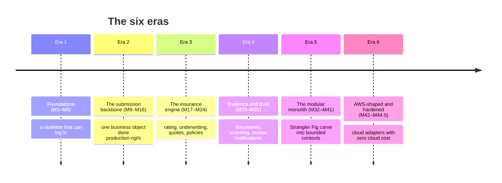
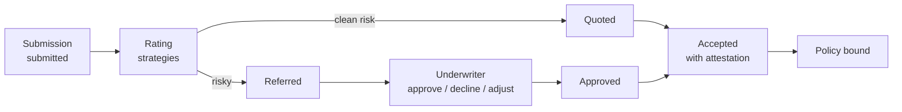
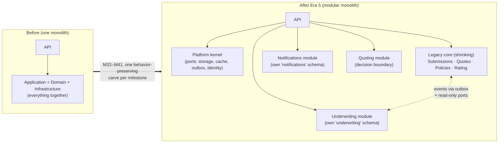

# The Build History — How LIAnsureProtect Grew, Milestone by Milestone

> **Living document**, updated at every milestone close. This is the one place that tells the whole
> story: what the project was before each step, what changed, and why. Each milestone links to its
> detailed learnings record in the archive (`docs/dev/`) if you want the deep dive; this document
> is the readable narrative.
>
> **How to read it:** the project grew in **six eras**, each with one big idea. Skim the era
> introductions to understand the shape of the journey; read the tables when you need specifics.

---

## Era 1 — Foundations (M1–M8): a skeleton that can log in

**Before:** nothing — an empty repository and a plan to build a production-style cyber specialty
insurance platform.

**The idea of this era:** lay rails before laying track. Every later feature rides on decisions
made here: Clean Architecture layers, CQRS with MediatR, PostgreSQL through Docker, JWT
authentication with Auth0, and a React frontend — each introduced as its own small, tested step.

> **Analogy:** building a restaurant. Era 1 doesn't cook a single meal — it pours the foundation,
> wires the kitchen, installs the door locks, and hires the doorman. Boring on purpose, because
> everything after depends on it.

| M | Name | What changed, in plain English |
|---|---|---|
| 1–2 | Solution & backend foundation | The solution/projects skeleton: API, Application, Domain, Infrastructure, Worker, tests. A health endpoint proves the API runs. |
| 3 | Dependency registration & architecture guards | One shared place wires services up, and **architecture tests** make illegal project references fail the build — the layer rules become law, not convention. |
| 4 | Application use-case foundation | First real use case: create a submission. CQRS command + MediatR + FluentValidation pipeline — the request-handling pattern every later feature copies. |
| 5 | Persistence foundation | The in-memory fake becomes real: EF Core + PostgreSQL (Docker, pgvector-ready), the first migration, Unit of Work as the commit boundary. |
| 6 | Authentication foundation | JWT bearer auth + policy-based authorization + `ICurrentUser`. The door gets a lock: `POST /submissions` now requires a role (Customer/Broker/Admin). |
| 7 | Identity provider integration | The lock gets keys: Auth0 issues the tokens (provider-neutral — the API only trusts issuer/audience/roles, not a vendor). |
| 8 | Frontend login & session | The first React/Vite app: Auth0 PKCE login, a guarded dashboard, and a browser→API→PostgreSQL smoke path. |

---

## Era 2 — The submission backbone (M9–M16): one business object done production-right

**Before:** a logged-in user and one API endpoint.

**The idea of this era:** take a single business object — the **submission** (a company asking for
cyber insurance) — and give it every production behavior a real system needs: a UI, reads,
ownership, state transitions, durable events, background processing, and safe retries. These
patterns (outbox, idempotency, ownership scoping) then protect *every* later feature for free.

> **Analogy:** teaching one student perfectly before opening the school. Once the submission knows
> how to be created, owned, listed, submitted, evented, and retried safely, every new aggregate
> (quotes, policies, evidence) enrolls into the same well-tested routines.

| M | Name | What changed, in plain English |
|---|---|---|
| 9 | Submission intake UI | `/submissions/new`: React Hook Form + Zod validation + TanStack Query, organized as a feature-owned vertical slice. |
| 10 | List & detail reads | `GET` list/detail endpoints + pages — the CQRS read side arrives. |
| 11 | Ownership | Each submission stores its owner; reads are scoped to the signed-in user. The first real **resource-based authorization** rule. |
| 12 | Submit + domain events | Drafts can be submitted; the aggregate raises `SubmissionSubmittedDomainEvent` — the domain starts *telling* the world what happened. |
| 13 | **Transactional outbox** | Events are saved to an `outbox_messages` table **in the same database transaction** as the business change — an event can never be lost or invented. This table becomes the event spine of the whole system. |
| 14 | Outbox dispatcher | The Worker begins draining the outbox on a poll loop — the mailroom clerk starts walking the mail. |
| 15 | **Idempotency** | `Idempotency-Key` handling: retrying a POST returns the stored answer instead of double-creating; unsafe key reuse → 409. |
| 16 | Idempotency hardening | The Worker deletes expired idempotency receipts hourly — the pattern gets an operational janitor. |

---

## Era 3 — The insurance engine (M17–M24): rating, underwriting, quotes, policies

**Before:** submissions existed but nothing *insurance* happened to them.

**The idea of this era:** build the pre-bind insurance lifecycle for real — rating with actuarial-
style factors, referral underwriting with a human decision-maker, acceptance with attestation, and
policy binding — plus the first resilience patterns and the advisory-only AI guardrail.

| M | Name | What changed, in plain English |
|---|---|---|
| 17 | Cyber rating & quotes | Synthetic actuarial-style rating via **Strategy pattern** (baseline/high-risk); owner-scoped, idempotent quote creation; clean risks → `Quoted`, risky ones → `Referred`. |
| 18 | Underwriting referrals | The referral queue + `Quotes.Underwrite` policy + approve/decline/adjust with an audit history. The human underwriter becomes the authority. |
| 19 | External rating provider + resilience | The first outbound HTTP boundary: a typed `HttpClient` adapter with **retry + circuit breaker** (`Microsoft.Extensions.Http.Resilience`) and an attempts audit table. Sets the standard for all future integrations. |
| 20 | Acceptance & policy binding | Quotes are accepted with a named attestation (subjectivities must be acknowledged) and bound into durable policies — idempotently. |
| 21 | Notification publishing | The outbox learns to *mean* something: important events map to provider-shaped notification messages, with publish retry/failure metadata on outbox rows. |
| 22 | AI underwriting assistant | An underwriter-only advisory AI review with a structural guardrail proven by tests: **AI can never change a quote, premium, or decision** — it only advises. |
| 23 | Underwriting workbench UI | `/underwriting/quote-referrals`: the underwriter's React workbench for triage, AI review, and decisions. |
| 24 | Referral operations | Assignment, priority, SLA due dates, work notes, follow-up tasks, and an audit timeline — the queue becomes a real operations tool. |

---

## Era 4 — Evidence and trust (M25–M31): documents, scanning, review, notifications

**Before:** underwriters could decide, but had no way to *ask for proof*.

**The idea of this era:** the evidence loop — underwriter asks ("show me your MFA policy"),
customer responds with documents, the system quarantine-scans them, the underwriter reviews
sufficiency, and everyone gets notified. Security is **fail-closed** at every step: only
clean-scanned documents can ever be downloaded or trusted.

> **Analogy:** a bank's document counter. You hand papers through a slot (upload), they're
> inspected in a back room before anyone touches them (scanning), a clerk judges whether they're
> the *right* papers (review), and you get a receipt at every step (notifications + audit rows).

| M | Name | What changed, in plain English |
|---|---|---|
| 25 | Evidence requests | Underwriters request evidence by category; owners respond; the workbench tracks open/responded activity. |
| 26 | Evidence notifications & follow-up | Lifecycle events → outbox → notifications; manual follow-up reminders; due/overdue indicators. |
| 27 | Document storage | Real file upload/download behind an Application-owned storage port — bytes on disk (later S3), metadata in PostgreSQL, private routes only. |
| 28 | Security screening | Quarantine-style scanning: pending → clean/rejected/failed; **only clean documents are downloadable or acceptable**; rejected files stay visible for audit; owners upload replacements. |
| 29 | Evidence review decisions | Human sufficiency review (`Satisfied` / `Insufficient` / `NeedsClarification`) with rationale, remediation guidance, and append-only audit rows. |
| 30 | Outcome notifications | Unfavorable reviews notify the owner with action-oriented remediation messages. |
| 31 | Notification inbox | The read model: a per-user inbox (list + unread count + mark-read) projected idempotently from the outbox, with a React notifications page. |

---

## Era 5 — The modular monolith (M32–M41): the Strangler Fig transformation

**Before:** one healthy but growing layered monolith — everything in four legacy projects.

**The idea of this era:** restructure *without ever breaking* — using the **Strangler Fig
pattern**.

### What "Strangler Fig" means (the pattern behind this whole era)

A strangler fig is a real tree: it starts as a seed **on** a host tree, grows its own roots and
branches *around* the host while the host keeps living, and eventually stands on its own — the
host having gradually withered away inside it. Applied to software (the name is Martin Fowler's):

> **Don't rewrite the old system. Grow the new structure around it, move one piece at a time
> while everything keeps working, and let the old core shrink until it's gone.**

The opposite — the "big-bang rewrite" — freezes the product for months and usually fails. The
Strangler Fig way meant every milestone in this era was **behavior-preserving**: same routes, same
UI, same data, all tests green — while internally, whole subsystems moved into self-contained
**modules** (bounded contexts) with their own database schemas, talking to the legacy core only
through **ports** (interfaces) and **events** (the outbox). That's why the legacy
`Domain/Application/Infrastructure` projects still exist and are still load-bearing today: they're
the host tree, deliberately shrinking one carve at a time — Submissions, the Quote/Policy
aggregates, and rating still live there until their own milestones move them.

| M | Name | What changed, in plain English |
|---|---|---|
| 32 | Platform & module skeleton + **Local⇄AWS switch** | The shared kernel (`Platform.Abstractions` ports) and the config-driven `Platform:Profile` switch — proven first on document storage. The seed lands on the host tree. |
| 33 | Notifications module | First real carve: the inbox moves into `Modules/Notifications` with its own `notifications` schema; the dispatcher feeds it through a projector port. |
| 34 | Team inbox | First feature built *natively inside* a module: shared team notifications with per-user read receipts. |
| 35 | Underwriting module: AI review | The AI review moves into `Modules/Underwriting` (`underwriting` schema). It reads quotes through a **read-only port** — "AI can't decide" becomes structural. |
| 36 | Referral operations carve | The most entangled move: the operations aggregate migrates, with **event-driven** cross-context hand-offs (create/close projected from outbox events). |
| 37 | Evidence carve | Evidence requests + reviews move into Underwriting; the dispatcher drains legacy + module outboxes in timestamp order so event ordering survives the move. |
| 38 | Evidence documents carve | Documents follow; storage contracts land in the Platform kernel; the temporary M37 seam is deleted. |
| 39 | Quoting decision boundary | The Quoting module skeleton: final decision commands move behind a Quoting-owned port while quote tables stay legacy for now. |
| 40 | Dispatcher decoupling | The dispatcher stops knowing event types: registered sources, consumers, and mapper registries — plug-in architecture for the event spine. |
| 41 | Observability | Correlation IDs, liveness/readiness probes for all three DbContexts, dispatcher activities/metrics/logs — production eyes before production infrastructure. |

---

## Era 6 — AWS-shaped and hardened (M42–M44.5): cloud adapters with zero cloud cost

**Before:** a modular monolith with local-only adapters behind every port.

**The idea of this era:** make the code cloud-ready **without an AWS account or bill** — every AWS
adapter developed and proven against emulators (LocalStack, local Redis), switchable purely by
configuration — then harden the whole solution before real infrastructure arrives in Phase 2.

| M | Name | What changed, in plain English |
|---|---|---|
| 42 | Documents → S3 | `S3DocumentStorageService` (SSE-KMS-ready) behind the existing storage port; a real S3 round trip proven against LocalStack. One new class + one registration line — the M32 switch paying off. |
| 43 | Real async messaging | Notifications publish a versioned JSON envelope to **SNS → SQS + DLQ** under the Aws profile; the outbox's retry/poison machinery is reused unchanged. |
| 44 | Caching + rate limiting | The `ICacheService` port (in-memory/Redis by profile), opt-in cache-aside via `ICacheableRequest`, API rate limiting (429 + `Retry-After`), and security headers. |
| — | Solidification & deep audits | Two audit passes (post-M41, post-M44): a permanent **zero-warning gate** (`latest-recommended` analyzers + warnings-as-errors), ten entities refactored off parameter-heavy constructors, hot-path logging source-generated, real bugs fixed, the living encyclopedia and run/testing guides written. |
| 44.5 | Referral queue hardening | Assignment became a guarded **claim** (domain rejection + optimistic-concurrency token → 409 + UI refetch), then the queue read was cached shared for 10s with write-triggered invalidation. *Correctness first, then the cache.* |

---

## Where the story goes next

**Phase 2 (M45–M50)** provisions real AWS with Terraform — account foundation (OIDC, VPC, KMS,
Secrets Manager), then data (Aurora, S3, SQS/SNS), compute (EKS), and edge (CloudFront + WAF) —
all `destroy`-able so nothing bills while idle. After that: the remaining legacy carves
(Submissions, Quoting completion, Policy) and new bounded contexts (**Claims** — where the
reserved `ClaimsAdjuster` role finally gets its workbench — Accounts, Product Catalog). The
detailed plan lives in the [Production Transformation Roadmap](dev/production-transformation-roadmap.md).

## Reading further

- **[The Encyclopedia](encyclopedia/README.md)** — how the system works *today* (architecture,
  patterns, every workflow with diagrams).
- **[Documentation map](README.md)** — what to read for which question.
- **Per-milestone archive** — every milestone's detailed design/learnings record lives in
  `docs/dev/milestone-*.md`, named by number; this chronicle links the story together.
