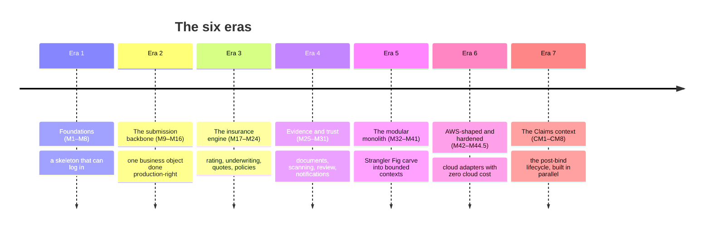
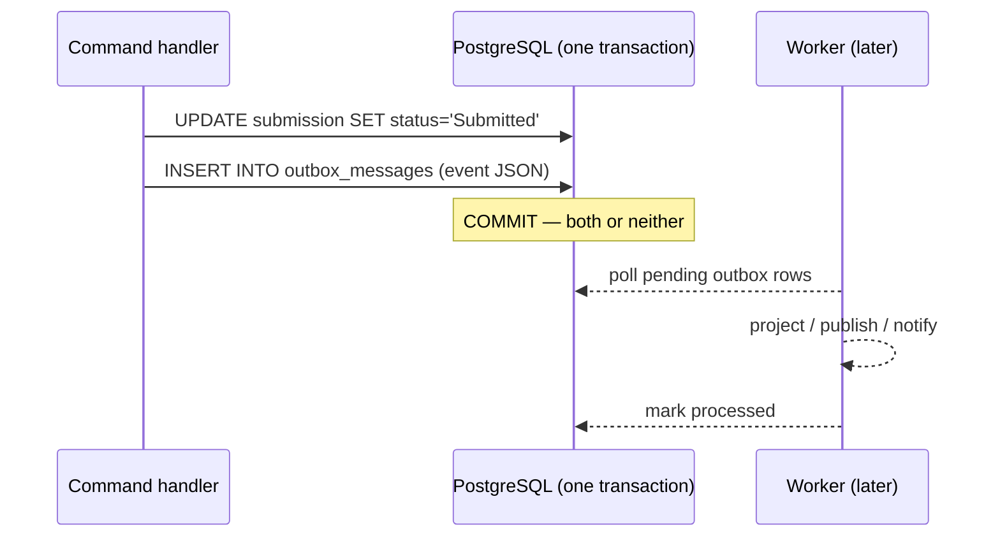
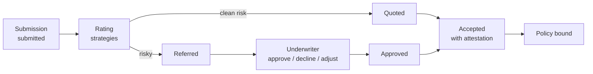
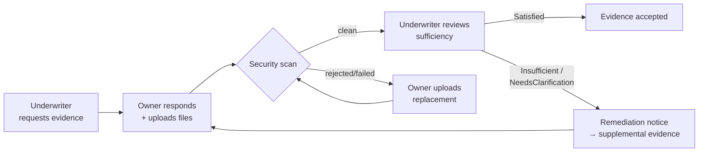
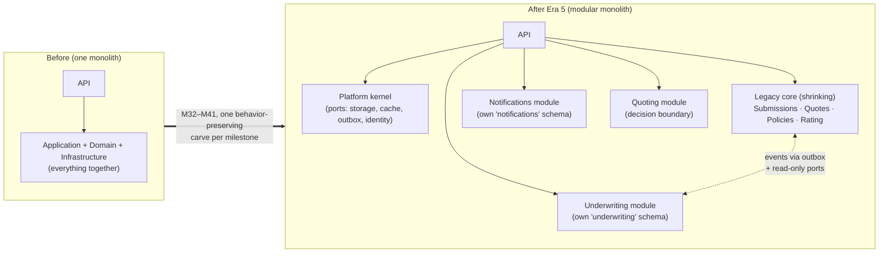
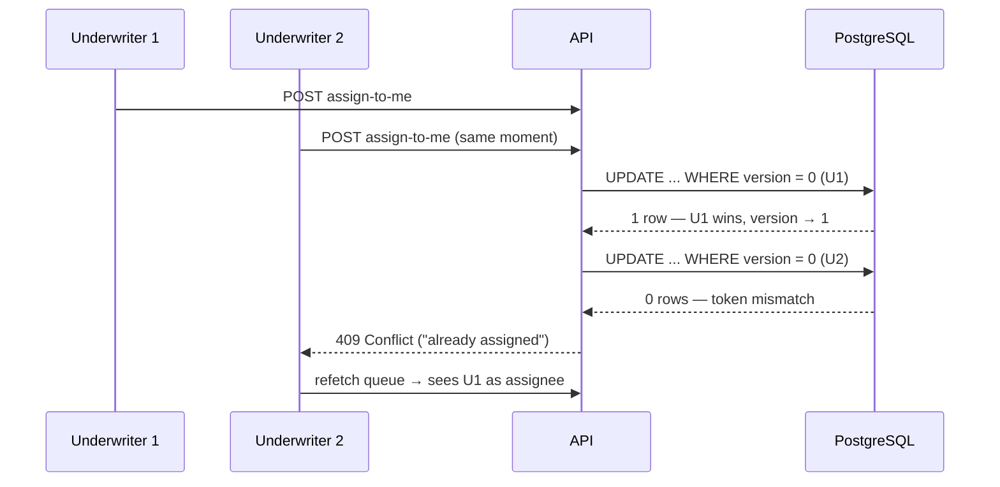

# The Build History — How LIAnsureProtect Grew, Milestone by Milestone

> **Living document**, updated at every milestone close. This is the one place that tells the whole
> story in full: for every milestone, what the project was before, what was built, and why it
> matters — so you can learn the entire journey **in this single document** without opening the
> per-milestone archive. (The archive under `docs/dev/` still exists for forensic depth — raw
> decision notes, gotchas, verification artifacts — but you should never *need* it to understand
> the project.)
>
> **How to read it:** the project grew in **six eras**, each with one big idea. Read straight
> through for the full story, or jump to an era.

---

# Era 1 — Foundations (M1–M8): a skeleton that can log in

**Before this era:** nothing — an empty repository and a plan to build a production-style cyber
specialty insurance platform, milestone by milestone, with documentation and tests as first-class
citizens.

**The one big idea:** lay rails before laying track. Every later feature rides on decisions made
here: Clean Architecture layers, CQRS with MediatR, PostgreSQL through Docker, JWT authentication
with Auth0, and a React frontend — each introduced as its own small, tested, documented step.

> **Analogy:** building a restaurant. Era 1 doesn't cook a single meal — it pours the foundation,
> wires the kitchen, installs the door locks, and hires the doorman. Boring on purpose, because
> everything after depends on it.

### M1–M2 — Solution & backend foundation

**Before:** an empty repo.
**What was built:** the solution skeleton — `Api`, `Application`, `Domain`, `Infrastructure`,
`Worker`, and test projects — plus a root status endpoint and health endpoint with the first
integration tests proving the API actually boots and answers.
**Why it matters:** the four-layer shape (Domain knows nothing, Application orchestrates,
Infrastructure implements, Api hosts) is the constitution every later milestone obeys. Starting
with tests — even trivial ones — set the norm that nothing ships unverified.

### M3 — Dependency registration & architecture guards

**Before:** each host wired its own services ad hoc.
**What was built:** shared `AddApplication()` / `AddInfrastructure()` registration extension
methods used by both API and Worker, and **architecture tests** (`ProjectReferenceBoundaryTests`)
that fail the build if a project references a layer it shouldn't.
**Why it matters:** layer rules became *law enforced by CI*, not convention enforced by memory.
Those same guard tests later became the ratchet that protects module boundaries in Era 5.

### M4 — Application use-case foundation

**Before:** the API had endpoints but no real use case.
**What was built:** the first business action — create a draft submission via
`POST /api/v1/submissions` — using the pattern stack every later feature copies: a CQRS command,
a MediatR handler, FluentValidation with a validation **pipeline behavior**, a repository
interface, and Moq-backed handler tests.
**Why it matters:** this milestone fixed the project's request-handling grammar. When you read any
handler today — quotes, evidence, notifications — you're reading the M4 shape.

### M5 — Persistence foundation

**Before:** the repository was an in-memory fake.
**What was built:** EF Core + PostgreSQL (Docker Compose, pgvector-ready image), the
`SubmissionDbContext` with explicit mapping, the first migration, **Unit of Work** as the
Application-side commit boundary, centralized NuGet versions (`Directory.Packages.props`), and an
opt-in integration test against real PostgreSQL.
**Why it matters:** two lasting decisions — *the database runs in Docker so every machine is
identical*, and *the Application layer commits through `IUnitOfWork`, never touching EF directly*.
The opt-in real-database test pattern was reused later for LocalStack S3/SNS and Redis.

### M6 — Authentication foundation

**Before:** anyone could call anything.
**What was built:** JWT bearer authentication, policy-based authorization (`Submissions.Create`
allowing Customer/Broker/Admin), the `ICurrentUser` abstraction so use cases can ask "who is
calling?" without depending on ASP.NET Core, and a test-only authentication scheme so integration
tests can impersonate any role.
**Why it matters:** security arrived as *policies naming business actions*, not role checks
sprinkled through code. The five roles (Customer, Broker, Underwriter, ClaimsAdjuster, Admin)
were declared here — ClaimsAdjuster deliberately reserved for the future Claims context.

### M7 — Identity provider integration

**Before:** tokens were provider-neutral in theory but untested against a real issuer.
**What was built:** Auth0 as the first real identity provider — the API validates Auth0-issued
tokens (issuer, audience, expiry, signature, role claim), with the tenant-specific authority kept
in User Secrets, and a manual token smoke-testing workflow documented step by step.
**Why it matters:** the API trusts *standards* (OIDC/JWT), not a vendor: swapping Auth0 for
Cognito later is configuration, not code. It also established the "never commit secrets" split
between committed placeholders and local User Secrets.

### M8 — Frontend login & session foundation

**Before:** no frontend existed.
**What was built:** the React 19 + TypeScript + Vite app (`src/LIAnsureProtect.Web`) with Tailwind,
React Router, Auth0 Authorization-Code-with-PKCE login, a guarded dashboard route, access-token
retrieval for the API audience, CORS for local development, and a protected API smoke-test button
— proving the full browser → Auth0 → API → PostgreSQL path.
**Why it matters:** the SPA never sees a client secret (PKCE), tokens are held in memory by the
Auth0 SDK (not localStorage), and the route-guard + token-retrieval pattern became the template
for every later page.

---

# Era 2 — The submission backbone (M9–M16): one business object done production-right

**Before this era:** a logged-in user and one write endpoint.

**The one big idea:** take a single business object — the **submission** (a company asking for
cyber insurance) — and give it every behavior a production system needs: a real UI, reads,
ownership, state transitions, durable events, background processing, and safe retries. The
patterns built here (outbox, idempotency, ownership scoping) silently protect *every* feature
built afterwards.

> **Analogy:** teaching one student perfectly before opening the school. Once the submission knows
> how to be created, owned, listed, submitted, evented, and retried safely, every new aggregate
> (quotes, policies, evidence) enrolls into the same well-tested routines.

### M9 — Submission intake UI

**Before:** submissions could only be created from a hard-coded dashboard button.
**What was built:** the protected `/submissions/new` page using React Hook Form + Zod (client-side
validation that mirrors the server rules) + TanStack Query (mutation state), organized as a
**feature-owned vertical slice** (`features/submissions/{api,components,hooks,pages,schemas}`).
**Why it matters:** the vertical-slice folder convention means a feature's UI logic lives in one
place — the same convention later used for underwriting, evidence, and notifications slices.

### M10 — Submission list & detail

**Before:** you could create but never see submissions.
**What was built:** `GET /api/v1/submissions` and `GET /api/v1/submissions/{id}` with Application
query handlers, EF Core **no-tracking** reads, and protected `/submissions` + `/submissions/:id`
pages with TanStack Query loading/error states.
**Why it matters:** the CQRS read side arrived: queries are separate handlers returning purpose-
built DTOs, never leaking EF entities — with REPR-style clarity (route → action → query → result).

### M11 — Submission ownership

**Before:** any authenticated customer could read *everyone's* submissions.
**What was built:** each new submission stores `OwnerUserId` from `ICurrentUser`; list/detail reads
filter to the owner; a separate `Submissions.Read` policy.
**Why it matters:** the first **resource-based authorization** rule — "roles say what *kind* of
thing you may do; ownership says *which* thing." Every later owner-facing read (quotes, evidence,
notifications) copies this scoping.

### M12 — Submit + domain events

**Before:** submissions were stuck as drafts.
**What was built:** `POST /submissions/{id}/submit` flips Draft → Submitted through a domain method
that enforces the transition, and the aggregate records a `SubmissionSubmittedDomainEvent` in
memory via `IHasDomainEvents`.
**Why it matters:** the domain started *telling the world what happened* instead of just changing
columns. Events were deliberately not dispatched yet — that discipline ("capture first, deliver
later") made the next milestone clean.

### M13 — Transactional outbox ⭐

**Before:** domain events vanished when the request ended.
**What was built:** an `outbox_messages` table written **in the same database transaction** as the
business change: when `SaveChangesAsync` commits a submission's status change, the serialized
event commits with it — or neither does.
**Why it matters:** this is the single most important reliability decision in the project. An
event can never be lost (the transaction guarantees it) and never invented (no event without the
change). The outbox became the **event spine**: notifications, projections, and eventually SNS
publishing all hang off this one table.

### M14 — Outbox dispatcher

**Before:** outbox rows accumulated with nobody reading them.
**What was built:** the Worker's first real job — `IOutboxDispatcher` polls pending
`outbox_messages` on a loop, processes them, and marks them processed.
**Why it matters:** the **poll → process → mark** loop is the delivery half of the outbox pattern.
Everything later (notification publishing, module projections, SNS) plugged into this loop rather
than inventing new delivery mechanisms.

### M15 — Idempotency ⭐

**Before:** a network retry of a POST could create two submissions.
**What was built:** PostgreSQL-backed `idempotency_records` + `Idempotency-Key` header handling on
the write endpoints: a retried request with the same key returns the **stored response** without
re-running the write; reusing a key with a *different* body returns **409 Conflict**.
**Why it matters:** at-least-once delivery (retries, flaky networks, double-clicks) is reality;
idempotency makes it harmless. The receipt-table pattern was reused for every important POST since
(quotes, acceptance, binding).

> **Analogy:** a coat-check ticket. Hand over the same ticket twice, you get the same coat — not
> two coats. Hand over a forged ticket with someone else's number, you get stopped (409).

### M16 — Idempotency operational hardening

**Before:** the receipt table would grow forever.
**What was built:** the Worker deletes completed idempotency records older than seven days, hourly,
with a supporting index.
**Why it matters:** the first "operational janitor" — patterns need lifecycle management, not just
happy paths. It set the norm that every durable mechanism ships with its cleanup story.

---

# Era 3 — The insurance engine (M17–M24): rating, underwriting, quotes, policies

**Before this era:** submissions existed, but nothing *insurance* happened to them.

**The one big idea:** build the real pre-bind lifecycle — actuarial-style rating, human referral
underwriting, acceptance with attestation, and policy binding — plus the first resilience patterns
and the "AI advises, humans decide" guardrail.

### M17 — Cyber rating & quote foundation

**Before:** a submitted submission was a dead end.
**What was built:** the first realistic rating slice — synthetic actuarial-style cyber factors
evaluated by **Strategy-pattern** rating strategies (baseline and high-risk, behind a selector),
producing a `Quote` aggregate with premium/limit/retention/risk-tier persisted to PostgreSQL.
Clean risks become `Quoted`; risky profiles become `Referred`. Quote creation is owner-scoped,
idempotent, and raises `QuoteGeneratedDomainEvent` into the outbox.
**Why it matters:** the Quoted/Referred fork created the underwriting workload that Eras 3–4 are
built around, and the Strategy pattern made rating rules swappable without touching the flow.

### M18 — Underwriting referral foundation

**Before:** `Referred` quotes had nowhere to go.
**What was built:** the underwriter's referral queue (`Quotes.Underwrite` policy), and
approve/decline/adjust review actions on the `Quote` aggregate — each writing an append-only
`quote_underwriting_reviews` audit row (with premium/retention before-and-after snapshots) and
raising `QuoteUnderwritingDecisionRecordedDomainEvent`.
**Why it matters:** the human underwriter became the decision authority, with a full audit trail —
the compliance-grade "who decided what, when, and why" record a real insurer needs.

### M19 — External rating provider + resilience ⭐

**Before:** all rating was in-process; no outbound HTTP existed.
**What was built:** the first external integration boundary: an Application-owned
`IRatingProviderClient` port, an Infrastructure **typed `HttpClient`** adapter with
`Microsoft.Extensions.Http.Resilience` (**retry + circuit breaker + timeouts**), a simulated
provider returning market indications, and a `quote_rating_provider_attempts` audit table
(status, disposition, HTTP code, failure category, duration).
**Why it matters:** this fixed the project's outbound-HTTP standard forever: *typed client +
resilience handler + attempt audit*. Local rating stayed authoritative — the provider enriches,
never decides — a deliberate resilience posture (the flow works even when the provider is down).

### M20 — Quote acceptance & policy binding

**Before:** an approved quote couldn't become a policy.
**What was built:** acceptance with a named **attestation** (acceptor name/title + an explicit
subjectivities-acknowledged flag that cannot be skipped), then binding into a durable `Policy`
(policy number, effective/expiration dates, bind-time snapshots of quote status/tier/
subjectivities), with a simulated binding-provider acknowledgement audit and idempotent POSTs.
`PolicyBoundDomainEvent` enters the outbox.
**Why it matters:** the lifecycle reached its commercial end — and the bind-time *snapshot*
pattern (copy what the quote looked like at bind) protects the policy record from later quote
changes, an insurance-specific correctness detail.

### M21 — Notification & outbox publishing

**Before:** the outbox marked events processed without anyone being told.
**What was built:** an Application-owned `INotificationPublisher` port with a provider-shaped local
implementation; selected quote/policy events map to notification messages during dispatch; outbox
rows gained publish retry/failure metadata (`publish_attempt_count`, `next_attempt_at_utc`,
`provider_message_id`, `failed_at_utc` — retry with backoff, then park as poison).
**Why it matters:** the outbox went from bookkeeping to *communication*, and the retry/poison
machinery built here was reused unchanged when real SNS publishing arrived in M43.

### M22 — AI underwriting assistant ⭐

**Before:** no AI anywhere.
**What was built:** an underwriter-only advisory AI review for referred quotes: an Application-
owned `IAiReviewService` port, a local simulated provider producing a structured review packet
(summary, positive/negative risk signals, control gaps, suggested questions, subjectivity
candidates, citations, limitations), persisted to `ai_underwriting_reviews` with prompt/schema/
input-hash audit fields — plus **guardrail tests proving AI output cannot change any quote,
premium, decision, acceptance, or binding state**.
**Why it matters:** the project's AI stance became enforceable law: *AI advises, humans decide*.
The audit fields (prompt version, schema version, input hash) anticipate real-model governance
before any real model exists.

### M23 — Underwriting workbench UI

**Before:** underwriters had endpoints but no screen.
**What was built:** the protected `/underwriting/quote-referrals` React workbench — queue triage
with risk/expiry context, referral reasons and subjectivities, on-demand AI review display, and
approve/decline/adjust forms — all over the existing endpoints.
**Why it matters:** the second persona (Underwriter) got a real workplace, and the workbench
became the surface all Era-4 evidence features plugged into.

### M24 — Referral operations

**Before:** the queue showed quotes but had no workflow state.
**What was built:** durable referral operations — self-assignment, priority, SLA due dates,
workflow status, append-only work notes, follow-up tasks, and an **audit timeline** merging
operational events with decision history — shown in a workbench operations panel.
**Why it matters:** underwriting became *manageable work* (who owns it, when it's due, what
happened) rather than a bare list. The timeline pattern — append-only entries for every action —
became the audit style for evidence too.

---

# Era 4 — Evidence and trust (M25–M31): documents, scanning, review, notifications

**Before this era:** underwriters could decide, but had no way to ask for *proof*.

**The one big idea:** the evidence loop — underwriter asks ("show me your MFA policy"), customer
responds with documents, the system quarantine-scans them, the underwriter reviews sufficiency,
and everyone is notified — with **fail-closed security**: only clean-scanned documents can ever be
downloaded or trusted.

> **Analogy:** a bank's document counter. You hand papers through a slot (upload), they're
> inspected in a back room before anyone touches them (scanning), a clerk judges whether they're
> the *right* papers (review), and you get a receipt at every step (notifications + audit rows).

### M25 — Evidence request foundation

**Before:** "please send us your security policy" happened outside the system.
**What was built:** PostgreSQL-backed evidence requests: underwriters create them by category
(MFA, EDR, backup/recovery, incident response, prior losses, questionnaire clarification, other)
with title/description/due date; owners see and respond to *their* requests (text + safe
attachment metadata placeholders); underwriters accept or cancel; the workbench tracks
open/responded activity.
**Why it matters:** the request→response conversation got structure, ownership scoping, and
lifecycle state — the frame everything else in this era filled in.

### M26 — Evidence notifications & follow-up

**Before:** evidence activity was silent.
**What was built:** evidence lifecycle domain events (created/responded/accepted/cancelled/
follow-up) flowing through the outbox into notifications; a manual underwriter follow-up reminder
action; due/overdue indicators in both the workbench and the owner's evidence page.
**Why it matters:** the nagging problem ("did they respond yet?") became visible state on both
sides of the conversation.

### M27 — Evidence document storage

**Before:** attachments were metadata-only placeholders.
**What was built:** real file upload/download — up to five files per response with size/type/
filename governance, bytes stored **outside the database** behind an Application-owned
`IDocumentStorageService` port (local filesystem adapter), metadata in `quote_evidence_documents`,
and private authorized download routes for owners and underwriters.
**Why it matters:** the storage *port* built here is exactly what made M42's S3 swap a one-class
change five eras of code later. Bytes-outside-the-DB and private-routes-only were the right
production calls from day one.

### M28 — Evidence document security screening ⭐

**Before:** an uploaded file was immediately downloadable.
**What was built:** quarantine-style screening: every upload is scanned through an
`IEvidenceDocumentScanner` port (local deterministic scanner), persisting scan status
(PendingScan/Clean/Rejected/Failed), scanner metadata, and SHA-256. **Fail-closed gates**: only
Clean documents can be downloaded or accepted for review; Rejected/Failed files stay visible for
audit but are never downloadable; owners append replacement files without deleting the original.
**Why it matters:** the trust boundary for user-supplied content. "Fail closed" (when unsure, deny)
is the security posture; keeping rejected files visible preserves the audit trail.

### M29 — Evidence review decisions

**Before:** underwriters could accept evidence, but couldn't formally say "not good enough."
**What was built:** human sufficiency review — `Satisfied` / `Insufficient` / `NeedsClarification`
with rationale and owner remediation guidance, reviewer metadata, timeline entries, and append-only
`quote_evidence_request_reviews` audit rows snapshotting the trusted-document count at review
time. Owners can submit supplemental evidence after an unfavorable review.
**Why it matters:** completed the loop between "a file arrived" and "the underwriter is satisfied,"
with the same audit-snapshot discipline as underwriting decisions.

### M30 — Review outcome notifications

**Before:** an owner wouldn't know their evidence was judged insufficient.
**What was built:** unfavorable review decisions raise a remediation-required event → outbox → an
action-oriented owner notification ("your MFA evidence needs clarification: …").
**Why it matters:** small milestone, important principle: every decision that requires someone
*else* to act must notify them with what to do next.

### M31 — Notification inbox read model

**Before:** notifications were published but users had no place to read them.
**What was built:** the per-user inbox: a `notification_inbox_entries` **read model** written by
the outbox dispatcher beside the publish step (idempotent on the source outbox-message id, so
retries never duplicate), owner-scoped list/unread-count/mark-read endpoints behind a new
`Notifications.Read` policy, and the React notifications page.
**Why it matters:** the first real **projection** — a table shaped purely for reading, built from
events. Its idempotent-on-source-id trick became the standard for every later projection.

---

# Era 5 — The modular monolith (M32–M41): the Strangler Fig transformation

**Before this era:** one healthy but growing layered monolith — everything in four legacy
projects, one DbContext, one schema.

**The one big idea:** restructure into **bounded-context modules** without ever breaking — using
the **Strangler Fig pattern**.

### What "Strangler Fig" means (the pattern behind this whole era)

A strangler fig is a real tree: it starts as a seed **on** a host tree, grows its own roots and
branches *around* the host while the host keeps living, and eventually stands on its own — the
host having gradually withered away inside it. Applied to software (the name is Martin Fowler's):

> **Don't rewrite the old system. Grow the new structure around it, move one piece at a time
> while everything keeps working, and let the old core shrink until it's gone.**

The opposite — the "big-bang rewrite" — freezes the product for months and usually fails. The
Strangler Fig way meant every milestone in this era was **behavior-preserving**: same routes, same
UI, same data, all tests green — while internally, whole subsystems moved into self-contained
**modules** with their own PostgreSQL schemas, talking to the legacy core only through **ports**
(interfaces) and **events** (the outbox). That's why the legacy
`Domain/Application/Infrastructure` projects still exist and are still load-bearing today: they're
the host tree, deliberately shrinking one carve at a time — Submissions, the Quote/Policy
aggregates, and rating still live there until their own milestones move them.

### M32 — Platform & module skeleton + the Local⇄AWS deploy switch ⭐

**Before:** no notion of "modules" or deployment profiles.
**What was built:** the `src/Platform` **shared kernel** (`Platform.Abstractions` ports +
`Platform` adapters), the empty `src/Modules/` home for future bounded contexts, the
schema-per-module `ModuleDbContext` template, a module-boundary architecture-test ratchet, and —
crucially — the config-driven **`Platform:Profile` Local⇄AWS switch**, proven first on document
storage: `Local` wires the filesystem adapter, `Aws` fails fast until its adapter exists.
**Why it matters:** the seed landing on the host tree. Zero behavior changed, but every later
carve had a home, and every later AWS adapter (S3, SNS, Redis) just filled in a branch of the
switch planted here. "Unimplemented profiles fail fast, never silently mis-wire" became a
project-wide guarantee.

### M33 — Notifications module (the first real carve)

**Before:** the notification inbox lived in the legacy layers.
**What was built:** the inbox moved into `Modules/Notifications/{Domain,Application,
Infrastructure}` with its own `NotificationsDbContext` owning a dedicated **`notifications`
schema**; the outbox dispatcher feeds it through an `INotificationProjector` port using idempotent
ordered projection (no distributed transaction); `ICurrentUser` moved into the Platform kernel;
scripts and CI began applying migrations per-context.
**Why it matters:** proved the whole carve recipe on the lowest-risk context: module owns its
schema, communicates via ports and events, and the public API doesn't move. Every later carve
repeated this recipe.

### M34 — Notifications team inbox

**Before:** team-addressed events (`underwriting-operations`, `binding-operations`) were dropped.
**What was built:** the first feature built *natively inside* a module: shared
`team_notification_entries` with **per-user read receipts** created lazily on mark-read (team
membership derived from the caller's role claim — no user directory needed); the notifications API
merges personal + team entries with scope tags; the UI gained All/Personal/Team tabs.
**Why it matters:** proved modules aren't just refactor targets — new features grow *inside* them.
The lazy-receipt trick (don't fan out on write; record reads as they happen) is a production-grade
scalability call.

### M35 — Underwriting module: AI review

**Before:** the AI review lived in the legacy `Quotes` namespace.
**What was built:** the AI review moved into `Modules/Underwriting` with its own
`UnderwritingDbContext` and **`underwriting` schema**. Because the underwriting *decision* lives
on the `Quote` aggregate (Quoting context), the module reads quote snapshots through a new
**read-only port** (`IUnderwritingQuoteContextReader`) implemented on the legacy side — the module
physically cannot mutate a quote.
**Why it matters:** "AI cannot make an insurance decision" stopped being a rule enforced by tests
and became a **structural impossibility** — the module doesn't even have a write path to the quote.

### M36 — Underwriting referral operations (the most entangled carve)

**Before:** referral operations (queue/SLA/notes/tasks/timeline) were tangled across legacy code
with a cross-schema foreign key to evidence.
**What was built:** the `QuoteReferralOperation` aggregate moved into the Underwriting module.
Cross-context hand-offs became **event-driven**: an `IReferralOperationProjector` (idempotent on
source outbox-message id, create-if-missing) reacts to quote/decision/evidence events to create,
close, and project activity onto operations. The underwriter's own actions stayed synchronous
module commands; the evidence→operation foreign key was dropped (reference by id only). The
create-if-missing "self-heal" means a user command arriving *before* the projector has run still
succeeds — eventual consistency with no user-visible gap. This milestone also established the
project-wide async/eventing conventions document.
**Why it matters:** the hardest proof of the approach — an aggregate deeply woven into everything
moved cleanly by choosing, hand-off by hand-off, between synchronous commands and eventual events.

### M37 — Underwriting evidence

**Before:** evidence requests/reviews were legacy; the module needed them.
**What was built:** evidence requests and reviews moved into the Underwriting module with
module-owned aggregates, commands, readers, repositories, and **a module outbox** — the dispatcher
learned to drain both legacy and module outbox sources merged in `CreatedAtUtc` order, preserving
event ordering across the move. Documents deliberately stayed legacy for one milestone behind a
temporary `IEvidenceRequestWriter` seam.
**Why it matters:** two lessons — order-preserving multi-source dispatch (the spine can have many
tributaries), and *temporary seams are fine if they're named, documented, and scheduled for
deletion* (M38 deleted it on schedule).

### M38 — Underwriting evidence documents

**Before:** document storage/scanning was the last legacy piece of evidence.
**What was built:** generic document-storage contracts moved to the **Platform kernel**
(`Platform.Abstractions.Documents`); the scanner port and document aggregate moved into
Underwriting; metadata moved to `underwriting.quote_evidence_documents`; all upload/replacement/
download/accept/review flows became module Application handlers. The M37 seam was deleted;
`IQuoteRepository` became quote-focused again.
**Why it matters:** finished the evidence carve *and* promoted document storage to platform
infrastructure — which is exactly why M42 later swapped filesystem→S3 without touching any
business code.

### M39 — Quoting decision boundary

**Before:** final referral decisions (approve/decline/adjust) ran through legacy handlers.
**What was built:** the Quoting module skeleton; decision commands moved into Quoting Application
behind a Quoting-owned port implemented by legacy Infrastructure — while the `Quote` aggregate and
tables deliberately stayed legacy for now. Underwriting consumes final decisions through the
existing outbox projection.
**Why it matters:** established *who owns the decision* (Quoting) separately from *where the data
lives* (legacy, for now) — a boundary-first, data-later carve that keeps each milestone small.

### M40 — Dispatcher integration event decoupling

**Before:** the dispatcher knew every event type through centralized static mappers.
**What was built:** a plug-in dispatcher: registered `IOutboxSource`s (drained in merged timestamp
order), registered `IOutboxMessageConsumer`s (referral-operation projection, notification
projection/publishing), and event-specific mapping in registered mapper classes behind
`OutboxMessageMapperRegistry<TOutput>`.
**Why it matters:** new events and consumers now plug in without touching the dispatcher — the
Open/Closed principle applied to the event spine, and the seam that made M43's SNS publishing a
pure adapter swap.

### M41 — Observability

**Before:** no correlation, minimal probes, no metrics.
**What was built:** `X-Correlation-ID` request correlation (sanitized against log forging, echoed
on responses, carried in log scopes with trace ids), explicit `/health/live` vs `/health/ready`
probes (readiness checks all three DbContexts), and native .NET activities/metrics/logs for the
outbox dispatcher (batch/message spans, counters, duration histograms).
**Why it matters:** production eyes before production infrastructure — when Phase 2 deploys to
EKS, the probes and telemetry are already battle-tested. The CodeQL gate on its PR also caught a
real log-forging vector, fixed by allowlist sanitization.

### Post-M41 solidification (an audit, not a milestone)

**What happened:** a full independent audit re-verified M37–M41 against their design docs (all
claims matched the code), fixed two resiliency bugs (the Worker poll loop now survives transient
exceptions; the dispatcher isolates consumer failures per message and per source), created the
12-chapter living **Encyclopedia**, and recorded two tooling decisions: `IHttpClientFactory` typed
clients are the outbound-HTTP standard, and **Ansible was evaluated and deferred** (Terraform-only
IaC — EKS/Fargate leaves no long-lived VMs to configure).

---

# Era 6 — AWS-shaped and hardened (M42–M44.5): cloud adapters with zero cloud cost

**Before this era:** a modular monolith with local-only adapters behind every port.

**The one big idea:** make the code cloud-ready **without an AWS account or bill** — every AWS
adapter developed and proven against emulators (LocalStack for S3/SNS/SQS, Docker Redis),
switchable purely by `Platform:Profile` configuration — then harden the whole solution before real
infrastructure arrives in Phase 2.

> **Analogy:** flight-simulator hours. The pilots (adapters) log real procedures on the ground
> (LocalStack) so the first real flight (Phase 2) is a checklist, not an adventure.

### M42 — Documents → S3

**Before:** document bytes lived on the local filesystem; `Platform:Profile=Aws` failed fast.
**What was built:** `S3DocumentStorageService` implementing the existing storage port — PutObject
with the same key shape and SSE-KMS when configured; GetObject with missing-object→null matching
the local adapter's contract; the composition root registers the S3 client (LocalStack vs real AWS
by config; static creds only for LocalStack, credential chain in the cloud; fail-fast on a missing
bucket). A profile-scoped LocalStack compose service and an env-gated round-trip test prove real
byte-for-byte storage.
**Why it matters:** the first fully wired Local⇄AWS branch — and the payoff proof for M27+M32+M38:
swapping storage backends was **one new class and one registration line**, with zero flow changes.

### M43 — Real async messaging

**Before:** the "publish" step was a local no-op returning a fake id.
**What was built:** `SnsNotificationPublisher` fills the `INotificationPublisher` seam: each
notification publishes a **versioned JSON envelope** (schemaVersion 1, with type/audience SNS
message attributes for subscription filtering) to an SNS topic fanning out to an SQS queue with a
**dead-letter queue**. The outbox's existing `ProviderMessageId` now stores the real SNS id;
transient SNS errors reuse the existing retry/poison path. In-process projection stayed (the API
reads it immediately — read-your-writes); only the outward publish became networked. Proven by a
LocalStack SNS→SQS+DLQ round trip.
**Why it matters:** events now leave the process onto a durable bus — the integration surface for
future consumers (extracted services, analytics) — at zero cost and with no new failure machinery.

### M44 — Caching + rate limiting + security headers

**Before:** no cache, no request limits, minimal response hardening.
**What was built:** (1) the `ICacheService` cache-aside port — in-memory locally, Redis
(StackExchange) under Aws, fail-fast on missing connection — with **opt-in** adoption via an
`ICacheableRequest` marker + a `CachingBehavior` MediatR pipeline (nothing is cached unless a query
opts in); (2) API **rate limiting**: a fixed-window limiter partitioned per user (IP fallback),
stricter for writes, returning 429 + ProblemDetails + Retry-After, config-driven with generous
defaults; (3) **security headers** (nosniff, frame-deny, referrer policy, CSP, permissions policy)
on every response. Deliberately, *no production read was cached yet* — every existing read was
per-user/PII or freshness-critical, and caching those would risk stale reads.
**Why it matters:** the mechanism-vs-adoption split: ship the primitive fully tested, adopt it
per-read with eyes open. Key lesson recorded: read config through `IOptions` per request, not
captured at startup (test overrides apply after registration).

### Post-M44 deep audit (an audit, not a milestone)

**What happened:** a final Phase-1 solidification pass. A permanent **zero-warning quality gate**
(`AnalysisLevel=latest-recommended` + `TreatWarningsAsErrors` solution-wide — with exactly two
documented exclusions: analyzer rules inside EF-generated migrations, and underscore test naming).
Ten domain entities were refactored off parameter-heavy constructors (up to 22 parameters — the
SonarLint S107 smell) onto factory property-assignment. Hot-path logging became source-generated
`[LoggerMessage]`. Two real bugs fixed (wrong `ArgumentException` param names; culture-sensitive
header formatting). The first production cache adoption landed: the evidence **reference-data
endpoint** (categories + upload rules from a single-source rules class, 1h TTL), with
`ICacheableRequest` moved into the Platform kernel so modules can opt in cleanly. The living
**run guide** and **manual testing guide** were written, and the role audit recorded: Admin is a
superuser by design; **ClaimsAdjuster is reserved** until the Claims bounded context is built.

### M44.5 — Referral queue hardening

**Before:** two underwriters clicking "Assign to me" simultaneously could both "win" (last write
silently overwrote), and the hottest read (the referral queue, fanning out to three readers on
every poll) hit the database every time.
**What was built:** *correctness first* — assignment became a guarded **claim**: the domain
rejects a second underwriter (same-user re-clicks idempotent; release is the explicit hand-over),
and a `Version` optimistic-concurrency token (bumped on every mutation, checked in the UPDATE's
WHERE clause) catches the true race the guard can't see; the loser gets **409** and the workbench
auto-refetches to show the real assignee. *Then the cache* — the queue read is served from one
shared 10-second cache entry, with an API-edge filter evicting it after every successful
queue-affecting write (read-your-writes preserved with zero module coupling; Worker-side
projection changes ride the TTL, which they were already eventually-consistent for).
**Why it matters:** the era's motto in one milestone — **never let a cache guarantee correctness;
make the write correct, then caching the read is safe.** The strongest proof: the entire
pre-existing endpoint suite passed unchanged with the cache active.

---

# Era 7 — The Claims context (CM1–CM8): the post-bind lifecycle, built in parallel

**Before this era:** the platform covered the whole *pre-bind* lifecycle (intake → bind), and the
`ClaimsAdjuster` role existed as a reserved constant with no screens.

**The one big idea:** build the **post-bind** world — what happens when an insured actually suffers a
cyber incident and files a claim — as a **new bounded context**, reusing every pattern the previous
six eras proved, and doing it **on a parallel branch** (`feat/claims-context`) so it could be built
autonomously while Phase 2 infrastructure work proceeded on `main`. Nothing new was invented; that's
the point — a mature platform absorbs a whole new context by *composition*, not reinvention.

> **Analogy:** Eras 1–6 built and sold the fire extinguisher. Era 7 is the whole "there's a fire"
> department — call it in, assign an adjuster, gather proof, set money aside, decide, pay, close —
> bolted onto the building through the same standardized sockets (ports, outbox, policies) the rest
> of the building already uses.

The full mechanics live in **Encyclopedia Chapter 12**; this is the milestone story.

| CM | Name | What changed, in plain English |
|---|---|---|
| 1 | Module skeleton + FNOL | The `Claims` module + `claims` schema + `ClaimsDbContext` + its own outbox source; the `Claim` aggregate (domain-enforced lifecycle, file-time policy snapshot, `Version` token); `POST /api/v1/claims` files against an **owned bound policy** validated through a read-only policy port (by-id only, no cross-schema FK); owner-scoped reads; `Claims.File`/`Claims.Read` policies. |
| 2 | Adjuster queue + assignment | Activated the **ClaimsAdjuster** role (`Claims.Adjudicate`); the `/claims/adjudication` queue; assign/release **reusing the M44.5 guarded-claim + concurrency-token pattern** (double-assign → 409); work notes; the information-request loop (adjuster asks → claimant answers → back to review). |
| 3 | Claim documents | Scan-gated supporting documents — the same fail-closed trust model as underwriting evidence (store → quarantine-scan → only `Clean` is downloadable; rejected stays for audit; replacements append). |
| 4 | Reserves & financials | The money picture: claimed amount, **reserve** (assigned-adjuster-only, append-only audited history, **confidential to the claimant**), paid amount. |
| 5 | Decision & settlement | Accept (with settlement) / deny (reason) / close, with three domain-enforced **charter guardrails**: no decision without assignment, no settlement over the limit net of retention, denial requires a reason. Append-only decision audit; lifecycle events into the outbox. |
| 6 | Notifications | Seven claim events mapped into the **existing** pipeline via the M40 registry (zero dispatcher changes) + a new `claims-operations` team inbox. |
| 7 | Frontend claims slice | The `features/claims` slice: claimant wizard/list/detail + the adjuster workbench; `RequireRole` guard; dashboard cards. |
| 8 | Consolidation prep | The final-merge checklist that folded this branch into the Tier-1 living docs when it merged to `main` (this Era 7 section is that checklist executed). |
| — | Post-CM8 hardening | An adversarial re-review (split queries, pure-SQL queue projection, **reserve auto-release on close**) and **server-authoritative roles**: a `GET /api/v1/me` endpoint so the SPA reads roles from the API, not the token — fully provider-neutral for the future Cognito option (Encyclopedia Chapter 5). |

**How it landed:** eight CI-green PRs into `feat/claims-context`, ~200 new backend + ~60 new frontend
tests, five additive `claims` migrations, **zero pushes to main and zero doc conflicts** during the
build — then one consolidation PR merged the whole context (and its living-doc updates) into `main`.
A textbook parallel bounded-context delivery.

---

# Where the story goes next

**Phase 2 (M45–M50)** provisions real AWS with Terraform — account foundation (OIDC, VPC, KMS,
Secrets Manager), then data (Aurora, S3, SQS/SNS), compute (EKS), and edge (CloudFront + WAF) —
all `destroy`-able so nothing bills while idle. M45 is the first milestone that needs a real AWS
account (prep: MFA on root, a billing alarm, a non-root IAM identity — everything else is created
*by* the Terraform). **Claims (Era 7) is already delivered** — built in parallel on its own branch
and merged. After Phase 2, the remaining work is the last legacy carves (Submissions, Quoting
completion, Policy) and the other new bounded contexts — Accounts/Companies, Product Catalog. The
detailed plan lives in the [Production Transformation Roadmap](dev/production-transformation-roadmap.md).

# Reading further

- **[The Encyclopedia](encyclopedia/README.md)** — how the system works *today* (architecture,
  patterns, every workflow with diagrams).
- **[Documentation map](README.md)** — what to read for which question.
- **Per-milestone archive** (`docs/dev/milestone-*.md`) — the raw design/learnings records behind
  every section above, for forensic depth only; this chronicle is self-contained.
