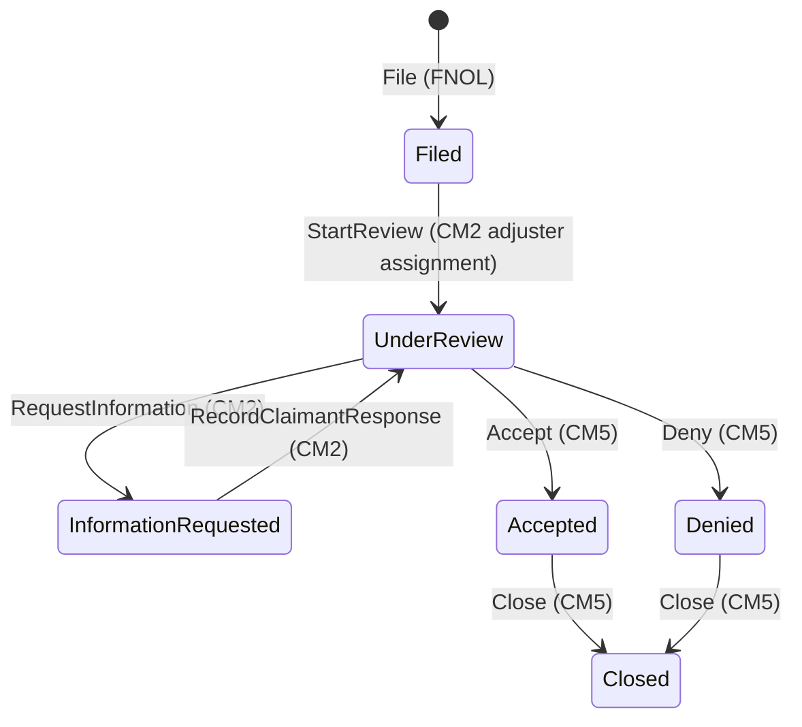
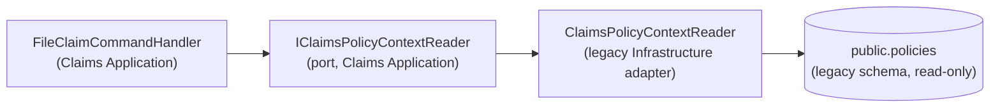

# Claims Milestone 1 - Claims Module Skeleton And FNOL — Design

> **Branch-local doc.** All Claims documentation lives under `docs/claims/` until the
> `feat/claims-context` branch merges to main (see `claims-status.md`). Tier-1 living docs are
> deliberately untouched on this branch.

## What this milestone builds

The **Claims bounded context** is born: a new `src/Modules/Claims` module (Domain / Application /
Infrastructure) owning a dedicated **`claims` PostgreSQL schema**, and the first business flow —
**FNOL (First Notice of Loss)**: a customer or broker files a cyber claim against one of their
**bound policies**, then sees their claims in an owner-scoped list and detail read.

> **Analogy:** the insurer opens a brand-new Claims department on its own floor of the office
> building. It gets its own filing room (the `claims` schema), its own outbox tube for memos
> (module outbox), and a reception desk (POST /api/v1/claims) where a policyholder reports an
> incident. The department never walks into the Policy department's filing room — it sends a
> runner with a read-only question ("does policy X exist, who owns it, what period does it
> cover?") through a hatch in the wall (the `IClaimsPolicyContextReader` port).

## Scope

In: module skeleton + schema + migration + CI wiring, the `Claim` aggregate with its full status
lifecycle and timeline, `POST /api/v1/claims` (file), `GET /api/v1/claims` (owner list),
`GET /api/v1/claims/{id}` (owner detail), `ClaimFiledDomainEvent` into the module outbox, new
`Claims.File` / `Claims.Read` policies.

Out (later milestones): adjuster queue/assignment (CM2), documents (CM3), reserves (CM4),
decisions (CM5), notification mappers (CM6), frontend (CM7).

## The aggregate

`Claim` (aggregate root, `claims.claims`):

| Field | Notes |
|---|---|
| `Id` | Guid |
| `PolicyId` | **id-only** reference to the Policy context — no cross-schema FK |
| `SubmissionId` | id-only, carried from the policy snapshot for traceability |
| `OwnerUserId` | claimant scoping (copied from the policy at file time) |
| `ClaimNumber` | human-readable `CLM-<year>-<8 hex>` (same style as policy numbers) |
| `IncidentType` | enum: RansomwareExtortion, BusinessEmailCompromise, DataBreachPrivacy, NetworkInterruption, FundsTransferFraud, Other |
| `IncidentAtUtc` / `DiscoveredAtUtc` | discovery must be ≥ incident |
| `Description` | required narrative |
| `Status` | Filed → UnderReview → InformationRequested → Accepted/Denied → Closed, **domain-enforced** (illegal transition throws) |
| `PolicyNumberAtFiling`, `PolicyEffectiveAtFiling`, `PolicyExpirationAtFiling`, `PolicyLimitAtFiling`, `PolicyRetentionAtFiling` | **file-time snapshot** of policy facts (same discipline as bind-time snapshots on `Policy`) |
| `Version` | optimistic-concurrency token, bumped on every mutation (M44.5 pattern, ready for CM2 assignment races) |
| timeline | append-only `ClaimTimelineEntry` children (`claims.claim_timeline_entries`) — every lifecycle change writes one |

Creation only via `Claim.File(...)` (factory + private setters). Transitions only via guard
methods (`StartReview`, `RequestInformation`, `RecordClaimantResponse`, `Accept`, `Deny`,
`Close`) — each validates the current status, writes a timeline entry, bumps `Version`, and
records a domain event. CM1 wires only `File` to an endpoint; the transition methods are
domain-complete and unit-tested now so CM2/CM5 only add application/API layers.

## Domain events (module outbox)

`ClaimFiledDomainEvent(ClaimId, ClaimNumber, PolicyId, PolicyNumber, OwnerUserId, IncidentType,
OccurredAtUtc)` — captured transactionally by `ClaimsDbContext.CaptureDomainEventsAsync` into
`claims.outbox_messages` (copy of the Underwriting module outbox), drained by the existing
dispatcher via a new registered `ClaimsOutboxSource : IOutboxSource`. Transition events
(`ClaimStatusChanged…`-style per-outcome events) are added in the milestone that wires each
transition, so every event has a consumer story when it ships.

## Cross-context read port

`ClaimsPolicySnapshot(PolicyId, SubmissionId, PolicyNumber, OwnerUserId, EffectiveAtUtc,
ExpirationAtUtc, Limit, Retention, Status)` — the same shape/spirit as
`IUnderwritingQuoteContextReader`. The Claims module physically cannot touch policy tables.

**File-claim validation (handler):** policy exists → caller owns it → policy status is `Bound` →
`IncidentAtUtc` within `[EffectiveAtUtc, ExpirationAtUtc]`. Field validation (dates, description,
enum) is FluentValidation, mirroring M4's grammar.

## API surface

| Endpoint | Policy | Behavior |
|---|---|---|
| `POST /api/v1/claims` | `Claims.File` (Customer/Broker/Admin) | files a claim; supports `Idempotency-Key` via `IIdempotencyService` (same controller pattern as quote accept/bind); 201 + result; 404 unknown/unowned policy; 409 business rejection (not bound / incident outside period) |
| `GET /api/v1/claims` | `Claims.Read` (Customer/Broker/Admin) | owner-scoped list (no-tracking read via `IClaimsReader`) |
| `GET /api/v1/claims/{id}` | `Claims.Read` | owner-scoped detail incl. timeline |

Unknown-vs-unowned policy both return 404 (no existence leak), matching the submissions/quotes
convention.

## Composition and wiring

- `AddClaimsModule(connectionString, profile)` in Claims Infrastructure — DbContext (migrations
  history table in `claims` schema), `IClaimRepository`, `IClaimsReader`, `IOutboxSource`
  (`ClaimsOutboxSource`), MediatR handlers. Registered in **both hosts** (API + Worker).
- Legacy Infrastructure registers the `IClaimsPolicyContextReader` adapter (new project
  reference: legacy Infrastructure → `Modules.Claims.Application`, same as it already does for
  Underwriting/Notifications/Quoting — architecture test lists updated).
- Health: `ClaimsDbContext` readiness check beside the other three.
- CI + `scripts/update-database.ps1`: a fourth `dotnet ef database update --context ClaimsDbContext` step.
- New policies in `ApplicationPolicies` (+`AuthorizationPolicies`): `Claims.File`, `Claims.Read`
  (Customer/Broker/Admin). `Claims.Adjudicate` arrives in CM2 with the adjuster queue.

## Testing plan (TDD)

1. **Domain unit tests** (`tests/LIAnsureProtect.UnitTests/Modules/Claims/ClaimTests.cs`):
   factory validation (bad dates, empty description, empty ids), snapshot capture, event raised,
   full legal-transition walk, every illegal transition throws, timeline appended per change,
   Version bumps.
2. **Application unit tests** (`FileClaimCommandHandlerTests`): happy path (repository add +
   unit-of-work commit), policy missing → null result, not owner → null, not bound → domain
   rejection, incident outside period → rejection. Port mocked (Moq), matching M4 conventions.
3. **Integration tests** (`ClaimEndpointTests`): SQLite-swapped `ClaimsDbContext` +
   `SubmissionDbContext` (policy row seeded), TestAuthHandler roles; file→201 with claim number;
   404s; 409s; owner-scoped list/detail; 403 for Underwriter role; idempotency replay test;
   outbox row written on file.
4. **Migration test** (`Claims/CreateClaimsSchemaMigrationTests.cs`, opt-in real PostgreSQL like
   the Underwriting ones) proving the `claims` schema + tables + history table.
5. Architecture tests updated: Api/Worker/Infrastructure reference lists + explicit Claims module
   rows; the module ratchet covers Claims automatically.

## Decisions to record

- **Snapshot at filing** (policy number/period/limit/retention copied onto the claim): claims are
  adjudicated against the policy *as it was*; protects CM5's settlement-≤-limit guardrail from
  later policy-side changes. Consciously mirrors bind-time snapshots.
- **Transition methods domain-complete in CM1** even though only `File` gets an endpoint: the
  state machine is the aggregate's constitution; testing it once now prevents per-milestone
  re-design. Events for transitions are deferred to the milestone that ships each action.
- **`Version` token from day one**: cheaper than a CM2 migration that retrofits concurrency onto
  live rows.
- **No amounts in CM1**: claimed/reserve/paid arrive in CM4 by design (keeps FNOL minimal).
