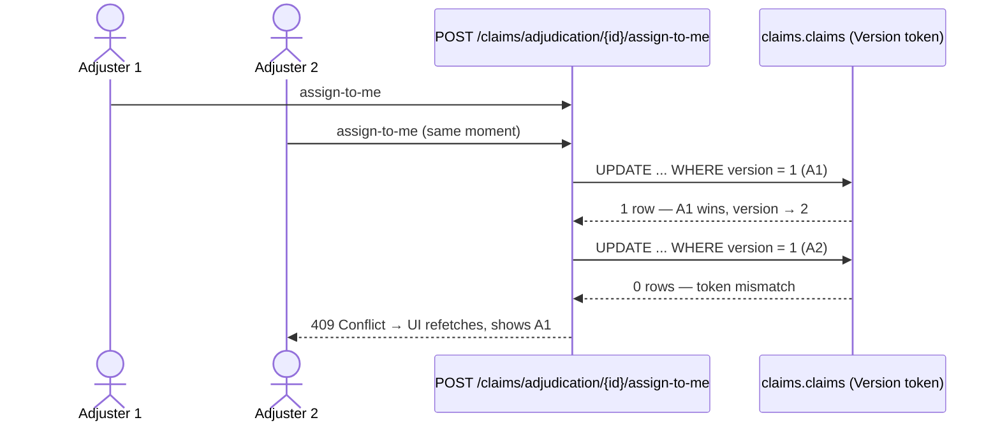

# Claims Milestone 2 - Adjuster Queue, Assignment And Operations — Design

> Branch-local doc (`docs/claims/` policy — see `claims-status.md`).

## What this milestone builds

The **ClaimsAdjuster role goes live** — the role reserved since M6 finally gets a workload. An
adjuster can see the adjudication queue, **claim a file** (assignment with the exact M44.5
concurrency pattern), leave internal work notes, and ask the claimant for more information; the
claimant answers from their side and the claim returns to review. Every action lands in the
append-only timeline.

> **Analogy:** the claims department gets its intake counter. Filed envelopes pile up in a tray
> (the queue); an adjuster picks one up and writes their name on the folder (assignment — and two
> adjusters grabbing at once means one politely loses, 409). Sticky notes inside the folder are
> work notes; a letter mailed to the policyholder ("please send the forensic report") flips the
> folder's flag to *waiting for information* until the reply arrives.

## Scope

In: `Claims.Adjudicate` + `Claims.Respond` policies, adjudication queue + detail endpoints,
assign/release with optimistic concurrency, work notes, information requests + claimant response,
new timeline entry types, domain events for each new lifecycle change, `AddClaimOperations`
migration.

Out: documents (CM3), reserves (CM4), decisions (CM5), notification mappers (CM6), UI (CM7).

## Domain changes (on the `Claim` aggregate — no separate operation aggregate)

Unlike underwriting (where the referral *operation* is a separate projection-fed aggregate
because the quote lives in another context), the claim **is** the module's own aggregate — so
assignment, notes, and information requests live directly on `Claim`. No projector is needed:
filing and adjudication are the same bounded context.

- `AssignedAdjusterUserId` (nullable) + **`AssignTo` as a guarded claim** (M44.5, copied
  semantics): same-adjuster re-click is an idempotent no-op; a second adjuster is rejected in
  the domain (`InvalidOperationException` → 409); `ReleaseAssignment` is the explicit hand-over.
  The true race (both load "unassigned") is caught by the existing `Version` token — the loser's
  save fails, `EfClaimRepository` already translates `DbUpdateConcurrencyException` → 409.
- **Assignment starts the review:** `AssignTo` on a `Filed` claim also performs the
  Filed → UnderReview transition (one action, two timeline entries). Assignment is only allowed
  while the claim is open (not Accepted/Denied/Closed).
- `ClaimWorkNote` child entity (append-only, internal to adjusters).
- `ClaimInformationRequest` child entity: title + message, requested-by/at, `IsAnswered`,
  response text + responded-by/at. `RequestInformation(...)` requires `UnderReview` and flips
  the claim to `InformationRequested`; `RespondToInformationRequest(...)` (claimant) requires
  the request to be open, records the answer, and flips the claim back to `UnderReview`.
  *Simplification (recorded):* the status flips back on the first response even if other
  requests are still open — open requests stay visible and answerable; the adjuster can re-flip
  by sending another request. Status is a coarse "whose court is the ball in" flag, not a
  per-request ledger.
- New timeline entry types: `AssignmentChanged`, `NoteAdded`, `InformationRequested`,
  `ClaimantResponded` (stored as strings — additive, no data migration).
- New domain events into the module outbox (consumers arrive in CM6):
  `ClaimAssignedDomainEvent`, `ClaimInformationRequestedDomainEvent`,
  `ClaimantInformationResponseDomainEvent`.

## API surface

Adjuster (`ClaimsAdjudicationController`, route `api/v1/claims/adjudication`, policy
**`Claims.Adjudicate`** = ClaimsAdjuster + Admin):

| Endpoint | Effect |
|---|---|
| `GET /` | queue: all non-Closed claims (newest filed first) with status/assignment/incident facts |
| `GET /{claimId}` | full working detail: claim + snapshot + notes + information requests + timeline |
| `POST /{claimId}/assign-to-me` | guarded claim; 409 on second adjuster or true race |
| `POST /{claimId}/release-assignment` | explicit hand-over |
| `POST /{claimId}/notes` | append a work note |
| `POST /{claimId}/information-requests` | ask the claimant; claim → InformationRequested |

Claimant (existing `ClaimsController`):

| Endpoint | Policy | Effect |
|---|---|---|
| `POST /{claimId}/information-requests/{requestId}/respond` | **`Claims.Respond`** (Customer/Broker/Admin), owner-scoped | answers the request; claim → UnderReview |
| `GET /{claimId}` (existing detail) | `Claims.Read` | now also returns the information requests (question + own response) so the claimant can see what is being asked |

Error grammar unchanged: null → 404 (missing/unowned), `ArgumentException` → 400,
`InvalidOperationException` → 409.

## Read side

`IClaimsAdjudicationReader` (separate port from the owner-scoped `IClaimsReader` — different
audience, different shape): `ListQueueAsync()` and `GetDetailAsync(claimId)`, both no-tracking.
The queue is **not cached** in CM2 — the referral queue earned its 10s cache only after
measurement (M44.5); the claims queue starts honest and can adopt `ICacheableRequest` later.

## Persistence

`AddClaimOperations` migration: `assigned_adjuster_user_id` column on `claims.claims` (+ index),
new tables `claims.claim_work_notes` and `claims.claim_information_requests` (FKs to
`claims.claims` only — same-schema children, cascade delete). Repository include-graph grows to
notes + information requests.

## Testing plan (TDD)

1. **Domain:** assignment claim semantics (first wins / same-user idempotent / second rejected /
   release then reassign / closed claim rejects), auto Filed→UnderReview on first assignment,
   note append + timeline, information request flow (request requires UnderReview, respond
   requires open request, status flips both ways), events raised, Version bumps.
2. **Application:** assign/release/note/request handlers (repository + current user mocks);
   claimant respond handler enforces ownership (null → 404).
3. **Persistence:** `ClaimAssignmentConcurrencyTests` — two contexts race on the same unassigned
   claim, second save throws `DbUpdateConcurrencyException` (copy of the M44.5 proof).
4. **Endpoints:** queue visible to ClaimsAdjuster/Admin, 403 for Customer/Underwriter; assign →
   200 + assignee, second adjuster → 409 + first assignment survives; release → reassignable;
   notes; full info-request round trip (adjuster asks → claimant sees + answers → status back to
   UnderReview → timeline shows both); claimant of another claim gets 404; migration-script test
   for the new tables/column.
