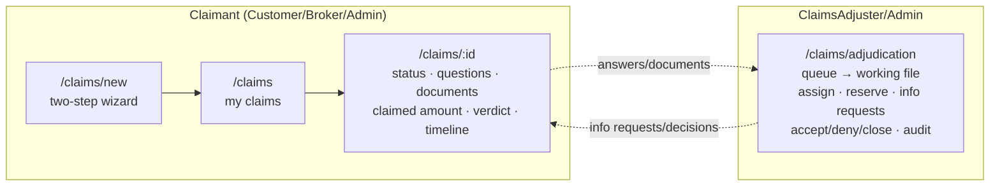

# Claims Milestone 7 - Frontend Claims Slice — Design

> Branch-local doc (`docs/claims/` policy — see `claims-status.md`).

## What this milestone builds

The Claims context gets its **screens**: a claimant journey (file a claim through a two-step
wizard, follow it, answer the adjuster, upload documents) and the **adjuster workbench** — the
workplace the ClaimsAdjuster persona has been waiting for since M6 — all as a
`features/claims` vertical slice in the established M9 convention, with **role-guarded routes**.

## Structure (vertical slice)

| Piece | Content |
|---|---|
| `types.ts` | mirror of the API result records + the three UI enums (incident types, document kinds, denial reasons) |
| `api/claimsApi.ts` | fetch wrappers for every claimant + adjudication endpoint; ProblemDetails `detail` surfaced as the error message; `Idempotency-Key: crypto.randomUUID()` on file/accept/deny |
| `hooks/useClaims.ts` | owner queries + mutations (respond, claimed amount, upload) with detail invalidation |
| `hooks/useClaimsAdjudication.ts` | queue/detail queries + all workbench mutations, invalidating on **`onSettled`** so a 409 refetches the truth (M44.5 UX) |
| pages | `ClaimsPage`, `NewClaimPage`, `ClaimDetailPage`, `ClaimsAdjudicationPage` |

## Route guards

New `RequireRole` (wraps children inside `RequireAuth`) + `lib/userRoles.ts` reading the
namespaced role claim the API validates. Claimant routes: Customer/Broker/Admin; workbench:
ClaimsAdjuster/Admin. **UX only** — the API's policies enforce.

## Backend enabler

The wizard needs "my bound policies": `GET /api/v1/claims/policy-options` (`Claims.File`), a new
`ListOwnedBoundPoliciesAsync` on the existing `IClaimsPolicyContextReader` port (legacy-side,
read-only, Bound-only, owner-scoped) → `ListMyClaimablePoliciesQuery`.

## Testing plan

Vitest + Testing Library per the repo exemplars (api module mocked, MemoryRouter, QueryClient
without retries): list/empty/error states, the full wizard walk (policy pick → incident form →
file → confirmation) + API rejection surfacing, detail interactions (answer a question, declare
the claimed amount, upload documents, verdict view, download URLs), the workbench matrix (open
file, assign, **409 → refetch proof**, release, reserve, info request, accept with cap hint,
deny, close, note), and `RequireRole` allow/deny/no-claim cases. Full `npm run lint/test/build`
green; backend suite green with the two new policy-options tests.
