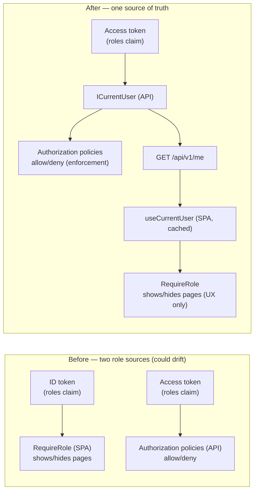

# Post-CM8 Hardening — The `/me` Endpoint (Server-Authoritative Roles)

> Branch-local doc (`docs/claims/` policy). Folds into **Encyclopedia Chapter 5 — Identity &
> Login** at the final merge (added to `final-merge-checklist.md`).

## The problem this fixes

CM7 shipped a frontend route guard, `RequireRole`, that decided whether to show the claimant
pages and the adjuster workbench. It read the caller's roles from the **ID token** (Auth0's
`user` object). But the **API** enforces roles from the **access token**. Two independent role
sources that a human had to keep in sync by hand — and the sync point was a single line in an
Auth0 Action. If that line was missing, the API would happily accept a ClaimsAdjuster while the
**UI** showed them an "access restricted" wall. Silent, confusing, and exactly the kind of
config-drift bug that production apps design out.

> **Analogy — one badge, one guard list.** Before: the building's door guard (the API) checked
> your access badge, but the *lobby directory sign* (the SPA) that tells you which floors you may
> visit was printed from a *different* list that someone had to update separately. If the two
> lists disagreed, you'd be told "you can't go up there" at the sign, even though the guard would
> have let you through. After: the lobby sign is generated live *from the guard's own list* by
> asking the front desk "what am I allowed to do?" (`GET /api/v1/me`). The sign and the guard can
> never disagree, because there is only one list.

## The fix: ask the backend "who am I?"

A tiny, provider-neutral endpoint returns the caller's identity and roles from the **same**
`ICurrentUser` abstraction the authorization policies already use. The SPA reads roles from it —
and stops parsing tokens entirely.

### Backend

`GET /api/v1/me` → `CurrentUserController` (`[Authorize]`, any authenticated caller) returns
`CurrentUserResult(UserId, Email, Roles)` straight from `ICurrentUser`. No MediatR, no database —
it is a pure identity echo. Because `ICurrentUser.GetRoles()` reads the identity's own
`RoleClaimType`, the roles returned are **exactly** the roles the policies enforce.

### Frontend

- `lib/currentUserApi.ts` — `fetchCurrentUser(token)` calls `/api/v1/me`.
- `hooks/useCurrentUser.ts` — TanStack Query, cached with a 5-minute stale time (roles rarely
  change mid-session), so the call happens ~once per session, not per navigation.
- `components/RequireRole.tsx` — now reads roles from `useCurrentUser()`:
  - **loading** → "Checking access…" (never a false "denied" while roles are still loading);
  - **error** → "We could not verify your access" (refresh / contact admin);
  - **no roles at all** → a *specific* "No roles assigned to your account" message (turns the old
    silent misconfiguration into a clear, actionable one);
  - **wrong role** → the standard restricted message;
  - **allowed** → the page.
- `lib/userRoles.ts` (the ID-token role reader) was **deleted** — nothing parses tokens anymore.

## Why this is the production-grade shape

| Property | Payoff |
|---|---|
| **Single source of truth** | UI-shown roles and API-enforced roles come from one place; they cannot disagree. The original bug is impossible by construction. |
| **Provider-neutral** | The SPA never reads an Auth0-specific token. When M48 adds Cognito, the SPA and this endpoint are **untouched** — only the API's token-validation config changes. Matches the project rule: keep provider details at the API edge. |
| **Spec-correct** | Access tokens are meant to be opaque to clients (OAuth2); the SPA no longer inspects one. Identity for the client comes from a first-party API call, not token archaeology. |
| **Fails loud, not silent** | A user with no roles gets a clear message instead of a dead end. |
| **Still defense-in-depth** | `RequireRole` remains **UX only**; every claims endpoint stays policy-guarded server-side. A hand-crafted request still hits the real authorization gate. |

## Consequence for the Auth0 tenant

The earlier action item — "add the namespaced roles claim to **ID tokens**" — is **no longer
required**. The SPA does not read the ID token for roles. The tenant still needs, as before:
RBAC enabled on the API, the roles claim on the **access token** (already configured since M7),
and each user assigned the correct role. Adding the claim to ID tokens is now harmless but
unnecessary.

## Verification

- Backend: `CurrentUserEndpointTests` — authenticated caller gets identity + roles (200), a
  caller with no role gets an empty `roles` array (200, not an error), anonymous gets 401. Full
  backend suite green (181 unit + 240 integration).
- Frontend: `RequireRole.test.tsx` rewritten for the five states (loading / error / no-roles /
  wrong-role / allowed). Full frontend suite green (61 tests), lint + build clean.

## Not changed (deliberately)

The API's authorization policies (the real enforcement) are untouched. This milestone only
changes **where the SPA learns roles**, replacing token-parsing with a first-party API call.
