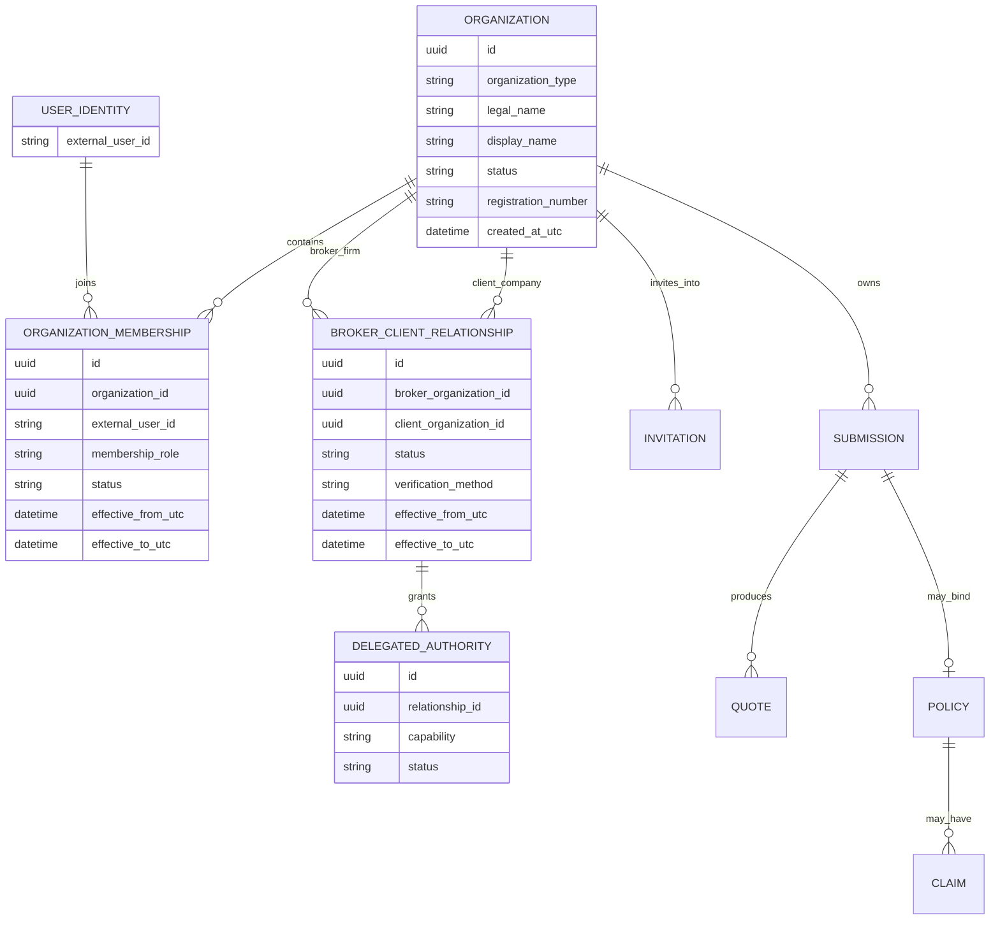
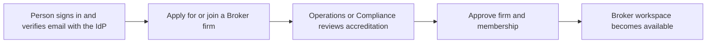
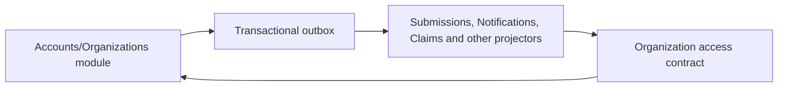

# Broker organizations and delegated client access — future milestone plan

**Status:** approved future milestone; design and implementation plan only.

**Separation rule:** this milestone is deliberately independent from
`manual-retest-hardening-batch-plan.md`. None of the Broker organization, client onboarding,
delegation, or ownership migration described here belongs in the current manual-retest hardening PR.

## 1. Why this milestone exists

The product description says that a Broker manages assigned client companies and submits applications
for them. The current runtime does not implement that relationship. Customer and Broker are allowed
through the same Customer-workflow policies and pages, and every Submission is owned by the authenticated
caller's `OwnerUserId`.

That means a Broker can type different applicant and company names into separate Submissions, but those
names are only Submission data. They do not create client-company accounts, invite customer users, prove
the Broker's authority, or transfer ownership away from the Broker's personal identity.

This is safe for the current walkthrough because repository reads remain strictly owner-scoped. It is not
the correct long-term brokerage model because:

- a company is not a durable business party;
- the Broker personally owns every downstream Quote, Policy, Evidence request, Notification, and Claim;
- a customer cannot later sign in and see its own history without rewriting ownership;
- there is no relationship approval, expiry, revocation, or delegated-authority audit;
- two Brokers can create duplicate text-only versions of the same client company; and
- permissions cannot differ between intake, Evidence, quote acceptance, binding, and Claims.

## 2. Product decisions

1. **Authentication and business access remain separate.** Auth0 (or a future compatible identity
   provider) authenticates a person and supplies a stable user id. The application owns organizations,
   memberships, Broker-client relationships, delegated permissions, approval, and audit history.
2. **A client company owns its insurance lifecycle.** A Broker acts for the company under explicit,
   revocable authority; the Broker's personal user id is not the permanent business owner.
3. **A Broker firm is an organization, not merely a role claim.** One firm may contain several Broker
   users, and one Broker user may act only within memberships granted to that firm.
4. **A customer company is also an organization.** It may have several authorized users with different
   capabilities, such as administrator, intake preparer, approver, or claims contact.
5. **Broker accreditation is approved once at the firm/membership boundary.** Routine drafts do not need
   approval. Legal/Compliance must decide the exact evidence and renewal requirements before production.
6. **Each Broker-client relationship requires authority.** Prefer customer acceptance of an invitation;
   permit an auditable operations verification path when an offline mandate is legitimate.
7. **Underwriters do not approve accounts or commercial representation.** Underwriting evaluates risk.
   Admin/operations/compliance owns Broker onboarding and relationship verification, preserving separation
   of duties.
8. **Delegation is capability-specific.** Creating/editing/submitting an application is not automatically
   authority to accept a Quote, bind a Policy, view all Claims, file a Claim, or respond to Claims.
9. **Removal of access does not erase history.** Memberships and relationships change status and retain
   effective dates, actor, reason, and audit evidence. Submitted/quoted/bound/claimed records remain.
10. **No role or UI check replaces resource authorization.** Every command and query proves organization
    membership plus the required delegated capability at the API/Application boundary.

## 3. Target model



### Core concepts

| Concept | Purpose |
| --- | --- |
| `Organization` | Durable Broker firm or client company identity. |
| `OrganizationMembership` | Connects an authenticated person to an organization with a scoped role and lifecycle. |
| `BrokerClientRelationship` | Auditable assignment between one approved Broker firm and one client company. |
| `DelegatedAuthority` | Explicit action permission granted through the relationship. |
| `Invitation` | Single-use, expiring invitation for a user to join a company or accept Broker representation. |
| `AccessDecision` | Application result explaining whether actor, organization, relationship, and capability permit an action. |

Recommended initial delegated capabilities:

- `Submissions.Create`
- `Submissions.Edit`
- `Submissions.Submit`
- `Evidence.Read`
- `Evidence.Respond`
- `Quotes.Read`
- `Quotes.RequestReassessment`
- `Quotes.Accept`
- `Policies.Read`
- `Policies.Bind`
- `Claims.Read`
- `Claims.File`
- `Claims.Respond`

Do not infer all permissions from a single `Broker` role.

## 4. Onboarding and approval workflows

### 4.1 Broker firm onboarding



- The identity provider proves account control, not insurance-broker authority.
- A new Broker firm starts `PendingReview`.
- Operations/Compliance records approve/decline reason, actor, UTC time, and any externally stored
  evidence references.
- Approved users receive application capabilities through server-authoritative membership reads. Avoid
  requiring an identity-provider role rewrite for every client assignment.
- Suspension or expiry immediately blocks new actions but does not erase audit history.

### 4.2 Add or connect a client company

1. An approved Broker searches existing client organizations using constrained, privacy-safe identifiers.
2. If the organization exists, the Broker requests a relationship instead of creating a duplicate.
3. If it does not exist, the Broker creates a pending client organization with legal/display details.
4. The Broker invites an authorized customer representative.
5. The representative verifies identity, joins the client organization, reviews requested permissions,
   and accepts or rejects the Broker relationship.
6. When customer acceptance is impossible but an offline mandate exists, operations may verify the
   relationship using a reasoned, auditable override. This path must be capability-limited and monitored.
7. The active relationship receives explicit effective dates and delegated capabilities.

### 4.3 Routine insurance work

- An approved Broker selects the client organization before entering a workflow.
- Every page visibly identifies the active client and Broker firm.
- New Submissions are owned by `ClientOrganizationId` and record `CreatedByUserId`,
  `ActingOrganizationId`, and the relationship/delegation used.
- Customer users and authorized Broker users see the same client record through different grants, not
  duplicated owner rows.
- Quote acceptance, Policy binding, and Claims use their own capability checks. High-impact actions may
  require a client approver or documented delegated authority.

### 4.4 Revocation and expiry

- Customer administrators can revoke future Broker access, subject to operational/legal holds.
- Operations can suspend a firm or relationship with a reason.
- Revocation blocks new reads/actions after authorization caches are invalidated.
- Existing business history retains the actor and authority snapshot that applied at the time.
- In-flight tasks are reassigned or made visible to client/operations queues; they do not disappear.

## 5. Authorization model

Broad identity roles remain useful for coarse entry:

```text
Customer
Broker
Underwriter
ClaimsAdjuster
Admin
```

Resource authorization adds four mandatory questions:

```text
Who is the authenticated person?
Which organization are they acting for?
Which client organization owns the resource?
Does an active membership/relationship grant the required capability now?
```

Recommended Application ports:

```csharp
public interface IOrganizationAccessAuthorizer
{
    Task<OrganizationAccessDecision> AuthorizeAsync(
        string userId,
        Guid ownerOrganizationId,
        OrganizationCapability capability,
        CancellationToken cancellationToken);
}

public interface ICurrentOrganizationContext
{
    Guid? ActingOrganizationId { get; }
}
```

Rules:

- Never accept an arbitrary client id as authorization proof.
- Resolve the active organization from a validated request/header/route contract plus server-side
  membership. The browser's selected client is untrusted input.
- Return 404 for another organization's resources where that avoids identity leakage; return 403 for a
  known but disallowed administrative transition when the product intentionally reveals it.
- Admin support access must be explicit, reasoned, logged, time-bound where appropriate, and not achieved
  by pretending Admin is the owner.
- Cache only rebuildable authorization summaries for short periods and invalidate them after membership,
  relationship, or delegation changes.

## 6. Bounded-context and persistence boundary

Create a dedicated `Accounts` (or `Organizations`) module with Domain, Application, and Infrastructure
projects plus its own PostgreSQL schema. It owns organizations, memberships, invitations, relationships,
delegations, and onboarding audit.

Other contexts keep only organization ids and immutable authority snapshots needed for their own audit.
They do not join or foreign-key into the Accounts schema.



- Direct user commands in Accounts are synchronous and strongly consistent.
- Cross-context effects use versioned events through the transactional outbox.
- Consumers are idempotent on source message id.
- Events carry ids/status facts, not contact documents or sensitive onboarding evidence.
- No module writes another module's tables and no cross-schema foreign keys are introduced.

Candidate integration events:

- `OrganizationCreated`
- `OrganizationMembershipApproved`
- `OrganizationMembershipSuspended`
- `BrokerClientRelationshipActivated`
- `BrokerClientRelationshipRevoked`
- `DelegatedAuthorityChanged`
- `OrganizationDisplayNameChanged`

## 7. API surface

Illustrative versioned endpoints:

```text
GET    /api/v1/organizations/mine
POST   /api/v1/broker-organizations/applications
GET    /api/v1/broker-organizations/applications/{id}
POST   /api/v1/admin/broker-organizations/{id}/approve
POST   /api/v1/admin/broker-organizations/{id}/decline

GET    /api/v1/broker/clients
POST   /api/v1/broker/clients
POST   /api/v1/broker/clients/{clientId}/relationship-requests
GET    /api/v1/client-organizations/{clientId}/relationship-requests
POST   /api/v1/client-organizations/{clientId}/relationship-requests/{requestId}/accept
POST   /api/v1/client-organizations/{clientId}/relationship-requests/{requestId}/decline
POST   /api/v1/client-organizations/{clientId}/broker-relationships/{relationshipId}/revoke

GET    /api/v1/client-organizations/{clientId}/members
POST   /api/v1/client-organizations/{clientId}/invitations
POST   /api/v1/invitations/{token}/accept
```

Contracts must use request DTOs, Problem Details, idempotency keys for unsafe retries, optimistic
concurrency on approvals/delegation changes, stable external references, cursor pagination, and
role/capability-appropriate filters.

## 8. User experience

### Broker workspace

- `Clients` becomes a first-class navigation item.
- Client selector/search shows only active assigned companies.
- Cards show relationship status, expiring authority, pending invitations, open tasks, and latest
  insurance activity without exposing unrelated sensitive data.
- `Add client`, `Invite customer`, `Request access`, and `Manage permissions` are separate actions.
- Every client-scoped page displays a persistent breadcrumb/context banner to prevent acting on the wrong
  company.
- Cross-client global search remains scoped to the Broker's active assignments and applicable capability.

### Customer workspace

- Customer administrators manage company members and pending Broker relationship requests.
- Customers can see which Broker firm/user performed each delegated action.
- Revocation and permission changes explain operational consequences before confirmation.

### Operations/Admin workspace

- Separate queues for Broker firm applications, relationship overrides, suspensions, expiry, and failed
  invitations.
- Approval requires a reason and shows an immutable audit timeline.
- Admin support never silently grants ownership.

## 9. Ownership migration from `OwnerUserId`

Migration must be incremental and always green:

1. Add Accounts module and schema beside the current owner model.
2. Create one personal/client organization for each distinct current owner as a compatibility backfill.
3. Add nullable `OwnerOrganizationId`, `CreatedByUserId`, and authority snapshot fields to source-owned
   aggregates/read models one context at a time.
4. Dual-read behind an explicit compatibility adapter while backfill verification runs; avoid permanent
   dual-write ambiguity.
5. Backfill and verify every Submission → Quote → Policy → Evidence → Notification → Claim lineage.
6. Switch create/read/update authorization to organization access in a single audited slice per context.
7. Convert legacy personal owners into organization memberships.
8. Make organization ownership required only after data and authorization parity checks pass.
9. Remove legacy user-owner paths and update boundary tests.

Do not treat equal company-name strings as the same legal company. Ambiguous historical rows require an
operations review or remain separate compatibility organizations until resolved.

## 10. Security, privacy, and audit

- Invitation and verification tokens are random, short-lived, single-use, hashed at rest, purpose scoped,
  and absent from logs/analytics/SignalR payloads.
- Rate-limit applications, searches, invitations, resends, relationship requests, and approval attempts.
- Do not expose whether an arbitrary company or email exists through public lookup responses.
- Protect legal registration identifiers, contact data, delegation documents, and Claims access according
  to retention and least-privilege rules.
- Record actor user, acting organization, owning organization, capability, relationship/delegation id,
  UTC time, correlation id, decision reason, and before/after status for important changes.
- Require step-up authentication for high-impact production actions if the approved identity plan supports
  it.
- Add monitoring for invitation abuse, rapid client switching, repeated access denials, expired authority,
  abnormal cross-client reads, and Admin overrides without including sensitive payloads.

## 11. Phased implementation plan

### Phase A — final decisions and RED tests

- Confirm Accounts vs Organizations module naming.
- Obtain Legal/Compliance decisions for Broker accreditation, client consent, authority documents,
  retention, expiry, and quote/bind/claim delegation.
- Define capability matrix and multi-role/Admin behavior.
- Add architecture, domain, authorization, and endpoint RED tests before implementation.

### Phase B — Accounts module foundation

- Add module projects/schema/DbContext/migrations.
- Implement Organization and Membership aggregates, repositories, queries, admin approval, and audit.
- Add organization-aware current-user/access ports without changing existing business ownership yet.

### Phase C — invitations and Broker-client relationships

- Add invitation, relationship request, approval/acceptance, expiry, suspension, revocation, and delegated
  authority.
- Add local deterministic delivery capture for tests and a production delivery port/adapter plan.
- Project safe personal/team notifications through the existing outbox.

### Phase D — Broker, Customer, and Admin workspaces

- Add client selector, client list/detail, invitations, relationship/permission management, and operations
  review queues.
- Add role/capability-aware navigation, search, filters, empty/error/loading states, breadcrumbs, and
  accessible confirmation flows.

### Phase E — organization ownership migration

- Backfill compatibility organizations and memberships.
- Move Submissions/Quotes/Policies first, then Underwriting Evidence/Notifications, then Claims.
- Add authority snapshots and actor attribution.
- Rework owner-scoped integration tests into organization/capability matrices without weakening isolation.

### Phase F — hardening and closeout

- Add concurrency, idempotency, rate limiting, expiry jobs, cache invalidation, operational metrics, and
  abuse/security tests.
- Update Tier-1 Encyclopedia, Build History, Running App, Manual Testing Guide, roles, architecture,
  roadmap, project status, README, and changelog.
- Complete zero-warning build, full tests, all DbContext pending-model checks, frontend gates, Docker-backed
  local CI, protected-main PR reviews, and migration rehearsal.

## 12. Acceptance scenarios

1. A Customer user sees only organizations where they hold an active membership.
2. A Broker user sees only client companies connected to their approved Broker firm by an active
   relationship.
3. Typing or modifying a client id cannot widen access; another company's resource returns safe
   404/forbidden behavior and records no mutation.
4. An unapproved/suspended Broker firm cannot create client relationships or insurance records.
5. A Broker can request access to an existing company without creating a duplicate or learning private
   company information.
6. A customer representative accepts a single-use invitation and explicitly approves requested Broker
   capabilities.
7. An operations override requires a reason, audit entry, and approved capability/expiry boundary.
8. A Broker with intake permission but no quote-acceptance permission can submit an application but cannot
   accept the Quote.
9. A Broker with no Claims permission cannot list or infer client Claims even when it can read the Policy.
10. Revoking a relationship removes future access immediately after authoritative invalidation while
    preserving every historical actor/authority snapshot.
11. Two users in one Broker firm receive only the client permissions granted to their memberships and
    relationship.
12. Customer and Broker views refer to one shared client-owned Submission/Quote/Policy history rather than
    duplicates.
13. Concurrent approval/revocation requests use optimistic concurrency and cannot resurrect stale access.
14. Invitation replay, expiry, wrong recipient, wrong organization, and enumeration attempts fail safely.
15. Outbox replay is idempotent; Notifications and downstream projections converge without cross-schema
    writes.
16. Historical user-owned data is backfilled with verified lineage counts and no orphaned Quotes, Evidence,
    Policies, Notifications, or Claims.
17. All module-boundary, authorization matrix, API, migration, concurrency, frontend accessibility, security,
    pending-model, and Docker-backed local-CI gates pass.

## 13. Explicitly out of scope until approved

- commission calculation, premium remittance, and Broker accounting;
- public Broker marketplace/discovery;
- producer licensing integrations with a government or third-party registry;
- cross-border licensing decisions;
- customer CRM, marketing automation, and Broker chat;
- insurer/wholesaler/sub-broker hierarchies beyond the first firm-to-client relationship;
- legal conclusions about Philippine brokerage or delegated-signature requirements; and
- replacing Auth0 solely to implement organization membership.

## 14. Questions that must be closed before implementation

- Which team verifies Broker firms and what evidence/renewal cadence is required?
- Must every client relationship be accepted by a customer user, or when may operations verify an offline
  mandate?
- Which actions may a Broker perform by default, and which require explicit client delegation or step-up?
- Can multiple Broker firms act for the same client simultaneously, and may authority differ by product or
  Submission?
- Who may accept a Quote, bind a Policy, file/respond to a Claim, and revoke a relationship after a loss?
- What happens to open Evidence/Claim tasks when a relationship expires?
- Which organization identifiers are authoritative and what duplicate-resolution process is approved?
- What retention, privacy, and notification wording does Legal/Compliance approve?

Until these questions are answered, this document authorizes future planning but not implementation.
