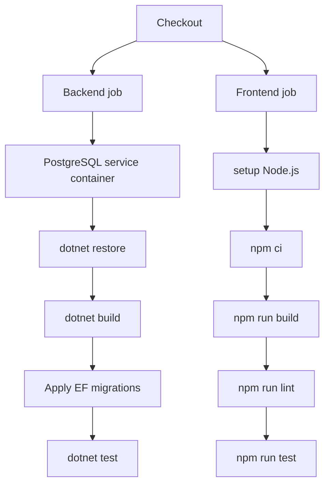

# CI/CD Flow

This document records the expected build and deployment flow for LIAnsureProtect.

## Local Script Mapping

Use this script when preparing a local developer machine or validating a branch before continuing work:

```powershell
.\scripts\setup-dev.ps1 -RunTests:$true
```

It runs the fresh setup and validation sequence:

```text
stop/remove existing dependency containers
  -> remove local DB volume
  -> pull PostgreSQL/pgvector image if missing
  -> start Docker Compose dependencies
  -> restore NuGet packages
  -> build the solution
  -> restore dotnet tools
  -> apply committed EF Core migrations
  -> run tests
  -> exit
```

Use this script when you want to run the API after setup:

```powershell
.\scripts\dev-up.ps1
```

It runs the same fresh setup path and then starts the API. Because it ends with `dotnet run`, it keeps running until the API is stopped.

Use this script when you want a CI-like one-command verification run with timestamped test results and an optional zip artifact:

```powershell
.\scripts\run-local-ci.ps1
```

By default, it removes the PostgreSQL container and local database volume after the run. Use this option when you want to inspect the database afterward:

```powershell
.\scripts\run-local-ci.ps1 -PostgreSqlAfterRun LeaveRunning
```

Use the smaller scripts only when debugging one step:

- `scripts/start-dependencies.ps1`
- `scripts/update-database.ps1`
- `scripts/stop-dependencies.ps1`

## CI Flow

The CI pipeline should be non-interactive and fail fast.

Recommended first CI flow:

```text
checkout repository
  -> restore .NET SDK and repo-local tools
  -> stop/remove any previous disposable dependencies
  -> remove disposable database volume
  -> start disposable Docker Compose dependencies
  -> restore NuGet packages
  -> build solution
  -> apply EF Core migrations to the disposable PostgreSQL/pgvector database
  -> run tests
  -> publish test/build artifacts
  -> stop Docker Compose dependencies
```

The local setup scripts use checked command execution so CI receives a failed exit code when any Docker or .NET step fails.

CI should publish the timestamped zip artifact produced by `run-local-ci.ps1`. The zip contains the timestamped result folder:

```text
TestResults/local-ci-yyyyMMdd-HHmmss.zip
```

Endpoint integration tests use SQLite in-memory for speed, and migration tests verify PostgreSQL migration SQL.

The project now also has an opt-in PostgreSQL-backed persistence test. CI should enable it after the PostgreSQL/pgvector Compose service is started and migrations have been applied:

```text
LIANSUREPROTECT_RUN_POSTGRES_TESTS=true
LIANSUREPROTECT_TEST_POSTGRES_CONNECTION_STRING=Host=localhost;Port=5432;Database=liansureprotect;Username=postgres;Password=postgres
```

The local equivalent is:

```powershell
.\scripts\setup-dev.ps1 -RunTests:$true
```

## Frontend Checks In CI

Milestone 8 adds the first React/Vite frontend under:

```text
src/LIAnsureProtect.Web
```

The first CI flow should run frontend checks as a separate frontend job or as a frontend step after checkout:

```text
checkout repository
  -> setup Node.js
  -> npm ci
  -> npm run build
  -> npm run lint
  -> npm run test
```

In simple English:

```text
npm ci:
  Install the exact package tree from package-lock.json.

npm run build:
  Prove TypeScript and Vite can produce a production build.

npm run lint:
  Prove ESLint accepts the frontend code.

npm run test:
  Prove focused frontend component tests pass.
```

The local equivalent is included in:

```powershell
.\scripts\run-local-ci.ps1
```

That script runs frontend checks when the web project exists.

## Containerization Direction For CI/CD

The project should become containerized for real CI/CD and deployment, but that does not mean every local development command must run inside application containers today.

Recommended direction by stage:

```text
Current local development:
  Run API and frontend directly on the host for fast debugging.
  Run external dependencies, such as PostgreSQL, in Docker Compose.

First CI:
  Run build/test commands in GitHub Actions runners.
  Run PostgreSQL as a CI service container.
  Publish test/build artifacts.

Deployment milestone:
  Build container images for deployable services.
  Push images to a registry.
  Deploy immutable images to the target platform.
```

Simple analogy:

```text
Local development:
  Work at your desk with tools open and easy to debug.

CI:
  Use a clean inspection bench that repeats the same checks every time.

Deployment:
  Seal the finished app into shipping boxes called container images.
```

### What Should Be Containerized

Likely production/deployment containers:

```text
API:
  ASP.NET Core Web API container.

Worker:
  Background worker container when worker jobs become real.

Frontend:
  Either static files built by CI and served by S3/CloudFront,
  or a small web-server container if the chosen hosting target needs it.
```

Development/test service containers:

```text
PostgreSQL with pgvector:
  Already containerized through Docker Compose.

Future Redis/cache:
  Containerized locally and in CI when introduced.

Future local AWS emulation:
  Containerized only if a future milestone needs it.
```

### Does Containerized Mean Tests Run Inside Containers?

Sometimes, but not always.

There are three common CI patterns:

```text
Pattern 1 - Runner executes tests, dependencies run in service containers:
  GitHub Actions runner runs dotnet test and npm test.
  PostgreSQL runs as a service container.

Pattern 2 - Test commands run inside app containers:
  Build a test image.
  Run dotnet test or npm test inside that image.

Pattern 3 - End-to-end environment uses containers:
  API container + frontend container/static host + database container.
  Browser tests run against that environment.
```

Recommended first approach for LIAnsureProtect:

```text
Use Pattern 1 first.
```

Why:

```text
It is simpler.
It is easier to debug.
It matches the current local scripts.
It still gives a clean disposable PostgreSQL database.
It avoids introducing Dockerfiles before deployment needs are clear.
```

Later, when deployment work starts, add Dockerfiles and container-image build checks.

### Future GitHub Actions Shape

First GitHub Actions workflow can look like this:



Future deployment workflow can add:

```text
build API image
build Worker image
build or upload frontend static assets
push image/artifact
deploy infrastructure/app
run post-deployment smoke tests
```

Do not add production containerization inside Milestone 8. Milestone 8's job is login/session foundation. Containerization belongs to a later CI/CD or deployment milestone.

## CD Flow

The CD pipeline should not run `dev-up.ps1`.

Recommended deployment flow:

```text
build immutable application artifact
  -> provision or update infrastructure
  -> apply database migrations as a gated deployment step
  -> deploy API and worker artifacts
  -> run health checks and smoke tests
  -> shift traffic when checks pass
```

Database migrations should run before the new app version receives traffic. In production, migrations should be reviewed for backward compatibility so the old and new app versions can tolerate the database during rolling or blue/green deployment.

## Messaging Direction

Do not add Kafka to the local stack by default.

The current AWS messaging direction is:

```text
transactional outbox
  -> SNS topic
  -> SQS queues
  -> Worker consumers
```

Use EventBridge later when the project needs rule-based routing across AWS services, SaaS integrations, or multiple bounded contexts.

Use Amazon MSK only if a future requirement specifically needs Apache Kafka compatibility, Kafka ecosystem tooling, very high-volume stream processing, or replayable stream consumers. That is not required for the current milestone.
