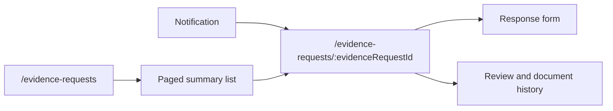
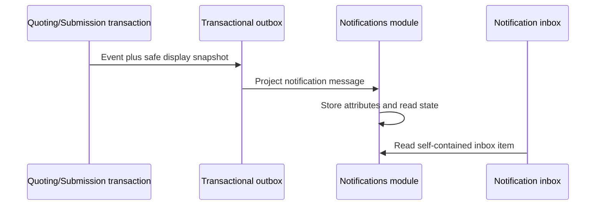

# Customer Error and Notification Hardening Design

## Status

- Approved: 2026-07-13
- Branch: `feat/customer-error-and-notification-hardening`
- Base: merged `main` after PR #63
- Scope: customer-facing errors, reassessment cancellation, evidence-request navigation, quote/evidence notification identity, and production observability contracts

## Why this milestone exists

The control-assurance milestone deliberately added richer quote and evidence behavior. Manual testing then exposed several places where the underlying system was correct but the customer experience was not yet safe or precise:

- an API `409 Conflict` could expose the raw Problem Details JSON in the page;
- a started reassessment could not be cancelled;
- one old link used `/evidence` even though `/evidence-requests` is canonical;
- every evidence notification opened the same large list rather than its own request;
- the evidence list eagerly rendered every response form and loaded every document;
- quote-ready and evidence-requested notifications did not identify the quote version or request;
- the application had correlation and .NET diagnostics, but no explicit production logging, browser-telemetry, or alerting contract.

The goal is not to hide useful information. It is to put the right information in the right place: a normal user receives a calm, actionable message; developers receive structured diagnostic context through logs and telemetry; audit history remains durable.

## Product decisions

### Errors shown to customers

The browser must never display raw response JSON, exception class names, stack traces, internal URLs, database messages, or provider payloads.

Expected business failures use stable machine codes. For example:

```json
{
  "title": "Reassessment needs a change",
  "status": 409,
  "code": "quote.reassessment.no_changes",
  "detail": "Change at least one control answer before creating a reassessment.",
  "correlationId": "f0d1..."
}
```

The frontend parses this shape, maps known codes to friendly copy, and falls back safely:

| Condition | Customer experience | Operational treatment |
|---|---|---|
| Correctable validation or business conflict | Specific inline guidance near the action | Structured information log and metric |
| Authentication or permission failure | Sign-in/permission guidance | Warning; alert only on abnormal volume |
| Not found | Friendly unavailable/not-found message | Information unless the pattern is abnormal |
| Rate limited | Retry guidance | Warning metric; alert on a sustained spike |
| Network or unexpected server failure | Generic retry message plus support ID when available | Error log/telemetry and alert |

Known errors remain actionable. Unknown errors remain private.

### Reassessment cancellation

Starting reassessment is local UI state; it does not change the quote until creation succeeds. Therefore cancellation must also be local:

1. `Cancel reassessment` is visible while reassessment mode is active.
2. If nothing changed, cancellation immediately restores the current quote values.
3. If a control assertion changed, an accessible confirmation modal asks whether to discard the edits.
4. Cancellation clears local mutation errors and attestation inputs and leaves the current quote unchanged.
5. `Create reassessment` stays disabled until at least one control assertion differs from the current quote.
6. The server keeps its no-change guard because browser validation is convenience, not security.

Only control assertion changes satisfy this rule. Premium inputs alone do not turn an unchanged control assessment into a reassessment.

### Evidence request information architecture

One pagination page per evidence request would make navigation slow and surprising. Pagination is for collections; a detail route is for identity.



The routes are:

- `/evidence-requests` — filterable, cursor-paginated summary list;
- `/evidence-requests/:evidenceRequestId` — one exact owner-scoped request with response form and documents;
- `/evidence` — compatibility redirect to the canonical list route.

The list endpoint returns lightweight summaries and does not load document collections. The detail endpoint returns one request and its documents. A request belonging to another owner returns `404`, not `403`, so the API does not disclose its existence.

Cursor pagination is ordered by due date, requested time, and ID. The opaque cursor prevents the frontend from depending on database keys and avoids the shifting-page behavior of offset pagination when new requests arrive.

Supported filters are status, category, quote, and overdue state. The initial page size is 12, with a bounded maximum.

### Notification identity and wording

Each notification represents one historical event. It keeps its own read state and action even if later events supersede the subject.

Several quote-ready notifications are legitimate because a customer can have multiple submissions and immutable quote versions. The current quote is the latest non-superseded quote for that submission; old notifications remain audit-friendly history.

Evidence notifications include snapshot attributes captured at the event boundary:

- evidence request ID and title;
- category, status, and due date;
- quote ID and quote version;
- submission ID and company name when available.

Quote-ready notifications include:

- quote ID and version;
- submission ID and company name;
- premium and expiry date;
- status at the time of the event.

Notifications must not query another context during inbox reads. The owning context enriches its domain/integration event, the custom outbox preserves the snapshot, and Notifications stores only notification data.



Exact actions are:

- evidence event -> `/evidence-requests/{evidenceRequestId}`;
- quote event -> `/submissions/{submissionId}/quotes/{quoteId}`;
- policy event -> `/policies/{policyId}`;
- submission event -> `/submissions/{submissionId}`.

The quote route reuses owner-scoped submission data and selects the requested quote. It must return/not-found safely when the quote does not belong to the submission owner.

## Central frontend API boundary

All feature APIs use one shared request helper. The helper:

- attaches the bearer token supplied by the caller;
- accepts JSON, multipart, and download responses;
- parses `application/problem+json` with Zod;
- reads `X-Correlation-ID` when CORS exposes it;
- throws a typed `ApiError` containing safe code, status, user message, field errors, and support ID;
- sends only privacy-safe diagnostics to the configured telemetry adapter.

Pages render `getUserErrorMessage(error, fallback)` rather than `error.message`. Local programming errors such as a missing required route parameter still use developer-oriented exceptions internally but are converted before display.

An application error boundary handles unexpected React rendering errors with a safe recovery screen and telemetry capture.

## Backend error contract

Controllers must not catch broad `InvalidOperationException` and copy `exception.Message` to clients. Business rules that cross the HTTP boundary use a typed application conflict with a stable code and safe detail. Validation uses `HttpValidationProblemDetails`. Unexpected exceptions reach centralized exception handling and are logged once with correlation context.

Problem Details extensions:

- `code`: stable public machine code;
- `correlationId`: request support ID;
- `errors`: validation fields when applicable.

Every error response, including rate limiting, uses the same contract.

## Observability and developer notification

The application already exposes health endpoints, a correlation middleware, structured `ILogger` scopes, `ActivitySource`, and `Meter` instruments. This milestone connects those pieces into a deployable contract:

- Production/Aws uses structured JSON console logs so container log collection can send them to CloudWatch Logs without application-held AWS credentials.
- Request outcome logging records route template, method, status class, duration, correlation ID, and stable error code. It excludes request bodies, tokens, evidence text, names, email addresses, and uploaded document content.
- Browser telemetry is configuration-gated and disabled by default. The adapter captures unexpected JavaScript errors and failed network outcomes with sampling and PII-safe fields; it never embeds AWS credentials.
- The deployment runbook defines CloudWatch Logs metric filters/alarms and CloudWatch RUM environment values. Terraform creates the actual AWS resources in the infrastructure milestone.

Developers should not be paged for every customer mistake. Alerting follows signal severity:

| Signal | Default response |
|---|---|
| One expected 400/404/409 | Log/metric only |
| Sustained 401/403/429 spike | Warning alert |
| Unexpected 5xx or unhandled exception | Error alert; page when threshold/severity warrants |
| Readiness failure | Page because traffic should not reach the instance |
| Outbox poison/repeated failure | Page because cross-context work is stuck |
| Browser JS/network error-rate spike | Warning or page based on affected-session rate |

This avoids alert fatigue while making genuine incidents visible.

## Security and privacy constraints

- No access tokens, authorization headers, request/response bodies, evidence text, document names, applicant names, company free text, emails, or attestation text in telemetry.
- Correlation IDs are sanitized and bounded.
- Owner-scoped detail endpoints return `404` for another owner.
- Notification attributes contain only the minimum display snapshot.
- Browser RUM remains opt-in until the privacy notice, retention, sampling, and production domain are configured.
- The custom transactional outbox and module boundaries remain unchanged.

## Acceptance scenarios

1. Creating an unchanged reassessment shows friendly guidance, never raw JSON.
2. The button is disabled before that request can normally be sent.
3. A customer can cancel clean reassessment immediately and dirty reassessment through a styled modal.
4. `/evidence` redirects to `/evidence-requests`.
5. The evidence list loads lightweight summaries in bounded pages.
6. Opening a list item or notification loads exactly one request at `/evidence-requests/{id}`.
7. Another owner's request returns `404` from the detail API.
8. Evidence notifications identify the requested control and due date.
9. Quote notifications identify quote version, company, premium, and expiry and open the exact quote.
10. Multiple historical quote-ready notifications remain valid and clearly versioned.
11. Unknown backend or network errors show generic user copy and a support ID when known.
12. No frontend page directly renders raw `error.message` from an API request.
13. Production logs are JSON and carry correlation/error-code fields without sensitive bodies.
14. The CloudWatch/RUM runbook states which resources, alarms, privacy settings, and environment values the Terraform milestone must create.

## Deliberate deferrals

- Provisioning live CloudWatch log groups, alarms, SNS/PagerDuty targets, X-Ray, an OpenTelemetry collector, and a CloudWatch RUM app monitor belongs to the AWS Terraform milestones.
- Evidence-request visual grouping by quote may be added after precise individual actions are proven.
- Endorsement/renewal workflows remain separate from reassessment.
- Automated document screening remains advisory; a human underwriter owns the insurance decision.
