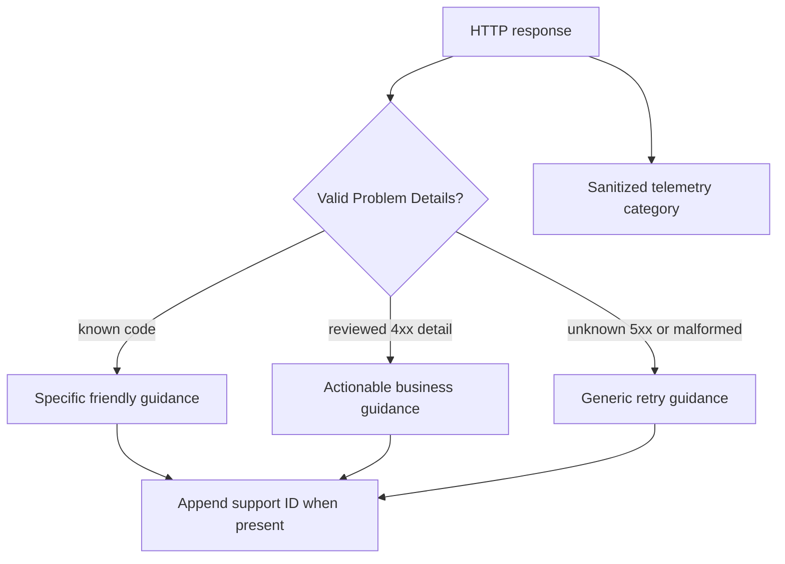
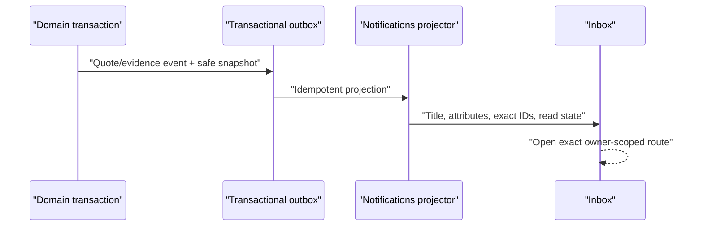

# Customer Error and Notification Hardening Learnings

## Outcome

This product-hardening slice makes customer failures understandable without exposing developer-only
diagnostics, makes quote reassessment safely cancellable, and gives every evidence or quote notification
an exact owner-scoped destination. It also replaces the growing evidence “wall” with a lightweight
paged list and a focused detail page, while defining how production CloudWatch and browser telemetry
must be provisioned later through Terraform.

The approved design is in
`docs/dev/customer-error-and-notification-hardening-design.md`; the task sequence is in
`docs/superpowers/plans/2026-07-13-customer-error-and-notification-hardening.md`; production operations
are in `docs/dev/production-observability-and-customer-errors-runbook.md`.

## What changed

### 1. One public error boundary

Previously each feature built an error string independently. A rejected request could become:

```text
API request failed with 409 Conflict: { ...raw Problem Details JSON... }
```

That text was accurate for a developer but harmful to the customer experience. The new shared frontend
client validates Problem Details with Zod and exposes a typed `ApiError`. Pages call one safe-message
function rather than rendering `response.text()` or `error.message`.



The API complements this boundary with:

- `BusinessConflictException` for stable public business codes;
- an exception handler that logs unhandled failures and returns safe `500` Problem Details;
- a Problem Details filter that guarantees correlation metadata and strips unreviewed server details;
- exposed `X-Correlation-ID` for support;
- structured request-outcome logs and metrics without request bodies or concrete resource paths.

Expected domain/validation failures remain useful 4xx contracts. Unknown server internals stay private.
This is not “hide every error”; it is “publish only the error information designed for that audience.”

An application error boundary also catches unexpected React rendering failures. Login callback and role
lookup pages no longer echo provider or runtime exception messages. The optional browser telemetry bridge
records sanitized categories only and is disabled unless deployment explicitly enables it.

### 2. Reassessment is a local draft until creation succeeds

Entering reassessment mode does not mutate the current quote. The UI can therefore cancel locally:

- clean form: cancel immediately;
- changed control assertion: show `Discard reassessment changes?` in the accessible shared modal;
- discard: restore the persisted quote controls, clear attestation/mutation state, and exit;
- submit: enabled only after a control assertion changes and attestation is complete;
- server: still rejects a no-change request with `quote.reassessment.no_changes`.

The current quote remains immutable throughout. Pricing choices do not count as a control reassessment.

#### Learning: compare the same semantic object on both sides

An early implementation built the stored fingerprint from controls **plus** requested limit/retention,
while the live reassessment fingerprint contained controls only. Those unequal shapes would falsely make
an untouched form look changed. The fix was not another conditional; it was a canonical, explicit
control-only snapshot on both sides.

> **Analogy:** comparing two passports only works if both comparisons use the passport fields. If one
> side quietly includes the traveller’s suitcase weight, equality no longer means “same identity.”

### 3. Collection routes and resource routes have different jobs

The canonical evidence routes are:

```text
/evidence-requests                         filterable cursor-paged summaries
/evidence-requests/{evidenceRequestId}     one request, response form, documents and review state
/evidence                                 compatibility redirect only
```

One evidence request per pagination page was rejected. Pagination answers “which group of resources
should I list?” A detail route answers “which exact resource did the customer choose?” Combining those
concepts would produce fragile links and surprising Back/Next behavior.

The API now mirrors the UI:

- list query: owner-scoped, no tracking, bounded page size, optional status/category/quote/overdue
  filters, and no document collection loading;
- detail query: one owner-scoped request with documents;
- missing or another owner’s ID: `404` to avoid confirming existence.

#### Learning: cursors need a total ordering

Four evidence requests can be created from one quote with exactly the same due and requested timestamps.
A cursor containing only those times can skip records. The cursor therefore contains all order keys:

```text
DueAtUtc ASC, RequestedAtUtc DESC, EvidenceRequestId ASC
```

The final ID is the deterministic tie-breaker. An integration test pages one record at a time through
identical timestamps and proves that none is skipped or repeated.

### 4. Notifications are historical events, not a live generic shortcut

Multiple quote-ready notifications are legitimate. A customer may own multiple submissions, and one
submission may have immutable quote versions. Each notification keeps the identity and display snapshot
that existed when the event occurred.



Quote notifications capture quote ID/version, submission ID, premium, expiry, and status where
available. Evidence notifications capture request ID/title/category/due date and quote ID/version.
The inbox does not reach into Quoting or Underwriting to rebuild titles during a read. That would couple
contexts and make old notification wording change when live records change.

Actions now resolve to:

```text
evidence request -> /evidence-requests/{evidenceRequestId}
quote ready      -> /submissions/{submissionId}/quotes/{quoteId}
policy           -> /policies/{policyId}
submission       -> /submissions/{submissionId}
```

The exact quote API and page are owner-scoped and display the requested immutable version. Superseded
quotes remain readable history and are explained as such.

### 5. Observability is code plus infrastructure

The API and Worker emit JSON console logs in Production/Aws profiles. Request outcomes use stable event
IDs, route templates, status classes, durations, and correlation IDs. The application emits native .NET
metrics and a privacy-safe browser telemetry interface.

That does **not** mean CloudWatch is operational yet. A production signal has two halves:

1. application code emits it; and
2. Terraform provisions collection, storage, encryption, retention, metric filters, alarms, dashboards,
   notification targets, RUM identity/origin controls, and cost limits.

Provisioning half of that manually would create an invisible, drifting production dependency. The runbook
records the contract for Phase 2 Terraform instead.

## Architecture boundaries preserved

- Submission/Quoting keeps ownership and exact quote reads; Notifications receives event snapshots.
- Underwriting owns evidence requests and their documents; list/detail access goes through its Application
  reader port.
- Notifications never queries another context to decorate inbox results.
- Cross-context side effects continue through the custom transactional outbox and idempotent projectors.
- No cross-schema foreign key or shared aggregate was introduced.
- No EF model changed, so this slice should produce no migration.

## Security and privacy decisions

- another owner’s quote or evidence request returns `404`, not an existence-revealing `403`;
- raw JSON, stack traces, database/provider errors, tokens, form contents, and document data stay out of
  customer messages;
- request outcome logs use route templates rather than concrete IDs;
- telemetry records categories and safe identifiers, not original exception text;
- RUM is disabled by default and requires deployment injection plus allowlisted origins and least privilege;
- support correlates by a sanitized ID rather than requesting confidential browser data.

## Test strategy

The slice adds or updates tests at each boundary:

- shared API client parsing, known-code mapping, validation, unknown 5xx hiding, and support IDs;
- page/component assertions that raw mock exception text is absent;
- clean and dirty reassessment cancellation;
- exact evidence/quote routes and loading/error behavior;
- owner isolation for evidence and quote detail endpoints;
- cursor traversal across identical timestamps;
- enriched outbox notification mapping and titles;
- exact notification actions for evidence, quote, policy, and submission subjects.

Final verification evidence:

- `dotnet build LIAnsureProtect.slnx --no-restore` — 0 warnings, 0 errors;
- standalone backend — UnitTests 206 passed; IntegrationTests 268 passed and 4 intentional service
  opt-in tests skipped;
- EF pending-model checks — clean for Submission, Notifications, Underwriting, and Claims;
- frontend — TypeScript, ESLint, production Vite build, and 96 tests passed;
- Docker local CI — all four migration histories applied to fresh PostgreSQL; UnitTests 206 passed;
  IntegrationTests 269 passed and 3 external-service tests intentionally skipped; frontend build,
  lint, and 96 tests passed; artifact created; Docker resources cleaned;
- artifact — `TestResults/local-ci-20260714-003907.zip`.

The full counts are also recorded in `docs/project-status.md` and `CHANGELOG.md`.

## Manual acceptance walkthrough

1. Open a submitted application with a quote and start reassessment.
2. Confirm `Create reassessment` is disabled before a control answer changes.
3. Cancel without changes and confirm the current quote remains untouched.
4. Start again, change a control, cancel, and confirm the discard modal restores the original values.
5. Create a valid reassessment and confirm the inbox identifies the new quote version.
6. Open the quote notification and confirm its exact immutable quote page opens.
7. Open each evidence notification and confirm a different exact detail page opens.
8. Return to the evidence list; filter it and page through summaries without rendering every response form.
9. Force a known no-change API conflict and confirm friendly guidance, not raw JSON.
10. Force an unexpected failure and confirm generic guidance plus a support ID whose server log can be found.

## Deferred work

- Terraform/Helm collection agents, log groups, metric filters, alarms, dashboards, SNS subscriptions,
  and CloudWatch RUM resources;
- production alert threshold tuning using real traffic baselines;
- legal/privacy approval for production telemetry retention and any future session recording;
- quote endorsement/renewal workflows after acceptance/binding;
- a company/account snapshot in notifications when its owning event can provide one without a cross-context
  read.

These are explicit future boundaries, not silent omissions from this slice.
