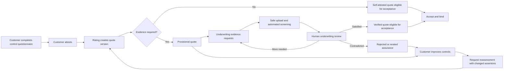

# Cyber Control Assurance and Quote Reassessment — Design

## Purpose

The current quote form asks for MFA, EDR, backup, incident-response, and sensitive-data facts and
immediately uses those answers in rating. That is useful for a walkthrough, but a production-shaped
insurance journey must distinguish a customer's **statement** from a fact that has been independently
verified.

This milestone makes that distinction explicit. It keeps the fast feedback customers expect while
adding attestation, risk-based evidence, underwriting review, acceptance gates, immutable history, and
controlled reassessment.

An analogy: a control assertion is like declaring the contents of a parcel, while evidence review is
the inspection. The declaration is still useful for routing and preliminary pricing, but it is not the
same thing as opening the parcel and checking what is actually inside.

## Product decisions

1. Customer answers are assertions, not automatically trusted facts.
2. Quote generation remains immediate. The result is provisional when verification is required.
3. Evidence is risk-based. The app does not force every customer to upload every possible document.
4. Positive control claims that materially reduce premium require stronger assurance than negative or
   unknown claims.
5. An underwriter owns the insurance decision. Automated checks advise and triage; they never declare
   a document genuine or silently finalize coverage.
6. A verified difference may change risk, premium, terms, referral, or eligibility.
7. Reassessment creates a new quote version. It never edits or deletes the previous quote.
8. Reassessment is available only before acceptance/binding. Post-bind change belongs to a future
   endorsement or renewal workflow.
9. No copy promises that remediation guarantees a better price or decision.
10. Final attestation and disclosure wording must be reviewed by legal/compliance before production.

## Journey

## Bounded-context ownership

### Quoting / legacy Submission context

Owns:

- questionnaire snapshot and attestation;
- versioned `ControlAssertion` records;
- premium/risk calculation;
- quote version and `SupersedesQuoteId`;
- assurance summary and acceptance eligibility;
- superseding an old, unaccepted quote during reassessment.

### Underwriting module

Owns:

- evidence requests and their category-specific instructions;
- uploaded evidence documents and malware scan state;
- deterministic document plausibility findings;
- human evidence decisions and append-only reviews;
- assurance-related evidence notifications.

### Boundary rule

Neither side writes the other side's tables. Cross-context changes use a domain event persisted in the
source transaction, the multi-source outbox dispatcher, and an idempotent projector. Events carry ids;
projectors use an owned read port for additional facts.

## Data model

### Quote additions

- `Version`: starts at 1 for a submission.
- `SupersedesQuoteId`: nullable id of the prior version; no cross-context implication.
- `AssuranceStatus`: `SelfAttested`, `EvidenceRequired`, `Verified`, or `Rejected`.
- `EvidenceRequiredCount` and `EvidenceSatisfiedCount`: an acceptance-gate summary projected from
  Underwriting decisions.
- attestation actor, wording version, and timestamp.

`QuoteStatus` remains the commercial lifecycle (`Quoted`, `Referred`, `Approved`, `Accepted`, `Bound`,
etc.). `AssuranceStatus` is separate. A quote can therefore be commercially `Quoted` while assurance is
`EvidenceRequired`. This avoids overloading one status with two meanings.

### ControlAssertion

One row per quote version and control area:

- control type;
- normalized claimed state;
- assurance state (`SelfAttested`, `EvidenceProvided`, `MachineVerified`, `HumanVerified`, `Rejected`,
  `Expired`);
- whether evidence is required and why;
- capture/verification timestamps and actor ids.

The first release stores five areas: MFA, EDR, Backup, Incident Response, and Sensitive Data.

### Questionnaire detail

The broad rating inputs remain for backward compatibility, but the API also captures material detail:

- MFA coverage for privileged access, email, remote access, workforce, and phishing resistance;
- EDR endpoint/server coverage, active monitoring, and tamper protection;
- backup immutability/offline copy, separate credentials, restore testing, RPO, and RTO;
- incident-response approval, recent update, exercise, and named roles;
- sensitive-data types, volume, inventory, encryption, and an explicit `Unknown` exposure choice.

## Evidence rules

The policy is deterministic and versioned. Initial rules request evidence when:

- MFA is claimed implemented and the quote receives material pricing credit;
- EDR is claimed implemented and the quote receives material pricing credit;
- backups are claimed mature;
- an incident-response plan is claimed in place;
- sensitive-data exposure is claimed Low without a maintained inventory and encryption support;
- a reassessment claims an improved control;
- higher limit, sensitive industry, prior incident, or high-risk combination makes verification material.

Unknown or weak controls do not need proof that they are absent; instead they receive the appropriate
risk treatment and may cause referral.

## Evidence assessment ladder

1. **File safe** — existing malware scan must pass.
2. **Document plausible** — file type, readable text/metadata, expected sections, dates, and
   organization references.
3. **Integrity indicators** — hashes, signatures, source, and timestamps where available.
4. **Claim consistency** — extracted facts compared with the questionnaire assertion.
5. **Telemetry verified** — future read-only IdP/EDR/backup connectors.
6. **Human verified** — underwriter records the authority-bearing decision.

Machine findings are advisory and auditable. They cannot mark an assertion `HumanVerified`, adjust a
premium, approve/decline a quote, or bind a policy.

## Acceptance and binding gates

- `SelfAttested` with zero required evidence may be accepted.
- `EvidenceRequired` cannot be accepted.
- `Verified` may be accepted if the commercial quote state is otherwise eligible.
- `Rejected` cannot be accepted and requires underwriting action or reassessment.
- Binding continues to require an accepted quote, so it inherits the assurance gate.

## Reassessment

A reassessment request must:

- target the latest unaccepted/unbound quote;
- include at least one changed assertion;
- repeat attestation;
- create version N+1 with `SupersedesQuoteId`;
- mark the prior quote `Superseded` without deleting its rating/provider/evidence history;
- require evidence for every claimed improvement;
- create new evidence requests correlated to the new quote id.

## User language

Replace walkthrough copy with:

> Provide your organization's current security posture as accurately as possible. These answers affect
> the risk assessment, premium, and whether underwriting evidence is required. Any quote may remain
> subject to verification of selected controls.

Attestation:

> I confirm that these answers are accurate to the best of my knowledge and understand that supporting
> evidence may be requested. Verified differences may change the risk assessment, premium, quote terms,
> or underwriting decision.

The UI identifies a result as provisional, lists exactly what must be verified, links to Evidence, and
explains that improving a control permits reassessment but does not guarantee a better outcome.

## Security, audit, and privacy

- Evidence stays private and owner/underwriter scoped.
- Existing scan-before-download rules remain mandatory.
- No document content is placed in notification payloads or domain events.
- Attestation and each quote version are immutable audit facts.
- Projectors deduplicate on source outbox message id.
- Errors fail closed: missing required assurance blocks acceptance.

## Acceptance scenarios

1. Quote generation without attestation returns 400 and writes nothing.
2. A positive material control claim produces a versioned assertion and evidence requirement.
3. A weak/unknown control affects rating without requiring proof of absence.
4. A provisional quote cannot be accepted or bound.
5. Automatic evidence request creation is eventually consistent and idempotent.
6. A satisfied human review advances the projected assurance summary.
7. Insufficient/clarification/rejected evidence keeps acceptance blocked.
8. A no-evidence-required quote can be accepted with `SelfAttested` assurance.
9. Reassessment creates version N+1, supersedes N, and preserves N's history.
10. Reassessment after acceptance/binding is rejected.
11. Another owner receives 404 for quote/evidence/reassessment access.
12. Automated document findings cannot make an underwriting or insurance decision.

## Deferred production integrations

- Read-only Entra/Okta/Auth0, EDR vendor, backup provider, and data-discovery connectors.
- Cryptographic signature validation beyond stored hashes/metadata.
- Legal/compliance-approved production attestation wording.
- Post-bind endorsement and renewal reassessment.
- A separate Risk Engineer/Security Reviewer role.

