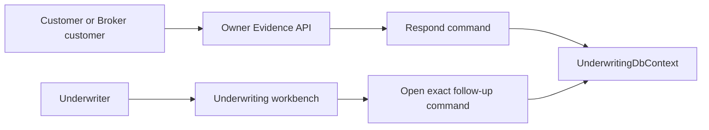

# Evidence Follow-up Governance and Quote Navigation Learnings

Date: 2026-07-15
Branch: `feat/evidence-upload-and-notification-usability`

## Why this follow-up exists

Manual testing exposed three related usability and audit questions:

1. Confirmation dialogs contained useful explanations, but always-expanded guidance made a small decision feel visually heavy.
2. A generated Quote had an exact immutable detail route, but ordinary customers could reach it from a Notification more easily than from the Submission that owns the Quote history.
3. An owner could append Evidence follow-ups before Underwriting reviewed the request, but contact-only corrections were not treated as meaningful, the single phone field did not explain Philippine formats, and there was no server-authoritative limit on unread follow-ups.

These are not only copy changes. The Evidence portion affects the Underwriting aggregate, append-only response history, API contracts, optimistic concurrency, database indexes, owner/Underwriter screens, and audit behavior.

## Product decisions

### Confirmation guidance is progressive disclosure

Every `ConfirmationDialog` information panel now starts collapsed behind a shared **More details** control. The decision title, irreversible consequence, and Cancel/confirm actions remain immediately visible. Opening the disclosure reveals the specific question and explanation supplied by that workflow.

This preserves both needs:

- a returning user can make a familiar decision without rereading a paragraph; and
- a first-time or cautious user can deliberately reveal the richer explanation.

The control exposes `aria-expanded` and `aria-controls`, so the state is understandable to assistive technology. Because the behavior lives in the shared component, Draft deletion, Submission withdrawal, reassessment discard, and other existing informational confirmation dialogs remain consistent.

### Quote detail remains nested under Submission

The canonical route remains:

```text
/submissions/{submissionId}/quotes/{quoteId}
```

A Quote is an immutable version in a Submission's commercial history, not an independent top-level customer workspace. A read-only detail page is intentional: actions such as acceptance, binding, and reassessment depend on the surrounding Submission journey and remain on Submission detail.

The missing affordance was access, not a new route. Submission detail now links its current Quote card to the exact Quote version. Notifications may still deep-link to the same immutable subject.

```text
Submission list
  -> Submission detail
       -> Latest Quote card
            -> Quote version detail

Notification
  -> the same Quote version detail
```

### Contact corrections are auditable follow-ups

While an Evidence request is `Responded` and its review decision is `NotReviewed`, an owner may append a follow-up containing any meaningful change:

- changed respondent name, title, or email;
- changed Philippine mobile or telephone number;
- additional Evidence response text;
- `Other concerns` text; or
- one or more new documents.

The previous response is never edited. The follow-up creates a new `quote_evidence_responses` row. This means a phone-only correction is useful and auditable rather than being blocked merely because the phone fields are optional.

### Mobile and telephone are different fields

The previous optional `Respondent phone` input was ambiguous. It is now split into:

- **Respondent mobile number (optional)**; and
- **Respondent telephone number (optional)** for a Philippine landline.

Accepted examples:

| Input | Stored canonical value |
| --- | --- |
| `0917 123 4567` | `+639171234567` |
| `+63 917 123 4567` | `+639171234567` |
| `02 8123 4567` | `+63281234567` |
| `+63 (2) 8123-4567` | `+63281234567` |

Spaces, hyphens, and parentheses are accepted for human entry, then removed during normalization. Non-Philippine or structurally invalid numbers are rejected. These fields help an Underwriter perform human verification; they are not proof by themselves.

The old `respondent_phone` columns remain readable for historic rows. The migration copies recognizable legacy values into the new canonical mobile or telephone columns without deleting the original value.

### Field limits are enforced by the server

Browser limits provide immediate guidance, but Domain validation is authoritative:

| Field | Rule |
| --- | --- |
| Respondent name | required, 120 characters |
| Respondent title | required, 120 characters |
| Respondent email | required, valid address, 254 characters |
| Mobile | optional Philippine format, canonical maximum 16 characters |
| Telephone | optional Philippine format, canonical maximum 16 characters |
| Evidence response | required for an initial/remediation response, up to 4,000 characters |
| Other concerns | optional, up to 2,000 characters |

For a pre-review follow-up, the main response text may be empty when another meaningful field changed or a file was added. Initial and remediation paths retain their existing narrative/document rules.

### The limit is five currently unread follow-ups, not five for life

An owner may have at most five `FollowUp` response rows that Underwriting has not opened. The limit is deliberately a pressure valve rather than a lifetime quota:

```text
owner appends follow-up
  -> pending unread count increases
  -> at 5, another follow-up is rejected

underwriter opens exact follow-up
  -> persisted viewed_at_utc + viewed_by_user_id
  -> pending unread count decreases
  -> one owner slot becomes available again
```

The server counts unread rows immediately before accepting a follow-up. The React button mirrors that result for early feedback, but cannot bypass the server rule.

This model discourages message bursts while avoiding a permanent lockout. It also gives `Unread` a precise meaning: the exact append-only response has not yet been acknowledged in the Underwriting workflow.

### Opening is an explicit audited command

Underwriting uses this command endpoint:

```text
POST /api/v1/underwriting/quote-referrals/{quoteId}
  /evidence-requests/{evidenceRequestId}
  /responses/{responseId}/view
```

A read-only `GET` does not change state. The Underwriter deliberately opens a specific hidden follow-up; the command records `viewed_by_user_id` and `viewed_at_utc`, then returns the refreshed Evidence result. Repeating the command is idempotent.

The implementation belongs in the existing Underwriting workbench. A separate profile/account page would separate the acknowledgement from the Evidence decision context and create another operational inbox without a distinct business owner.

## Persistence and concurrency

Migration: `AddEvidenceFollowUpGovernance`

New request columns:

- `respondent_mobile_number`
- `respondent_telephone_number`
- `version`

New response columns:

- `respondent_mobile_number`
- `respondent_telephone_number`
- `viewed_by_user_id`
- `viewed_at_utc`

New supporting index:

```text
(evidence_request_id, kind, viewed_at_utc)
```

The unread-count query uses that index to count only `FollowUp` rows whose `viewed_at_utc` is null.

`QuoteEvidenceRequest.Version` is an optimistic-concurrency token. Both adding a follow-up and acknowledging one touch the request version. If two writers race, one receives a safe conflict and reloads rather than silently overwriting the other's workflow state.

## Module boundary

All new durable behavior remains inside the existing Underwriting bounded context:



There is no cross-context table access, no new Notification projection, and no outbox event for the local read acknowledgement. The response and its acknowledgement share the same Underwriting context and transaction boundary. Existing Evidence domain events and document trust rules remain unchanged.

## Testing coverage

The added regression coverage proves:

- shared confirmation guidance starts collapsed and expands accessibly;
- Draft deletion, withdrawal, and reassessment tests follow the shared disclosure behavior;
- Submission detail links to the exact latest Quote version;
- Philippine mobile and telephone inputs normalize correctly;
- invalid/non-Philippine contact values and over-limit text are rejected in the Domain;
- a changed mobile number alone is a meaningful owner follow-up;
- a sixth currently unread follow-up is rejected;
- only a `FollowUp` response participates in the acknowledgement workflow;
- acknowledgement is idempotent and records the Underwriter identity/time;
- the Underwriting workbench hides an unread follow-up body until the operator opens it; and
- the integration workflow observes count `1`, opens that exact response, and then observes count `0`.

## Verification evidence

- `dotnet build LIAnsureProtect.slnx --no-restore`: 0 warnings, 0 errors.
- Standalone backend tests: 217 Unit tests and 279 Integration tests passed; 4 external-service tests remained intentionally opt-in.
- EF pending-model checks: no pending changes for `SubmissionDbContext`, `NotificationsDbContext`, `UnderwritingDbContext`, or `ClaimsDbContext`.
- Frontend TypeScript and ESLint passed.
- Frontend production bundle completed successfully.
- Frontend tests: all 110 passed.
- Docker-backed local CI: attempted, but the host Docker Desktop Linux engine never became ready. Its
  internal `vpnkit-bridge` waited for a missing `guest-services/socketforwarder-receive-fds.sock`, while
  Docker API calls returned HTTP 500. A force-stop, scoped `docker-desktop` WSL termination, and clean
  restart did not recover it; restarting `com.docker.service` was denied by the current host session.
  No containers, migrations, or test stages ran. Rerun the standard local-CI command after Docker Desktop
  is repaired or the machine is restarted; do not treat this host failure as a passing Docker gate.

The Vite production build still prints the known upstream Rolldown `INVALID_ANNOTATION` diagnostics for two `@microsoft/signalr` comments. Rolldown ignores those comments, transforms the package, and exits successfully. The repository does not patch installed dependency files.
