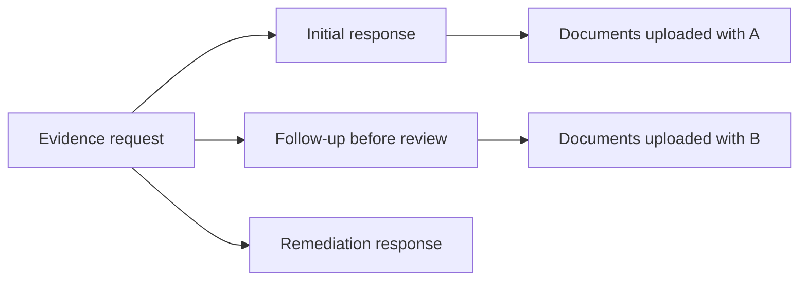

# Evidence response follow-up and notification context — design

**Status:** approved for automatic implementation on
`feat/evidence-follow-up-and-notification-context`.

## Problem statement

Manual testing found four related gaps:

1. a customer cannot add a useful document or clarification after the first response while an
   underwriter has not reviewed it;
2. the stored response identifies a name and title but gives Underwriting no direct contact route;
3. the notification badge can remain stale while the Worker is projecting a newly generated quote's
   outbox messages; and
4. a flat notification list is difficult to understand when one owner has several submissions.

The solution must improve the conversation without turning an auditable evidence record into an
editable chat message.

## Decisions

### 1. Follow-ups are append-only

The original response is never overwritten. Each submission creates an immutable response-history
entry with the respondent identity, contact details, narrative, optional concerns, actor, kind, and
timestamp. Documents uploaded with an entry retain that response identity.

A follow-up is permitted only while the request is `Responded` and the decision is `NotReviewed`.
Once an underwriter records a decision, the ordinary follow-up path closes. An unfavorable decision
continues to use the existing remediation response path, which resets the decision to `NotReviewed`
but also appends a new response entry.

### 2. Identity and contact improve verification but do not prove truth

Every response requires respondent name, title, and email. Phone is optional because not every
customer can share one safely. `Other concerns` is optional. The interface explains that these values
support human verification and do not automatically prove a control exists. Automated document
screening remains advisory; only an underwriter records the insurance decision.

An initial or remediation response still requires an evidence narrative. A pre-review follow-up may
contain additional narrative, other concerns, documents, or any combination, but cannot submit a
completely empty entry.

### 3. Document requirements remain deliberate

| Source | Default | Reason |
|---|---|---|
| deterministic assurance policy | `Required` | the customer claimed a material control that earns rating credit |
| manual Underwriting request | chosen by underwriter | the question may need a document, narrative, or either |
| legacy automatic request incorrectly carrying `Optional` | migrate to `Required` | restore the intended assurance contract |

`Optional` does not mean “trusted without review.” It means the underwriter may verify the named
respondent and narrative through contact or other records. `NarrativeOnly` is for questions where a
file would not add useful assurance.

### 4. Notifications show submission context

Quote and evidence notification snapshots carry company name and immutable Submission reference.
The inbox groups entries by that context and repeats it on each card. Old notifications fall back to
their existing Submission UUID, so the change does not require rewriting the Notifications schema.

### 5. Opening is the normal read action

Opening a notification's policy, submission, quote, or evidence destination marks that notification
read first, then navigates. Standalone `Mark as read` controls are removed; reading is attached to the
meaningful action that opens the exact subject. The command remains idempotent and owner/team scoped.

### 6. Badge freshness uses a lightweight count query

The app shell calls a dedicated unread-count endpoint when the signed-in shell first loads. React Query
refreshes it after a notification action invalidates the cache, when the Notifications workspace is
opened, and when the window regains focus. There is no continuous timer. This avoids persistent request
traffic, with the deliberate trade-off that a newly projected notification may not update the badge
until one of those meaningful refresh events occurs. Opening an item updates the TanStack Query cache
optimistically and then reconciles with the server.

## Authorization and boundaries

- owner Evidence reads/writes stay repository-scoped by `OwnerUserId`;
- operational Evidence detail remains protected by the Underwriting policy and quote/request pair;
- personal and team unread counts use the same role-to-team-audience mapping as the inbox;
- Quoting and Underwriting events carry event-time display snapshots; Notifications never queries
  another context at read time;
- no module references another module or a legacy aggregate.

## Acceptance scenarios

1. Initial required response without a document is rejected.
2. Initial response persists required email and optional phone/concerns as response history.
3. `Responded + NotReviewed` accepts a document-only or message follow-up and preserves the first entry.
4. A reviewed, accepted, or cancelled request rejects ordinary follow-up.
5. An unfavorable review accepts a remediation response as a new immutable entry.
6. Existing automatic assurance requests marked Optional migrate to Required; manual Optional stays Optional.
7. Underwriting can load response history and contact details before deciding.
8. Quote/evidence notifications show company and Submission reference and group by Submission.
9. Opening an unread actionable notification marks it read and decreases the badge.
10. A newly projected notification appears after Notifications navigation, window focus, or another
    meaningful unread-count cache refresh; no continuous badge poll runs.

## Deliberate deferrals

- email/phone ownership verification, OTP challenges, and outbound contact workflows;
- customer-underwriter live chat;
- automatic approval from contact data or document screening;
- push/WebSocket notification delivery. If near-real-time badge updates become a production
  requirement, use a deliberate push channel instead of shortening a polling interval.
