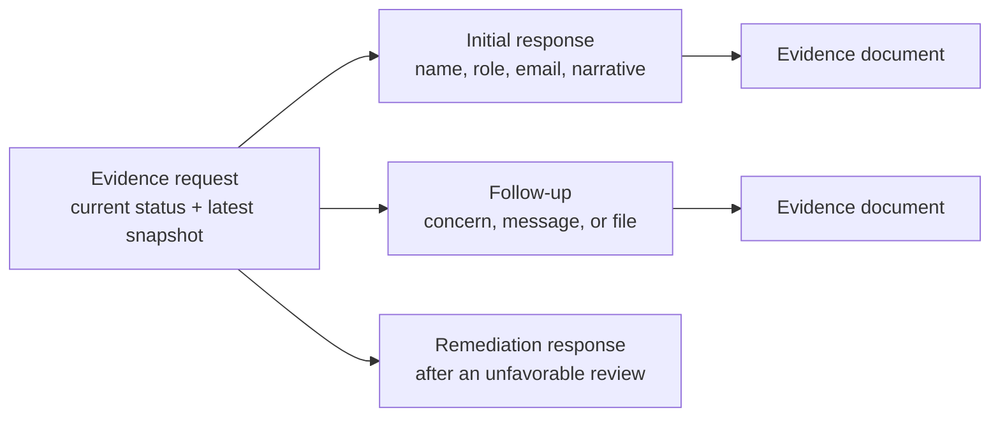
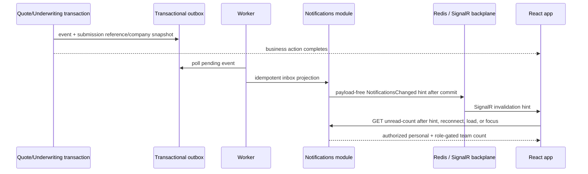

# Evidence Response Follow-up and Notification Context Learnings

**Date:** 2026-07-14
**Branch:** `feat/evidence-follow-up-and-notification-context`
**Starting point:** synchronized `main` commit `7a191b7`
**Design source:** `docs/dev/evidence-response-follow-up-and-notification-context-design.md`

## Outcome

This slice closes four usability and trust gaps found during the Customer walkthrough:

1. a customer can add evidence while a response is still waiting for its first Underwriting review;
2. every response has a named, contactable person and an optional place for concerns or caveats;
3. notifications from multiple Submissions are grouped by Company and immutable Submission reference;
4. the unread badge refreshes through a payload-free realtime hint while the user remains in the app,
   and opening an actionable notification marks it read; and
5. all four DbContexts in a host share one explicit, capacity-budgeted Npgsql pool.

The implementation does **not** claim that an email address, phone number, written answer, or uploaded
file proves a cyber control. Those are inputs to an Underwriter's decision. Automated file screening
answers “is this file safe enough to inspect?” and advisory plausibility answers “does this look broadly
consistent?” Neither answers the legal/business question “is this control truly operating?”

## The central model: an audit notebook, not an editable sticky note

Before this slice, an evidence request stored only the latest response fields on the request row. That
works for a single answer, but it cannot safely support later messages: changing the same columns would
erase what the customer originally said.

The new model keeps the request row as a **latest-state index** for existing queues and adds an immutable
`quote_evidence_responses` history:

Each response records:

- response ID, request ID, Quote ID, Submission ID, owner ID, and authenticated responder ID;
- respondent name, title/role, required email, optional phone;
- optional `Other concerns` alongside the main evidence narrative;
- kind (`Initial`, `FollowUp`, or `Remediation`) and UTC timestamp.

Documents now have an optional `evidence_response_id`, so a reviewer can tell which response introduced
a file. Older documents remain valid with a null response link. Existing response snapshots are not
invented or backfilled: audit-history entries start when the migration is deployed.

## State rules

| Current request state | Customer action | Result |
|---|---|---|
| `Open` | Submit the first response | Adds `Initial`; request becomes `Responded` |
| `Responded` + `NotReviewed` | Add message, concern, or file | Adds `FollowUp`; original response remains |
| `Responded` + `Insufficient` / `NeedsClarification` | Answer requested remediation | Adds `Remediation`; review returns to `NotReviewed` |
| Reviewed `Satisfied`, `Accepted`, or `Cancelled` | Add more evidence | Rejected; the reviewed/closed audit boundary is preserved |

A pre-review follow-up must contain at least one meaningful addition: response text, `Other concerns`, or
a document. Respondent name, title, and valid email are required each time so every entry is attributable.
Phone remains optional because not every organization permits direct phone disclosure.

## Required versus optional documents

“Optional” was previously misleading for automatically generated control requests. Those requests exist
because a material rating assertion—such as implemented MFA, EDR, or mature backups—received credit and
needs verification. They now use `Required` at creation, and the migration corrects existing rows where
`requested_by_user_id = 'system-assurance-policy'` was still `Optional`.

Underwriters may still deliberately create:

- `Required` when an artifact must support the assertion;
- `Optional` when contactable testimony may be enough but a file could help;
- `NarrativeOnly` when a file would add no useful assurance.

A later pre-review follow-up does not have to repeat a required file already supplied with the initial
response. Remediation still obeys the request's document rule.

## Human verification and privacy boundary

The owner API and Underwriting API expose contact/history only through their existing authorization
policies. Another owner still receives 404, and the Notifications module receives only safe display
snapshots—not respondent phone/email or document contents.

An Underwriter can load an exact evidence request from the workbench and see response history, contact
details, concerns, and clean documents before recording a decision. Suggested operational checks include:

1. compare the respondent's organization/domain and role with known account information;
2. contact the respondent through an independently trusted channel when the assertion is material;
3. inspect current, clean documents and their scope/date/issuer;
4. record the review reason and remediation guidance;
5. never treat automated screening or contact presence as automatic approval.

Future production work may add verified-domain indicators, consent/retention wording, contact-verification
events, and specialist integrations. This slice deliberately does not send email/SMS or expose contact
data to a new provider.

## Notification context and read behavior

Quote and Evidence notification events now carry safe snapshots of Company name and immutable Submission
reference. The outbox mapper copies those attributes into the Notifications read model. The inbox groups
items using that context, so two Submissions for the same customer no longer appear as one undifferentiated
stream.

The first implementation used a small five-second foreground count poll. Manual review rejected the
continuous request pattern even though the payload was tiny. The intermediate behavior used only
navigation/focus refresh, which was quiet but could stay stale while the user worked in one tab. The
final behavior has no timer: an authenticated SignalR connection receives only a
`NotificationsChanged` doorbell, then React Query reloads authorized HTTP state.

The separate Worker commits the projection and publishes the hint through Redis; the API's SignalR
connection receives the backplane message. A hint failure is caught and logged, then ordinary external
notification publishing and outbox completion continue. PostgreSQL retains the notification, so focus,
navigation, reconnect, or a later hint repairs the browser view.

For actionable notifications, `View quote`, `Open evidence request`, `View policy`, `Open claim`, and similar links mark
the entry read before navigation. React Query applies an optimistic count/list update, removes the entry
from an Unread-only result, and then refetches authoritative state. Standalone `Mark as read` actions are
removed across the inbox so there is one unambiguous read behavior.

## Persistence and API changes

- Migration: `20260714121633_AddEvidenceResponseHistoryAndContacts`
- New table: `underwriting.quote_evidence_responses`
- New request columns: `respondent_email`, `respondent_phone`, `other_concerns`
- New document column: `evidence_response_id`
- Owner response contract: required name/title/email; optional phone/response/concerns depending on state
- Underwriter exact read: `GET /api/v1/underwriting/quote-referrals/{quoteId}/evidence-requests/{evidenceRequestId}`
- Count-only inbox read: `GET /api/v1/notifications/unread-count`

## Boundary decisions

- Underwriting owns Evidence request, response, review, and document relationships.
- Notifications owns unread state and role-aware team visibility.
- Cross-context display context travels in events/outbox snapshots; Notifications never queries Submission
  or Underwriting tables to decorate an inbox row.
- A notification refresh is eventually consistent; no synchronous “write the other module now” shortcut
  was added.
- Existing owner/team authorization is applied before search, grouping, or counting.
- The hub uses the same `Notifications.Read` policy, puts only the authenticated owner and role-derived
  team audiences into groups, and accepts query-string bearer tokens only on `/hubs/notifications`.
- SignalR sends no business payload. Redis is advisory transport, not an inbox, queue, or audit log.

## Connection-pool governance

Npgsql was already pooling, but every `UseNpgsql(connectionString)` registration could create a separate
pool and its default maximum was invisible in capacity planning. Both hosts now create one shared
`NpgsqlDataSource`; Submission, Notifications, Underwriting, and Claims contexts all borrow from that
same process pool.

| Host | Default maximum | Purpose |
|---|---:|---|
| API | 40 | concurrent HTTP reads/writes across all contexts |
| Worker | 20 | outbox/projector and cleanup bursts |

At minimum zero, an idle host keeps no unnecessary physical connections. Startup validation rejects
negative/min-over-max limits and invalid timeouts. `Application Name` identifies API versus Worker in
`pg_stat_activity`. Production must calculate `(replicas × max pool)` for both hosts and preserve
operational/migration headroom. Npgsql connection-pool meters and PostgreSQL `pg_stat_activity` should
drive tuning. RDS Proxy/PgBouncer is a later measured response to connection storms, not a substitute
for fixing slow queries or an excuse to exceed the database budget.

### Production deployment checklist

- preserve WebSocket upgrade headers through
  [CloudFront](https://docs.aws.amazon.com/AmazonCloudFront/latest/DeveloperGuide/distribution-working-with.websockets.html)
  and the [Application Load Balancer](https://docs.aws.amazon.com/elasticloadbalancing/latest/application/load-balancer-listeners.html);
- configure an idle timeout compatible with SignalR keepalive/reconnect and test rolling deployments;
- configure the API and Worker with the same ElastiCache endpoint and channel prefix;
- redact the hub `access_token` query value from edge, proxy, and application logs;
- keep hub authorization aligned with `Notifications.Read`, and never add business payloads to the hint;
- monitor connections, reconnects, Redis publish failures, Npgsql pool acquisition/usage, and
  PostgreSQL saturation with low-cardinality dimensions;
- calculate pool budgets for the real replica count before every scaling change; evaluate
  [RDS Proxy](https://docs.aws.amazon.com/AmazonRDS/latest/UserGuide/rds-proxy.html) only when measured
  connection storms or replica counts justify it.

## Verification

The release-sized verification gate passed:

- `dotnet build LIAnsureProtect.slnx --no-restore`: 0 warnings, 0 errors;
- standalone backend: 213 Unit tests and 279 Integration tests passed, with 4 intentional opt-in skips;
- `SubmissionDbContext`, `NotificationsDbContext`, `UnderwritingDbContext`, and `ClaimsDbContext`:
  no pending model changes;
- frontend TypeScript, ESLint, production build, and all 104 tests passed;
- fresh Docker local CI: PostgreSQL and Redis started healthy, all migrations applied, 213 Unit tests
  and 280 Integration tests passed, 3 intentional external-service tests skipped, all 104 frontend
  tests and API smoke checks passed, and Docker resources were cleaned up;
- artifact: `TestResults/local-ci-20260715-001120.zip`.

Acceptance coverage includes:

- initial, pre-review follow-up, remediation, and closed/reviewed state rules;
- immutable response history visible to owner and Underwriter;
- required automatic assurance documents and compatible manual document modes;
- another-owner 404 behavior;
- role-aware unread count, notification context attributes, grouping, and automatic read-on-open;
- zero-warning build, all four pending-model checks, backend tests, frontend type/lint/test/build, and
  Docker-backed local CI.

## Operational lesson

Trust is layered. A contact field improves **traceability**; a document improves **support**; malware
screening improves **safety**; advisory analysis improves **review efficiency**; and an Underwriter's
recorded decision supplies **accountability**. Calling any one layer “proof” would overstate what the
system knows.
