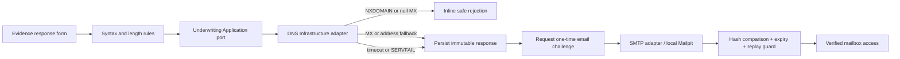
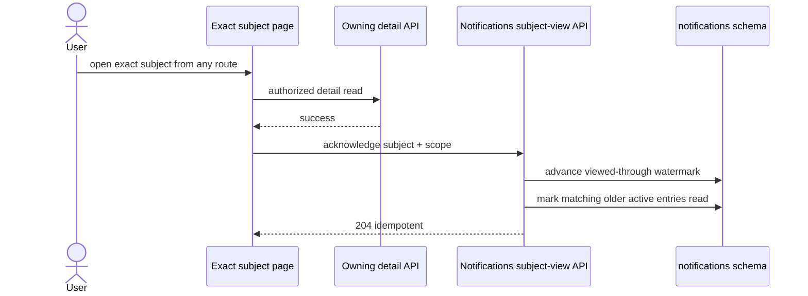

# Manual-retest hardening batch — implementation learnings

**Date:** 2026-07-16  
**Branch:** `fix/reassessment-self-service-cooldown`  
**Source plan:** `docs/dev/manual-retest-hardening-batch-plan.md`  
**Separate future milestone:** `docs/dev/broker-organizations-and-delegated-access-plan.md`

## Why these findings belonged in one batch

Manual testing exposed several symptoms that looked unrelated:

- an Evidence request could be answered while its notification remained unread;
- Underwriters received an Evidence action that opened a customer-only page;
- customer follow-ups could reach their limit while no Underwriting referral existed;
- the Personal notification tab disappeared when it was empty; and
- syntactically valid respondent email addresses could belong to domains that cannot receive mail.

They shared one root lesson: a screen must be driven by the **business subject and the caller's
capabilities**, not by the page from which the user happened to arrive. The implementation therefore
treated read state, Evidence work, routing, and respondent verification as explicit contracts rather
than UI side effects.

## Delivered behavior

### 1. Progressive respondent email trust

Respondent email trust now has three deliberately separate layers:

1. Browser and API syntax/length validation catch malformed input quickly.
2. An Underwriting-owned asynchronous DNS adapter classifies the domain as `MailCapable`,
   `AddressFallback`, `Undeliverable`, or `Unverified`.
3. A single-use email challenge proves access to the mailbox and records `VerificationPending` or
   `Verified` on the immutable response that was submitted.

Important boundaries:

- DNS is not performed in a Data Annotation, React render, or domain entity.
- Null MX and NXDOMAIN are authoritative negative answers. A domain with no MX but a resolvable
  A/AAAA address is not falsely rejected; it remains visibly unverified.
- DNS timeout/refusal is non-destructive. The Evidence response can continue while verification is
  pending.
- Common-provider typo suggestions are advisory buttons. The app never rewrites the address and does
  not use a public-provider allowlist.
- The challenge is 256 random bits, URL-safe, SHA-256 hashed at rest, response/owner scoped, valid for
  20 minutes, single-use, limited to one send per minute and five sends in a rolling day.
- Email verification proves mailbox access only. It cannot satisfy Evidence, change rating, approve a
  Quote, or replace the Underwriter's decision.

The local SMTP default is Mailpit at `localhost:1025`; its browser inbox is
`http://localhost:8025`. Production supplies `LIANSUREPROTECT_SMTP_HOST`, port, sender, TLS, and
optional credentials through secret-backed environment configuration.

### 2. Subject-aware notification acknowledgement

Notification read state no longer depends on first visiting the Notifications page. An exact detail
page acknowledges the exact subject only after its authorized resource read succeeds. Evidence,
Quote, Policy, Claim, and Submission detail pages use the shared hook.

Notifications owns the command and its schema. A normalized `(recipient, scope, audience,
subjectType, subjectId)` view row stores a `ViewedThroughUtc` watermark. The command marks active
entries with `OccurredAtUtc <= ViewedThroughUtc`; the projector also consults that watermark so a
delayed older projection cannot resurrect an unread badge. A genuinely newer update stays unread.

An Evidence response event supplies the durable non-browser safety net. Its outbox projection advances
the owner's matching personal subject watermark after the Underwriting transaction has committed. No
Underwriting code writes the Notifications schema.

### 3. Capability-aware notification actions

`GET /api/v1/me` now exposes server-derived capabilities, including whether the caller can read team
notifications. A typed action resolver combines the notification scope/audience, subject identity,
safe attributes, and effective capabilities.

- Customer/Broker Evidence updates open `/evidence-requests/{requestId}`.
- Underwriting team Evidence updates open
  `/underwriting/quote-referrals?quoteId={quoteId}&evidenceRequestId={requestId}`.
- Claims, Policy, Quote, Submission, and reassessment actions are capability-gated.
- If no usable destination exists, the update remains readable but is not rendered as a broken action.

The Underwriter customer-route guard remains intact. Better routing did not weaken authorization.

### 4. Independent Underwriting Evidence review queue

Quote referral and Evidence review are different dimensions. The workbench now has an Underwriting-
owned, paged Evidence queue that does not start from `QuoteStatus.Referred`. A current `Quoted` Quote
with Evidence work therefore remains reachable even when the referral queue is empty.

The queue provides server-side search/filtering, stable cursor ordering, current-version enforcement,
overdue/unread/responded priority, safe counts, document readiness, latest activity, and an exact deep
link. Opening a customer follow-up remains a separate explicit command: it reveals that one immutable
entry, records the Underwriter/time idempotently, and restores exactly one customer follow-up slot.

Telemetry records only queue count and oldest pending-follow-up age. It deliberately excludes response
text, names, contact details, filenames, and other Evidence contents.

### 5. Stable notification scope controls

For users with the server-authoritative team capability, All/Personal/Team tabs are rendered
independently from query result cardinality. Empty Personal or Team results now show scope-specific
empty states without removing the tab strip. Search/read-state empty results keep every control.

Customer/Broker pages remain personal-only and show no scope tabs. Backend authorization still enforces
the scope even if a caller manually changes a URL or request.

### 6. Concise, accessible respondent contact guidance

The mobile and telephone examples remain in placeholders while duplicated paragraphs were removed.
The email helper now says only that Underwriting may use the address to verify the response. Validation
rules did not change: invalid email/mobile/telephone values still produce field-specific visible errors,
`aria-invalid`, and accessible error relationships instead of silently disabling submission.

## Schema and dependency changes

- Notifications migration `AddNotificationSubjectViews` adds the recipient/subject watermark table.
- Underwriting migration `AddRespondentEmailVerification` adds domain and challenge state to immutable
  Evidence response rows.
- `DnsClient` is centrally versioned and referenced only by Underwriting Infrastructure.
- Docker Compose adds pinned Mailpit `axllent/mailpit:v1.27.6` with SMTP `1025`, UI `8025`, and a
  readiness check.

These are additive changes. Existing Evidence response history, read timestamps, Quote history, and
outbox records are retained.

## Security and operational notes

- PostgreSQL remains authoritative; SignalR is still a payload-free invalidation hint.
- Detail GET endpoints remain safe reads. Acknowledgement uses an explicit idempotent POST.
- A customer cannot acknowledge a team audience; a team-scope attempt without a mapped team audience
  returns 403.
- Owner/request scoping is enforced in the repository before challenge creation or verification.
- The code/hash is never logged or placed in Notifications/SignalR payloads.
- Local Mailpit is a development capture service, not a production delivery design.
- DNS cache size is bounded. Positive/unverified results use 30 minutes and authoritative negatives use
  five minutes; a two-second lookup timeout and one retry prevent a resolver problem from tying up the
  request indefinitely.

## Testing strategy

The test boundary is deterministic even though production DNS and SMTP are network adapters:

- Unit tests cover challenge lifecycle, cooldown/reset, expiry, wrong code, replay, and fixed-time hash
  comparison behavior.
- Integration fixtures replace DNS and SMTP with deterministic fakes. They prove authoritative rejection
  persists no response and verification is owner/request scoped and single-use.
- Notifications tests cover exact-subject acknowledgement, delayed projection watermarks, team read
  receipts, and forbidden team scope.
- Underwriting integration tests prove a current Evidence request appears without a referred Quote.
- React tests cover invalid-domain guidance/suggestion, verification controls, stable scope tabs,
  capability action resolution, and exact workbench deep links.
- The release gate remains zero-warning build, all backend/frontend tests, four pending-model checks, and
  fresh Docker-backed local CI.

The complete verification run passed on 2026-07-17:

- `dotnet build LIAnsureProtect.slnx --no-restore`: 0 warnings and 0 errors;
- standalone backend: 228 Unit tests and 290 Integration tests, with four intentional opt-in skips;
- `SubmissionDbContext`, `NotificationsDbContext`, `UnderwritingDbContext`, and `ClaimsDbContext`:
  no pending model changes;
- frontend: TypeScript, ESLint, production build, and all 117 tests;
- fresh Docker local CI: all four migration histories, 228 Unit tests, 291 Integration tests with
  three intentional external-service skips, frontend gates, and API smoke checks; and
- artifact: `TestResults/local-ci-20260717-011229.zip`, followed by complete container, volume, and
  network cleanup.

## Deferred intentionally

Broker firms, client organizations, delegated authority, onboarding approval, and migration away from
user ownership are not a small extension of this work. They remain a separate future milestone with
their own legal, authorization, tenancy, audit, and migration design in
`docs/dev/broker-organizations-and-delegated-access-plan.md`.
