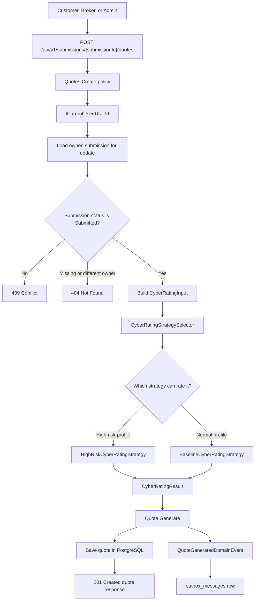
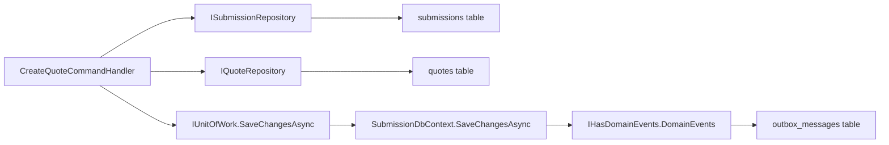
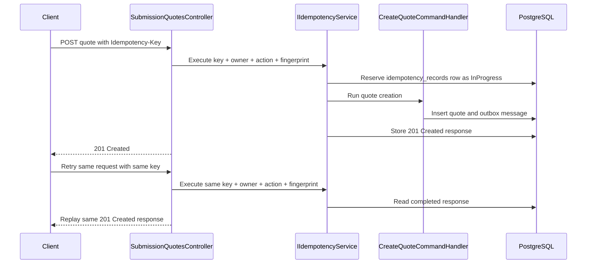

# Milestone 17 - Cyber Rating And Quote Foundation Learnings

This document records the implementation notes, design decisions, test coverage, and verification path for `Milestone 17 - Cyber Rating And Quote Foundation`.

Milestone 17 changed the original direction from a small strategy-pattern demo into a more realistic specialty-insurance rating slice. The system still does not copy a real insurer's proprietary rate tables, forms, underwriting manuals, policy wording, or pricing. Instead, it uses a synthetic cyber rating model that behaves like a real insurance workflow:

```text
submitted owned submission
  -> cyber rating inputs
  -> rating strategy selection
  -> quote persisted in PostgreSQL
  -> quote generated domain event
  -> transactional outbox row
```

## Goal

The goal is this rule:

```text
Quote generation should be a durable, owner-scoped, retry-safe business workflow,
not only a calculator method.
```

Simple explanation:

```text
Milestone 17 creates the first pricing desk.
The pricing desk looks at cyber risk facts, calculates a quote,
stores the quote, and leaves a durable event for later workflow steps.
```

Another analogy:

```text
Submission = the application folder.
Rating input = the facts the pricing desk reads from the folder.
Rating strategy = the pricing worksheet.
Quote = the formal price sheet saved to the filing cabinet.
Outbox event = the note left for the next office worker.
```

## End-To-End Flow



## Storage Flow



## Idempotency Flow



## Implemented Scope

Implemented:

- Local cyber quote creation for owned submitted submissions.
- Protected endpoint:

```text
POST /api/v1/submissions/{submissionId}/quotes
```

- `Quotes.Create` authorization policy for Customer, Broker, and Admin roles.
- PostgreSQL-backed `quotes` table.
- EF Core migration:

```text
20260621024858_AddCyberQuotes
```

- Synthetic cyber rating inputs:
  - industry class
  - annual revenue band
  - requested limit
  - retention
  - MFA status
  - EDR status
  - backup maturity
  - incident response plan
  - prior cyber incidents
  - sensitive data exposure
- Baseline and high-risk cyber rating strategies.
- Premium calculation using base premium, industry factor, limit factor, retention factor, control credits/debits, prior incident surcharge, sensitive-data factor, and minimum premium.
- Risk tier output:
  - `Low`
  - `Moderate`
  - `High`
  - `Severe`
- Quote statuses:
  - `Quoted`
  - `Referred`
  - with `Draft` and `Declined` reserved for future workflow states.
- Subjectivities and referral reasons.
- `QuoteGeneratedDomainEvent`.
- Generic domain-event capture for entities that implement `IHasDomainEvents`, so `Submission` and `Quote` events both flow into the transactional outbox.
- `Idempotency-Key` support for quote creation so safe retries do not create duplicate quotes or duplicate outbox messages.

Deferred:

- Underwriter approval, decline, and adjustment actions.
- External rating provider HTTP calls.
- Retry and circuit breaker around an external provider.
- Quote acceptance.
- Policy binding and issuing.
- SNS/SQS publishing.
- Notification inboxes.
- Advisory AI underwriting assistance.

## Rating Model

The rating model is intentionally synthetic but realistic enough to teach real workflow shape.

Inputs influence premium like this:

```text
base premium by revenue band
  * industry factor
  * requested limit factor
  * retention factor
  * MFA factor
  * EDR factor
  * backup factor
  * incident response factor
  * prior incident factor
  * sensitive data factor
  * high-risk loading when applicable
```

Why these inputs:

- Revenue approximates company size.
- Industry class approximates sector risk.
- Requested limit changes insurer exposure.
- Retention changes how much risk the insured keeps.
- MFA, EDR, backups, and incident response are common cyber-control signals.
- Prior incidents suggest claim frequency or control weakness.
- Sensitive data exposure affects breach severity.

The model produces:

- premium
- risk tier
- subjectivities
- referral reasons
- strategy name

Subjectivities are underwriting follow-up items. Referral reasons are stronger signals that the quote needs underwriter review before later milestones allow acceptance or binding.

## Ownership And State Boundaries

Quote creation keeps the existing ownership model:

```text
Authenticated user
  -> Quotes.Create role policy
  -> ICurrentUser.UserId
  -> owner-scoped submission load
  -> quote creation only if submission belongs to that user
```

Cross-owner quote requests return `404 Not Found`, matching the existing submission detail and submit behavior. The API does not reveal whether another user's submission exists.

Draft submissions cannot be quoted. They return `409 Conflict` because the submission exists for the owner, but it is not in the right state:

```text
Draft submission
  -> 409 Conflict
  -> "Only submitted submissions can be quoted."
```

## Idempotency

Quote creation uses the existing idempotency foundation because it is a protected POST that writes durable state.

Safe retry:

```text
same user
same Idempotency-Key
same submission id
same quote request body
  -> same stored 201 Created response
  -> no duplicate quote
  -> no duplicate QuoteGeneratedDomainEvent outbox row
```

Unsafe key reuse:

```text
same Idempotency-Key
different user, action, route, or body
  -> 409 Conflict
```

This keeps quote creation consistent with earlier create-submission and submit-submission idempotency behavior.

## Files Added Or Updated

Domain:

```text
src/LIAnsureProtect.Domain/Common/IHasDomainEvents.cs
src/LIAnsureProtect.Domain/Quotes/*
src/LIAnsureProtect.Domain/Submissions/Submission.cs
```

Application:

```text
src/LIAnsureProtect.Application/Quotes/*
src/LIAnsureProtect.Application/Common/Security/ApplicationPolicies.cs
src/LIAnsureProtect.Application/DependencyInjection.cs
```

Infrastructure:

```text
src/LIAnsureProtect.Infrastructure/Quotes/EfCoreQuoteRepository.cs
src/LIAnsureProtect.Infrastructure/Persistence/Configurations/QuoteConfiguration.cs
src/LIAnsureProtect.Infrastructure/Persistence/Migrations/20260621024858_AddCyberQuotes.cs
src/LIAnsureProtect.Infrastructure/Persistence/SubmissionDbContext.cs
src/LIAnsureProtect.Infrastructure/DependencyInjection.cs
```

API:

```text
src/LIAnsureProtect.Api/Controllers/SubmissionQuotesController.cs
src/LIAnsureProtect.Api/Security/AuthorizationPolicies.cs
src/LIAnsureProtect.Api/Program.cs
```

Tests:

```text
tests/LIAnsureProtect.UnitTests/Quotes/CyberRatingStrategyTests.cs
tests/LIAnsureProtect.IntegrationTests/SubmissionEndpointTests.cs
tests/LIAnsureProtect.IntegrationTests/DependencyRegistrationTests.cs
```

Documentation:

```text
README.md
CHANGELOG.md
docs/architecture/overview.md
docs/project-status.md
docs/dev/pattern-roadmap-after-milestone-11.md
docs/dev/milestone-17-cyber-rating-and-quote-foundation-learnings.md
```

## What To Remember

- This milestone implements local rating and quote creation, not external carrier integration.
- The rating logic is realistic and synthetic, not proprietary.
- Quotes are durable PostgreSQL records.
- Quote creation is owner-scoped and submitted-only.
- Quote creation is idempotent.
- Quote-generated events are captured through the existing transactional outbox.
- Later milestones should add underwriter referral workflow, provider adapter/resilience, binding, notifications, and advisory AI separately.

## Closeout

Milestone 17 implementation was committed locally as:

```text
0792023 feat: add cyber rating and quote foundation
```

The next milestone should start the underwriter workflow that consumes the `Referred` quote state created in this milestone:

```text
Milestone 18 - Underwriting Referral Foundation
```

## Verification

Focused unit tests:

```powershell
dotnet test tests\LIAnsureProtect.UnitTests\LIAnsureProtect.UnitTests.csproj --no-restore --filter "FullyQualifiedName~Quotes"
```

Focused integration tests:

```powershell
dotnet test tests\LIAnsureProtect.IntegrationTests\LIAnsureProtect.IntegrationTests.csproj --no-restore --filter "FullyQualifiedName~Create_Quote"
```

Full verification:

```powershell
dotnet build LIAnsureProtect.slnx --no-restore
dotnet test LIAnsureProtect.slnx --no-restore
dotnet ef migrations has-pending-model-changes --project src\LIAnsureProtect.Infrastructure\LIAnsureProtect.Infrastructure.csproj --startup-project src\LIAnsureProtect.Api\LIAnsureProtect.Api.csproj --context SubmissionDbContext --no-build
.\scripts\run-local-ci.ps1 -RunFrontendInstall:$false
```

Result after implementation:

```text
Focused quote unit tests: 2 passed
Focused quote endpoint integration tests: 5 passed
Build: succeeded with 0 warnings and 0 errors
Direct solution test run:
  UnitTests: 24 passed
  IntegrationTests: 37 passed, 1 skipped PostgreSQL opt-in test
EF Core pending model check: no pending model changes
Local CI: passed
Local CI UnitTests: 24 passed
Local CI IntegrationTests: 38 passed, including the PostgreSQL opt-in persistence test
Frontend Vitest: 5 files passed, 16 tests passed
Artifact zip: TestResults\local-ci-20260621-105342.zip
```

What the CI run verified:

- Docker-backed PostgreSQL/pgvector started successfully.
- All committed migrations applied, including `20260621024858_AddCyberQuotes`.
- Backend build passed with 0 warnings and 0 errors.
- Backend unit and integration tests passed.
- Docker Compose config validation passed.
- Frontend production build passed.
- Frontend ESLint passed.
- Frontend Vitest passed.
- CI artifact zip was created.
- The PostgreSQL container, volume, and network were cleaned up.
