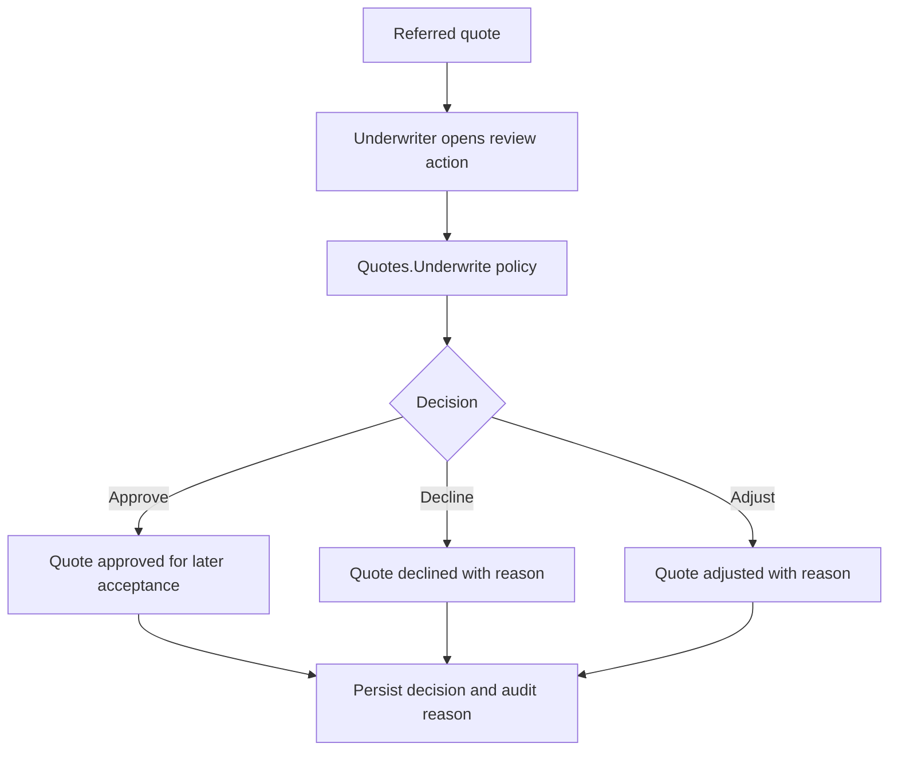

# Milestone 18 - Underwriting Referral Foundation Learnings

This document starts the planning and learning notes for `Milestone 18 - Underwriting Referral Foundation`.

Milestone 17 created the first realistic local quote/rating workflow. It can produce a quote with status:

```text
Quoted
Referred
```

`Referred` means the local rating engine found risk signals that should not move straight through without human underwriting review.

## Goal

The goal for Milestone 18 is this rule:

```text
A high-risk quote should move through an explicit underwriter review workflow
before it can be accepted or bound in later milestones.
```

Simple analogy:

```text
Milestone 17 created the pricing sheet.
Milestone 18 creates the underwriter sign-off desk.

The pricing sheet may say:
"This risk needs review."

The underwriter sign-off desk records:
"Approved with reason,"
"Declined with reason,"
or "Adjusted with reason."
```

## Starting Point

Branch:

```text
codex/milestone-18-underwriting-referral-foundation
```

Starting commit:

```text
5753b46 docs: close cyber rating and quote foundation milestone
```

Milestone 17 implementation commit:

```text
0792023 feat: add cyber rating and quote foundation
```

## Recommended Scope

Implement:

- Underwriter review actions for referred quotes.
- A `Quotes.Underwrite` authorization policy for Underwriter and Admin roles.
- Application commands for approving, declining, and adjusting referred quotes.
- Audit-friendly reason fields for review decisions.
- Persistence for review decisions and quote state transitions.
- Tests proving:
  - customers cannot approve their own referred quote
  - underwriters can act only through the underwriter policy
  - approved, declined, and adjusted states are persisted
  - review reasons are required and stored
  - non-referred or already-finalized quotes reject invalid transitions

Keep out:

- External rating provider calls.
- Retry/circuit-breaker behavior.
- Quote acceptance.
- Policy binding or issuing.
- SNS/SQS notification publishing.
- Advisory AI.

## Flow To Design



## What To Remember

- Underwriting review is not an ownership bypass.
- Customer/broker ownership still matters for customer-facing access.
- Underwriter authority should be explicit through policy and workflow state.
- AI, provider adapters, policy binding, and notifications wait for later milestones.
