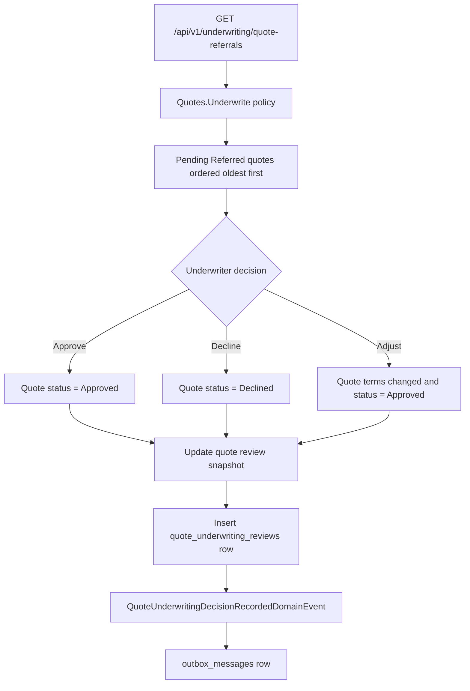

# Milestone 18 - Underwriting Referral Foundation Learnings

This document records the implementation notes, design decisions, test coverage, and verification path for `Milestone 18 - Underwriting Referral Foundation`.

Milestone 17 created local cyber quotes and introduced the `Referred` quote state. Milestone 18 turns that state into a real workflow:

```text
Referred quote
  -> underwriter queue
  -> approve, decline, or adjust
  -> review audit row
  -> quote decision snapshot
  -> outbox event
```

## Goal

The goal is this rule:

```text
A high-risk quote should move through explicit underwriter review
before later milestones can allow acceptance or binding.
```

Simple analogy:

```text
Milestone 17 created the pricing sheet.
Milestone 18 created the underwriter sign-off desk.

The pricing sheet may say:
"This risk needs review."

The underwriter sign-off desk records:
"Approved with reason,"
"Declined with reason,"
or "Adjusted with reason."
```

## Implemented Scope

Implemented:

- Underwriter-only referral queue:

```text
GET /api/v1/underwriting/quote-referrals
```

- Underwriter-only review actions:

```text
POST /api/v1/underwriting/quote-referrals/{quoteId}/approve
POST /api/v1/underwriting/quote-referrals/{quoteId}/decline
POST /api/v1/underwriting/quote-referrals/{quoteId}/adjust
```

- `Quotes.Underwrite` authorization policy for:
  - `Underwriter`
  - `Admin`
- Domain methods on `Quote` for:
  - approving a referred quote
  - declining a referred quote
  - adjusting a referred quote's premium, retention, and optional subjectivities
- New quote status:
  - `Approved`
- Existing quote states still used:
  - `Referred`
  - `Declined`
- Adjustment moves a referred quote to `Approved` with changed terms. It does not create a separate `Adjusted` status.
- Current review snapshot fields on `quotes`:
  - reviewed by user id
  - reviewed at UTC
  - underwriting decision reason
  - underwriting decision notes
- PostgreSQL audit table:

```text
quote_underwriting_reviews
```

- Audit fields:
  - quote id
  - decision type
  - reviewed by user id
  - reason
  - notes
  - premium before and after
  - retention before and after
  - created at UTC
- `QuoteUnderwritingDecisionRecordedDomainEvent` persisted through the existing transactional outbox.

Deferred:

- External rating provider calls.
- Retry and circuit breaker around external HTTP calls.
- Quote acceptance.
- Policy binding and issuing.
- SNS/SQS notification publishing.
- Notification inboxes.
- Document evidence upload.
- Subjectivity clearance workflow.
- Advisory AI underwriting assistance.
- Underwriter authority profiles or dollar authority limits.

## End-To-End Flow



## Authorization Boundary

Quote creation and quote underwriting use different policies.

Customer and broker quote creation:

```text
POST /api/v1/submissions/{submissionId}/quotes
  -> Quotes.Create
  -> Customer, Broker, Admin
  -> owner-scoped submitted submission
```

Underwriter review:

```text
GET /api/v1/underwriting/quote-referrals
POST /api/v1/underwriting/quote-referrals/{quoteId}/approve
POST /api/v1/underwriting/quote-referrals/{quoteId}/decline
POST /api/v1/underwriting/quote-referrals/{quoteId}/adjust
  -> Quotes.Underwrite
  -> Underwriter, Admin
```

This is important because underwriting review is not an ownership bypass. A customer or broker may own the submission and quote, but that does not give them authority to approve their own referred quote.

Simple explanation:

```text
Owner access answers:
"Whose application folder is this?"

Underwriter authority answers:
"Who is allowed to make the underwriting decision?"
```

## Persistence Shape

The quote keeps the latest review snapshot because later reads often need the current decision quickly:

```text
quotes
  status
  reviewed_by_user_id
  reviewed_at_utc
  underwriting_decision_reason
  underwriting_decision_notes
```

The audit table keeps the decision history:

```text
quote_underwriting_reviews
  id
  quote_id
  decision
  reviewed_by_user_id
  reason
  notes
  premium_before
  premium_after
  retention_before
  retention_after
  created_at_utc
```

Why both:

- The current quote row answers the common question: "Where is this quote now?"
- The review table answers the audit question: "What underwriting decision was recorded, by whom, and with which before/after terms?"

## State Rules

Allowed:

```text
Referred -> Approved
Referred -> Declined
Referred -> Approved with adjusted premium/retention
```

Rejected:

```text
Quoted -> Approved
Quoted -> Declined
Quoted -> Adjusted
Approved -> Approved again
Approved -> Declined
Declined -> Approved
Declined -> Adjusted
```

The rejection returns `409 Conflict` through the API because the quote exists, but it is not in the right business state for the requested transition.

## Files Added Or Updated

Domain:

```text
src/LIAnsureProtect.Domain/Quotes/Quote.cs
src/LIAnsureProtect.Domain/Quotes/QuoteStatus.cs
src/LIAnsureProtect.Domain/Quotes/QuoteUnderwritingDecision.cs
src/LIAnsureProtect.Domain/Quotes/QuoteUnderwritingReview.cs
src/LIAnsureProtect.Domain/Quotes/QuoteUnderwritingDecisionRecordedDomainEvent.cs
```

Application:

```text
src/LIAnsureProtect.Application/Quotes/Queries/ListQuoteReferrals/*
src/LIAnsureProtect.Application/Quotes/Commands/UnderwriteQuoteReferral/*
src/LIAnsureProtect.Application/Quotes/IQuoteRepository.cs
src/LIAnsureProtect.Application/Common/Security/ApplicationPolicies.cs
```

Infrastructure:

```text
src/LIAnsureProtect.Infrastructure/Quotes/EfCoreQuoteRepository.cs
src/LIAnsureProtect.Infrastructure/Persistence/Configurations/QuoteConfiguration.cs
src/LIAnsureProtect.Infrastructure/Persistence/Configurations/QuoteUnderwritingReviewConfiguration.cs
src/LIAnsureProtect.Infrastructure/Persistence/Migrations/20260621043444_AddQuoteUnderwritingReviews.cs
src/LIAnsureProtect.Infrastructure/Persistence/SubmissionDbContext.cs
```

API:

```text
src/LIAnsureProtect.Api/Controllers/UnderwritingQuoteReferralsController.cs
src/LIAnsureProtect.Api/Security/AuthorizationPolicies.cs
```

Tests:

```text
tests/LIAnsureProtect.UnitTests/Quotes/QuoteUnderwritingReviewTests.cs
tests/LIAnsureProtect.IntegrationTests/UnderwritingReferralEndpointTests.cs
tests/LIAnsureProtect.IntegrationTests/DependencyRegistrationTests.cs
```

Documentation:

```text
README.md
CHANGELOG.md
docs/architecture/overview.md
docs/project-status.md
docs/dev/pattern-roadmap-after-milestone-11.md
docs/dev/milestone-18-underwriting-referral-foundation-learnings.md
```

## What To Remember

- Underwriting review is separate from customer/broker ownership.
- `Quotes.Underwrite` is intentionally limited to Underwriter and Admin roles.
- The review queue lists only pending `Referred` quotes.
- Approve and adjust both move the quote to `Approved`.
- Decline moves the quote to `Declined`.
- Each review decision requires a reason.
- Each decision stores both a current snapshot on the quote and an audit row.
- Each decision records an outbox event for later notification or workflow milestones.
- The milestone does not bind coverage, issue a policy, call an external rating provider, send notifications, or add AI.

## Verification

Focused unit tests:

```powershell
dotnet test tests\LIAnsureProtect.UnitTests\LIAnsureProtect.UnitTests.csproj --no-restore --filter "FullyQualifiedName~QuoteUnderwritingReviewTests"
```

Focused integration tests:

```powershell
dotnet test tests\LIAnsureProtect.IntegrationTests\LIAnsureProtect.IntegrationTests.csproj --no-restore --filter "FullyQualifiedName~UnderwritingReferralEndpointTests|FullyQualifiedName~PersistenceMigrationsCreate"
```

Full verification:

```powershell
dotnet build LIAnsureProtect.slnx --no-restore
dotnet test LIAnsureProtect.slnx --no-restore
dotnet ef migrations has-pending-model-changes --project src\LIAnsureProtect.Infrastructure\LIAnsureProtect.Infrastructure.csproj --startup-project src\LIAnsureProtect.Api\LIAnsureProtect.Api.csproj --context SubmissionDbContext --no-build
.\scripts\run-local-ci.ps1 -RunFrontendInstall:$false
```

Result after implementation:

```text
Focused quote underwriting unit tests: 4 passed
Focused underwriting referral integration tests and migration guard: 7 passed
Build: succeeded with 0 warnings and 0 errors
Direct solution test run:
  UnitTests: 28 passed
  IntegrationTests: 43 passed, 1 skipped PostgreSQL opt-in test
EF Core pending model check: no pending model changes
Local CI: passed
Local CI UnitTests: 28 passed
Local CI IntegrationTests: 44 passed, including the PostgreSQL opt-in persistence test
Frontend Vitest: 5 files passed, 16 tests passed
Artifact zip: TestResults\local-ci-20260621-124044.zip
```

What the CI run verified:

- Docker-backed PostgreSQL/pgvector started successfully.
- All committed migrations applied, including `20260621043444_AddQuoteUnderwritingReviews`.
- Backend build passed with 0 warnings and 0 errors.
- Backend unit and integration tests passed.
- Docker Compose config validation passed.
- Frontend production build passed.
- Frontend ESLint passed.
- Frontend Vitest passed.
- CI artifact zip was created.
- The PostgreSQL container, volume, and network were cleaned up.
