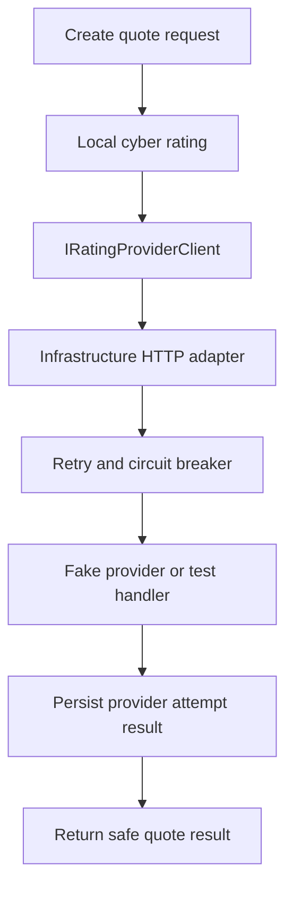

# Milestone 19 - External Rating Provider Adapter And Resilience Foundation Learnings

This document starts the planning and learning notes for `Milestone 19 - External Rating Provider Adapter And Resilience Foundation`.

Milestone 17 created local cyber rating and quote generation. Milestone 18 added human underwriter review for referred quotes. Milestone 19 should introduce the first provider-shaped external rating boundary without replacing those local workflows.

## Goal

The goal for Milestone 19 is this rule:

```text
External rating calls should be isolated behind an adapter,
and provider failure should not erase the local rating and referral workflow.
```

Simple analogy:

```text
Milestone 17 created the internal pricing desk.
Milestone 18 created the underwriter sign-off desk.
Milestone 19 creates a carrier/provider phone line.

The app should know how to call that phone line,
but the rest of the business workflow should not depend directly on the phone system.
```

## Starting Point

Branch:

```text
codex/milestone-19-external-rating-provider-adapter-and-resilience-foundation
```

Starting commit:

```text
e18d82d docs: close underwriting referral foundation milestone
```

Milestone 18 implementation commit:

```text
dc8a924 feat: add underwriting referral foundation
```

## Recommended Scope

Implement:

- An Application-owned provider client interface for rating provider calls.
- An Infrastructure HTTP adapter using `IHttpClientFactory`.
- A local fake provider endpoint or test HTTP handler rather than real insurer credentials.
- Retry and circuit-breaker behavior around the external HTTP call.
- Safe persistence of provider attempt status, such as success/failure, response reference, and failure reason.
- Local rating fallback or preservation so provider failure does not delete the local quote/referral workflow.
- Focused backend tests proving:
  - Application depends on an interface, not the provider implementation.
  - transient provider failure is retried.
  - repeated provider failure trips the circuit breaker.
  - provider errors map to safe Application/API behavior.
  - existing local quote and underwriter referral behavior remains intact.

Keep out:

- Real insurer credentials.
- Production provider onboarding.
- Policy binding or issuing.
- Quote acceptance.
- SNS/SQS notification publishing.
- Notification inboxes.
- Advisory AI underwriting assistance.

## Flow To Design



## What To Remember

- Adapter pattern belongs at the provider boundary, not inside the Domain aggregate.
- Retry and circuit breaker belong around external network calls, not around local EF Core queries.
- Local rating remains the durable internal workflow.
- Provider errors should be visible and auditable, but they should not leak secrets or raw provider internals to API callers.
- Real provider credentials, binding, notifications, and AI wait for later milestones.
