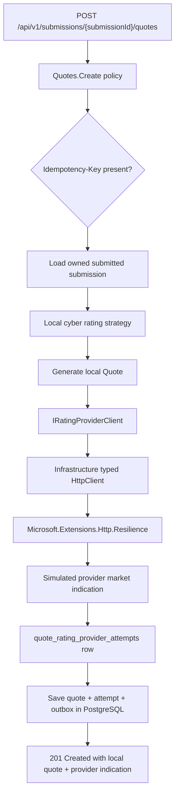
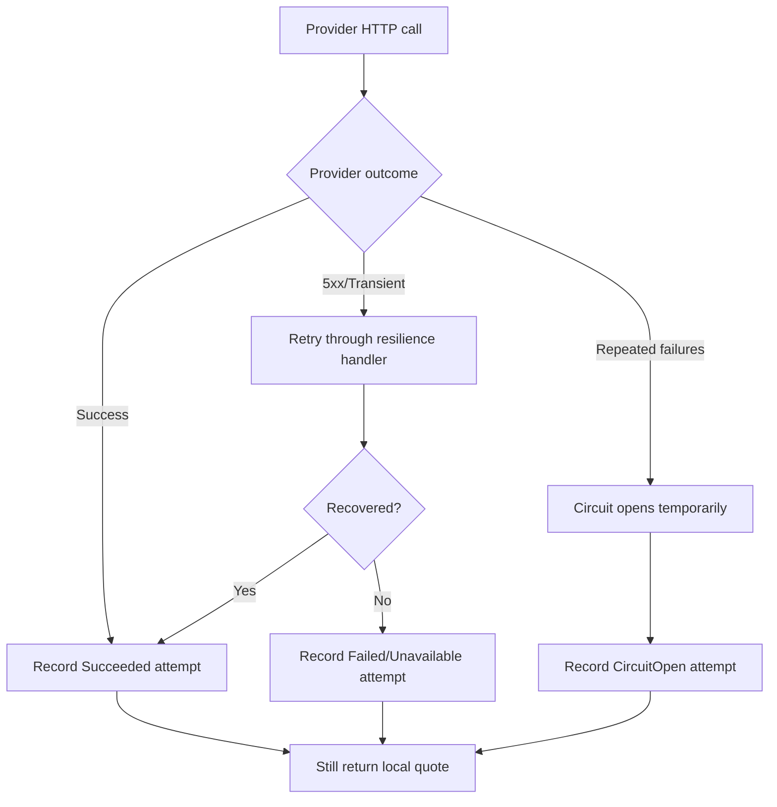

# Milestone 19 - External Rating Provider Adapter And Resilience Foundation Learnings

This document records the implementation notes, design decisions, test coverage, and verification path for `Milestone 19 - External Rating Provider Adapter And Resilience Foundation`.

Milestone 17 created local cyber rating and quote generation. Milestone 18 added human underwriter review for referred quotes. Milestone 19 introduces the first external rating provider boundary without replacing those local workflows.

## Goal

The goal for Milestone 19 is this rule:

```text
External rating calls should be isolated behind an adapter,
protected with production-style HTTP resilience,
and audited without letting provider failure erase the local quote workflow.
```

Simple analogy:

```text
Milestone 17 created the internal pricing desk.
Milestone 18 created the underwriter sign-off desk.
Milestone 19 creates a carrier/provider phone line and call log.

The app can call the provider phone line,
but the local pricing desk still keeps the official LIAnsureProtect quote.
```

## What ACORD Means Here

ACORD is an insurance-industry standards organization known for insurance forms and electronic data standards. In real insurance systems, ACORD is one of the common reference points for structured data exchange between brokers, carriers, MGAs, agencies, and policy systems.

For this portfolio project, Milestone 19 does not copy an ACORD schema, carrier API, rating manual, form, or proprietary product wording. Instead, it applies the real-world lesson behind ACORD-style exchange:

```text
Insurance integrations should exchange structured risk and quote data,
not random ad hoc strings,
and the system should keep an audit trail of what was sent and what safe result came back.
```

That is why the milestone uses provider-shaped DTOs:

- A request contains cyber risk facts already used by the local rating engine.
- A response contains a market indication, not a binding policy.
- The attempt record stores safe references and status fields.
- Raw provider payloads, secrets, and credentials are not stored.

Simple analogy:

```text
Ad hoc integration:
  "Here is a blob of text. Good luck."

Provider-shaped integration:
  "Here are named fields for risk class, limit, retention, controls,
   local premium, and local quote status."
```

## Implemented Scope

Implemented:

- Application-owned provider client boundary:

```text
IRatingProviderClient
```

- Provider-shaped Application request/result DTOs:

```text
RatingProviderRequest
RatingProviderResult
RatingProviderIndicationResult
```

- Infrastructure HTTP adapter:

```text
RatingProviderHttpClient
```

- `IHttpClientFactory` typed-client registration.
- `Microsoft.Extensions.Http.Resilience` standard resilience handler.
- Retry, timeout, and circuit-breaker behavior around the outbound provider HTTP call.
- Local simulated provider HTTP handler:

```text
SimulatedRatingProviderHttpMessageHandler
```

- Physical-attempt counting handler:

```text
RatingProviderAttemptCountingHandler
```

- PostgreSQL provider-attempt audit table:

```text
quote_rating_provider_attempts
```

- Quote creation response enrichment with a safe provider indication summary.
- Tests for provider success, provider unavailability, retry recovery, circuit-open behavior, provider-attempt persistence, migration shape, and idempotent replay.

Deferred:

- Real insurer credentials.
- Production carrier onboarding.
- Carrier-specific ACORD schema support.
- Quote acceptance.
- Policy binding and issuing.
- SNS/SQS notification publishing.
- Notification inboxes.
- Advisory AI underwriting assistance.

## End-To-End Flow



The local quote remains the official LIAnsureProtect quote in this milestone. The provider result is an external market indication stored next to the quote for audit and future workflow decisions.

## Failure And Fallback Flow



This is important because a provider outage should not delete or block the local rating workflow. The customer or broker can still receive a local quote or referral result. Operations can still see that the provider was unavailable.

## What IHttpClientFactory Is

`IHttpClientFactory` is the .NET pattern for creating outbound `HttpClient` instances through dependency injection.

Why it matters:

- It avoids scattering `new HttpClient()` throughout the codebase.
- It lets each external system have a named or typed client.
- It gives one place to configure the base address, handlers, timeouts, and resilience behavior.
- It makes the provider integration easier to replace later with a real carrier endpoint.

Milestone 19 uses a typed client:

```text
IRatingProviderClient
  -> RatingProviderHttpClient
  -> HttpClient
```

Simple analogy:

```text
IHttpClientFactory is the phone system.
RatingProviderHttpClient is the trained operator for one provider line.
IRatingProviderClient is the business promise the Application layer uses.
```

## What Retry, Timeout, And Circuit Breaker Mean

Retry:

```text
Try the provider call again when the failure looks temporary.
```

Example: the provider returns `502 Bad Gateway` once, then succeeds on the next attempt.

Timeout:

```text
Stop waiting after a configured time so one slow provider does not hold the request forever.
```

Example: the provider does not respond before the attempt timeout.

Circuit breaker:

```text
Temporarily stop calling a provider after repeated failures.
```

Example: if the provider keeps returning server errors, the app records `CircuitOpen` instead of repeatedly hammering the same failing dependency.

Why these belong around the external HTTP call:

- External providers are outside the app's control.
- Network calls can fail transiently.
- Provider outages should be contained.
- Repeated failing calls can make the app slower and increase pressure on the provider.

Why these do not wrap EF Core queries in this milestone:

- Database transactions have different consistency rules.
- Retrying database writes can duplicate state unless idempotency and transaction boundaries are designed carefully.
- The project already uses idempotency for important protected POST actions.

## Provider Attempt Persistence

The provider attempt table stores one safe audit row for each quote creation that reaches the provider boundary:

```text
quote_rating_provider_attempts
  id
  quote_id
  provider_name
  status
  market_disposition
  provider_reference
  provider_quote_number
  indicated_premium
  indicated_limit
  indicated_retention
  http_status_code
  failure_category
  failure_reason
  attempt_count
  duration_ms
  request_payload_hash
  created_at_utc
  completed_at_utc
```

Why this is a separate table:

- `quotes` answers: "What is the current LIAnsureProtect quote?"
- `quote_rating_provider_attempts` answers: "What happened when we contacted a provider?"
- Later milestones could contact multiple markets for one quote.
- Later milestones could add provider selection, appetite comparison, or market declination history without changing the core quote table every time.

Why store a request hash:

- It gives a stable fingerprint for the provider-shaped request.
- It avoids storing the full request payload.
- It helps compare attempts without leaking sensitive details.

What is intentionally not stored:

- Real provider credentials.
- Bearer tokens.
- Raw HTTP exception text.
- Full raw provider payloads.
- Secrets from headers or configuration.

## Idempotency Behavior

Quote creation already supports `Idempotency-Key`.

Milestone 19 preserves that behavior:

```text
First request with Idempotency-Key
  -> creates quote
  -> calls provider
  -> stores provider attempt
  -> stores response in idempotency_records

Matching retry with same Idempotency-Key
  -> replays stored response
  -> does not create another quote
  -> does not call provider again
  -> does not create another provider attempt
```

This matters because provider calls may be expensive or rate-limited in real systems. A safe client retry should not create duplicate market calls.

## Files Added Or Updated

Domain:

```text
src/LIAnsureProtect.Domain/Quotes/QuoteRatingProviderAttempt.cs
src/LIAnsureProtect.Domain/Quotes/RatingProviderAttemptStatus.cs
src/LIAnsureProtect.Domain/Quotes/RatingProviderFailureCategory.cs
src/LIAnsureProtect.Domain/Quotes/RatingProviderMarketDisposition.cs
```

Application:

```text
src/LIAnsureProtect.Application/Quotes/RatingProviders/*
src/LIAnsureProtect.Application/Quotes/Commands/CreateQuote/*
src/LIAnsureProtect.Application/Quotes/IQuoteRepository.cs
```

Infrastructure:

```text
src/LIAnsureProtect.Infrastructure/Quotes/RatingProviders/*
src/LIAnsureProtect.Infrastructure/Persistence/Configurations/QuoteRatingProviderAttemptConfiguration.cs
src/LIAnsureProtect.Infrastructure/Persistence/Migrations/*_AddQuoteRatingProviderAttempts.cs
src/LIAnsureProtect.Infrastructure/Persistence/SubmissionDbContext.cs
src/LIAnsureProtect.Infrastructure/DependencyInjection.cs
```

Tests:

```text
tests/LIAnsureProtect.UnitTests/Quotes/CreateQuoteCommandHandlerTests.cs
tests/LIAnsureProtect.IntegrationTests/RatingProviderHttpClientResilienceTests.cs
tests/LIAnsureProtect.IntegrationTests/SubmissionEndpointTests.cs
tests/LIAnsureProtect.IntegrationTests/DependencyRegistrationTests.cs
```

Documentation:

```text
README.md
CHANGELOG.md
docs/architecture/overview.md
docs/project-status.md
docs/dev/pattern-roadmap-after-milestone-11.md
docs/dev/milestone-19-external-rating-provider-adapter-and-resilience-foundation-learnings.md
```

## What To Remember

- The Application layer depends on `IRatingProviderClient`, not on `HttpClient`.
- The Infrastructure layer owns the outbound HTTP implementation.
- The local quote remains authoritative.
- Provider values are a market indication, not a bindable policy.
- Provider failure is auditable but not fatal to local quote creation.
- Retry and circuit breaker protect only the outbound provider call.
- Idempotent replay does not call the provider again.
- This milestone is a foundation for future real carrier onboarding, not the onboarding itself.

## Verification

Focused unit tests:

```powershell
dotnet test tests\LIAnsureProtect.UnitTests\LIAnsureProtect.UnitTests.csproj --no-restore --filter "FullyQualifiedName~CreateQuoteCommandHandlerTests|FullyQualifiedName~CyberRatingStrategyTests"
```

Focused integration tests:

```powershell
dotnet test tests\LIAnsureProtect.IntegrationTests\LIAnsureProtect.IntegrationTests.csproj --no-restore --filter "FullyQualifiedName~DependencyRegistrationTests|FullyQualifiedName~Create_Quote|FullyQualifiedName~RatingProviderHttpClientResilienceTests"
```

Full verification:

```powershell
dotnet build LIAnsureProtect.slnx --no-restore
dotnet test LIAnsureProtect.slnx --no-restore
dotnet ef migrations has-pending-model-changes --project src\LIAnsureProtect.Infrastructure\LIAnsureProtect.Infrastructure.csproj --startup-project src\LIAnsureProtect.Api\LIAnsureProtect.Api.csproj --context SubmissionDbContext --no-build
.\scripts\run-local-ci.ps1 -RunFrontendInstall:$false
```

Current focused result:

```text
Focused provider-boundary and rating unit tests: 4 passed
Focused provider endpoint, migration, retry, and circuit integration tests: 10 passed
Dependency vulnerability scan: no vulnerable packages after SQLitePCLRaw bundle override
```

Result after implementation:

```text
Build: succeeded with 0 errors
Direct solution test run:
  UnitTests: 30 passed
  IntegrationTests: 45 passed, 1 skipped PostgreSQL opt-in test
EF Core pending model check: no pending model changes
Local CI: passed
Local CI UnitTests: 30 passed
Local CI IntegrationTests: 46 passed, including the PostgreSQL opt-in persistence test
Frontend Vitest: 5 files passed, 16 tests passed
Artifact zip: TestResults\local-ci-20260621-170602.zip
Dependency vulnerability scan: no vulnerable packages after SQLitePCLRaw bundle override
```

What the CI run verified:

- Docker-backed PostgreSQL/pgvector started successfully.
- All committed migrations applied, including `20260621084502_AddQuoteRatingProviderAttempts`.
- Backend build passed.
- Backend unit and integration tests passed.
- Docker Compose config validation passed.
- Frontend production build passed.
- Frontend ESLint passed.
- Frontend Vitest passed.
- CI artifact zip was created.
- The PostgreSQL container, volume, and network were cleaned up.

## SQLite Test Dependency Hardening

After the first Milestone 19 local CI run, NuGet reported a high-severity advisory for the transitive test-only package:

```text
SQLitePCLRaw.lib.e_sqlite3 2.1.11
GHSA-2m69-gcr7-jv3q
```

The vulnerable package was reachable only through `LIAnsureProtect.IntegrationTests`, because the integration tests use EF Core SQLite in-memory for fast HTTP pipeline tests. Production projects use PostgreSQL and did not report vulnerable packages.

Even though this was test-only, it was still fixed before milestone closeout because:

- security warnings should not become normal CI noise;
- dependency warnings hide future warnings if the team gets used to ignoring them;
- the package is part of the local verification toolchain;
- the replacement is a narrow package-management change, not an architecture change.

The fix was to add a direct IntegrationTests reference to:

```text
SQLitePCLRaw.bundle_e_sqlite3 3.0.3
```

That newer bundle depends on `SourceGear.sqlite3` instead of the vulnerable legacy native package. The vulnerable-package scan then reported no vulnerable packages for all projects.

Verification:

```powershell
dotnet list LIAnsureProtect.slnx package --vulnerable --include-transitive
dotnet test tests\LIAnsureProtect.IntegrationTests\LIAnsureProtect.IntegrationTests.csproj --no-restore
```

Result:

```text
All projects: no vulnerable packages
IntegrationTests: 45 passed, 1 skipped PostgreSQL opt-in test
```
