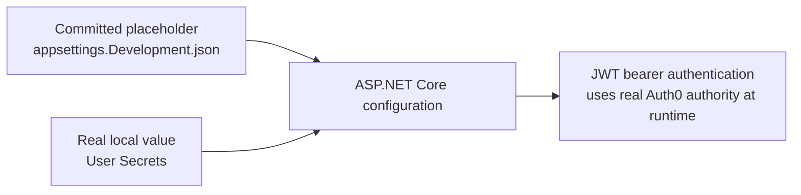

# Milestone 7 - Identity Provider Integration Learnings

This document records the decisions and tradeoffs from Milestone 7 - Identity Provider Integration.

## Why This Milestone Exists

Milestone 6 added the API authentication and authorization foundation. Milestone 7 connects that foundation to a real external identity provider.

Simple analogy:

```text
Milestone 6:
  Build the badge scanner at the API door.

Milestone 7:
  Connect the badge scanner to a real badge office.
```

For LIAnsureProtect, Auth0 by Okta is the first external badge office. The API should still stay provider-neutral where practical by validating standard JWT access tokens instead of depending on Auth0-specific types inside Application code.

## Auth0 Development Setup Direction

The first Auth0 setup uses:

```text
API name:
LIAnsureProtect API

API audience:
https://api.liansureprotect.local

Signing algorithm:
RS256
```

The audience represents the whole LIAnsureProtect API, not one endpoint.

Simple analogy:

```text
https://api.liansureprotect.local:
  The API building.

/api/v1/submissions:
  One room inside the building.
```

The API validates that an access token was issued for the LIAnsureProtect API building. Endpoint authorization policies then decide which room the caller may enter.

## Local User Secrets Direction

The committed `appsettings.Development.json` should not contain the real Auth0 tenant authority. It should keep a placeholder:

```json
"Authentication": {
  "Authority": "https://YOUR_AUTH0_DOMAIN/",
  "Audience": "https://api.liansureprotect.local",
  "RoleClaimType": "https://liansureprotect.local/roles"
}
```

The real tenant value belongs in ASP.NET Core User Secrets on the developer machine:

```powershell
dotnet user-secrets set "Authentication:Authority" "https://your-real-auth0-domain/" --project src/LIAnsureProtect.Api
```

Simple analogy:

```text
appsettings.Development.json:
  A shared classroom worksheet.

User Secrets:
  Your private answer sheet kept on your own desk.
```

The API reads both. If both contain `Authentication:Authority`, the User Secrets value wins in Development.



`UserSecretsId` is not a secret. It is a pointer in the API project file that tells .NET which local User Secrets file belongs to the project:

```xml
<UserSecretsId>1d8c758e-0a3b-48e5-809c-7760f05d86ba</UserSecretsId>
```

On Windows, the local file is stored outside the repository under the current user's profile:

```text
C:\Users\Poy\AppData\Roaming\Microsoft\UserSecrets\1d8c758e-0a3b-48e5-809c-7760f05d86ba\secrets.json
```

Important distinction:

| Value | Commit? | Why |
| --- | --- | --- |
| Auth0 authority | No, use User Secrets for the real tenant URL | It is tenant-specific local setup. |
| API audience | Yes | It is the stable API identifier for LIAnsureProtect. |
| Role claim type | Yes | It is the project contract for where roles appear in tokens. |

## Roles Claim Direction

Auth0 access tokens should use a namespaced custom claim for roles:

```text
https://liansureprotect.local/roles
```

The API should then configure:

```json
"Authentication": {
  "RoleClaimType": "https://liansureprotect.local/roles"
}
```

This keeps the Application role names stable:

```text
Customer
Broker
Underwriter
ClaimsAdjuster
Admin
```

Only the token claim location changes.

## RBAC And Permissions Decision

Auth0 RBAC is enabled for the LIAnsureProtect API.

Do not include permissions in access tokens during the first Milestone 7 pass. The current API enforces roles through ASP.NET Core policies such as:

```text
Submissions.Create
```

Adding permission claims is only useful when the API code is ready to check those permissions.

Later, LIAnsureProtect should evolve to fine-grained authorization:

```text
Role: Customer
Permission: create:submissions
Ownership rule: only create for own company
```

This is stronger than role-only authorization, but it should be its own focused milestone.

## JWE Decision

JSON Web Encryption (JWE) encrypts access-token claims.

Do not enable JWE during Milestone 7.

Reason:

- Signed JWT validation is the right first production-style baseline.
- Access tokens should stay small and avoid confidential claims.
- JWE requires decrypt-then-validate support in the API.
- JWE also adds key management, key rotation, and test complexity.

JWE should be evaluated later if access tokens need to carry confidential claims or if a production requirement demands encrypted access-token payloads.

## Sender-Constrained Token Direction

Sender-constrained tokens reduce damage from stolen bearer tokens.

Simple analogy:

```text
Normal bearer token:
  Whoever holds the badge can try to use it.

Sender-constrained token:
  The badge only works with the matching fingerprint or key.
```

Future direction:

- Evaluate DPoP for browser/public-client user flows.
- Evaluate mTLS for backend-to-backend or partner/service integrations.

Do not enable sender-constraining during Milestone 7. It should wait until the client type, Auth0 support, API validation behavior, and local developer workflow are clear.

## Step-Up MFA Direction

Transactional Authorization with MFA, or an equivalent step-up MFA pattern, should be evaluated later for sensitive actions.

Candidate actions:

- binding coverage
- approving payments
- changing admin roles
- releasing sensitive documents
- other high-impact insurance workflows

This should not block basic Auth0 token validation in Milestone 7.

## Refresh Token Direction

Offline access and refresh tokens belong with the future React login/session milestone.

Do not enable offline access during Milestone 7.

Refresh tokens require:

- secure storage
- refresh token rotation
- revocation handling
- logout behavior
- frontend/session tests

## Identity Lifecycle Automation Direction

Auth0 Actions include more triggers than the Milestone 7 post-login trigger.

The current milestone uses only:

```text
post-login:
  Add LIAnsureProtect roles into the access token.
```

Current manual setup progress:

```text
Auth0 tenant
  -> LIAnsureProtect API audience
  -> RBAC enabled
  -> app roles created
  -> test user verified and assigned Customer
  -> post-login Action deployed and attached
  -> token tester application authorized for user-delegated API access
  -> local API configuration uses committed audience/role-claim constants and User Secrets for the tenant-specific Auth0 authority
  -> manual authorization-code exchange returned an access token
  -> authenticated POST /api/v1/submissions returned Draft
  -> anonymous POST /api/v1/submissions returned 401 Unauthorized
  -> Underwriter POST /api/v1/submissions returned 403 Forbidden
  -> local build succeeded after Auth0 configuration and documentation/comment updates
  -> full local CI passed after manual Auth0 access-token smoke testing, User Secrets cleanup, and final documentation updates
```

The current verification process is called manual Auth0 access-token smoke testing.

In plain English:

```text
Manual:
  The developer gets and uses the token by hand, step by step.

Auth0 access-token:
  The test uses a real token issued by Auth0 for the LIAnsureProtect API audience.

Smoke testing:
  A small, fast check that proves the main path is not broken before deeper automated tests are added.
```

This is not a full automated integration test yet. It is a manual learning and confidence check for the real identity-provider flow.

The useful manual smoke-test matrix is:

| Caller | Expected result | Meaning |
| --- | --- | --- |
| Auth0 `Customer` access token | `201 Created` with `Draft` submission | Authenticated and authorized caller can create a submission. |
| No access token | `401 Unauthorized` | Anonymous callers are still blocked at the authentication gate. |
| Auth0 `Underwriter` access token | `403 Forbidden` | Authenticated callers without the `Submissions.Create` role are blocked at the authorization gate. |

Other triggers are useful later, but they should not be added until the app has the matching product workflow.

Recommended future use:

- `pre-user-registration`: use for registration guardrails before Auth0 creates a user, such as invite-only broker/admin onboarding, blocking disposable email domains, or early risk checks.
- `post-user-registration`: use after Auth0 creates a user, such as creating an internal application profile, sending onboarding notifications, writing audit events, or starting customer/broker setup workflows.
- `send-phone-message`: use only if the app needs a custom SMS/MFA provider or custom phone-message delivery. Prefer Auth0's managed/default MFA messaging until there is a clear reason to own this delivery path.
- `password-reset-post-challenge`: use after a password reset challenge is passed for risk checks, security audit events, or custom notifications.
- `post-change-password`: use after a password is changed for audit logging, security notifications, session/token revocation decisions, and account-risk workflows.

Simple analogy:

```text
post-login:
  Stamp the user's badge before they enter the API.

post-user-registration:
  Create the user's employee folder after the badge office creates the person.

post-change-password:
  Record that the person changed the lock on their account.
```

These should become a future identity lifecycle automation milestone after the basic Auth0 JWT flow and frontend login/session model are understood.

## What To Remember

Milestone 7 should teach the complete basic Auth0/JWT flow before adding hardening layers:

```text
Auth0 tenant
  -> API audience
  -> roles
  -> namespaced role claim
  -> manual access token
  -> ASP.NET Core JWT validation
  -> protected submission smoke test
```

Future security hardening is important, but it should be split into clear milestones so each security feature is understood, configured, tested, and documented properly.
