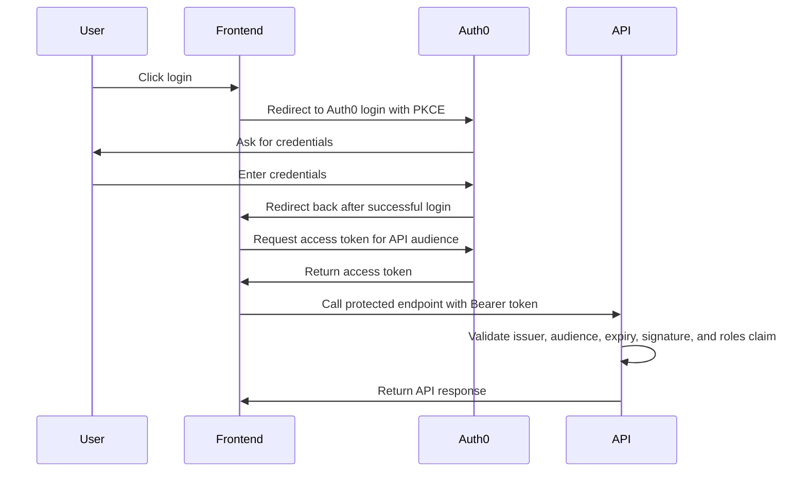
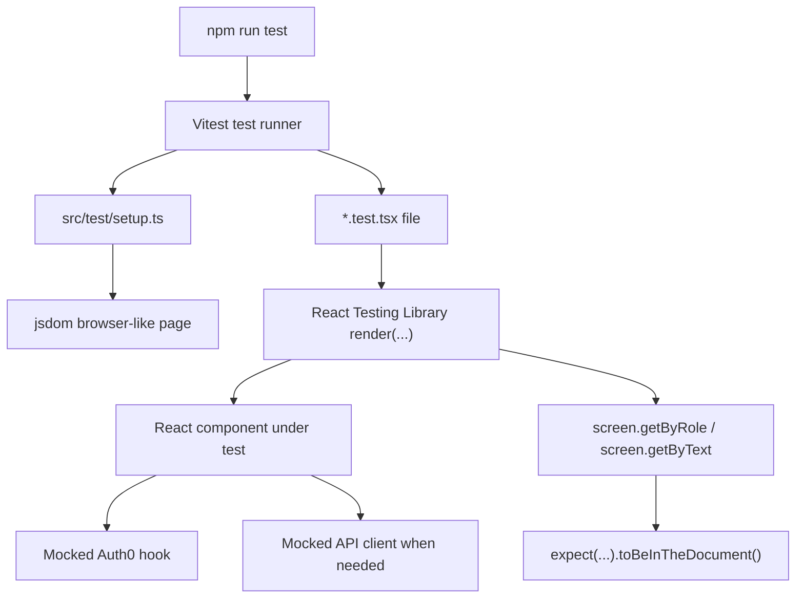
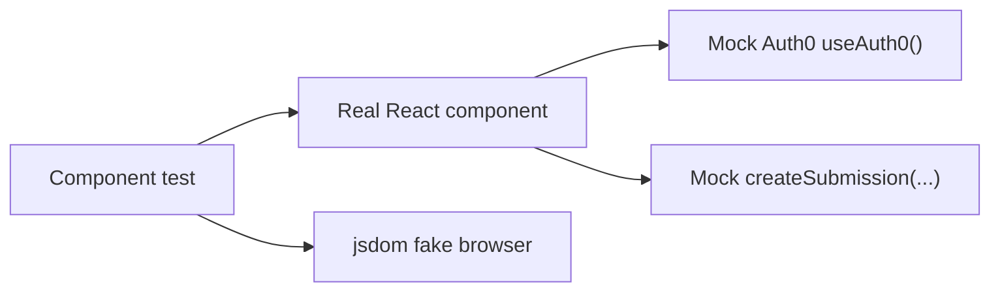
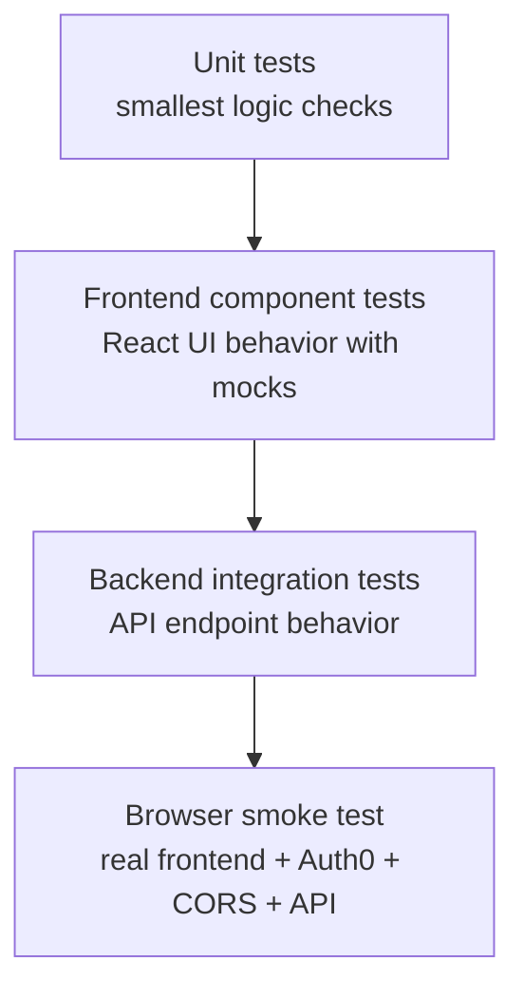
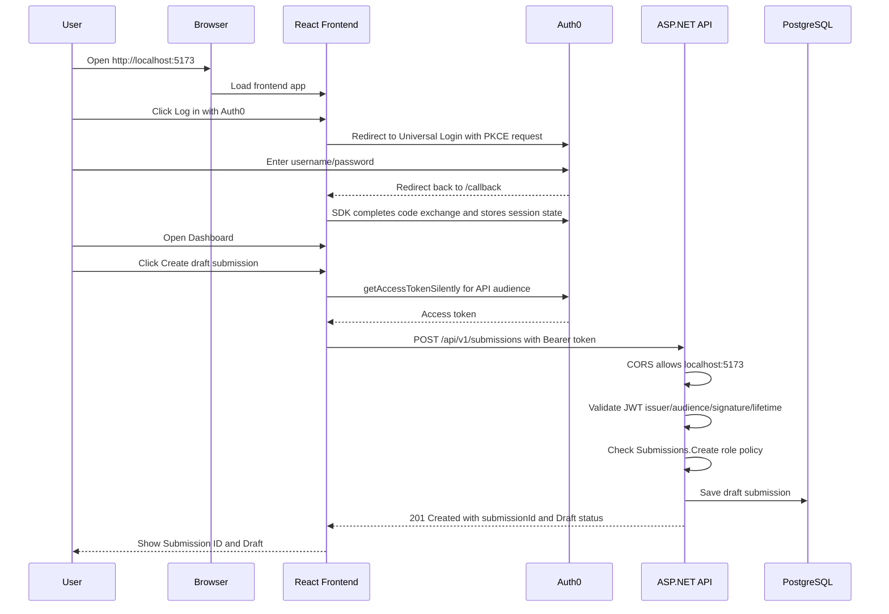
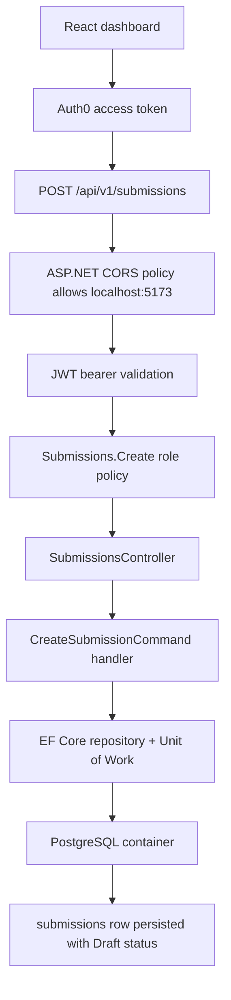

# Milestone 8 - Frontend Login And Session Foundation Learnings

This document records decisions, explanations, tradeoffs, and manual implementation notes for Milestone 8 - Frontend Login And Session Foundation.

Milestone 7 proved that the API can validate real Auth0 access tokens. Milestone 8 moves one layer outward: the frontend should sign the user in, request an API access token, and use that token when calling protected API endpoints.

## Goal

The goal is not to build the full production portal yet.

The goal is to create the first understandable login/session foundation.

In simple English:

```text
Milestone 7:
  The API can check a real Auth0 badge.

Milestone 8:
  The frontend helps the user get that badge and carries it to the API.
```

## Approved Direction

Use Auth0 Authorization Code with PKCE for browser login.

Why:

- It is the modern OAuth/OIDC flow for browser-based apps.
- The browser does not need a client secret.
- Auth0 can handle the login screen, password validation, and token issuance.
- The frontend receives tokens only after Auth0 confirms the user is authenticated.

Simple analogy:

```text
Frontend:
  The reception desk.

Auth0:
  The identity office that checks the user's identity.

API:
  The secure office door that checks the badge before letting the user in.
```

The frontend should not validate the user's password itself. Auth0 owns that.

The frontend should:

```text
1. Send the user to Auth0.
2. Let Auth0 authenticate the user.
3. Receive the login result.
4. Ask Auth0 for an access token for the LIAnsureProtect API.
5. Send that access token to the API in the Authorization header.
```

## Expected Token Flow



## Important Boundaries

Milestone 8 should stay focused.

In scope:

- Inspect the current frontend/project structure.
- Decide the exact frontend setup based on what already exists.
- Add Auth0 frontend login/session foundation.
- Request access tokens for `https://api.liansureprotect.local`.
- Call a protected API endpoint with the access token.
- Document local frontend configuration.
- Keep the implementation guided and manual so the user can learn each piece.

Out of scope unless explicitly approved later:

- User registration screens.
- Admin user-management UI.
- Database user profile table.
- Ownership checks.
- Fine-grained permission enforcement.
- JWE.
- DPoP or mTLS sender-constrained tokens.
- Transactional authorization with MFA.
- Production AWS deployment.

## Refresh Token Direction

Do not enable refresh tokens automatically at the start of Milestone 8.

Why:

Refresh tokens are like a long-lived spare key. They can improve user experience because the user does not need to log in as often, but they also require stronger handling.

Before enabling them, decide:

- where they are stored
- whether refresh token rotation is enabled
- what logout does
- how token revocation works
- how tests prove the session behavior

For the first frontend login slice, prefer a simple access-token flow first.

## First Manual Step

Before writing frontend auth code, inspect the current repository structure.

Questions to answer:

- Does a frontend project already exist?
- If it exists, what framework and tooling does it use?
- If it does not exist, should Milestone 8 create the first React app?
- What local ports will the frontend and API use?
- What callback/logout URLs need to be allowed in Auth0?

Current answer:

```text
No frontend project exists yet.
No package.json exists in the repository.
Milestone 8 should create the first React frontend project.
```

Scaffold result:

```text
src/LIAnsureProtect.Web
  -> React 19
  -> TypeScript
  -> Vite
  -> npm dependencies installed
  -> Vite dev server started on http://localhost:5173/
```

The command was intended to be:

```powershell
npm create vite@latest src/LIAnsureProtect.Web -- --template react-ts
```

The important detail is the extra `--` before `--template`. That tells npm:

```text
Everything after this belongs to the Vite project creator,
not to npm itself.
```

If the extra `--` is missed, npm may warn that `template` is an unknown npm config. In this run, the project is still usable because React and TypeScript were selected manually from Vite's prompts.

`node_modules` was created locally after dependency installation. It should not be committed. The generated frontend `.gitignore` ignores `node_modules` and build output such as `dist`.

## First Frontend Verification Checks

The fresh Vite app was opened in the browser at:

```text
http://localhost:5173/
```

Result:

```text
The default Vite + React page loaded successfully.
```

This proves the frontend development server can start and serve the React app.

Simple analogy:

```text
Browser check:
  "Can we open the new frontend building?"
```

The first production build check was:

```powershell
npm run build
```

This runs the `build` script from `src/LIAnsureProtect.Web/package.json`:

```json
"build": "tsc -b && vite build"
```

In simple English:

```text
tsc -b:
  Ask TypeScript to check and compile the project.

vite build:
  Ask Vite to create the production-ready frontend files.
```

Simple analogy:

```text
npm run build:
  "Can this frontend be packaged for real use?"
```

The first lint check was:

```powershell
npm run lint
```

This runs the `lint` script from `src/LIAnsureProtect.Web/package.json`:

```json
"lint": "eslint ."
```

In simple English:

```text
ESLint:
  A code quality checker that reads the frontend code and looks for suspicious patterns.
```

It can catch things such as:

- unused variables
- broken React hook rules
- risky code patterns
- code that does not follow the configured frontend rules

Simple analogy:

```text
TypeScript build:
  "Does the code compile?"

ESLint:
  "Does the code look suspicious or against the team's rules?"
```

Current verification:

```text
Frontend browser load:
  Passed.

npm run build:
  Passed.

npm run lint:
  Passed.
```

## Tailwind CSS Installation

Tailwind CSS was installed after the fresh React/Vite scaffold:

```powershell
npm install tailwindcss @tailwindcss/vite
```

Installed packages:

```text
tailwindcss:
  The styling engine.

@tailwindcss/vite:
  The official Tailwind plugin that connects Tailwind to Vite's build pipeline.
```

Simple analogy:

```text
Tailwind:
  A box of small styling Lego blocks.

Vite plugin:
  The adapter that lets the Vite workshop understand and use those blocks.
```

Example Tailwind class list:

```tsx
<button className="rounded-lg bg-blue-600 px-4 py-2 text-white">
  Create submission
</button>
```

In plain English:

```text
rounded-lg:
  Give the button rounded corners.

bg-blue-600:
  Give the button a blue background.

px-4 py-2:
  Add horizontal and vertical padding.

text-white:
  Make the text white.
```

Installation result:

```text
10 packages added.
163 packages audited.
0 vulnerabilities found.
```

The install step only downloads the styling tools. Tailwind is not active in the app until the project also:

```text
1. Adds the Tailwind Vite plugin to vite.config.ts.
2. Imports Tailwind in the main CSS file.
3. Uses Tailwind classes in React components.
```

Tailwind Vite plugin configuration was added to `src/LIAnsureProtect.Web/vite.config.ts`:

```ts
import { defineConfig } from 'vite'
import react from '@vitejs/plugin-react'
import tailwindcss from '@tailwindcss/vite'

// https://vite.dev/config/
export default defineConfig({
  plugins: [react(), tailwindcss()],
})
```

In simple English:

```text
react():
  Tells Vite how to handle React.

tailwindcss():
  Tells Vite how to process Tailwind CSS.
```

Simple analogy:

```text
Vite is the workshop.
React plugin teaches the workshop how to build React.
Tailwind plugin teaches the workshop how to build Tailwind styles.
```

Tailwind was then imported at the top of `src/LIAnsureProtect.Web/src/index.css`:

```css
@import "tailwindcss";
```

In simple English:

```text
vite.config.ts:
  Connects Tailwind to the build system.

index.css:
  Pulls Tailwind into the app's actual stylesheet.
```

Without the CSS import, the package and plugin exist, but Tailwind utility classes are not available to the app.

## Early Frontend Warnings And What They Mean

After Tailwind was connected, a small Tailwind smoke-test class was added to the Vite starter button:

```tsx
className="counter ring-4 ring-emerald-400"
```

In simple English:

```text
counter:
  The original Vite template CSS class.

ring-4:
  Add a visible 4-pixel outline ring using Tailwind.

ring-emerald-400:
  Make that ring emerald green.
```

Simple analogy:

```text
The original button is a plain ID card.

Tailwind classes are stickers:
  ring-4 adds a thick border sticker.
  ring-emerald-400 chooses the sticker color.
```

This is only a smoke test. It proves Tailwind classes are being recognized and converted into real CSS. It is not the final LIAnsureProtect design.

### Link `rel="noopener"` Warning

VS Code / Microsoft Edge Tools may warn about links like this:

```tsx
<a href="https://vite.dev/" target="_blank">
```

The warning says the link should include `noopener`.

Recommended form:

```tsx
<a href="https://vite.dev/" target="_blank" rel="noreferrer noopener">
```

In simple English:

```text
target="_blank":
  Open the link in a new browser tab.

rel="noopener":
  Do not let the new tab control or inspect the original app tab.

rel="noreferrer":
  Also avoid sending referrer information to the external site.
```

What `target="_blank"` does:

```text
Normal link:
  The current browser tab navigates to the link.

target="_blank":
  The current browser tab stays open, and the link opens in a new tab or window.
```

Example:

```tsx
<a href="https://example.com">Open in same tab</a>

<a href="https://example.com" target="_blank">Open in new tab</a>
```

Why this becomes a security issue:

```text
When a page opens another page using target="_blank",
the newly opened page may receive a reference back to the original page.

That reference is called window.opener.
```

Think of `window.opener` as a callback phone line:

```text
Original LIAnsureProtect tab:
  "I opened this new tab."

New external tab:
  "I may still have a phone line back to the original tab."
```

If the new page is malicious, compromised, or later redirects to something malicious, it may try to use that opener relationship to affect the original tab. A common risk is called reverse tabnabbing.

Reverse tabnabbing in simple terms:

```text
1. User is on LIAnsureProtect.
2. User clicks an external link that opens in a new tab.
3. The new tab is controlled by an attacker or redirects to an attacker.
4. The new tab uses its opener access to navigate the original LIAnsureProtect tab.
5. The original tab is replaced with a fake login page.
6. User thinks they are still safely returning to the app and may enter credentials.
```

Small diagram:

```text
Before click:

  [LIAnsureProtect tab]

After target="_blank" without noopener:

  [LIAnsureProtect tab] <---- opener link ---- [External tab]

After target="_blank" with noopener:

  [LIAnsureProtect tab]      no opener link     [External tab]
```

Simple analogy:

```text
Opening a new tab is like giving a visitor a door into another room.

noopener:
  Closes the connecting door behind them.

noreferrer:
  Also removes the note saying exactly where they came from.
```

Why `rel="noopener"` fixes the important part:

```text
noopener:
  Tells the browser not to give the new tab a usable window.opener reference.
```

Why `rel="noreferrer"` is often added too:

```text
noreferrer:
  Prevents the browser from sending the original page URL as the Referer header.

Also:
  In modern browsers, noreferrer also implies noopener behavior.
```

Why use both?

```text
rel="noreferrer noopener"
```

This is explicit and easy to recognize during code review:

```text
noreferrer:
  Do not reveal where the user came from.

noopener:
  Do not give the new tab control back to the original tab.
```

Is this only for `_blank`?

```text
Mostly yes.
```

The `noopener` issue is specifically connected to links that open another browsing context, usually `target="_blank"`. If a link opens in the same tab, there is no separate new tab that needs an opener relationship back to the original tab.

Use this rule:

```text
External link + target="_blank":
  Add rel="noreferrer noopener".

Internal app navigation:
  Usually use React Router links later, not target="_blank".

Same-tab external link:
  noopener is not normally relevant because there is no new tab opener relationship.
```

For production React code, external links that use `target="_blank"` should normally include `rel="noreferrer noopener"`.

For this milestone, the warning appears inside the default Vite starter screen. That screen is temporary and will be replaced by the real LIAnsureProtect shell. It is still useful to understand because the same rule applies later to real external links such as docs, support pages, or policy links.

After adding `rel="noreferrer noopener"` to the starter template links, the frontend checks passed:

```powershell
npm run build
npm run lint
```

Observed result:

```text
Build:
  Vite production build completed successfully.

Lint:
  ESLint completed with no reported errors.
```

The browser smoke test also confirmed that the temporary Tailwind ring rendered on the starter button.

This means the full Tailwind path is working:

```text
Installed package
  -> Vite plugin
  -> CSS import
  -> React className
  -> Browser-rendered style
  -> Production build
  -> ESLint check
```

Simple analogy:

```text
Tailwind is now connected like a working water pipe:

Source:
  tailwindcss package

Pipe connection:
  @tailwindcss/vite in vite.config.ts

Faucet:
  @import "tailwindcss" in index.css

  Water coming out:
  ring-4 ring-emerald-400 visibly appears in the browser
```

## First LIAnsureProtect App Shell

After Tailwind was verified, the default Vite starter screen was replaced with a small LIAnsureProtect-owned shell.

The temporary screen says:

```text
LIAnsureProtect
Frontend login and session foundation
Login placeholder
API smoke test placeholder
```

Why this step exists:

```text
Before adding Auth0, routing, or API calls, the frontend needs a clean app-owned surface.
```

Simple analogy:

```text
The Vite starter screen is like a showroom sticker on a new laptop.

The LIAnsureProtect app shell removes the sticker and puts our project name on the machine.
```

The two placeholder buttons are intentional:

```text
Login placeholder:
  Later this will call Auth0 login.

API smoke test placeholder:
  Later this will request an access token and call the protected API.
```

The browser confirmed that the LIAnsureProtect shell renders successfully.

The next cleanup step is to remove leftover Vite starter styling and assets that are no longer used by the new shell.

## Starter CSS Cleanup

After the LIAnsureProtect shell rendered, the leftover Vite starter CSS was removed.

`src/LIAnsureProtect.Web/src/App.css` was simplified to:

```css
#root {
  min-height: 100vh;
}
```

In simple English:

```text
#root:
  The HTML element where React places the app.

min-height: 100vh:
  Make the app area at least as tall as the browser window.
```

`src/LIAnsureProtect.Web/src/index.css` now keeps only global app-level styling:

```css
@import "tailwindcss";

:root {
  font-family:
    Inter, ui-sans-serif, system-ui, -apple-system, BlinkMacSystemFont, "Segoe UI",
    sans-serif;
  color: #0f172a;
  background: #020617;
  font-synthesis: none;
  text-rendering: optimizeLegibility;
  -webkit-font-smoothing: antialiased;
  -moz-osx-font-smoothing: grayscale;
}

* {
  box-sizing: border-box;
}

body {
  margin: 0;
  min-width: 320px;
}
```

Why this cleanup matters:

```text
The Vite starter CSS had demo-specific selectors like .counter, .hero, #center, and #next-steps.

Those selectors no longer describe the LIAnsureProtect app.
Keeping them would make future styling harder to understand.
```

Simple analogy:

```text
The Vite demo CSS was temporary scaffolding.

Once the first LIAnsureProtect shell stood up, we removed the extra scaffolding so the next floors are built on a clean frame.
```

The frontend now has:

```text
Tailwind available.
Minimal global CSS.
A first LIAnsureProtect-owned screen.
No dependency on the old Vite demo layout.
```

## Initial Frontend Folder Structure

The first frontend folders were created under `src/LIAnsureProtect.Web/src`:

```text
app
components
features
lib
pages
```

What each folder is for:

```text
app:
  App-wide composition.
  Examples: providers, router setup, top-level layout.

components:
  Shared reusable UI pieces.
  Examples: Button, PageShell, LoadingSpinner, ErrorMessage.

features:
  Business capability folders.
  Examples: authentication, submissions, policies, claims.

lib:
  Small shared helpers and integration code.
  Examples: API client, Auth0 config helpers, date formatting helpers.

pages:
  Route-level screens.
  Examples: HomePage, DashboardPage, LoginCallbackPage.
```

Simple analogy:

```text
The frontend is a building.

app:
  Main electrical panel and building entrance.

components:
  Reusable furniture.

features:
  Departments inside the building.

lib:
  Utility closet with shared tools.

pages:
  Rooms that users can visit directly.
```

Why we create the structure before adding Auth0:

```text
Auth0 login, routing, API calls, and user session state will touch multiple files.

A simple folder structure prevents everything from being placed inside App.tsx.
```

This keeps `App.tsx` from becoming a large mixed file that handles layout, routing, authentication, API calls, and page content all at once.

## File Name Casing Warning

After moving the first screen into `HomePage.tsx`, VS Code / TypeScript showed a warning like:

```text
Already included file name '.../pages/HomePage.tsx'
differs from file name '.../pages/Homepage.tsx' only in casing.
```

The actual file on disk was:

```text
src/LIAnsureProtect.Web/src/pages/HomePage.tsx
```

And the import was:

```tsx
import { HomePage } from "./pages/HomePage";
```

That means the current file name and import are correct.

What the warning means:

```text
TypeScript saw two paths that look the same except for capital letters:

HomePage.tsx
Homepage.tsx
```

Why this matters:

```text
Windows usually treats file names as case-insensitive.
Linux usually treats file names as case-sensitive.
```

Simple example:

```text
On Windows:
  HomePage.tsx and Homepage.tsx may be treated like the same file.

On Linux:
  HomePage.tsx and Homepage.tsx are different files.
```

Simple analogy:

```text
Windows is like a receptionist who treats "John Smith" and "john smith" as the same person.

Linux is like a strict database that treats those as different records.
```

Why TypeScript warns:

```text
The app might work locally on Windows but fail later in Linux-based CI, Docker, or deployment.
```

For this milestone, the build and lint commands passed after the file was corrected:

```powershell
npm run build
npm run lint
```

When the file name and import already match, but VS Code still shows the warning, the likely cause is editor cache.

Recommended fix:

```text
1. Confirm the file is named HomePage.tsx.
2. Confirm the import says ./pages/HomePage.
3. Restart the TypeScript server in VS Code.
```

VS Code command:

```text
Ctrl+Shift+P
TypeScript: Restart TS Server
```

If the warning still remains:

```text
Ctrl+Shift+P
Developer: Reload Window
```

After restarting the TypeScript server / reloading VS Code, the warning disappeared. No code change was needed because the file name and import already matched.

This is another example of the difference between:

```text
Real project failure:
  npm run build or npm run lint fails.

Editor/tooling warning:
  VS Code has stale or stricter local analysis.
```

## React Router Installation

React Router was installed in the frontend project:

```powershell
npm install react-router
```

Installed dependency:

```json
"react-router": "^7.17.0"
```

After installation, the frontend checks passed:

```powershell
npm run build
npm run lint
```

What React Router is:

```text
React Router lets the browser URL decide which React page component should render.
```

Simple example:

```text
/:
  Render HomePage.

/callback:
  Later, render an Auth0 callback page.

/dashboard:
  Later, render the signed-in dashboard.
```

Simple analogy:

```text
React Router is like a receptionist in a building.

The visitor says:
  "I am going to /dashboard."

The receptionist says:
  "That means you should go to the DashboardPage room."
```

Why it belongs before Auth0:

```text
Auth0 login will redirect the browser back to the frontend.

The frontend needs a route ready to receive that redirect.
```

For this milestone, the first route should keep behavior unchanged:

```text
Before Router:
  App renders HomePage directly.

After Router:
  App renders HomePage when the URL is /.
```

That makes routing a small structural change, not a behavior change.

The first route was then added:

```tsx
<Routes>
  <Route path="/" element={<HomePage />} />
</Routes>
```

And the app was wrapped in `BrowserRouter`:

```tsx
<BrowserRouter>
  <App />
</BrowserRouter>
```

After the router wiring, the checks passed:

```powershell
npm run build
npm run lint
```

The browser page still looked the same, which was the expected result. The change added routing plumbing without changing the visible UI.

### Import Order

Import order does not usually change how JavaScript works, but it matters for readability and consistency.

Recommended project convention:

```text
1. React / framework imports.
2. Third-party library imports.
3. Local app imports.
4. CSS imports.
```

Example:

```tsx
import { StrictMode } from "react";
import { createRoot } from "react-dom/client";
import { BrowserRouter } from "react-router";

import App from "./App.tsx";
import "./index.css";
```

Simple analogy:

```text
Import order is like arranging tools on a workbench.

The hammer still works wherever it is,
but a consistent layout makes it faster to find and harder to misuse.
```

One important exception:

```text
CSS imports can affect final styling order.
```

If two CSS files define styles for the same selector, the later-loaded rule can win. In this project, most styling should come from Tailwind classes, so CSS import order should stay simple and intentional.

For now, keep imports clean and grouped, but do not over-optimize import sorting until we add formatting/lint rules for it.

## Placeholder Routes

After the first `/` route worked, two placeholder routes were added:

```text
/callback
/dashboard
```

The route table became:

```tsx
<Routes>
  <Route path="/" element={<HomePage />} />
  <Route path="/callback" element={<LoginCallbackPage />} />
  <Route path="/dashboard" element={<DashboardPage />} />
</Routes>
```

What each route means:

```text
/:
  The public starting page.

/callback:
  The future Auth0 redirect target after login.

/dashboard:
  The future signed-in user area.
```

Why create placeholders before wiring Auth0:

```text
Auth0 will eventually redirect the browser back to a frontend URL.

It is easier to understand and test that URL when the route already exists,
even if it only shows placeholder text for now.
```

Simple analogy:

```text
Before inviting guests to a building, we label the rooms.

/callback:
  The security desk where Auth0 sends the user after login.

/dashboard:
  The room the user enters after authentication is working.
```

The placeholder routes were verified manually in the browser:

```text
http://localhost:5173/
http://localhost:5173/callback
http://localhost:5173/dashboard
```

The frontend checks also passed:

```powershell
npm run build
npm run lint
```

## React Router `Link`

After the routes worked by manually typing URLs, the home page added a navigation link to the dashboard:

```tsx
import { Link } from "react-router";
```

```tsx
<Link
  to="/dashboard"
  className="rounded-lg border border-slate-700 px-5 py-3 text-sm font-semibold text-slate-200 hover:border-slate-500"
>
  View dashboard placeholder
</Link>
```

What `Link` does:

```text
Link changes the browser URL and lets React Router render the matching page.
```

Why not always use `<a href="/dashboard">`?

```text
<a href="/dashboard">:
  The browser asks the server for a new page.

<Link to="/dashboard">:
  React Router changes the route inside the already-loaded React app.
```

Simple analogy:

```text
Using <a href> is like leaving the building and entering through another door.

Using <Link> is like walking through an internal hallway while staying inside the same building.
```

Why this matters for a React single-page app:

```text
The app can keep client-side state.
Navigation feels faster.
React Router controls which component appears.
The server does not need to reload the whole app for every internal route.
```

Important rule:

```text
Use Link for internal app routes.
Use a normal <a> tag for external websites.
```

Examples:

```tsx
// Internal route
<Link to="/dashboard">Dashboard</Link>

// External website
<a href="https://auth0.com" target="_blank" rel="noreferrer noopener">
  Auth0
</a>
```

The home-to-dashboard navigation was verified in the browser after build and lint passed.

A return link was then added from the dashboard back to home:

```tsx
<Link
  to="/"
  className="mt-8 inline-flex rounded-lg border border-slate-700 px-5 py-3 text-sm font-semibold text-slate-200 hover:border-slate-500"
>
  Back to home
</Link>
```

This created a complete internal navigation loop:

```text
/:
  Click View dashboard placeholder

/dashboard:
  Click Back to home

/:
  Back at the starting page
```

Why this matters:

```text
Before adding authentication, we now know basic client-side navigation works.
```

Simple analogy:

```text
Before installing a security checkpoint, we first confirmed the hallway between rooms works in both directions.
```

## Auth0 Frontend URL Settings

When preparing Auth0 for the React frontend, the local development app URL is:

```text
http://localhost:5173
```

The important Auth0 URL fields are:

```text
Allowed Callback URLs:
  http://localhost:5173/callback

Allowed Logout URLs:
  http://localhost:5173/

Allowed Web Origins:
  http://localhost:5173
```

What each one means:

```text
Allowed Callback URLs:
  Where Auth0 is allowed to send the browser after login.

Allowed Logout URLs:
  Where Auth0 is allowed to send the browser after logout.

Allowed Web Origins:
  Browser origins allowed for web-based token/session operations.
```

Important difference:

```text
URL:
  Includes a path.
  Example: http://localhost:5173/callback

Origin:
  Scheme + host + port only.
  Example: http://localhost:5173
```

Auth0 may reject this value in `Application Login URI`:

```text
http://localhost:5173/
```

The validation error says the field `initiate_login_uri` must be HTTPS or empty.

For this milestone, leave `Application Login URI` empty.

Why:

```text
The React app will initiate login by calling the Auth0 React SDK.

We do not need Auth0 to know a separate default login page yet.
```

Simple analogy:

```text
Allowed Callback URL:
  "After checking the user's ID, send them back to this exact door."

Allowed Logout URL:
  "After sign-out, send them back to this safe exit."

Allowed Web Origin:
  "This building is allowed to talk to Auth0 from the browser."

Application Login URI:
  "If Auth0 itself needs to start login, send the user to this HTTPS login desk."
```

Because this is local development over plain HTTP, the callback/logout/origin fields can use localhost for dev, but `Application Login URI` should be blank unless we have an HTTPS login route.

After leaving `Application Login URI` blank, Auth0 accepted the frontend URL settings.

Important correction:

```text
The React browser app should use an Auth0 Single Page Application client.
```

Milestone 7 used:

```text
LIAnsureProtect Dev Token Tester
  Type: Regular Web Application
```

That app was useful for manual Authorization Code token testing because we exchanged an authorization code with a client secret from PowerShell.

Milestone 8 needs a different Auth0 application:

```text
LIAnsureProtect Web Dev
  Type: Single Page Application
```

Why:

```text
A React app runs in the user's browser.
Anything shipped to the browser is visible to the user.
Therefore, a React app must not use a client secret.
```

Simple analogy:

```text
Regular Web App:
  Like an office worker behind a locked counter.
  It can safely keep a private key in the back office.

Single Page App:
  Like a public kiosk in the lobby.
  Anything placed in the kiosk can be inspected by visitors.
```

The frontend SPA should use Authorization Code with PKCE:

```text
Authorization Code:
  Auth0 returns a short-lived code after login.

PKCE:
  The browser proves it is the same login attempt without needing a client secret.
```

This means:

```text
Do not put an Auth0 client secret in React.
Do not put an Auth0 client secret in Vite environment variables.
Use only the SPA client ID, domain, audience, and redirect URI.
```

### Authorization Code With PKCE

PKCE means:

```text
Proof Key for Code Exchange
```

It is pronounced like:

```text
pixy
```

Auth0 and the OAuth standard recommend Authorization Code with PKCE for public clients such as browser-based single-page apps.

Why the normal Authorization Code flow needs help in a browser:

```text
Traditional server-side web app:
  Can keep a client secret on the server.

React single-page app:
  Runs in the browser.
  Cannot keep a client secret because browser code is visible.
```

Without a client secret, there is a risk:

```text
If an attacker steals the temporary authorization code,
they may try to exchange that code for tokens.
```

PKCE reduces that risk by adding a one-time proof.

Simple analogy:

```text
Authorization code:
  A claim ticket.

PKCE code verifier:
  The secret half of the claim ticket that only the original app tab has.

Auth0:
  The clerk who only gives the package to someone with both the claim ticket and the matching proof.
```

The flow in simple steps:

```text
1. React app starts login.

2. Auth0 SDK creates a random secret called a code_verifier.

3. The SDK transforms that secret into a code_challenge.

4. The browser is redirected to Auth0 with the code_challenge.

5. User logs in at Auth0.

6. Auth0 redirects back to the React app with a short-lived authorization code.

7. The SDK sends the authorization code plus the original code_verifier to Auth0.

8. Auth0 checks whether the verifier matches the earlier challenge.

9. If it matches, Auth0 returns tokens.
```

Diagram:

```text
React app
  creates code_verifier
  creates code_challenge
        |
        v
Auth0 receives code_challenge
        |
        v
User logs in
        |
        v
React app receives authorization code
        |
        v
React app sends:
  authorization code + original code_verifier
        |
        v
Auth0 checks proof and returns tokens
```

Why this helps:

```text
An attacker might see the authorization code.

But without the original code_verifier,
the stolen code is not enough to get tokens.
```

Important rule for LIAnsureProtect:

```text
Frontend React app:
  Uses Authorization Code with PKCE.
  Does not use a client secret.

Backend API:
  Validates access tokens.
  Does not handle the user's Auth0 password.

Auth0:
  Handles login, password validation, redirects, and token issuance.
```

### React Local Config Versus .NET User Secrets

In the ASP.NET API, local secret values can be stored with .NET User Secrets:

```text
dotnet user-secrets set "Authentication:Authority" "..."
```

That works because the ASP.NET API runs on the developer machine or server. The values are read by server-side .NET code and are not automatically shipped to the user's browser.

React is different:

```text
React code runs in the browser.
Anything React can read, the browser can inspect.
```

That means React does not have a true equivalent of .NET User Secrets for values used by browser code.

Simple analogy:

```text
.NET User Secrets:
  A locked drawer in the back office.

React environment variables:
  A label printed on a public kiosk.
```

Vite uses `.env.local` for local frontend configuration:

```env
VITE_AUTH0_DOMAIN=dev-example.us.auth0.com
VITE_AUTH0_CLIENT_ID=example-client-id
VITE_AUTH0_AUDIENCE=https://api.liansureprotect.local
VITE_AUTH0_CALLBACK_URL=http://localhost:5173/callback
```

Important:

```text
VITE_* variables are included in browser code.
They are not secrets.
They are only local configuration convenience.
```

Safe to put in frontend `.env.local`:

```text
Auth0 domain
Auth0 SPA client ID
API audience
Frontend callback URL
API base URL
```

Never put in frontend `.env.local`:

```text
Auth0 client secret
Database password
Private signing key
Production API secret
Payment provider secret key
Any credential that grants server-side authority
```

If the frontend needs a real secret, the correct design is:

```text
React browser app
  calls backend API

Backend API
  reads secret from User Secrets, environment variables, Key Vault, or another secure server-side store

External service
  receives the secret only from the backend
```

For Milestone 8, `.env.local` is appropriate because the Auth0 SPA values are public configuration, not secrets.

The frontend local config file was created at:

```text
src/LIAnsureProtect.Web/.env.local
```

It contains public browser configuration:

```env
VITE_AUTH0_DOMAIN=...
VITE_AUTH0_CLIENT_ID=...
VITE_AUTH0_AUDIENCE=https://api.liansureprotect.local
VITE_AUTH0_CALLBACK_URL=http://localhost:5173/callback
```

Git check:

```text
The .env.local file exists.
It does not appear in git status.
```

That is the expected result because local env files should stay out of commits.

## Auth0 React SDK Installation

The Auth0 React SDK was installed:

```powershell
npm install @auth0/auth0-react
```

Installed dependency:

```json
"@auth0/auth0-react": "^2.18.0"
```

After installation, the frontend checks passed:

```powershell
npm run build
npm run lint
```

What the SDK provides:

```text
Auth0Provider:
  Wraps the React app and connects it to Auth0.

useAuth0:
  React hook for login, logout, authentication state, user profile,
  and access token retrieval.
```

Common SDK capabilities:

```text
loginWithRedirect:
  Send the user to Auth0 Universal Login.

logout:
  Sign the user out through Auth0.

isAuthenticated:
  True when the user is signed in.

isLoading:
  True while the SDK is checking authentication state.

user:
  Basic identity claims about the signed-in user.

getAccessTokenSilently:
  Ask Auth0 for an access token that can be sent to the API.
```

Simple analogy:

```text
Auth0Provider:
  The security desk installed at the app entrance.

useAuth0:
  The phone each component can use to ask the security desk:
  "Is this user signed in?"
  "Who is this user?"
  "Can I get an API access badge?"
```

## Auth0 Frontend Config Helper

The frontend added a small config helper:

```text
src/LIAnsureProtect.Web/src/lib/auth0Config.ts
```

It reads Vite environment variables:

```ts
const auth0Domain = import.meta.env.VITE_AUTH0_DOMAIN;
const auth0ClientId = import.meta.env.VITE_AUTH0_CLIENT_ID;
const auth0Audience = import.meta.env.VITE_AUTH0_AUDIENCE;
const auth0CallbackUrl = import.meta.env.VITE_AUTH0_CALLBACK_URL;
```

What `import.meta.env` means:

```text
Vite exposes frontend environment variables through import.meta.env.
```

Important Vite rule:

```text
Only variables that start with VITE_ are exposed to browser code.
```

The helper checks required values:

```ts
if (!auth0Domain) {
  throw new Error("Missing VITE_AUTH0_DOMAIN.");
}
```

Why fail early:

```text
If configuration is missing, the app should fail with a clear message.
It is better than silently opening a broken login page later.
```

Simple analogy:

```text
Starting the app without Auth0 config is like trying to mail a letter without an address.

The config helper checks the address before the app tries to send the user to Auth0.
```

The helper exports:

```ts
export const auth0Config = {
  domain: auth0Domain,
  clientId: auth0ClientId,
  audience: auth0Audience,
  callbackUrl: auth0CallbackUrl,
};
```

What each exported value means:

```text
domain:
  Which Auth0 tenant to talk to.

clientId:
  Which Auth0 SPA application represents this React frontend.

audience:
  Which API the frontend wants access tokens for.

callbackUrl:
  Where Auth0 sends the browser after login.
```

The config helper was verified with:

```powershell
npm run build
npm run lint
```

## Auth0Provider Wiring

The React app was wrapped with `Auth0Provider` in `src/LIAnsureProtect.Web/src/main.tsx`.

The provider receives:

```tsx
<Auth0Provider
  domain={auth0Config.domain}
  clientId={auth0Config.clientId}
  authorizationParams={{
    audience: auth0Config.audience,
    redirect_uri: auth0Config.callbackUrl,
  }}
>
  <App />
</Auth0Provider>
```

What each value does:

```text
domain:
  Which Auth0 tenant the frontend talks to.

clientId:
  Which Auth0 Single Page Application client represents this React app.

audience:
  Which API the frontend wants an access token for.

redirect_uri:
  Where Auth0 sends the browser after login.
```

Simple analogy:

```text
Auth0Provider is the security desk installed at the app entrance.

domain:
  Which security company branch to call.

clientId:
  Which registered app is asking.

audience:
  Which protected building/API the user wants access to.

redirect_uri:
  Which door Auth0 should send the user back through.
```

At this stage, the visible UI does not need to change yet. The provider makes Auth0 available to the app, but components must still call `useAuth0()` before login/logout/profile behavior appears.

## Auth0 API Access Error For The New SPA

After wiring `loginWithRedirect`, clicking the login button redirected to Auth0 and then returned to:

```text
http://localhost:5173/callback?error=invalid_request&error_description=...
```

The important part of the error was:

```text
Client "...client id..." is not authorized to access resource server
"https://api.liansureprotect.local".
```

What this means:

```text
The frontend successfully asked Auth0 for a login.

But it also asked Auth0 for an access token whose audience is:
https://api.liansureprotect.local

Auth0 refused because the new SPA client has not been granted access
to the LIAnsureProtect API resource server yet.
```

Simple analogy:

```text
The user reached the security desk.
The security desk recognized the app.
But the app was not yet on the approved visitor list for the API building.
```

This is different from:

```text
Wrong callback URL:
  Auth0 would complain about redirect_uri or callback URL.

Wrong domain/client ID:
  Auth0 would not know which tenant/app is being used.

API access not authorized:
  Auth0 knows the app, but will not issue an API badge for that audience.
```

The expected fix is in Auth0:

```text
Applications -> APIs -> LIAnsureProtect API -> Application Access
```

Then authorize:

```text
LIAnsureProtect Web Dev
```

for:

```text
User-delegated Access
```

Because the API currently has no explicit permission strings/scopes, the grant may show:

```text
0 / 0 permissions granted
```

That is acceptable for the current milestone because authorization is still role-based. Fine-grained permission strings are planned for a later milestone.

After granting `LIAnsureProtect Web Dev` user-delegated access to `LIAnsureProtect API`, the Auth0 error disappeared.

This confirmed:

```text
The React SPA client is now allowed to request access tokens
for https://api.liansureprotect.local.
```

Next, the frontend needs to display real authentication state so we can confirm whether Auth0 considers the browser session signed in.

## Callback Page Session Display

The callback page was updated to read Auth0 state with:

```tsx
const { isAuthenticated, isLoading, user } = useAuth0();
```

What each value means:

```text
isLoading:
  Auth0 React SDK is still checking or processing authentication state.

isAuthenticated:
  Auth0 React SDK believes the browser has a signed-in session.

user:
  The user profile claims returned by Auth0, such as email.
```

Simple analogy:

```text
isLoading:
  The security desk is still checking the badge.

isAuthenticated:
  The badge check passed.

user:
  The name and details printed on the badge.
```

After login, the callback page showed:

```text
Loading: no
Authenticated: yes
User email: available
```

This confirmed:

```text
Auth0 login works.
The React SDK receives the session.
The frontend can read basic signed-in user information.
```

## Dashboard Session Display And Logout

The dashboard was updated to read Auth0 session state:

```tsx
const { isAuthenticated, isLoading, logout, user } = useAuth0();
```

The dashboard now shows:

```text
Loading
Authenticated
User email
```

It also added a logout button:

```tsx
logout({
  logoutParams: {
    returnTo: window.location.origin,
  },
})
```

What this means:

```text
logout:
  Ask Auth0 to end the user's Auth0 session.

returnTo:
  Tell Auth0 where to send the browser after logout.

window.location.origin:
  The current frontend origin, for local dev:
  http://localhost:5173
```

Simple analogy:

```text
Login:
  Get a visitor badge from the security desk.

Dashboard:
  Show the badge details.

Logout:
  Return the badge and leave through the approved exit.
```

The login-dashboard-logout loop was verified:

```text
1. User logs in with Auth0.
2. Callback page shows authenticated state.
3. Dashboard shows authenticated user email.
4. Logout returns the browser to the frontend home page.
```

The next security improvement is to protect `/dashboard` so unauthenticated users cannot view it directly.

## Dashboard Route Guard

The frontend added a reusable route guard:

```text
src/LIAnsureProtect.Web/src/components/RequireAuth.tsx
```

The dashboard route now renders through the guard:

```tsx
<Route
  path="/dashboard"
  element={
    <RequireAuth>
      <DashboardPage />
    </RequireAuth>
  }
/>
```

What `RequireAuth` does:

```text
If Auth0 is still loading:
  Show "Checking authentication..."

If the user is not signed in:
  Show "Please log in to continue" and a login button.

If the user is signed in:
  Render the protected page.
```

Simple analogy:

```text
RequireAuth is a guard standing in front of a room.

If the badge check is still happening:
  The guard says, "Please wait."

If there is no badge:
  The guard says, "Please get a badge first."

If the badge is valid:
  The guard opens the door to the dashboard.
```

Why the guard is separate from `DashboardPage`:

```text
DashboardPage:
  Owns dashboard content.

RequireAuth:
  Owns the rule for whether protected content can render.
```

This keeps page content and access control easier to understand separately.

Verification after adding the guard:

```text
TypeScript project build:
  Passed.

Vite production build:
  Passed.

ESLint:
  Passed.
```

The agent shell could not find `npm` on PATH, so verification used the same local project tools through the bundled Node runtime:

```text
node node_modules/typescript/bin/tsc -b
node node_modules/vite/bin/vite.js build
node node_modules/eslint/bin/eslint.js .
```

These are equivalent checks to:

```powershell
npm run build
npm run lint
```

Browser verification:

```text
Opening /dashboard while logged out redirected to Auth0 Universal Login.
```

This confirmed:

```text
The dashboard route is no longer freely viewable by unauthenticated users.
RequireAuth detected that the user was not signed in.
The login button/redirect flow sent the browser to Auth0.
```

The Auth0 Universal Login page also showed a `Dev Keys` alert.

What that means:

```text
Auth0 is warning that one or more social login connections are using Auth0 development keys.
```

In local development:

```text
This is acceptable while learning and testing.
```

For production:

```text
Use application-owned provider credentials for social login connections.
Do not rely on Auth0 development keys.
```

Simple analogy:

```text
Dev keys are like borrowing a training badge from the building manager.

Fine for practice.
Not acceptable for the real production entrance.
```

## Home Page Authenticated State

After a successful login, the user returned to the home page and still saw:

```text
Log in with Auth0
```

This was confusing but expected from the previous code because `HomePage` always rendered the login button. It did not yet ask Auth0 whether the browser session was already authenticated.

The home page was updated to read:

```tsx
const { isAuthenticated, isLoading, loginWithRedirect, logout, user } =
  useAuth0();
```

New behavior:

```text
If Auth0 is still checking:
  Show "Checking session..."

If the user is not authenticated:
  Show "Log in with Auth0"

If the user is authenticated:
  Show the signed-in email, "Go to dashboard", and "Log out"
```

Simple analogy:

```text
Before:
  The receptionist always said, "Please sign in,"
  even to people already wearing a badge.

After:
  The receptionist checks the badge first.
  If the badge exists, the user is sent to the dashboard instead.
```

The Auth0 authorization popup with `Decline` and `Accept` is a consent prompt.

What it means:

```text
The frontend app is asking Auth0 for permission to access the LIAnsureProtect API
on behalf of the signed-in user.
```

Why it appeared:

```text
The Auth0Provider requests an access token for:
https://api.liansureprotect.local

Auth0 may ask the user to approve that application/API access.
```

Simple analogy:

```text
Login:
  "Who are you?"

Consent:
  "Do you allow this app to request an API access badge for you?"
```

Clicking `Accept` lets Auth0 continue and issue tokens for the requested API audience, subject to the Auth0 application/API access settings.

## Frontend API Access Token Checkpoint

Before calling the API, the dashboard added a button that requests an access token:

```tsx
const { getAccessTokenSilently } = useAuth0();
```

What `getAccessTokenSilently` does:

```text
Ask Auth0 for an access token without sending the user through the full login screen again,
as long as the user already has a valid Auth0 session and the app is allowed to request the API audience.
```

Simple analogy:

```text
The user already has an identity badge.

getAccessTokenSilently asks the security desk:
  "Can this signed-in user get an API access badge now?"
```

The dashboard intentionally displays only a short token preview:

```text
first 16 characters ... last 16 characters
token length
```

Why not show the full token:

```text
An access token is a bearer credential.
Anyone who has it may be able to call the API until it expires.
```

Simple analogy:

```text
An access token is like a temporary building access badge.

Showing the whole token on screen is like photocopying the full badge.
Showing a short preview is like showing only the first and last few serial numbers.
```

This checkpoint proves:

```text
The frontend can request an API access token.
Auth0 accepts the configured audience.
The SPA client is authorized to access the API resource server.
```

The next step after this checkpoint is to send that token to the ASP.NET API in an `Authorization: Bearer <token>` header.

## Why The API Needs CORS For The Frontend Smoke Call

The React frontend runs at:

```text
http://localhost:5173
```

The ASP.NET API runs at:

```text
http://localhost:5223
```

These are different origins.

Why they are different:

```text
An origin is:
scheme + host + port
```

Examples:

```text
http://localhost:5173
http://localhost:5223
https://localhost:5223
```

Those are all different origins because the port or scheme changes.

Why this matters:

```text
Browser JavaScript is not automatically allowed to call a different origin.
```

This is where CORS comes in.

What CORS means:

```text
Cross-Origin Resource Sharing
```

What CORS middleware does:

```text
It tells the browser which cross-origin frontend origins are allowed
to call this API.
```

Important boundary:

```text
CORS is a browser rule.
It is not authentication.
It is not authorization.
It is not a substitute for JWT validation.
```

Simple analogy:

```text
Authentication:
  "Who are you?"

Authorization:
  "Are you allowed into this protected room?"

CORS:
  "Is this browser website allowed to talk to this API building at all?"
```

Another analogy:

```text
Frontend:
  A visitor standing outside a building.

API:
  The building.

CORS:
  The building receptionist's list of which neighboring buildings
  are allowed to send visitors to the desk.
```

Why the dashboard call especially needs CORS:

```text
The dashboard will call:
POST /api/v1/submissions

With:
Authorization: Bearer <token>
Content-Type: application/json
```

That combination usually triggers a browser preflight request.

What preflight means:

```text
Before the real POST, the browser sends an OPTIONS request asking:

"Is http://localhost:5173 allowed to send a POST here
with these headers?"
```

The API must answer with the proper CORS headers, such as:

```text
Access-Control-Allow-Origin
Access-Control-Allow-Methods
Access-Control-Allow-Headers
```

If the API does not answer correctly:

```text
The browser blocks the frontend JavaScript call,
even if the API itself would have accepted the request.
```

This is why CORS middleware is needed here.

What we implemented:

In `appsettings.Development.json`:

```json
"Cors": {
  "AllowedOrigins": [
    "http://localhost:5173"
  ]
}
```

In `Program.cs`:

```csharp
const string LocalFrontendCorsPolicy = "LocalFrontend";
```

```csharp
var allowedCorsOrigins = builder.Configuration
    .GetSection("Cors:AllowedOrigins")
    .Get<string[]>() ?? [];

builder.Services.AddCors(options =>
{
    options.AddPolicy(LocalFrontendCorsPolicy, policy =>
    {
        policy
            .WithOrigins(allowedCorsOrigins)
            .AllowAnyHeader()
            .AllowAnyMethod();
    });
});
```

And in the middleware pipeline:

```csharp
app.UseCors(LocalFrontendCorsPolicy);
```

Why `AllowAnyHeader()` was needed:

```text
The frontend sends Authorization and Content-Type headers.
Those must be allowed by the policy for the browser to proceed.
```

Why `AllowAnyMethod()` was needed:

```text
The frontend will send POST requests.
The browser may also send OPTIONS preflight requests first.
```

Important limitation:

```text
CORS does not stop Postman, curl, or another backend service.
Those are not browser-enforced clients.
```

So CORS solves:

```text
"My browser frontend cannot call the API from another origin."
```

CORS does not solve:

```text
"Is this caller authenticated?"
"Does this role have permission?"
"Should the API trust this token?"
```

Those are still handled by JWT bearer authentication and ASP.NET authorization policies.

### How Auth0, CORS, And The Protected API Call Work Together

The protected dashboard smoke call has three separate gates:

```text
1. Auth0 token issuance
2. Browser CORS permission
3. ASP.NET API authentication and authorization
```

End-to-end workflow:

```text
User
  -> opens React app at http://localhost:5173

React app
  -> redirects user to Auth0 login

Auth0
  -> authenticates user
  -> redirects back to http://localhost:5173/callback

React app
  -> calls getAccessTokenSilently()
  -> receives access token for https://api.liansureprotect.local

React app
  -> sends browser fetch request to http://localhost:5223/api/v1/submissions
     with Authorization: Bearer <access_token>

Browser
  -> sees this is cross-origin
  -> sends CORS preflight OPTIONS request if required

ASP.NET API CORS middleware
  -> checks whether http://localhost:5173 is allowed
  -> returns CORS allow headers when allowed

Browser
  -> allows the real POST request to continue

ASP.NET JWT bearer authentication
  -> validates issuer, audience, signature, lifetime, and role claim

ASP.NET authorization policy
  -> checks whether the role can create submissions

SubmissionsController
  -> creates draft submission
  -> returns submissionId and status

React dashboard
  -> displays success or error
```

Compact diagram:

```text
Browser React app
  |
  | login redirect
  v
Auth0
  |
  | callback + session
  v
Browser React app
  |
  | getAccessTokenSilently()
  v
Auth0 token endpoint
  |
  | access token for API audience
  v
Browser React app
  |
  | CORS preflight + POST with Bearer token
  v
ASP.NET API
  |
  | CORS -> JWT validation -> authorization policy -> controller
  v
Draft submission
```

Simple analogy:

```text
Auth0 token:
  The user's badge.

CORS policy:
  The browser receptionist checking whether this website is allowed
  to approach the API desk.

JWT validation:
  The API scanner checking whether the badge is real.

Authorization policy:
  The API guard checking whether this badge holder can enter this room.
```

If CORS fails:

```text
The browser blocks the request before frontend JavaScript can read the API response.
```

If JWT validation fails:

```text
The API returns 401 Unauthorized.
```

If authorization fails:

```text
The API returns 403 Forbidden.
```

If validation of the request body fails:

```text
The API returns 400 Bad Request.
```

If everything passes:

```text
The API returns 201 Created.
```

### Protecting Against curl, Postman, And Server-To-Server Callers

CORS does not protect against `curl`, Postman, scripts, backend services, or attackers calling the API outside a browser.

Why:

```text
CORS is enforced by browsers.
Non-browser clients do not have to obey browser CORS rules.
```

Example:

```text
Browser fetch:
  Browser checks CORS before allowing JavaScript to read the response.

curl/Postman:
  Sends the request directly.
  Does not need browser permission.
```

So protection against non-browser callers must happen at different layers.

Current protection already in this project:

```text
JWT bearer authentication:
  Caller must provide a valid Auth0 access token.

Audience validation:
  Token must be intended for https://api.liansureprotect.local.

Issuer validation:
  Token must come from the configured Auth0 tenant.

Signature validation:
  Token must be signed by Auth0's trusted signing keys.

Lifetime validation:
  Expired tokens are rejected.

Role authorization:
  Caller must have an allowed role for the endpoint.
```

That means a random `curl` request without a valid token should fail with:

```text
401 Unauthorized
```

A `curl` request with a valid token but the wrong role should fail with:

```text
403 Forbidden
```

Additional production protections that can be added later:

```text
Rate limiting:
  Slow down repeated or abusive requests.

WAF:
  Block common attack patterns before they reach the API.

Gateway/front-door enforcement:
  Only allow traffic that came through CloudFront, API Gateway, or another trusted edge.

Network restrictions:
  Keep the API private or restrict inbound traffic to approved infrastructure.

Machine-to-machine client credentials:
  For trusted backend services, issue service tokens with explicit scopes/roles.

mTLS:
  Require client certificates for highly trusted server-to-server calls.

DPoP or sender-constrained tokens:
  Bind tokens to a proof so stolen bearer tokens are less useful.

Audit logging and anomaly detection:
  Record who called what, when, and from where.
```

Can we add an on/off switch?

```text
Yes, but the switch must protect something real.
```

Good switches:

```text
RequireGatewayHeader:
  Only accept requests that include a secret header added by a trusted gateway.
  Useful when CloudFront/API Gateway is the only intended public entry point.

EnableRateLimiting:
  Turn request throttling on or off per environment.

RequireSenderConstrainedTokens:
  Later, require DPoP or mTLS-bound tokens for selected clients.

RequireMachineClientForServiceEndpoints:
  Only allow client-credentials tokens for machine-only endpoints.
```

Bad switch:

```text
BlockCurlOrPostman:
  Not reliable.
```

Why `BlockCurlOrPostman` is not reliable:

```text
Tools can spoof User-Agent headers.
Tools can send Origin headers.
Attackers can copy headers from real browser traffic.
```

Simple analogy:

```text
Blocking curl by User-Agent is like blocking people by the name written
on a sticky note they put on their shirt.

Real protection checks a badge, a locked entrance, or a trusted gate.
```

Recommended LIAnsureProtect direction:

```text
Do not add a fake "block non-browser callers" switch.

For production hardening, add real controls in later milestones:
rate limiting, WAF, gateway origin enforcement, audit logs, and eventually
sender-constrained tokens for high-risk flows.
```

Possible future config shape:

```json
{
  "ApiProtection": {
    "RequireGatewayHeader": false,
    "GatewayHeaderName": "X-LIAnsureProtect-Gateway",
    "GatewayHeaderValue": "",
    "EnableRateLimiting": true
  }
}
```

When this is useful:

```text
RequireGatewayHeader:
  Useful when production traffic must enter through CloudFront/API Gateway only.

EnableRateLimiting:
  Useful for public APIs, login-adjacent flows, quote generation, document upload,
  payment actions, and any endpoint that could be abused repeatedly.

Sender-constrained tokens:
  Useful later for high-risk API calls where stolen bearer tokens would be especially dangerous.
```

This belongs in a later hardening milestone because it touches deployment topology, secret storage, middleware ordering, tests, and operational runbooks.

### Why `LocalFrontend` Is Hardcoded In `Program.cs`

The code currently has:

```csharp
const string LocalFrontendCorsPolicy = "LocalFrontend";
```

That string is the internal name of the CORS policy.

It is used in two places:

```csharp
options.AddPolicy(LocalFrontendCorsPolicy, policy =>
{
    // policy rules
});
```

and:

```csharp
app.UseCors(LocalFrontendCorsPolicy);
```

What those two calls mean:

```text
AddPolicy:
  Register a CORS policy and give it a name.

UseCors:
  Apply the policy with that name in the request pipeline.
```

Simple analogy:

```text
AddPolicy is creating a rule card named "LocalFrontend".

UseCors is telling the API:
  "Use the rule card named LocalFrontend."
```

Why the name is hardcoded:

```text
It is not an environment-specific value.
It is only a code-level identifier connecting registration to middleware use.
```

What is not hardcoded:

```text
The allowed frontend origin is not hardcoded in Program.cs.
It comes from configuration:

Cors:AllowedOrigins
```

Current development value:

```json
"Cors": {
  "AllowedOrigins": [
    "http://localhost:5173"
  ]
}
```

This means:

```text
Policy name:
  Stable code identifier.

Allowed origins:
  Environment configuration.
```

If the app later needs multiple CORS policies, examples could be:

```text
LocalFrontend
PartnerPortal
AdminFrontend
```

For Milestone 8, one named policy is enough.

### Frontend Tests Versus Backend Tests

Backend tests currently live under:

```text
tests/LIAnsureProtect.UnitTests
tests/LIAnsureProtect.IntegrationTests
```

What they test:

```text
Unit tests:
  Application logic in isolation.

Integration tests:
  API behavior through ASP.NET test host, authentication test handler,
  persistence overrides, and HTTP endpoint behavior.
```

Frontend tests should live under the frontend project:

```text
src/LIAnsureProtect.Web/src/**/*.test.ts
src/LIAnsureProtect.Web/src/**/*.test.tsx
```

or in a dedicated frontend test folder:

```text
src/LIAnsureProtect.Web/src/test
```

Recommended for this project:

```text
Keep component/page tests near the React code they test.
Use src/test only for shared test setup utilities.
```

Example future frontend test files:

```text
src/LIAnsureProtect.Web/src/pages/HomePage.test.tsx
src/LIAnsureProtect.Web/src/pages/DashboardPage.test.tsx
src/LIAnsureProtect.Web/src/components/RequireAuth.test.tsx
src/LIAnsureProtect.Web/src/test/setup.ts
```

How to tell which test type it is:

```text
Backend test:
  Lives under tests/.
  Runs with dotnet test.
  Tests .NET code and API behavior.

Frontend test:
  Lives under src/LIAnsureProtect.Web.
  Runs with npm/Vitest.
  Tests React rendering, routing, buttons, and frontend state.
```

Simple analogy:

```text
Backend tests:
  Inspect the kitchen and service counter.

Frontend tests:
  Inspect what the customer sees and clicks.
```

## Frontend API Client And Protected Smoke Call

The frontend now has a small API client:

```text
src/LIAnsureProtect.Web/src/lib/apiClient.ts
```

It currently contains:

```text
createSubmission(accessToken, request)
```

The function sends:

```text
POST http://localhost:5223/api/v1/submissions
Authorization: Bearer <access token>
Content-Type: application/json
```

The dashboard now includes a protected smoke-test button that:

```text
1. Gets an access token with getAccessTokenSilently()
2. Calls createSubmission(...)
3. Shows either:
   - submissionId + status
   - or an error message
```

This is the first end-to-end browser-to-Auth0-to-API path for Milestone 8.

## Milestone 8 Completed Scope

Completed scope:

```text
React + TypeScript + Vite scaffold.
Tailwind CSS setup.
Basic LIAnsureProtect shell.
React Router routes.
Auth0 Single Page Application setup.
Auth0 React SDK installation.
Local .env.local config for public frontend Auth0 values.
Login with Auth0.
Callback page session display.
Dashboard session display.
Logout.
Dashboard route guard.
Frontend API access-token preview.
Development CORS policy for the local frontend origin.
Frontend API client/fetch wrapper.
Protected dashboard smoke button for POST /api/v1/submissions.
Focused frontend tests with Vitest, React Testing Library, and jsdom.
Local CI frontend build/lint/test integration.
Browser-tested protected POST /api/v1/submissions smoke path.
Verified PostgreSQL container persistence for the created draft submission.
```

Final closeout verification:

```text
1. Backend build passed.
2. EF Core migration application passed.
3. Backend UnitTests passed: 14 passed.
4. Backend IntegrationTests passed: 13 passed.
5. API smoke tests passed.
6. Frontend production build passed.
7. Frontend lint passed.
8. Frontend tests passed: 2 files, 5 tests.
9. Real browser Auth0 smoke test passed.
10. PostgreSQL container persistence was verified.
```

Simple analogy:

```text
We built the reception desk, confirmed the user can get a badge,
used that badge to enter the API building, performed one protected action,
and confirmed the action was written into the system-of-record database.
```

### TypeScript `ES2023` Schema Warning

The generated Vite TypeScript config uses modern compiler targets:

```json
"target": "es2023",
"lib": ["ES2023", "DOM"]
```

Some editor extensions or JSON schemas may warn that `ES2023` is not allowed.

Important distinction:

```text
Editor/schema warning:
  "My helper tool may not recognize this value."

Build failure:
  "The actual compiler cannot build this project."
```

In this milestone, the frontend build already passed with the generated config. That means the actual installed TypeScript/Vite toolchain accepts the setting. The warning is most likely the editor or extension using an older schema list.

Simple analogy:

```text
TypeScript is the real building inspector.
VS Code schema hints are a checklist printed earlier.

If the real inspector passes the building, but the old checklist does not list a new material yet, the checklist is stale.
```

Do not lower the TypeScript target just to quiet a stale editor warning unless:

```text
1. npm run build fails, or
2. the app must support older browsers that cannot run the generated JavaScript, or
3. the team intentionally standardizes on an older target.
```

### Root `tsconfig.json` Suggestions

VS Code / Microsoft Edge Tools may suggest enabling options like:

```json
"strict": true,
"forceConsistentCasingInFileNames": true
```

The root `tsconfig.json` in this Vite project is mainly a coordinator file:

```json
{
  "files": [],
  "references": [
    { "path": "./tsconfig.app.json" },
    { "path": "./tsconfig.node.json" }
  ]
}
```

In simple English:

```text
Root tsconfig.json:
  Points TypeScript to the real config files.

tsconfig.app.json:
  Configures browser app code under src.

tsconfig.node.json:
  Configures Node-side tooling code such as vite.config.ts.
```

Simple analogy:

```text
Root tsconfig.json is the reception desk.
It tells visitors which office to go to.

The actual office rules live in the referenced config files.
```

For this milestone, keep the generated Vite config unless the actual build or lint command fails. We can tighten TypeScript rules later as part of frontend quality hardening.

### Checks To Trust

When deciding whether an issue is real, prefer this order:

```text
1. npm run build
   Proves TypeScript and Vite can compile the app.

2. npm run lint
   Proves ESLint accepts the source code rules.

3. Browser smoke test
   Proves the app actually renders and responds.

4. Editor warnings
   Useful hints, but not always authoritative.
```

Simple analogy:

```text
npm run build:
  The car engine starts.

npm run lint:
  The mechanic sees no obvious loose parts.

Browser smoke test:
  The car drives around the block.

Editor warning:
  A dashboard reminder light that may need investigation.
```

## Frontend Tests Added In Milestone 8

Milestone 8 now has focused frontend tests using:

```text
Vitest:
  The frontend test runner.

React Testing Library:
  A tool for rendering React components in a test and checking them the way a user would see them.

jsdom:
  A lightweight browser-like environment inside Node.js.
```

Simple analogy:

```text
Vitest:
  The examiner.

React Testing Library:
  The examiner's eyes and hands.

jsdom:
  A small practice room that behaves enough like a browser for component tests.
```

The installed test packages are development-only packages. They help us test the app while building it, but they are not shipped to users as part of the production browser app.

### Test Script

The frontend `package.json` now has:

```json
"test": "vitest run"
```

Run it from the frontend project folder:

```powershell
cd src\LIAnsureProtect.Web
npm run test
```

What this means:

```text
npm run test:
  Ask npm to run the script named "test".

vitest run:
  Run the Vitest test suite once and exit.
```

This is different from a watch-mode test command. Watch mode keeps running and reruns tests after every file save. `vitest run` is better for CI because it finishes with a pass or fail result.

### Test Setup File

The project has:

```text
src/LIAnsureProtect.Web/src/test/setup.ts
```

It imports:

```ts
import "@testing-library/jest-dom/vitest";
```

This adds user-friendly assertions such as:

```ts
expect(screen.getByText("Dashboard")).toBeInTheDocument();
```

Without this setup, TypeScript and Vitest would not know about `toBeInTheDocument()`.

The setup file also runs cleanup after each test:

```ts
afterEach(() => {
  cleanup();
});
```

Why cleanup matters:

```text
Test 1 renders a Dashboard.
Test 2 renders another Dashboard.

Without cleanup:
  Both dashboards may still be in the fake browser page.
  A query for "Create draft submission" might find two buttons.

With cleanup:
  Each test starts with an empty page.
```

Simple analogy:

```text
Testing without cleanup is like testing recipes in a kitchen
without washing the counter between recipes.

The next recipe might fail because ingredients from the previous
recipe are still on the table.
```

### Route Guard Tests

The route guard tests live here:

```text
src/LIAnsureProtect.Web/src/components/RequireAuth.test.tsx
```

They check three important states:

```text
1. Auth0 is still checking the browser session.
   Expected UI: "Checking authentication..."

2. Auth0 says the user is not authenticated.
   Expected UI: "Authentication required" plus the "Log in with Auth0" button.

3. Auth0 says the user is authenticated.
   Expected UI: the private dashboard content is rendered.
```

The tests mock Auth0:

```ts
vi.mock("@auth0/auth0-react", () => ({
  useAuth0: () => authState,
}));
```

In simple English, the test says:

```text
Do not call real Auth0.
For this test, pretend Auth0 returned this state.
```

Why we mock Auth0 in component tests:

```text
We are testing our component's reaction to Auth0 states.
We are not retesting Auth0 itself.
```

Simple analogy:

```text
If you test a doorbell button, you do not need the real delivery person.
You only need to prove that pressing the button triggers the expected signal.
```

### Dashboard Tests

The dashboard tests live here:

```text
src/LIAnsureProtect.Web/src/pages/DashboardPage.test.tsx
```

They check two important frontend behaviors:

```text
1. The dashboard can request an access token and display only a shortened preview.
2. The dashboard can call the frontend API client with the access token and sample submission request.
```

The first test protects against accidentally showing the full access token:

```text
Good:
  header.payload.s...-long-test-value (45 characters)

Bad:
  header.payload.signature-with-long-test-value
```

Why this matters:

```text
Access tokens are bearer tokens.
Whoever has the token can use it until it expires.
Showing the full token on screen makes accidental sharing easier.
```

Simple analogy:

```text
A bearer token is like a temporary event wristband.
If someone else gets it, they can enter until the wristband expires.
```

The second test mocks the API client:

```ts
vi.mock("../lib/apiClient", () => ({
  createSubmission: vi.fn(),
}));
```

That means the test does not call the real backend. It checks that the dashboard passes the correct token and request body to the API client.

This keeps the test fast and focused:

```text
Dashboard component test:
  Does the button call our API client correctly?

Backend integration test:
  Does the real API endpoint authorize and create the submission correctly?

Browser/manual smoke test:
  Do the frontend, Auth0, CORS, and backend all work together in a real browser?
```

These are different levels of testing. They complement each other instead of replacing each other.

### Frontend Test Foundation Workflow

The Milestone 8 frontend test foundation has three main pieces:

```text
Vitest:
  Runs the tests.

React Testing Library:
  Renders React components and lets the test interact with them like a user.

jsdom:
  Provides a fake browser page inside Node.js.
```

Workflow diagram:



In simple English:

```text
1. npm starts Vitest.
2. Vitest loads the test setup file.
3. jsdom creates a fake browser page.
4. React Testing Library renders a component into that fake page.
5. The test clicks buttons or searches for text.
6. Assertions prove the expected UI or function call happened.
7. Cleanup clears the fake page before the next test.
```

Simple analogy:

```text
Vitest is the test coordinator.
React Testing Library is the person acting like a user.
jsdom is the practice stage.
Mocks are stand-ins for expensive or external actors.
```

Why this is useful:

```text
Fast:
  It does not open a real browser.

Focused:
  It tests one component behavior at a time.

Repeatable:
  It does not depend on Auth0 being reachable or the API running.

Good for CI:
  It returns a clear pass/fail result.
```

What this does not prove:

```text
It does not prove the real Auth0 login page works.
It does not prove real CORS headers are correct.
It does not prove the real API creates a database row.
It does not prove the full browser redirect flow works.
```

That is why we still need the real browser smoke test at the end of this milestone.

### What Is Mocked And What Is Real

Component tests intentionally replace some dependencies with mocks.



Real:

```text
The React component code.
The button labels.
The conditional rendering.
The click handlers.
The request body passed to the API client.
The token-preview formatting logic.
```

Mocked:

```text
Auth0 login/session behavior.
The backend API call.
The browser's real networking stack.
```

Why this is correct:

```text
If we are testing DashboardPage, the question is:
  "Does DashboardPage ask for a token and call createSubmission correctly?"

The question is not:
  "Does Auth0's production service work today?"

The question is also not:
  "Can the ASP.NET API write to PostgreSQL?"
```

Those other questions are answered by different checks:

| Question | Best Check |
| --- | --- |
| Does the dashboard button call the right frontend code? | React component test |
| Does the API authorize and create submissions? | ASP.NET integration test |
| Does the full login/token/CORS/API path work together? | Browser smoke test |

### Testing Levels In This Project

It helps to think of testing as layers:



Another way to see it:

```text
Unit/component tests:
  "Does this small part behave correctly?"

Integration tests:
  "Do these backend parts work together?"

Browser smoke test:
  "Can a real user complete the important path?"
```

Simple analogy:

```text
Unit/component tests:
  Check the brakes, lights, and steering one by one.

Integration tests:
  Check that the engine and transmission work together.

Browser smoke test:
  Drive the car around the block.
```

Milestone 8 needs all three kinds of confidence because authentication crosses several boundaries:

```text
React app
Auth0 tenant
Browser redirect/session
CORS middleware
JWT bearer authentication
Role authorization
ASP.NET controller
Application use case
Database persistence
```

### Frontend Test Commands

From the frontend project:

```powershell
cd src\LIAnsureProtect.Web
npm run test
npm run build
npm run lint
```

The combined local CI script now runs frontend checks by default:

```powershell
.\scripts\run-local-ci.ps1
```

It runs:

```text
npm ci
npm run build
npm run lint
npm run test
```

The script also has this escape hatch:

```powershell
.\scripts\run-local-ci.ps1 -RunFrontendInstall:$false
```

That skips `npm ci` but still runs:

```text
npm run build
npm run lint
npm run test
```

Why this exists:

```text
npm ci deletes and recreates node_modules.

On Windows, a running Vite dev server, editor extension, or antivirus scanner
can temporarily hold a native package file open.

When npm tries to delete that locked file, Windows can return:
EPERM unlink
```

In simple English:

```text
npm says:
  "I need to replace this file."

Windows says:
  "No, something is still holding it."
```

The best normal fix is to stop running frontend dev servers and rerun local CI. The `-RunFrontendInstall:$false` switch is useful when dependencies are already installed and you only need to verify the code.

Why `npm ci` is used in CI:

```text
npm install:
  Good for normal local package editing.
  May update package-lock.json when dependencies change.

npm ci:
  Good for repeatable verification.
  Deletes node_modules and installs exactly what package-lock.json records.
```

Simple analogy:

```text
npm install:
  "Get me these ingredients and update the shopping list if needed."

npm ci:
  "Use this exact shopping list. Do not improvise."
```

### Current Verification Result

The frontend verification loop passed with:

```text
Vitest:
  2 test files passed
  5 tests passed

TypeScript:
  tsc -b passed

ESLint:
  eslint . passed

Vite production build:
  vite build passed
```

The backend solution build also passed when run with:

```powershell
dotnet build LIAnsureProtect.slnx -p:RestoreIgnoreFailedSources=true
```

That flag was needed in the Codex sandbox because the shell could not reach NuGet. The build succeeded because the required packages were already available locally.

The combined local CI script also passed with:

```powershell
.\scripts\run-local-ci.ps1 -RunSmokeTests:$false -RunFrontendInstall:$false -CreateZipArtifact:$false
```

That run verified:

```text
Backend build:
  Passed

EF Core migration application:
  Passed

Backend unit tests:
  14 passed

Backend integration tests:
  13 passed

Docker Compose config:
  Passed

Frontend build:
  Passed

Frontend lint:
  Passed

Frontend tests:
  2 test files passed
  5 tests passed
```

`-RunFrontendInstall:$false` was used because `npm ci` hit a Windows `EPERM unlink` file-lock problem while trying to delete native package files under `node_modules`. That is a local environment/file-handle issue, not a TypeScript, React, Vite, or API code failure.

The remaining Milestone 8 verification step is the real browser smoke path:

```text
Frontend login -> Auth0 -> Dashboard -> Create draft submission -> API returns Draft submission
```

## Final Browser Smoke Test For Milestone 8

The last Milestone 8 check is a real browser smoke test.

In simple English:

```text
A smoke test is a small end-to-end check.
It does not test every feature.
It proves the most important path does not obviously break.
```

For Milestone 8, the most important path is:

```text
Can a real signed-in frontend user call the protected API?
```

### What Must Be Running

You need both apps running:

```text
ASP.NET API:
  http://localhost:5223

Vite React frontend:
  http://localhost:5173
```

The API must have local Auth0 authority configured through User Secrets:

```powershell
dotnet user-secrets list --project src/LIAnsureProtect.Api
```

Expected shape:

```text
Authentication:Authority = https://your-auth0-domain/
```

The frontend must have local Vite/Auth0 settings in:

```text
src/LIAnsureProtect.Web/.env.local
```

Expected shape:

```text
VITE_AUTH0_DOMAIN=your-auth0-domain
VITE_AUTH0_CLIENT_ID=your-spa-client-id
VITE_AUTH0_AUDIENCE=https://api.liansureprotect.local
VITE_AUTH0_CALLBACK_URL=http://localhost:5173/callback
VITE_API_BASE_URL=http://localhost:5223
```

Reminder:

```text
.env.local is gitignored.
Do not commit it.
Do not put a client secret in the frontend.
```

### Smoke Test Flow



### Manual Steps

Terminal 1, from the repository root:

```powershell
.\scripts\dev-up.ps1
```

Wait until the API is running on:

```text
http://localhost:5223
```

Terminal 2, from the frontend project:

```powershell
cd src\LIAnsureProtect.Web
npm run dev
```

Open:

```text
http://localhost:5173
```

Then:

```text
1. Click Log in with Auth0.
2. Log in using the Auth0 test user.
3. Return to the app callback page.
4. Continue to Dashboard.
5. Click Get API access token.
6. Confirm a shortened token preview appears.
7. Click Create draft submission.
8. Confirm the page shows:
   - Submission ID
   - Status: Draft
```

Expected successful result:

```text
Submission ID: some-guid-or-id
Status: Draft
```

### How To Read Failures

If the dashboard cannot get an access token:

```text
Likely area:
  Auth0 frontend app settings, API audience, callback URL, or Auth0 session.
```

If the browser console shows a CORS error:

```text
Likely area:
  API CORS config or API environment.

Check:
  Cors:AllowedOrigins includes http://localhost:5173
  app.UseCors(...) runs before authentication/authorization
```

If the API returns `401 Unauthorized`:

```text
Meaning:
  The API did not accept the token as a valid authenticated caller.

Likely area:
  Wrong Auth0 authority, wrong audience, expired token, missing bearer token,
  or token issued for a different API.
```

If the API returns `403 Forbidden`:

```text
Meaning:
  The token is valid, but the user lacks an allowed role.

Likely area:
  Auth0 user role assignment or namespaced role claim.

Expected allowed roles for this endpoint:
  Customer
  Broker
  Admin
```

If the API returns validation errors:

```text
Meaning:
  Authentication and authorization worked.
  The request body did not satisfy Application validation.
```

If the page shows `Submission ID` and `Draft`:

```text
Meaning:
  Frontend login worked.
  Auth0 access-token retrieval worked.
  Browser CORS permission worked.
  API JWT validation worked.
  Role authorization worked.
  Submission creation worked.
```

### Why This Is The Last Milestone 8 Item

Milestone 8 is not trying to build the full insurance UI yet.

Its goal is the foundation:

```text
Can the browser app sign in a user,
get an API access token,
and call a protected backend endpoint?
```

Once the browser smoke test passes, Milestone 8 has proven the login/session foundation. Later milestones can build real user workflows on top of it.

### Current Automation Limitation

During the Codex verification attempt, the API and frontend were brought to the correct local state:

```text
API health:
  http://localhost:5223/api/v1/health -> Healthy

Frontend:
  http://localhost:5173 -> 200 OK
```

The automated browser layer could not complete the Auth0 browser flow because the local browser-control runtime hit a Windows permission error while accessing the user profile area.

That means the final smoke test must be completed manually in the visible browser for this run.

This is not a code failure by itself. It means the browser automation tool could not drive the browser in this environment.

Manual completion checklist:

```text
1. Keep the API running on http://localhost:5223.
2. Keep the frontend running on http://localhost:5173.
3. Open http://localhost:5173.
4. Log in through Auth0.
5. Go to Dashboard.
6. Click Get API access token.
7. Click Create draft submission.
8. Confirm Submission ID and Draft status are displayed.
```

### Verified Browser Smoke Test Result

The final browser smoke test passed.

Observed result in the dashboard:

```text
Submission ID: 826637af-7ca2-4715-bd71-eb9836caeb7c
Status: Draft
```

A direct query against the local PostgreSQL container confirmed the row was saved:

```text
id: 826637af-7ca2-4715-bd71-eb9836caeb7c
applicant: Frontend Smoke Test Applicant
email: frontend-smoke@example.com
company: Frontend Smoke Test Company
status: Draft
```

The PostgreSQL database was running inside Docker:

```text
container: liansureprotect-postgres
image: pgvector/pgvector:0.8.2-pg16-trixie
status: healthy
port: localhost:5432 -> container:5432
```

Simple verified flow:

```text
React dashboard
  -> sends POST /api/v1/submissions with Auth0 access token
  -> ASP.NET API validates token and role
  -> Application creates draft submission
  -> EF Core saves it
  -> PostgreSQL container stores the row
```

Workflow diagram:



This proves the Milestone 8 login/session foundation works end to end:

```text
Auth0 login:
  Passed

Frontend API access-token request:
  Passed

Browser CORS permission:
  Passed

API JWT validation:
  Passed

Role authorization:
  Passed

Submission persistence:
  Passed
```
