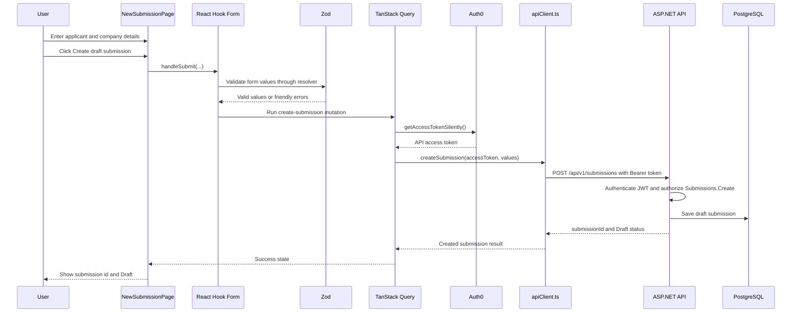
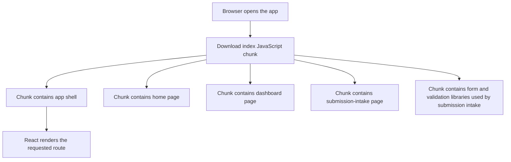
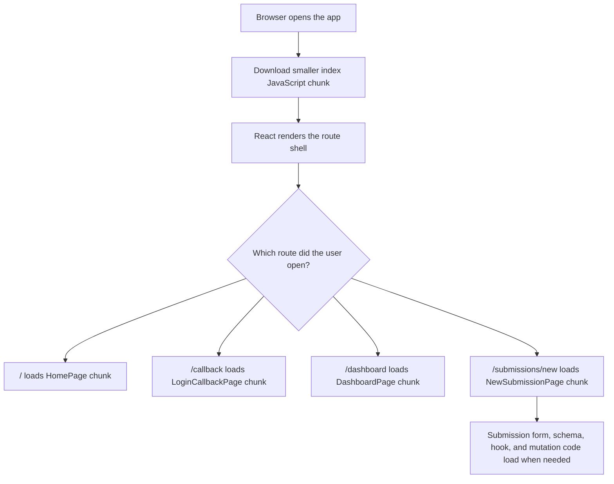

# Milestone 9 - Submission Intake UI Foundation Learnings

This document records the implementation notes, tool explanations, tradeoffs, tests, and verification results for `Milestone 9 - Submission Intake UI Foundation`.

Milestone 8 proved that a signed-in React user could click a protected smoke-test button and create a draft submission through the API. Milestone 9 turns that proof into the first real frontend workflow: a signed-in user fills out a small submission intake form and the app creates a draft submission.

## Goal

The goal is not to build the full cyber insurance questionnaire yet.

The goal is to replace this:

```text
Dashboard button with hard-coded test data
```

with this:

```text
Protected Create Submission page
  -> user enters applicant name, applicant email, and company name
  -> frontend validates the form
  -> frontend requests an Auth0 access token
  -> frontend calls POST /api/v1/submissions
  -> frontend shows the created draft submission id and status
```

Simple analogy:

```text
Milestone 8:
  We proved the doorbell works by pressing a test button.

Milestone 9:
  We replaced the test button with the first real front desk form.
```

## Approved Scope

In scope:

- Add frontend form and server-state libraries:
  - `react-hook-form`
  - `zod`
  - `@hookform/resolvers`
  - `@tanstack/react-query`
- Add a protected route:

  ```text
  /submissions/new
  ```

- Add a real submission intake page where the user enters:
  - applicant name
  - applicant email
  - company name
- Add friendly inline validation messages.
- Use the current Auth0 access-token flow.
- Call the existing backend endpoint:

  ```text
  POST /api/v1/submissions
  ```

- Replace the dashboard-only smoke submit area with navigation to the real intake page.
- Add co-located frontend tests for the new page.
- Update documentation and continuity notes.

Out of scope:

- Ownership rules.
- Multi-step insurance questionnaire.
- File upload or document handling.
- Quote generation.
- Admin screens.
- Refresh tokens.
- Deployment.
- DPoP, mTLS, or JWE.
- Full design system expansion.

## Files Added Or Updated

Frontend dependencies:

```text
src/LIAnsureProtect.Web/package.json
src/LIAnsureProtect.Web/package-lock.json
```

Frontend app code:

```text
src/LIAnsureProtect.Web/src/main.tsx
src/LIAnsureProtect.Web/src/App.tsx
src/LIAnsureProtect.Web/src/pages/DashboardPage.tsx
src/LIAnsureProtect.Web/src/features/submissions/api/createSubmission.ts
src/LIAnsureProtect.Web/src/features/submissions/components/SubmissionIntakeForm.tsx
src/LIAnsureProtect.Web/src/features/submissions/hooks/useCreateSubmission.ts
src/LIAnsureProtect.Web/src/features/submissions/pages/NewSubmissionPage.tsx
src/LIAnsureProtect.Web/src/features/submissions/schemas/submissionIntakeSchema.ts
src/LIAnsureProtect.Web/src/features/submissions/types.ts
```

Frontend tests:

```text
src/LIAnsureProtect.Web/src/pages/DashboardPage.test.tsx
src/LIAnsureProtect.Web/src/features/submissions/pages/NewSubmissionPage.test.tsx
```

Documentation:

```text
docs/dev/milestone-9-submission-intake-ui-foundation-learnings.md
docs/project-status.md
docs/dev/run-the-app.md
README.md
CHANGELOG.md
```

## Why These Libraries Were Added

### React Hook Form

Package:

```text
react-hook-form
```

What it does:

React Hook Form manages form state in React without forcing every keystroke to become a big React state update.

In this milestone, it handles:

- reading field values
- connecting inputs to the form
- tracking validation errors
- running submit logic only when the form is valid

Simple analogy:

```text
React Hook Form is the clipboard at the front desk.

It keeps track of what the user wrote on the form,
which fields are missing,
and when the form is ready to hand to the API.
```

Small example:

```tsx
const { register, handleSubmit, formState: { errors } } = useForm<FormValues>();

<input {...register("applicantName")} />

{errors.applicantName && (
  <p>{errors.applicantName.message}</p>
)}
```

Without a form helper, the page would need to manually keep state for each field and manually decide when to show validation messages. That is fine for one or two fields, but it becomes noisy once the real submission workflow grows.

### Zod

Package:

```text
zod
```

What it does:

Zod defines a validation schema in TypeScript. The schema says what shape the form data must have before the app sends it to the API.

In this milestone, the schema says:

```text
applicantName:
  required after trimming whitespace

applicantEmail:
  required after trimming whitespace
  must be a valid email address

companyName:
  required after trimming whitespace
```

Simple analogy:

```text
Zod is the checklist beside the front desk.

Before the form is accepted, the checklist says:
  "Name filled in?"
  "Email looks like an email?"
  "Company filled in?"
```

Small example:

```tsx
const schema = z.object({
  applicantName: z.string().trim().min(1, "Applicant name is required."),
  applicantEmail: z.string().trim().email("Enter a valid email address."),
  companyName: z.string().trim().min(1, "Company name is required."),
});
```

The backend still validates too. Frontend validation is for fast user feedback. Backend validation is the final gate that protects the system.

Simple rule:

```text
Frontend validation:
  Help the user fix mistakes quickly.

Backend validation:
  Protect the application and database.
```

### Hook Form Resolver

Package:

```text
@hookform/resolvers
```

What it does:

The resolver connects Zod to React Hook Form.

React Hook Form knows how to manage form state. Zod knows how to validate data. The resolver is the adapter between them.

Simple analogy:

```text
React Hook Form speaks "form clipboard."
Zod speaks "validation checklist."

The resolver is the translator.
```

Small example:

```tsx
const form = useForm<FormValues>({
  resolver: zodResolver(schema),
});
```

Without the resolver, the page would need to manually call Zod during submit and manually copy validation errors into the form UI.

### TanStack Query

Package:

```text
@tanstack/react-query
```

What it does:

TanStack Query manages server-state operations in React. Server state means data that comes from or goes to an API, instead of state that only exists inside the browser.

In this milestone, it is used for one mutation:

```text
Create a draft submission.
```

A mutation is an API operation that changes server data.

Simple analogy:

```text
TanStack Query is the delivery tracker.

It knows:
  "The request is being sent."
  "The request succeeded."
  "The request failed."
  "Here is the returned data."
```

Small example:

```tsx
const createSubmissionMutation = useMutation({
  mutationFn: async (request) => {
    const accessToken = await getAccessTokenSilently();
    return createSubmission(accessToken, request);
  },
});
```

The UI can then ask:

```text
isPending:
  show "Creating submission..." and disable the button

isSuccess:
  show the submission id and Draft status

isError:
  show the API error message
```

This is better than hand-rolling several pieces of state for every API operation.

## Request Flow

The new form uses the same protected API path that Milestone 8 proved with hard-coded data.



Simple version:

```text
Form
  -> validate
  -> get token
  -> call API
  -> show result
```

## Co-Located Test Convention

Milestone 9 keeps the frontend test convention that was discussed before implementation.

Page tests stay beside the page they protect:

```text
src/pages/
  DashboardPage.tsx
  DashboardPage.test.tsx

src/features/submissions/pages/
  NewSubmissionPage.tsx
  NewSubmissionPage.test.tsx
```

Shared test setup stays in:

```text
src/test/setup.ts
```

The `src/test` folder is for shared test infrastructure, not for every page test.

Simple analogy:

```text
Co-located tests are like keeping a product's instruction sheet in the same box.

Shared test setup is like the common toolbox used by every product.
```

Why this is useful:

- When a page moves, its test is easy to find.
- When a page changes, its test is next to it.
- Shared setup stays separate and does not become a mixed pile of page tests, component tests, and helper files.

## Production-Scale React Structure

After the first Milestone 9 implementation, the submission intake page worked but still had too many responsibilities in one file:

```text
NewSubmissionPage.tsx
  -> page layout
  -> Auth0 token access
  -> TanStack Query mutation
  -> React Hook Form setup
  -> Zod schema
  -> field rendering
  -> success and error rendering
```

That shape is understandable for a tiny first slice, but it does not scale well once the app grows.

The refactor moved the submission workflow into a feature-owned vertical slice:

```text
src/features/submissions/
  api/
    createSubmission.ts
  components/
    SubmissionIntakeForm.tsx
  hooks/
    useCreateSubmission.ts
  pages/
    NewSubmissionPage.tsx
    NewSubmissionPage.test.tsx
  schemas/
    submissionIntakeSchema.ts
  types.ts
```

Simple analogy:

```text
Before:
  All submission paperwork was stacked on one desk.

After:
  The submissions department has its own shelves:
    API calls
    form component
    mutation hook
    page
    validation schema
    types
```

This is a feature-based, or vertical-slice, frontend structure.

In plain English:

```text
Files are grouped by business capability first,
then by technical role inside that capability.
```

That is different from a purely technical folder structure such as:

```text
src/api/
src/components/
src/hooks/
src/schemas/
src/types/
src/pages/
```

A purely technical folder structure can become difficult in a large app because each feature is spread across many top-level folders. Feature-based structure keeps related business code together.

### What Each Feature Folder Means

```text
api/
  Code that talks to backend endpoints for this feature.

components/
  UI pieces owned by this feature.

hooks/
  Feature-specific React hooks, especially hooks that combine auth, API calls,
  and TanStack Query.

pages/
  Route-level screens for this feature.

schemas/
  Validation schemas and form data shapes for this feature.

types.ts
  Shared TypeScript types owned by this feature.
```

For Milestone 9:

```text
api/createSubmission.ts:
  Knows how to call POST /api/v1/submissions.

hooks/useCreateSubmission.ts:
  Knows how to get the Auth0 access token and run the create-submission mutation.

schemas/submissionIntakeSchema.ts:
  Knows the frontend validation rules.

components/SubmissionIntakeForm.tsx:
  Knows how to render and submit the form.

pages/NewSubmissionPage.tsx:
  Knows the route-level page layout and composes the form.
```

### Thin Page Rule

The page should be thin.

Thin means:

```text
The page composes the screen.
It should not contain every detail of the workflow.
```

After the refactor, `NewSubmissionPage.tsx` mostly does this:

```tsx
export function NewSubmissionPage() {
  return (
    <main>
      <header>...</header>
      <SubmissionIntakeForm />
    </main>
  );
}
```

Simple analogy:

```text
The page is the room.
The form is the workbench.
The hook is the messenger to the API.
The schema is the checklist.
The API file is the phone line to the backend.
```

### Feature-Owned Business Logic

The create-submission API call is now owned by the submissions feature:

```text
features/submissions/api/createSubmission.ts
```

This is intentional. The API call is business-specific:

```text
POST /api/v1/submissions
```

Because only the submissions feature uses it, the code belongs in the submissions feature.

If later many features repeat the same lower-level fetch behavior, such as JSON parsing, auth headers, error conversion, correlation ids, or retries, then a shared helper can be extracted:

```text
src/shared/api/httpClient.ts
```

Rule:

```text
Feature-specific first.
Shared only after proven reuse.
```

Simple analogy:

```text
Do not build a company-wide mailroom because one department mailed one letter.

Build the mailroom when multiple departments repeatedly need the same mailing process.
```

### Shared Primitives Only When Genuinely Reusable

This milestone did not create shared `Button`, `TextField`, or `FieldError` components yet.

Why:

```text
There is only one real production form.
```

A shared UI primitive is worthwhile when multiple features need the same behavior and styling. For example, after the app has submission intake, questionnaire forms, document upload forms, underwriting review forms, and admin forms, shared primitives may make sense:

```text
src/shared/ui/Button.tsx
src/shared/ui/TextField.tsx
src/shared/ui/FieldError.tsx
src/shared/ui/PageHeader.tsx
```

Until then, premature shared components can become too generic and harder to change.

Simple analogy:

```text
One chair does not require a furniture warehouse.

When every department needs the same chairs, then create the warehouse.
```

### Route Wiring Still Lives At The App Level

The feature owns the page, but the app still owns the route table:

```text
src/App.tsx
```

Current route import:

```tsx
import { NewSubmissionPage } from "./features/submissions/pages/NewSubmissionPage";
```

That keeps the app-level route map readable while allowing the feature to own its internal files.

## Why Not Add Every Specialty Insurance Feature Now?

The app is intended to become a large specialty insurance platform, but adding every major product surface inside Milestone 9 would make the milestone too large to learn from and too hard to verify.

Milestone 9 should stay focused:

```text
First real frontend submission intake workflow.
Large-app structure for that workflow.
```

Future specialty-insurance functionality should be added milestone by milestone.

Why:

```text
Each workflow needs its own backend contract, frontend screens, tests, docs,
security rules, and smoke tests.
```

Adding all of them now would create a wide but shallow app. It would look bigger, but the behavior would be harder to trust.

Recommended future milestones:

| Future capability | What it means | Why it should be separate |
| --- | --- | --- |
| Submission list and detail view | Customers/brokers can see created submissions. | Requires read endpoints, loading/empty/error states, and ownership planning. |
| Multi-step cyber questionnaire | User answers underwriting questions. | Requires form wizard state, validation per step, saving drafts, and business wording. |
| Insured company profile | Company information, industry, revenue, employee count, controls. | Core insurance data model needs backend persistence and validation. |
| Document upload | Users upload supporting documents. | Requires file storage, virus/security considerations, size limits, and audit events. |
| Underwriter work queue | Underwriters review submitted risks. | Requires role-specific UI, list filters, statuses, assignment, and authorization. |
| Quote generation workflow | Underwriter or system prepares quote options. | Requires rating model assumptions and quote data model. |
| Policy bind/issue flow | Convert accepted quote into policy. | High-risk workflow; needs audit, permissions, and possibly step-up authorization later. |
| Claims intake | Claimant reports an incident. | Separate domain workflow with different forms, documents, and statuses. |
| Notification center | Users see task/status updates. | Later DynamoDB/read-model direction can be introduced here. |
| Admin/user management | Admin manages users, roles, organizations. | Needs careful Auth0/app boundary design and security testing. |

Simple analogy:

```text
Do not build the whole insurance company in one construction day.

First build a strong submissions department layout.
Then add underwriting, documents, quotes, policies, claims, and admin as
separate rooms with their own inspections.
```

## TDD Notes

The implementation followed a RED/GREEN loop for the main behavior.

RED checks were added first:

- `NewSubmissionPage.test.tsx` expected a page that did not exist yet.
- `DashboardPage.test.tsx` expected the dashboard to link to the real intake route instead of showing the old smoke-test button.

The focused test command failed for the expected reasons:

```text
NewSubmissionPage.test.tsx:
  Failed to resolve import "./NewSubmissionPage"

DashboardPage.test.tsx:
  Unable to find link "Create submission"
```

GREEN implementation then added:

- `NewSubmissionPage.tsx`
- `/submissions/new` route
- React Query provider
- dashboard link to the new route
- exported API request type

The focused tests then passed:

```text
Test Files  2 passed (2)
Tests       5 passed (5)
```

## Validation Behavior

The frontend form currently validates three rules:

| Field | Rule | Friendly message |
| --- | --- | --- |
| Applicant name | Required after trimming whitespace | `Applicant name is required.` |
| Applicant email | Required and must be email-shaped | `Applicant email is required.` / `Enter a valid email address.` |
| Company name | Required after trimming whitespace | `Company name is required.` |

Example invalid scenario:

```text
Applicant name:
  empty

Applicant email:
  not-an-email

Company name:
  empty
```

Expected page result:

```text
Applicant name is required.
Enter a valid email address.
Company name is required.
```

The API is not called when the frontend validation fails.

## API Mutation Behavior

The submit button uses a TanStack Query mutation.

The mutation sequence is:

```text
1. User submits a valid form.
2. Mutation asks Auth0 for an API access token.
3. Mutation calls createSubmission(accessToken, request).
4. API returns submissionId and status.
5. Page shows success state.
```

Sample request body:

```json
{
  "applicantName": "Jane Applicant",
  "applicantEmail": "jane@example.com",
  "companyName": "Example Company"
}
```

Sample success result:

```json
{
  "submissionId": "submission-456",
  "status": "Draft"
}
```

## Package Manager Note

This repository's frontend uses npm lockfiles:

```text
src/LIAnsureProtect.Web/package-lock.json
```

During this Codex run, the shell did not have `npm` or `node` on `PATH`, so the bundled Codex Node runtime was used for verification commands. The first package install attempt used pnpm because pnpm was the available bundled package manager. That attempt created pnpm-specific files, but the repo was brought back to the existing npm-lock convention:

```text
Kept:
  package.json
  package-lock.json

Removed:
  pnpm-lock.yaml
  pnpm-workspace.yaml
```

The existing project scripts and `run-local-ci.ps1` can continue to use npm on a normal developer machine.

Simple analogy:

```text
package-lock.json is the shopping receipt for npm.

If the project uses npm, keep that receipt current
instead of adding a second receipt from another package manager.
```

## Build Warning Fix: Route-Level Code Splitting

After the first Milestone 9 implementation, the Vite production build passed,
but Vite printed a chunk-size warning:

```text
Some chunks are larger than 500 kB after minification.
```

This was a warning, not a build failure.

Plain-English meaning:

```text
Vite successfully built the frontend.

The warning means:
  "One generated JavaScript file is getting large enough that users may wait
   longer before the page becomes interactive, especially on slower networks."
```

What a JavaScript chunk is:

```text
A chunk is one output JavaScript file produced by the frontend build.

During development, the browser can load many source files from Vite.
During production build, Vite/Rolldown bundles those source files and library
imports into optimized files under dist/assets.
```

Simple packaging analogy:

```text
Source files are individual documents on your desk.

The production build packs those documents into shipping boxes.

A chunk is one shipping box.

The warning means:
  "This box is not broken, but it is getting heavy."
```

Likely reason:

```text
The app now includes Auth0, React Router, React Query, React Hook Form, Zod,
testing/build support, and the current frontend code in one main bundle.
```

Why Milestone 9 triggered it:

```text
Milestone 8 had mostly login/session pages.

Milestone 9 added a real submission-intake workflow:
  - form state management through React Hook Form
  - schema validation through Zod
  - the React Hook Form to Zod adapter through @hookform/resolvers
  - server mutation state through TanStack Query
  - feature-owned submission page, form, hook, schema, API call, and types

Those are valid additions, but they increased the amount of JavaScript that
the first production bundle had to carry.
```

What this means:

```text
The production JavaScript bundle was getting large enough that Vite suggested
code-splitting.
```

What the user would experience if the app kept growing without splitting:

```text
The first page load would download more code than the current screen needs.

Example:
  A user opens the home page.
  The browser also receives submission-intake form code.
  Later milestones add questionnaire, document upload, quote workflow, and admin pages.
  The home page could end up paying for all of those workflows on first load.
```

Simple analogy:

```text
Without code-splitting:
  The browser receives one large binder at the front desk.

With route-level code-splitting:
  The browser receives the front-desk binder first.
  The submission-intake binder is fetched only when the user opens that route.
```

Before the fix:



The important problem in the diagram is that the browser had to download
submission-intake route code even when the user had not opened
`/submissions/new`.

Implemented fix:

```text
App.tsx now lazy-loads route pages with React.lazy and Suspense.

Routes split this way:
  /
  /callback
  /dashboard
  /submissions/new
```

After the fix:



How `React.lazy` helps:

```text
Normal import:
  import { NewSubmissionPage } from "./features/submissions/pages/NewSubmissionPage";

Meaning:
  Include this page in the main app bundle immediately.

Lazy import:
  const NewSubmissionPage = lazy(() =>
    import("./features/submissions/pages/NewSubmissionPage").then((module) => ({
      default: module.NewSubmissionPage,
    })),
  );

Meaning:
  Create a separate build chunk for this page.
  Load it when React needs to render this route.
```

How `Suspense` helps:

```text
React.lazy says:
  "This component may arrive later."

Suspense says:
  "While that component is loading, show this fallback UI."

In this app, the fallback is a simple full-screen Loading... state with the same
dark visual tone as the rest of the frontend.
```

Before:

```text
dist/assets/index-*.js  544.69 kB
Vite printed the chunk-size warning.
```

After:

```text
dist/assets/index-*.js              443.91 kB
dist/assets/NewSubmissionPage-*.js   94.36 kB
No Vite chunk-size warning was printed.
```

Important detail:

```text
The total application code did not magically disappear.

Instead, the build stopped putting all route code into the first JavaScript
file. Some code moved into route-specific files.

That is the goal:
  load the core app first
  load workflow-specific code when the workflow is opened
```

Why this is a good Milestone 9 fix:

```text
The submission form libraries are useful only when the user opens the
submission-intake workflow.

The dashboard and home page should not pay the full JavaScript cost for that
workflow on their first load.
```

What this does not mean:

```text
This is not a full bundle-analysis strategy yet.

Future milestones can add visual bundle analysis, vendor chunking, or prefetch
behavior if the app grows enough to justify those tools.
```

Example future scenario:

```text
Milestone 10 adds a submission list.
Milestone 11 adds a multi-step questionnaire.
Milestone 12 adds file upload and document review.
Milestone 13 adds underwriter quote workflow.

Each of those workflows can become its own route chunk so the home page and
dashboard do not download every specialty-insurance workflow up front.
```

Verification command:

```powershell
npm run build
```

Expected result after the fix:

```text
Vite prints the generated dist/assets files.
The index JavaScript chunk is below the warning threshold.
No "Some chunks are larger than 500 kB" warning appears.
```

## Verification

Focused RED test result before implementation:

```text
Test Files  2 failed (2)
Tests       1 failed | 1 passed (2)
```

Expected failures:

```text
NewSubmissionPage did not exist yet.
Dashboard did not link to Create submission yet.
```

Focused GREEN test result after implementation:

```text
Test Files  2 passed (2)
Tests       5 passed (5)
```

Full frontend test result:

```text
Test Files  3 passed (3)
Tests       8 passed (8)
```

TypeScript check:

```text
tsc -b
Passed.
```

ESLint check:

```text
eslint .
Passed.
```

Vite production build:

```text
vite build
Passed after route-level code splitting.
No chunk-size warning was printed.
```

Rendered browser check:

```text
http://127.0.0.1:5173/submissions/new
```

Result:

```text
Protected unauthenticated route rendered the Auth0 login guard.
Generic protected-workflow guard copy was visible.
No browser console warnings or errors were reported.
```

Full signed-in Auth0 submission creation was completed manually after the Codex implementation pass. The user created a draft submission from `/submissions/new`, confirmed the success panel in the browser, and verified the persisted row in PostgreSQL through DBeaver.

During manual smoke-test setup, `.\scripts\dev-up.ps1` may fail during `dotnet build` if an old `LIAnsureProtect.Api` process is still running. The error says files under `src\LIAnsureProtect.Api\bin\Debug\net10.0\` are locked by `LIAnsureProtect.Api (process id)`.

This means the old API is still reading the DLL files that the new build is trying to replace. Stop the old API terminal with `Ctrl+C`, or run `Stop-Process -Id <process-id-from-error>`, then rerun `.\scripts\dev-up.ps1`.

This is documented in `docs/dev/run-the-app.md` under the troubleshooting section.

Verified follow-up:

```text
Stopped stale LIAnsureProtect.Api process 26928.
dotnet build LIAnsureProtect.slnx --no-restore
Build succeeded with 0 warnings and 0 errors.
```

Feature-structure refactor verification:

```text
Before refactor focused tests:
  Test Files  2 passed (2)
  Tests       5 passed (5)

After moving the workflow into src/features/submissions:
  Focused tests passed.
  TypeScript passed.
  Browser route check passed at http://127.0.0.1:5173/submissions/new.
  Auth0 login guard was visible.
  Browser console had no warnings or errors.
```

The refactor was behavior-preserving. The user-facing workflow stayed the same; the ownership boundaries changed so the code can scale better.

## Manual Browser Smoke Test

To verify the full live path manually:

Terminal 1, from repository root:

```powershell
.\scripts\dev-up.ps1
```

Terminal 2, from the frontend project:

```powershell
cd src\LIAnsureProtect.Web
npm run dev
```

Open:

```text
http://localhost:5173
```

Then:

```text
1. Log in with Auth0.
2. Go to Dashboard.
3. Click Create submission.
4. Enter:
   Applicant name: Jane Applicant
   Applicant email: jane@example.com
   Company name: Example Company
5. Click Create draft submission.
6. Confirm the page shows:
   Submission ID
   Status: Draft
```

Expected result:

```text
The browser creates a protected draft submission through POST /api/v1/submissions.
```

If validation messages appear before the API call, that is frontend validation working.

If the API returns `401`, the token was missing or rejected.

If the API returns `403`, the token was valid but the user lacks an allowed role.

If the page shows a submission id and `Draft`, the first real submission intake UI path is working.

## Manual Database Verification Result

The signed-in browser smoke test created this draft submission:

```text
Submission ID: 3d80c3c8-e96e-4bc6-8fc5-f2c425383b7b
Status: Draft
Applicant name: Jane Applicant
Applicant email: jane@example.com
Company name: Example Company
```

Direct PostgreSQL verification confirmed the row exists:

```sql
select
  id,
  applicant_name,
  applicant_email,
  company_name,
  status,
  created_at_utc
from public.submissions
where id = '3d80c3c8-e96e-4bc6-8fc5-f2c425383b7b';
```

Result:

```text
id: 3d80c3c8-e96e-4bc6-8fc5-f2c425383b7b
applicant_name: Jane Applicant
applicant_email: jane@example.com
company_name: Example Company
status: Draft
created_at_utc: 2026-06-19 06:21:03.056016+00
```

DBeaver navigation reminder:

```text
liansureprotect
-> Databases
-> liansureprotect
-> Schemas
-> public
-> Tables
-> submissions
```

If `submissions` is not visible in the tree, refresh the database/schema node.
The table is named lowercase `submissions` in the PostgreSQL `public` schema,
not `Submissions`.

Final local CI:

```text
.\scripts\run-local-ci.ps1
Local CI passed in the user's PowerShell session after the signed-in browser
smoke test and DBeaver persistence check.
```
