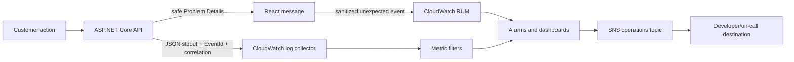

# Production Observability and Customer Error Runbook

## Purpose

This runbook explains how LIAnsureProtect turns a failed customer action into two deliberately
different experiences:

- the customer receives safe, calm, actionable guidance; and
- developers receive structured diagnostics that can be searched and alerted on.

The application now emits the required signals. The future Phase 2 Terraform milestones must
provision the CloudWatch log groups, metric filters, alarms, notification targets, and CloudWatch
RUM resources described here. Do not create those resources manually: unmanaged console changes
are difficult to review, reproduce, destroy, or recover after an incident.

> **Analogy:** a restaurant guest should hear “We could not complete that order; please try again
> and quote support ID ABC.” The kitchen still needs the full ticket number, station, timing, and
> failure category. Giving the guest the kitchen exception is confusing and unsafe; hiding the
> kitchen record from staff makes the failure impossible to diagnose.

## Public error contract

Expected API failures use RFC 7807 Problem Details plus stable extensions:

```json
{
  "title": "Quote cannot be created.",
  "status": 409,
  "detail": "Change at least one control answer before creating a reassessment.",
  "code": "quote.reassessment.no_changes",
  "correlationId": "824e9d3c8f1e4c1b91f61cdd3f0aaf35"
}
```

The frontend validates this response with Zod. Known codes map to specific customer guidance.
Expected 4xx details may be shown when they are part of the reviewed public API contract. Unknown
5xx details, exception messages, stack traces, response JSON, provider payloads, and database text
are never displayed. Unexpected failures use a generic retry message and append the correlation ID
as a support ID when one is available.

The API returns and exposes `X-Correlation-ID`. Support should ask for that ID, the approximate time,
the environment, and the action being attempted. Support should never ask a customer to paste access
tokens, document contents, or browser-storage values.

## Signal flow



Production/Aws processes use JSON console logs. The container platform owns collection from stdout;
application code does not call CloudWatch directly. This keeps the application portable and avoids
making a transient monitoring outage part of a customer request.

## Stable application signals

| Signal | Meaning | Handling |
|---|---|---|
| API log `EventId=4100` | completed request outcome with route template, status class, duration, and correlation ID | use for latency and 5xx rate metrics; never log bodies or concrete resource IDs |
| API log `EventId=5000` | unhandled server exception converted to safe Problem Details | error alarm and investigation |
| `liansureprotect.api.requests` | low-cardinality request count | split by method and status class, not user or URL ID |
| `liansureprotect.api.request.duration` | request duration histogram | latency dashboard and sustained-latency alarms |
| readiness probe | API dependencies are reachable | load-balancer routing and availability alarm |
| outbox diagnostics | pending, processed, failed/poison messages and batch duration | event-pipeline health |
| browser telemetry event | unexpected UI failure or sanitized failed API outcome | client regression signal; never a source of business audit truth |

Expected 4xx failures are not pages. A single validation error, conflict, authorization failure, or
rate-limit response is normal system behavior. Alert only when the rate changes materially and stays
abnormal. Unhandled 5xx failures, readiness loss, and poison outbox records deserve stronger treatment.

## Terraform acceptance contract

Phase 2 infrastructure must create, tag, encrypt, retain, and destroy the following resources.

### Log groups

Recommended names:

```text
/liansureprotect/{environment}/api
/liansureprotect/{environment}/worker
/liansureprotect/{environment}/browser-rum
```

- Encrypt with the environment observability KMS key.
- Use environment-specific retention: 14 days for short-lived development, 30–90 days for staging,
  and a reviewed compliance period for production.
- Deny public access and grant read access through least-privilege developer/operations roles.
- Do not put request/response bodies, tokens, document names/contents, attestation free text, email
  addresses, or authenticated user IDs into routine request logs.
- Keep CloudTrail for AWS control-plane audit; it does not replace application logs.

### Metric filters and alarms

Minimum filters/dashboards:

1. `EventId=5000` unhandled API exceptions.
2. `EventId=4100` with status class `5xx`.
3. API request count and duration/p95 when exported through OpenTelemetry/CloudWatch.
4. readiness failures by service and environment.
5. outbox poison/exhausted messages and a sustained pending backlog.
6. browser unexpected-error rate and affected-session rate.
7. sustained authentication, authorization, and rate-limit spikes as warning signals.

Suggested initial alarm policy (tune from real baselines):

| Alarm | Initial treatment |
|---|---|
| any poison outbox message | notify operations immediately; the message requires review or replay |
| readiness unhealthy for 2 consecutive periods | page because traffic may be unable to reach a healthy replica |
| API 5xx count >= 5 in 5 minutes or error rate >= 2% with meaningful volume | page; use both count and rate to avoid low-volume noise |
| API p95 above the agreed SLO for 3 periods | warning, then page if availability/customer actions degrade |
| browser unexpected-error rate above baseline for 10 minutes | warning linked to release/environment |
| 401/403/409/429 spike | warning and investigate; do not page on an isolated customer correction |

All alarms should publish to an environment-specific SNS operations topic. Production subscriptions
may connect to email, chat, or an incident-management service. Delivery configuration and escalation
ownership belong in Terraform and the operations roster, not source-code addresses.

## CloudWatch RUM privacy contract

Browser telemetry is disabled by default. Build-time configuration enables the adapter only when:

```text
VITE_CLOUDWATCH_RUM_ENABLED=true
```

The production page must also inject `window.AwsRum` using the official AWS CloudWatch RUM web client.
The application bridge does not bundle credentials or create AWS resources. If the flag is enabled but
the deployment bootstrap is absent, the application continues to function and does not fabricate a
telemetry success.

Terraform/deployment requirements:

- allowlist only the real production/staging web origins;
- use a least-privilege unauthenticated Cognito identity or the current AWS-recommended RUM auth path;
- allow only the actions needed to publish RUM events;
- begin with approximately 10% session sampling and tune based on cost and diagnostic value;
- disable session recording unless a separate privacy/security review explicitly approves it;
- do not collect cookies, tokens, form values, document metadata/content, email, names, or free text;
- send error category, safe route template, status class/code, release, environment, and correlation ID
  only when each field is already privacy-safe;
- keep source maps private in the release pipeline so developers can symbolicate errors without
  exposing source maps publicly;
- define retention, deletion, access, and cost budgets in Terraform and policy documentation.

Browser telemetry helps detect failures. It does not replace server logs, the transactional outbox,
domain audit history, or human underwriting records.

## Incident investigation by support ID

1. Confirm the environment and approximate timestamp/timezone.
2. Validate the support ID using the same correlation-ID character/length rules as the API.
3. Search the API log group for `CorrelationId=<support-id>`.
4. Follow any associated trace ID into downstream spans and Worker/outbox records.
5. Check the deployment version and browser-RUM trend near the timestamp.
6. Classify the event:
   - expected business correction: improve guidance if customers repeatedly misunderstand it;
   - dependency/transient failure: confirm retry/recovery and alert thresholds;
   - application defect: create an issue with sanitized evidence and a regression test;
   - security/privacy concern: use the security incident process and restrict access immediately.
7. Record the resolution without copying sensitive payloads into tickets or chat.

Example CloudWatch Logs Insights starting point (field names depend on the final collector mapping):

```text
fields @timestamp, EventId, LogLevel, Message, CorrelationId, TraceId, RequestMethod, RouteTemplate, StatusCode
| filter CorrelationId = "824e9d3c8f1e4c1b91f61cdd3f0aaf35"
| sort @timestamp asc
```

## Local verification

Local development intentionally keeps readable console logs and leaves browser RUM disabled.

```powershell
dotnet build LIAnsureProtect.slnx --no-restore
dotnet test LIAnsureProtect.slnx --no-build

Set-Location src/LIAnsureProtect.Web
pnpm exec tsc -b
pnpm exec eslint .
pnpm exec vitest run
pnpm exec vite build
```

Manual checks:

- create an unchanged reassessment and confirm the action is disabled in the browser;
- call the guarded endpoint directly and confirm a coded `409` with a correlation ID;
- simulate an unexpected API failure and confirm the page shows no raw JSON/exception text;
- confirm the same support ID is present in the response and structured server log;
- confirm `VITE_CLOUDWATCH_RUM_ENABLED` is false/absent locally and no telemetry credentials exist in
  source control.

## Deferred production work

This milestone does not create AWS resources, install a collector, choose a paid incident platform,
or make legal/privacy claims. Those actions belong to the Terraform, compute, deployment, security,
and compliance milestones. Their acceptance evidence must reference this runbook and prove the
resources, filters, alarms, privacy controls, retention, access, costs, and destroy path in a disposable
non-production environment before production promotion.
