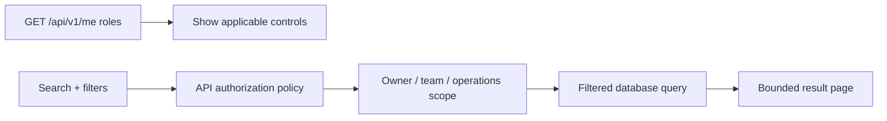

# Role-Aware Search, Navigation, and Form Safety Design

## Status

Approved for implementation on `feat/role-aware-search-and-navigation`. This branch starts from the
complete, verified customer-error and notification hardening commit chain. The final pull request will
therefore deliver both slices together.

## Problem

The app now has exact owner-scoped detail routes, but its growing collections are still difficult to
scan. A Customer can legitimately create many submissions for the same applicant and company; an
Underwriter can receive many referrals; a Claims Adjuster can own a large open queue; and every role's
notification history grows over time. Raw UUIDs and raw UTC timestamps make those collections harder
to use than they need to be.

The same manual walkthrough also exposed two form-safety gaps:

- leaving draft creation can discard meaningful typing without an explicit product action;
- leaving an evidence response can discard text and selected local files without explaining what is
  and is not already persisted.

The solution must improve usability without weakening authorization, audit retention, module
boundaries, or the custom transactional outbox.

## Product decisions

### 1. A submission has two identities

`Submission.Id` remains the UUID primary key used by database relationships, API routes, domain
events, ownership checks, and technical diagnostics. A new immutable `Submission.Reference` is a
globally unique, server-generated alternate identifier for people.

Example:

```text
Technical identity: 1a31da08-10bd-4a4d-b87c-8a5d96ba87a5
Display identity:   SUB-2026-1A31DA0810BD4A4D
```

Both values live on the same Submission row. The reference is not a foreign key and is not a secret.
Knowing a reference never bypasses owner or role authorization. The reference is never editable and
is not deliberately reused after Draft deletion.

Quotes do not receive a second display reference in this slice. A quote is presented as
`<Submission reference> / Quote version N`; its UUID remains available for exact operational lookup.
Policies and Claims already have human-facing policy and claim numbers.

### 2. Contextual search comes before global search

Search is added to collection/workbench pages whose complete result sets can grow:

| Surface | Authorized roles | Search scope | Applicable filters |
|---|---|---|---|
| Submissions | Customer, Broker, Admin | reference, exact UUID, applicant, email, company | status, created range |
| Evidence requests | Customer, Broker, Admin | request title/category, submission reference/UUID, request UUID, quote UUID, company | status, category, overdue, review decision, document requirement |
| Policies | Customer, Broker, Admin | policy number/UUID, submission reference/UUID, applicant, company | contractual status, coverage state |
| My claims | Customer, Broker, Admin | claim number/UUID, policy number/UUID | claim status, incident type |
| Underwriting referrals | Underwriter, Admin | submission reference/UUID, quote UUID, applicant, company | priority, risk tier, assignment, SLA, evidence state |
| Claims adjudication | ClaimsAdjuster, Admin | claim number/UUID, policy number/UUID, owner user id | status, incident type, assignment, open-information state |
| Notifications | every notification role | title, type, subject UUID, safe snapshot reference/company | unread/read, type; Personal/Team only for team-capable roles |

Create and detail pages do not receive unrelated search boxes. They receive semantic breadcrumbs and
clear resource identity instead.

A global header search is deliberately deferred. It would need a role-filtered, event-built search
projection or module-owned federated search ports. Direct cross-schema joins or a module reaching into
another module are prohibited.

### 3. Role-aware controls are not authorization

The SPA continues to use server-authoritative roles from `GET /api/v1/me` to decide which workspaces
and filters make sense. Customer/Broker see owner-workflow filters. Underwriter sees referral controls.
ClaimsAdjuster sees adjudication controls. Admin receives the controls appropriate to every route it
is authorized to enter.

The API still applies policies first, then owner/team/operational scoping inside the read side. Admin
does not silently gain cross-owner Customer-workflow access merely because it sees more workspaces.
Unauthorized exact identifiers remain indistinguishable from missing records.



### 4. Search behavior

- Search runs against the complete authorized server-side collection, never only the visible React
  page.
- Search values are trimmed and bounded. Exact GUIDs use indexed equality. Human text uses
  case-insensitive matching over the fields explicitly owned by that read model.
- Submission references are normalized uppercase and backed by a unique database index.
- Filters and cursor values live in URL query parameters so refresh, Back, and shareable links are
  predictable. Form drafts and selected files never go into the URL.
- Search is submitted explicitly through an accessible form; this avoids request-per-keystroke noise.
- Search terms may contain names or email addresses and therefore are never written to logs,
  telemetry dimensions, or metrics.
- Empty results explain the active filter instead of claiming the user has no records at all.

Submissions receive cursor pagination with a default of 20 and maximum of 50. Evidence keeps its
existing cursor pagination with 12 per page and maximum 50. Other current collections receive
server-side search/filtering while preserving their existing bounded/full response contracts; their
next pagination step is documented rather than mixing several incompatible cursor migrations into
this product-hardening PR.

### 5. Friendly time presentation

The API and database remain UTC. The frontend uses semantic `<time>` elements and the browser's locale
and timezone for customer display, while the exact UTC timestamp remains available in a title or
technical-details value. Labels say `Created`, `Filed`, `Due`, or `Occurred`, not `Created UTC`.

### 6. Breadcrumbs are semantic, not browsing history

A shared breadcrumb component derives hierarchy from the current resource route and data:

```text
Dashboard > Submissions > SUB-2026-1A31DA0810BD4A4D > Quote version 2
Dashboard > Evidence requests > SUB-2026-1A31DA0810BD4A4D > MFA evidence
Dashboard > Claims > CLM-2026-001
```

It uses `<nav aria-label="Breadcrumb">`, links every parent, and marks the final item with
`aria-current="page"`. It replaces scattered top-level `Back to ...` links. It does not remember an
unbounded route history or store navigation in local/session storage.

### 7. Safe cancellation of unsaved work

Draft creation gains **Cancel**. Evidence response gains **Cancel response**. A value is meaningful
when any text field contains non-whitespace text or any file is selected. This is safer than an
ASCII-letter check because legitimate values can contain digits, punctuation, non-Latin letters, or
partially typed email addresses.

Clean cancellation navigates immediately. Dirty cancellation uses the existing accessible
`ConfirmationDialog`. Confirming explicitly resets form values, mutation state, duplicate/idempotency
attempt state, selected `File` objects, and then navigates with `replace: true`. React unmounting is
the final cleanup; no draft form is persisted to browser storage.

Evidence cancellation discards only the unsent response and locally selected files. Previously
submitted documents and responses are retained as audit history and are never deleted by this UI
action.

### 8. Evidence response requirements

Respondent name, respondent title, and meaningful narrative remain required in UI and domain rules.
File requirements become explicit request data rather than an accidental UI assumption:

- `Required` — at least one new document must accompany the response;
- `Optional` — a meaningful narrative may be submitted without a document;
- `NarrativeOnly` — attachments are not requested for this response type.

Automatic material-control verification requests use `Required`. Underwriters choose the requirement
for manual requests. The API/domain is authoritative; the frontend mirrors the rule for immediate
feedback. Existing upload count, size, type, private storage, malware scan, and human underwriting
decision rules remain unchanged.

## Context and event boundaries

Submission reference is owned by Submission/Quoting persistence. Where another context needs display
identity, it receives a safe snapshot through an existing port/event seam:

- Policy reads join Submission only because both currently live in the same legacy context.
- Underwriting extends its owned `IUnderwritingQuoteContextReader` snapshot and persists submission
  reference/company on evidence requests when they are created.
- Notification events/outbox attributes carry the minimum display snapshot; Notifications never
  queries Submission, Quoting, Underwriting, Claims, or Policy tables during inbox reads.
- Claims continues to use its own Claim number and snapshotted Policy number. This slice does not add
  a cross-context Submission lookup to Claims.

## Acceptance scenarios

1. Empty draft Cancel returns to Dashboard immediately and Back does not restore that form instance.
2. Meaningful draft input opens a styled discard confirmation; Keep editing preserves input and
   Discard clears all local/mutation state before redirect.
3. Every created/backfilled Submission has a unique immutable reference; UUID routes and ownership
   behavior remain unchanged.
4. One hundred same-company submissions can be searched, filtered, and traversed in bounded pages.
5. Raw UTC is replaced by friendly local display without changing API/database UTC values.
6. Breadcrumbs expose valid parent routes on every list/detail/create journey and update from route
   data after navigation.
7. Customer/Broker never see Underwriter, ClaimsAdjuster, Team, or administrative-only filters.
8. Underwriter/Admin can search and filter the complete referral queue by operational attributes.
9. ClaimsAdjuster/Admin can search and filter the complete adjudication queue; claimants cannot enter
   it or call its API.
10. Search cannot reveal another owner's record and raw search text never appears in structured logs.
11. Evidence list remains 12-per-page and identifies submission reference/company/quote version.
12. Required-document evidence cannot be submitted without a new file; Optional can; both require a
   meaningful respondent and narrative.
13. Dirty evidence Cancel warns and discards only unsent values/files; persisted evidence remains.
14. Notification filters remain personal-only for Customer/Broker and Personal/Team-capable for
   operational roles, with role-appropriate search/type/read filters.

## Deliberate deferrals

- Global header search and an event-built cross-context search projection.
- User-created submission aliases or labels; the generated reference solves identity first.
- Separate human references for Quote and Evidence Request; submission reference + quote version +
  evidence title are sufficient in the current workflow.
- Pagination migrations for every operational list. Current server filtering remains complete;
  pagination follows when measured volume requires it.
- Fuzzy ranking, PostgreSQL trigram indexes, OpenSearch, and typo correction. Exact/prefix/contains
  matching in PostgreSQL is sufficient for current product volume.
