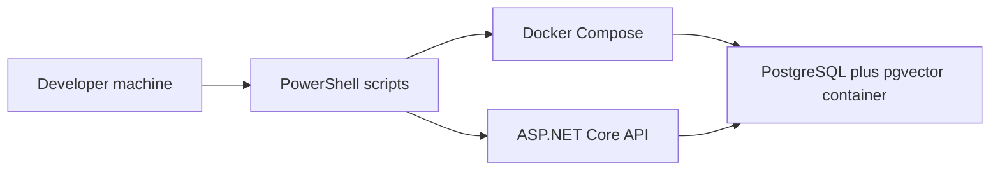
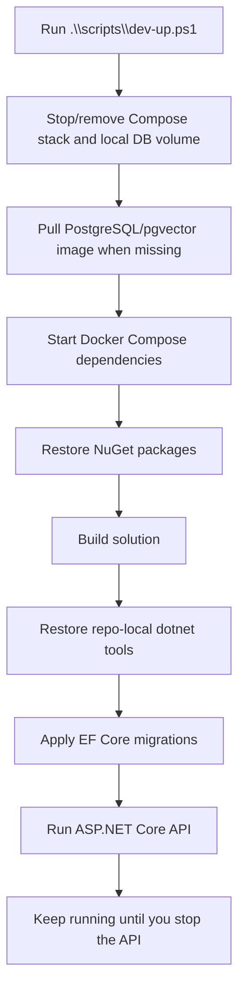
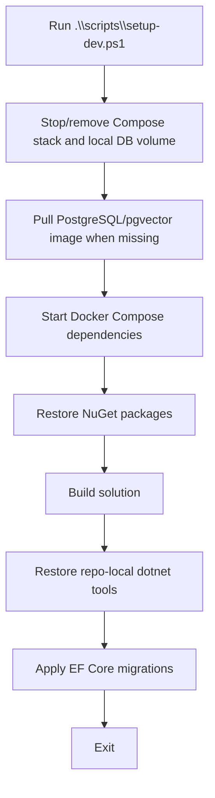
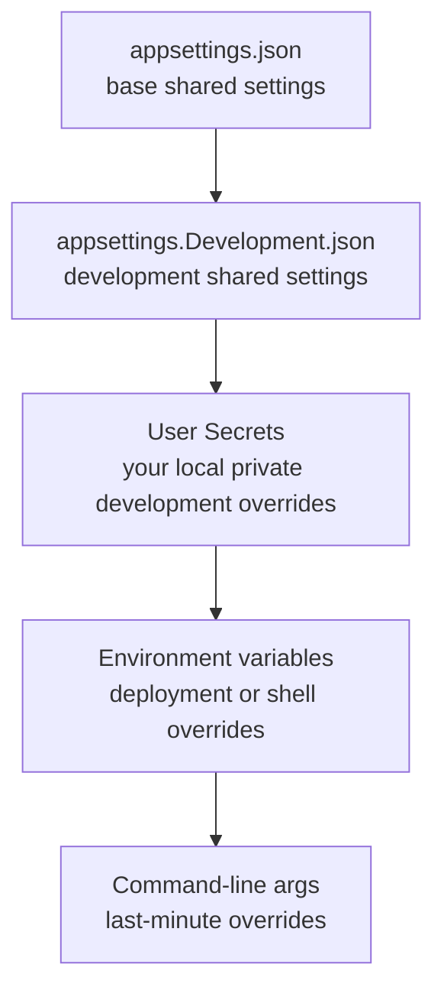
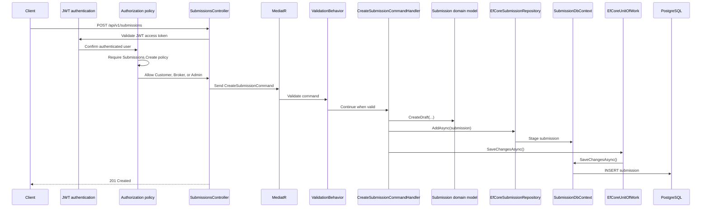
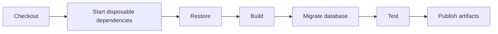
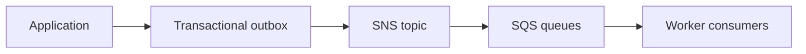

# Run The App

This guide explains how to run everything that exists in LIAnsureProtect up to `Milestone 6 - Authentication Foundation`.

At this point, the runnable app is:

- ASP.NET Core API
- PostgreSQL with pgvector through Docker Compose
- EF Core migrations for the submissions table
- JWT bearer authentication and policy-based authorization foundation
- Unit and integration tests

Not included yet:

- React frontend
- Real external identity provider tenant setup
- React login flow
- User registration and account management
- Redis cache
- AWS services
- Background Worker jobs
- AI/RAG features

Those are intentionally separate milestones.

## Current Runtime Shape

The API runs on the development machine for easy debugging. The application dependencies run through Docker Compose so developers do not manually install PostgreSQL, pgvector, Redis, or future service dependencies.

Today there is one Docker Compose service:

| Service | Container | Purpose |
| --- | --- | --- |
| PostgreSQL with pgvector | `liansureprotect-postgres` | Main relational database and future vector storage foundation |



Think of Docker Compose as the local power strip for dependencies. When the app needs a supporting service, such as a database or future cache, Compose turns it on in a predictable way.

## Prerequisites

Install these before running the app:

- Git
- Docker Desktop
- .NET SDK 10

Docker Desktop must be running before the scripts can start PostgreSQL.

The current backend runs directly with `dotnet run`. That is intentional for this milestone because it keeps debugging simple. Future milestones can add API and Worker containers when the project needs full app container orchestration.

## One Command To Run The API

From the repository root:

```powershell
.\scripts\dev-up.ps1
```

This is the main local run command. By default it creates a fresh local database by stopping and removing the involved Compose stack and removing the PostgreSQL Docker volume before startup.

It runs this sequence:



In plain English:

1. It stops and removes the involved Docker Compose containers.
2. It removes the local PostgreSQL Docker volume.
3. It pulls the PostgreSQL/pgvector image if the image is not already downloaded.
4. It starts PostgreSQL with pgvector.
5. It restores .NET packages.
6. It builds the solution.
7. It restores the repo-local `dotnet-ef` tool.
8. It applies committed EF Core migrations to PostgreSQL.
9. It starts the API.

The script blocks at the final step because the API process keeps running. Press `Ctrl+C` in that terminal to stop the API.

## One Command To Verify Everything

From the repository root:

```powershell
.\scripts\run-local-ci.ps1
```

This is the main one-time verification command. It runs the fresh setup path, applies migrations, runs all tests including the PostgreSQL-backed test, validates Docker Compose config, starts the API briefly, smoke-tests the root endpoint, health endpoint, and anonymous submission security gate, then stops the API.

By default, it also removes the PostgreSQL container and local database volume after verification. That makes the script behave like CI: run the checks, keep the results, and remove disposable test infrastructure.

During the run, it writes one timestamped result folder:

```text
TestResults/local-ci-yyyyMMdd-HHmmss/
```

It also creates a zip artifact by default:

```text
TestResults/local-ci-yyyyMMdd-HHmmss.zip
```

The result folder contains:

- `.trx` test result files
- `api-smoke-result.json`
- `api-smoke-stdout.log`
- `api-smoke-stderr.log`
- `verification-summary.json`

When the zip artifact is created successfully, the script removes the source result folder so the zip is the single artifact to keep or upload. If zip creation fails, the source result folder remains for inspection. If `-CreateZipArtifact:$false` is used, the source result folder remains.

Current `run-local-ci.ps1` flags:

| Flag | Default | Meaning |
| --- | --- | --- |
| `-RunSmokeTests` | `$true` | Starts the API briefly and checks root, health, and anonymous create-submission security behavior. |
| `-ApiStartupTimeoutSeconds` | `60` | How long to wait for the API to become healthy during smoke tests. |
| `-PostgreSqlAfterRun` | `Cleanup` | Use `Cleanup` to remove the PostgreSQL container and volume after verification, or `LeaveRunning` to keep it for local development. |
| `-CreateZipArtifact` | `$true` | Creates a zip file from the timestamped result folder. |
| `-ResultsRoot` | `TestResults` | Root folder where verification result folders and zip artifacts are written. |

Useful examples:

```powershell
.\scripts\run-local-ci.ps1 -RunSmokeTests:$false
```

That skips the temporary API startup and only verifies setup, migrations, tests, and Docker Compose config.

```powershell
.\scripts\run-local-ci.ps1 -PostgreSqlAfterRun LeaveRunning
```

That keeps PostgreSQL running after verification so you can continue local development.

```powershell
.\scripts\run-local-ci.ps1 -CreateZipArtifact:$false
```

That keeps the timestamped folder and skips zip creation.

## Setup Without Running The API

Use this command when you want to set up a fresh local database and build the repo but do not want tests or the API to run:

```powershell
.\scripts\setup-dev.ps1
```

It runs this sequence by default:



To include tests:

```powershell
.\scripts\setup-dev.ps1 -RunTests:$true
```

When tests run through this script, `.trx` test result files are written under `TestResults/`.

To run the API from the same setup script:

```powershell
.\scripts\setup-dev.ps1 -RunApi:$true
```

To preserve the existing local containers and database volume:

```powershell
.\scripts\setup-dev.ps1 -ResetContainers:$false -RemoveLocalDbVolume:$false
```

When `RemoveLocalDbVolume` is false, the setup script does not apply migrations automatically. If you preserve the database but still need to update schema after pulling migration changes, run:

```powershell
.\scripts\update-database.ps1
```

When `RemoveLocalDbVolume` is true, the setup script first checks that committed EF Core migration files exist under:

```text
src/LIAnsureProtect.Infrastructure/Persistence/Migrations
```

If the folder is missing or contains only the model snapshot, the script stops before touching Docker and prints the manual recovery steps. The scripts intentionally do not create migrations automatically because migration files should be reviewed and committed like normal source code.

Run `setup-dev.ps1`:

- After a fresh clone
- After pulling package changes
- After pulling Docker Compose changes
- After pulling migration changes
- Before committing or opening a pull request

## Step By Step Manual Flow

Use the individual scripts when debugging one part of setup.

### 1. Start Dependencies

```powershell
.\scripts\start-dependencies.ps1
```

This starts Docker Compose and waits for PostgreSQL to become healthy. It does not remove existing containers or volumes. Use `setup-dev.ps1` when you want the default fresh reset behavior.

Check the service:

```powershell
docker compose ps
```

Expected result: the `postgres` service is running and healthy.

### 2. Restore And Build

```powershell
dotnet restore LIAnsureProtect.slnx
dotnet build LIAnsureProtect.slnx --no-restore
```

Restore downloads NuGet packages. Build compiles the API, Application, Domain, Infrastructure, Worker, and test projects.

### 3. Apply Migrations

```powershell
.\scripts\update-database.ps1
```

This restores the repo-local `dotnet-ef` tool and applies the EF Core migration to PostgreSQL.

By default, this script suppresses EF Core database command logs during `dotnet ef database update`. That keeps fresh-database setup logs clean because EF Core can otherwise log a misleading failed query while checking for `__EFMigrationsHistory` before the table exists.

To see raw EF Core database command logs while debugging migrations:

```powershell
.\scripts\update-database.ps1 -SuppressEfCommandLogs:$false
```

The first migration:

- Enables the PostgreSQL `vector` extension
- Creates the `submissions` table

### 4. Run Tests

```powershell
dotnet test LIAnsureProtect.slnx --no-build
```

Current tests include:

- Domain behavior tests
- Application command handler tests
- Validation tests
- Dependency registration tests
- Submission endpoint tests
- Authentication and authorization integration tests for protected submission creation
- Migration SQL tests for pgvector and the submissions table
- Opt-in PostgreSQL persistence test for pgvector and real EF Core/Npgsql persistence

The PostgreSQL-backed test is skipped during a plain `dotnet test` run. Use this command when you want the real database test included:

```powershell
.\scripts\setup-dev.ps1 -RunTests:$true
```

Test result files are created when tests run through `setup-dev.ps1 -RunTests:$true` or `run-local-ci.ps1`:

```text
TestResults/*.trx
```

### 5. Run The API

```powershell
dotnet run --project src\LIAnsureProtect.Api\LIAnsureProtect.Api.csproj
```

The development launch profile exposes:

```text
http://localhost:5223
https://localhost:7167
```

Use the HTTP URL first if the local HTTPS development certificate is not trusted.

## Smoke Test The Running API

After `dev-up.ps1` starts the API, open a second terminal from the repository root.

Check the root status endpoint:

```powershell
Invoke-RestMethod http://localhost:5223/
```

Expected shape:

```json
{
  "application": "LIAnsureProtect.Api",
  "status": "Running"
}
```

Check health:

```powershell
Invoke-RestMethod http://localhost:5223/api/v1/health
```

Expected response:

```text
Healthy
```

Check that anonymous submission creation is blocked:

```powershell
$body = @{
    applicantName = "Jane Applicant"
    applicantEmail = "jane@example.com"
    companyName = "Example Company"
} | ConvertTo-Json

Invoke-RestMethod `
    -Method Post `
    -Uri http://localhost:5223/api/v1/submissions `
    -ContentType "application/json" `
    -Body $body
```

Expected response:

```text
401
```

`POST /api/v1/submissions` is now a protected business endpoint. Anonymous callers are stopped at the authentication gate before validation or business logic runs.

Authenticated submission creation requires a valid JWT access token with a role allowed by the `Submissions.Create` policy. The current allowed roles are:

```text
Customer
Broker
Admin
```

## Manual Auth0 Access-Token Smoke Testing

Milestone 7 - Identity Provider Integration uses manual Auth0 access-token smoke testing before adding frontend login or automation.

This means:

```text
manual:
  A developer gets and uses the token by hand.

Auth0 access-token:
  The token is issued by Auth0 for the LIAnsureProtect API audience.

smoke testing:
  A small check that proves the main security path works.
```

Do not paste client secrets, authorization codes, access tokens, or ID tokens into docs, commits, screenshots, or chat. If a client secret is exposed, rotate it in Auth0 before continuing.

### Auth0 Values

Use values from:

```text
Applications > Applications > LIAnsureProtect Dev Token Tester
```

Set these in PowerShell. Replace the placeholders locally:

```powershell
$domain = "YOUR_AUTH0_DOMAIN"
$clientId = "YOUR_CLIENT_ID"
$clientSecret = "YOUR_CLIENT_SECRET"
$redirectUri = "http://localhost:5223/callback"
$audience = "https://api.liansureprotect.local"
$scope = "openid profile email"
```

Example domain shape:

```text
dev-example.us.auth0.com
```

The API development configuration should use:

```json
"Authentication": {
  "Authority": "https://YOUR_AUTH0_DOMAIN/",
  "Audience": "https://api.liansureprotect.local",
  "RoleClaimType": "https://liansureprotect.local/roles"
}
```

Keep the committed file generic. For local development, store the real Auth0 tenant value in ASP.NET Core User Secrets:

```powershell
dotnet user-secrets set "Authentication:Authority" "https://YOUR_AUTH0_DOMAIN/" --project src/LIAnsureProtect.Api
```

Replace `YOUR_AUTH0_DOMAIN` with the tenant domain from Auth0, for example `dev-example.us.auth0.com`.

Do not literally save `https://YOUR_AUTH0_DOMAIN/` in User Secrets. That text is only a placeholder in committed files and documentation.

Correct local example:

```powershell
dotnet user-secrets set "Authentication:Authority" "https://dev-example.us.auth0.com/" --project src/LIAnsureProtect.Api
```

The audience and role-claim-type values are project constants, not private credentials. They can stay in committed development configuration. If you want to override all authentication values locally, User Secrets can store them too:

```powershell
dotnet user-secrets set "Authentication:Audience" "https://api.liansureprotect.local" --project src/LIAnsureProtect.Api
dotnet user-secrets set "Authentication:RoleClaimType" "https://liansureprotect.local/roles" --project src/LIAnsureProtect.Api
```

For this milestone, the recommended split is:

| Setting | Committed file | User Secrets | Why |
| --- | --- | --- | --- |
| `Authentication:Authority` | Placeholder | Real Auth0 tenant URL | Tenant-specific and should not be committed. |
| `Authentication:Audience` | `https://api.liansureprotect.local` | Optional | Project API identifier, not secret. |
| `Authentication:RoleClaimType` | `https://liansureprotect.local/roles` | Optional | Project role-claim location, not secret. |

In plain English: `appsettings.Development.json` is the shared recipe, and User Secrets is your private sticky note on your own machine. The app reads both, and the private sticky note wins for your local run.

Configuration loading works like a stack of transparent sheets:



If two sheets contain the same key, the later sheet covers the earlier one.

Example:

```text
appsettings.Development.json:
  Authentication:Authority = https://YOUR_AUTH0_DOMAIN/

User Secrets:
  Authentication:Authority = https://dev-example.us.auth0.com/

API sees:
  Authentication:Authority = https://dev-example.us.auth0.com/
```

The API project contains this non-secret identifier:

```xml
<UserSecretsId>1d8c758e-0a3b-48e5-809c-7760f05d86ba</UserSecretsId>
```

That value tells .NET which local User Secrets file belongs to this project. It is like a mailbox number, not the message inside the mailbox.

On Windows, the local file is stored under the current Windows user's profile:

```text
%APPDATA%\Microsoft\UserSecrets\1d8c758e-0a3b-48e5-809c-7760f05d86ba\secrets.json
```

For this machine, that usually means:

```text
C:\Users\Poy\AppData\Roaming\Microsoft\UserSecrets\1d8c758e-0a3b-48e5-809c-7760f05d86ba\secrets.json
```

User Secrets are local-only and outside the Git repository, but they are not encrypted. Use them for development convenience, not production secret storage.

Verify local User Secrets:

```powershell
dotnet user-secrets list --project src/LIAnsureProtect.Api
```

Expected shape:

```text
Authentication:Authority = https://your-real-auth0-domain/
```

If the value still says `https://YOUR_AUTH0_DOMAIN/`, run the `dotnet user-secrets set` command again with the real Auth0 domain.

### Get A Manual Authorization Code

Build the Auth0 login URL:

```powershell
$authorizeUrl = "https://$domain/authorize?response_type=code&client_id=$([System.Uri]::EscapeDataString($clientId))&redirect_uri=$([System.Uri]::EscapeDataString($redirectUri))&audience=$([System.Uri]::EscapeDataString($audience))&scope=$([System.Uri]::EscapeDataString($scope))"
$authorizeUrl
```

Open the printed URL in a browser and log in with the Auth0 test user.

After Auth0 redirects to a URL like this:

```text
http://localhost:5223/callback?code=...
```

copy only the `code` value from the browser address bar. A `404` page is acceptable because the local API does not implement a real callback endpoint for this manual workflow.

Authorization codes are short-lived and one-time use. Get a fresh code for each token exchange.

### Exchange The Code For Tokens

Set the fresh code locally:

```powershell
$code = "PASTE_FRESH_CODE_HERE"
```

Build the token request body:

```powershell
$tokenBody = @{ grant_type = "authorization_code"; client_id = $clientId; client_secret = $clientSecret; code = $code; redirect_uri = $redirectUri } | ConvertTo-Json
```

Exchange the code for tokens:

```powershell
$tokenResponse = Invoke-RestMethod -Method Post -Uri "https://$domain/oauth/token" -ContentType "application/json" -Body $tokenBody
```

Use the `access_token` for API calls:

```powershell
$accessToken = $tokenResponse.access_token
```

Do not use the `id_token` to call the API. The ID token describes the logged-in user for the client application. The access token is the badge for calling the API.

### Smoke-Test Matrix

Create a request body:

```powershell
$body = @{ applicantName = "Jane Applicant"; applicantEmail = "jane@example.com"; companyName = "Example Company" } | ConvertTo-Json
```

Authorized caller test:

```powershell
$apiResponse = Invoke-RestMethod -Method Post -Uri "http://localhost:5223/api/v1/submissions" -Headers @{ Authorization = "Bearer $accessToken" } -ContentType "application/json" -Body $body
$apiResponse
```

Expected for an Auth0 user with `Customer`, `Broker`, or `Admin`:

```text
201 Created with status Draft
```

Anonymous caller test:

```powershell
$anonymousStatusCode = $null
try { Invoke-RestMethod -Method Post -Uri "http://localhost:5223/api/v1/submissions" -ContentType "application/json" -Body $body } catch { $anonymousStatusCode = [int]$_.Exception.Response.StatusCode }
$anonymousStatusCode
```

Expected:

```text
401
```

Authenticated but unauthorized caller test:

1. In Auth0, temporarily remove `Customer` from the test user and assign `Underwriter`.
2. Get a fresh authorization code and access token.
3. Call the protected endpoint with the new token:

```powershell
$underwriterStatusCode = $null
try { Invoke-RestMethod -Method Post -Uri "http://localhost:5223/api/v1/submissions" -Headers @{ Authorization = "Bearer $accessToken" } -ContentType "application/json" -Body $body } catch { $underwriterStatusCode = [int]$_.Exception.Response.StatusCode }
$underwriterStatusCode
```

Expected:

```text
403
```

After the negative test, restore the test user to `Customer` so the happy-path smoke test remains easy to repeat.

## Request Workflow

This is what happens when an authenticated and authorized caller sends `POST /api/v1/submissions`:



The important security idea is that protected business endpoints stop unauthenticated or unauthorized callers before the Application use case runs. The important persistence idea is that the repository stages the change and Unit of Work commits it. This keeps the Application layer from depending directly on EF Core.

## Stop The App

Stop the API process with `Ctrl+C`.

Stop Docker Compose dependencies:

```powershell
.\scripts\stop-dependencies.ps1
```

This stops and removes the Compose containers. The named Docker volume keeps local database data unless you pass `-RemoveVolumes:$true`:

```powershell
.\scripts\stop-dependencies.ps1 -RemoveVolumes:$true
```

## Troubleshooting

### Docker Daemon Is Not Running

Symptom:

```text
failed to connect to the docker API at npipe:////./pipe/docker_engine
```

Fix:

1. Start Docker Desktop.
2. Wait until Docker reports that it is running.
3. Rerun `.\scripts\setup-dev.ps1` or `.\scripts\dev-up.ps1`.

### Docker Config Access Warning

Symptom:

```text
WARNING: Error loading config file: open C:\Users\Poy\.docker\config.json: Access is denied.
```

Meaning:

Docker can render Compose config, but the current process cannot read the user Docker config file.

Fix:

- Run from a normal user shell that has access to Docker Desktop.
- If the warning continues, check permissions on `C:\Users\Poy\.docker\config.json`.

### Raw EF Core Logs Show A Failed Migration History Query On A Fresh Database

Symptom when running raw `dotnet ef database update` or `update-database.ps1 -SuppressEfCommandLogs:$false`:

```text
Failed executing DbCommand ...
SELECT "MigrationId", "ProductVersion"
FROM "__EFMigrationsHistory"
```

Meaning:

On a fresh database, EF Core checks whether the migration history table exists before applying migrations. If the script continues and prints `Applying migration ...` followed by `Done.`, the setup succeeded.

Fix:

- No action is needed when the migration completes successfully.
- Use the default `update-database.ps1` behavior for normal local setup and CI logs. It suppresses this EF command-log noise while still failing on real migration errors through the `dotnet ef` exit code.
- Investigate only if the script stops with an exception after that message.

### Migration Files Are Missing

Symptom:

```text
EF Core migration files are missing.
Expected folder:
src\LIAnsureProtect.Infrastructure\Persistence\Migrations
```

Meaning:

The setup and local CI scripts apply committed EF Core migrations. They do not create new migration files. If migration files are gone, a fresh PostgreSQL database cannot be built from source.

Fix:

Restore the repo-local `dotnet-ef` tool first:

```powershell
dotnet tool restore
```

Then create the first migration:

```powershell
dotnet ef migrations add CreateSubmissionPersistence `
  --project src\LIAnsureProtect.Infrastructure\LIAnsureProtect.Infrastructure.csproj `
  --startup-project src\LIAnsureProtect.Api\LIAnsureProtect.Api.csproj `
  --context SubmissionDbContext `
  --output-dir Persistence\Migrations
```

The script prints these recovery commands as normal console output before throwing a short failure. Copy the command from that normal output, not from PowerShell's red exception-rendering block.

Then rerun:

```powershell
.\scripts\run-local-ci.ps1
```

### NuGet Restore Fails With NU1301

Symptom:

```text
NU1301: Unable to load the service index for source https://api.nuget.org/v3/index.json
```

Meaning:

The shell cannot reach NuGet. In a restricted sandbox this can happen even when the code is valid.

Fix:

1. Check internet access.
2. Check proxy or firewall rules.
3. Run `dotnet restore LIAnsureProtect.slnx` from a normal development terminal.
4. Rerun `.\scripts\setup-dev.ps1`.

### Port 5432 Is Already In Use

Symptom:

PostgreSQL container cannot bind to localhost port `5432`.

Fix options:

- Stop the process already using port `5432`.
- Or change the published port in `docker-compose.yml` and update the development connection string.

Keep the internal container port as `5432`; only the host-side published port should change.

## CI/CD Shape

Local setup and CI should follow the same order:



CI should use disposable containers and fail fast. CD should not run `dev-up.ps1` because that command starts a foreground API process. Deployment should build an artifact, apply reviewed migrations as a gated deployment step, deploy the app, then run smoke tests.

## Current Milestone Boundary

Do not add these to the local run path yet unless a future milestone approves them:

- Redis
- Kafka
- LocalStack
- React frontend
- External identity provider tenant setup
- React login flow
- User registration and account management
- Domain events or outbox
- Event sourcing

The expected future messaging direction is AWS-native:



Kafka is not part of the default plan. If a future requirement specifically needs Kafka compatibility or stream replay semantics, Amazon MSK can be considered then.
