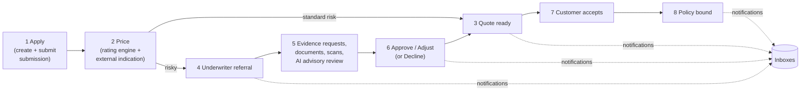

# Chapter 1 — The Big Picture

## What is LIAnsureProtect?

LIAnsureProtect is a **cyber specialty insurance platform**. It lets a business apply for cyber
insurance, get a price (a *quote*), have risky cases reviewed by a human underwriter (with
advisory AI help), provide supporting evidence, and finally *bind* the coverage into a policy —
with every important step audited and every stakeholder notified.

> **Analogy:** think of the whole product as a **specialty bank for risk**. A customer walks in
> and fills out an application (submission). A teller prices standard cases instantly (automated
> rating). Unusual cases go to a back-office specialist (underwriter) who may ask for documents
> (evidence requests), consult a research assistant who can advise but never sign (the AI
> review), and then approve, adjust, or decline. When the customer accepts the offer, the vault
> door closes and the contract is official (policy binding). Every hand-off drops a memo in an
> internal mail system (events + notifications) so nobody has to shout across the office.

Only the **Cyber** product line is implemented today, but the catalog is deliberately shaped so
Tech E&O, MPL, and Multimedia Liability can be added later without re-architecting.

## Who uses it? (the actors)

| Role | Who they are | What they do here |
|------|--------------|-------------------|
| **Customer** | The insured business | Creates and submits applications, responds to evidence requests, accepts quotes, reads notifications. |
| **Broker** | An intermediary acting for customers | Same self-service surface as customers (owner-scoped). |
| **Underwriter** | The risk specialist | Works the referral queue, requests/reviews evidence, uses the advisory AI, approves/declines/adjusts quotes. |
| **ClaimsAdjuster** | Claims handler | Reserved for the future Claims context. |
| **Admin** | Operations/administration | Sees operations surfaces (team inboxes, workbench). |

Roles live in **Auth0** (the identity provider) and arrive in every API call inside the access
token — the backend never stores passwords or role tables. See
[Chapter 5](05-flow-identity-and-login.md).

## The end-to-end business story (the "happy path")

The scenario below is the spine that Chapters 6–10 zoom into, flow by flow.

1. **Apply** — Maria (a broker) fills in the intake form; a `Submission` is created as a draft and
   then *submitted* ([Chapter 6](06-flow-submission-intake.md)).
2. **Price** — the rating engine picks a strategy for the risk profile, optionally enriched by a
   simulated external rating provider, and produces a `Quote`
   ([Chapter 7](07-flow-quoting-and-rating.md)).
3. **Quote ready** — clean risks are quoted instantly and Maria is notified.
4. **Referral** — risky profiles are *referred*: a referral operation appears in the underwriter
   workbench ([Chapter 8](08-flow-underwriting.md)).
5. **Evidence & AI** — the underwriter can request evidence (e.g. "prove MFA is enforced"),
   the customer responds with text and documents, documents are security-scanned (fail-closed),
   and the underwriter may generate an **advisory-only** AI review.
6. **Decision** — approve, adjust (new premium), or decline — always a human, never the AI.
7. **Accept** — the customer accepts the quote.
8. **Bind** — the policy is bound through a (simulated) binding provider and everyone is notified
   ([Chapter 9](09-flow-acceptance-and-binding.md)).

Everything dotted in the diagram — notifications, referral projections, audit trails — travels
through the **transactional outbox** and the background **Worker**
([Chapter 10](10-flow-notifications-and-background.md)), so a crash can delay a memo but never
lose one.

## What the product is NOT (deliberate limits)

- **AI never decides.** AI output is advisory text with an audit trail; approval/decline/bind are
  human actions enforced by module boundaries (the AI module cannot even reference the `Quote`).
- **Not microservices.** One deployable, many internal modules (see
  [Chapter 3](03-architecture.md)). Extraction into services is possible later, not default.
- **Not multi-product yet.** Cyber only; the catalog stays product-shaped for later lines.
- **No real insurer's content.** Inspired by specialty insurance workflows, but no copied
  branding, forms, wording, or rating logic.

## Where the project is heading

The approved multi-milestone program in
[`docs/dev/production-transformation-roadmap.md`](../dev/production-transformation-roadmap.md)
takes this local-first codebase to an AWS deployment (EKS, Aurora PostgreSQL, S3, SNS/SQS,
CloudFront + WAF) behind a config-only **Local ⇄ AWS switch** — the same container image runs in
both worlds. Milestones M32–M41 (the modular-monolith refactor plus observability) are complete;
M42 (documents to S3) is next.
