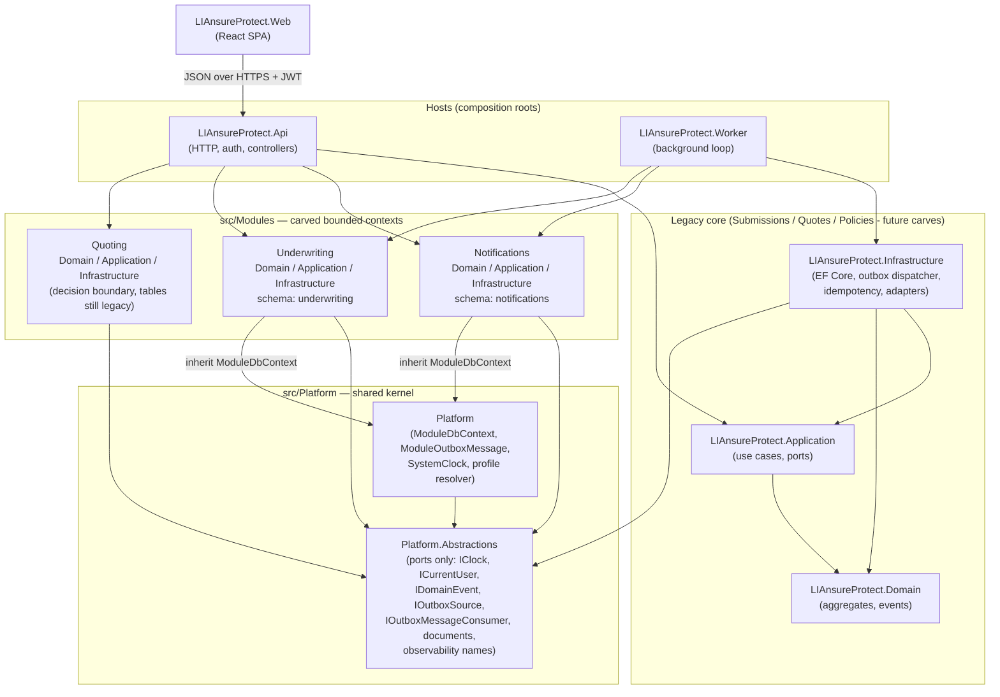
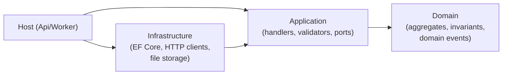

# Chapter 3 — Architecture

Three ideas define this codebase. They compose — none replaces the others:

1. **Modular monolith** — one deployable, many bounded-context modules.
2. **Clean Architecture** — strict layering *inside* each module and the legacy core.
3. **Ports & Adapters** — every infrastructure concern is an interface with swappable
   implementations, which powers the **Local ⇄ AWS deploy switch**.

> **Analogy:** the app is **one office building** (single deployable). Each floor is a
> department (bounded context) with its own locked filing room (database schema). Departments
> exchange **memos** (contracts and events) — they never rummage in each other's cabinets.
> Plumbing and power (storage, messaging, identity) are standardized **wall sockets** (ports) you
> plug either local or cloud equipment into (adapters).

## The solution map

The arrows are **enforced, not aspirational**: `ProjectReferenceBoundaryTests` (a unit test that
reads the `.csproj` files) fails the build if anyone adds a forbidden reference, and a
data-driven **module-boundary ratchet** auto-validates every new `src/Modules/*` project.

## Idea 1 — Modular monolith

**What:** many bounded contexts (Notifications, Underwriting, Quoting, and the legacy core that
still holds Submissions/Quotes/Policies) compiled into **one** API and **one** Worker.

**Why:** module boundaries give most of the "microservices" benefits (ownership, independent
reasoning, future extractability) with none of the distributed-systems tax (network partitions,
distributed transactions, versioned deploys) — the right trade-off at this scale.

**The three module rules:**

1. **Schema-per-module.** Each module's `DbContext` inherits `ModuleDbContext` and owns its own
   PostgreSQL schema and migration history table. No cross-schema foreign keys — other contexts
   are referenced **by id only**.
2. **Contracts only.** A module exposes its Application-layer contracts (commands, queries,
   reader/projector interfaces). Nobody touches another module's tables or internals.
3. **Events at the seams.** Cross-context side effects ride domain events through the
   transactional outbox (Chapter 10); synchronous calls are allowed only through explicit
   contract interfaces (e.g. legacy reads `IReferralOperationsReader` from Underwriting).

**Consistency consequence (accepted, documented):** projections across modules are **eventually
consistent** — e.g. a new referral appears in the workbench a few seconds after the quote is
referred. Mitigations: idempotent projectors, create-if-missing self-healing, and the dispatcher
merge-ordering events by `CreatedAtUtc` across outboxes so causality is preserved.

## Idea 2 — Clean Architecture (inside each module)

Dependencies always point **inward**: Infrastructure → Application → Domain. Domain knows
nothing about databases or HTTP; Application defines *ports* (interfaces) that Infrastructure
implements.

- **Domain** protects invariants with factory methods and private setters — e.g.
  `Submission.CreateDraft(...)` is the only door to create one, `Submission.Submit()` is the only
  door to change its status and it records `SubmissionSubmittedDomainEvent` as it does.
- **Application** hosts one folder per use case (command/query + handler + validator + result).
- **Infrastructure** implements the ports (`EfCoreSubmissionRepository`, `RatingProviderHttpClient`,
  `LocalDocumentStorageService`…), owns EF configurations and migrations.

## Idea 3 — Ports & Adapters and the Local ⇄ AWS switch

Every environment-specific concern hides behind a port in `Platform.Abstractions` or a module's
Application layer. At startup, `PlatformProfileResolver.Resolve(configuration)` reads
**`Platform:Profile`** (`Local` default, `Aws`) and each registration method wires the matching
adapter:

| Port | Local adapter (today) | AWS adapter |
|---|---|---|
| `IDocumentStorageService` | `LocalDocumentStorageService` (filesystem) | `S3DocumentStorageService` — **live (M42)**, S3 + SSE-KMS, tested via LocalStack; presigned URLs prepared for M47 |
| `INotificationPublisher` | `LocalNotificationPublisher` | `SnsNotificationPublisher` — **live (M43)**, publishes a versioned envelope to SNS → SQS + DLQ, tested via LocalStack |
| `IAiReviewService` | `LocalSimulatedAiReviewService` | Bedrock (Phase 3) |
| `IEvidenceDocumentScanner` | Local deterministic scanner | S3-triggered Lambda scan (M42) |
| `IRatingProviderClient` | Typed `HttpClient` + simulated handler | Same client, real endpoint |
| `ICacheService` | `InMemoryCacheService` (memory) | `RedisCacheService` — **live (M44)**, Redis/ElastiCache, tested via local Docker Redis |
| Identity | Auth0 (works in both) | Auth0 or Cognito (M48) |

The not-yet-implemented AWS branches **fail fast** with a clear exception until their milestone
lands — a misconfigured profile can never silently run with the wrong adapter. Two branches are
now fully wired: **document storage** selects `S3DocumentStorageService` (M42) and **notification
publishing** selects `SnsNotificationPublisher` (M43); each still fails fast at composition if its
bucket/topic is missing.

**Why this matters:** the same container image runs locally and in AWS; only configuration and
which Terraform you apply differ. Tests exercise business logic against local adapters with full
fidelity.

## The two hosts

- **`LIAnsureProtect.Api`** — HTTP edge: CORS, correlation middleware, JWT auth, authorization
  policies, controllers → MediatR. Composes every module (`AddPlatform`, `AddNotificationsModule`,
  `AddQuotingModule`, `AddUnderwritingModule`, `AddClaimsModule`, `AddApplication`,
  `AddInfrastructure`). The carved modules — Notifications (`notifications` schema), Underwriting
  (`underwriting`), Quoting, and **Claims (`claims`, the post-bind context — Chapter 12)** — each own
  their schema and a readiness check; `ClaimsOutboxSource` is the fourth outbox source.
- **`LIAnsureProtect.Worker`** — a `BackgroundService` loop that drains the outboxes through
  `IOutboxDispatcher` every 5 seconds and runs hourly idempotency-record cleanup. Same module
  composition, no HTTP. A transient failure inside an iteration is logged and retried on the next
  poll — it never kills the host.

## Quality attributes — how the architecture serves them

| Attribute | Mechanism |
|---|---|
| **Flexibility** | Ports & adapters + profile switch; modules replaceable/extractable; mapper registries let new event consumers plug in without editing the dispatcher. |
| **Resiliency** | Outbox retry with poison-message parking (max 3 attempts, 5-min delay); resilience-handler HTTP client (retry/circuit-breaker/timeout); worker loop survives transient exceptions; consumer exceptions are isolated per message. |
| **Idempotency** | `Idempotency-Key` on unsafe POSTs (stored request fingerprint + replayed response); idempotent projectors keyed on source outbox message id; at-least-once delivery is safe end-to-end. |
| **Consistency** | Single system of record; domain events captured in the same transaction as the business change (transactional outbox); cross-module eventual consistency with causal ordering. |
| **Performance** | No-tracking LINQ reads; indexed outbox dispatch/cleanup queries; frontend query caching; pooled HTTP handlers. |
| **High availability (path to)** | Liveness/readiness probes per DbContext; stateless API (scale-out ready); Worker designed for at-least-once so multiple instances stay safe; AWS phase adds Multi-AZ Aurora/EKS. |
| **Security** | Strict JWT validation, policy-per-action authorization, owner-scoping via `ICurrentUser`, fail-closed document scanning, CodeQL gate, sanitized log inputs, secrets out of Git. |
