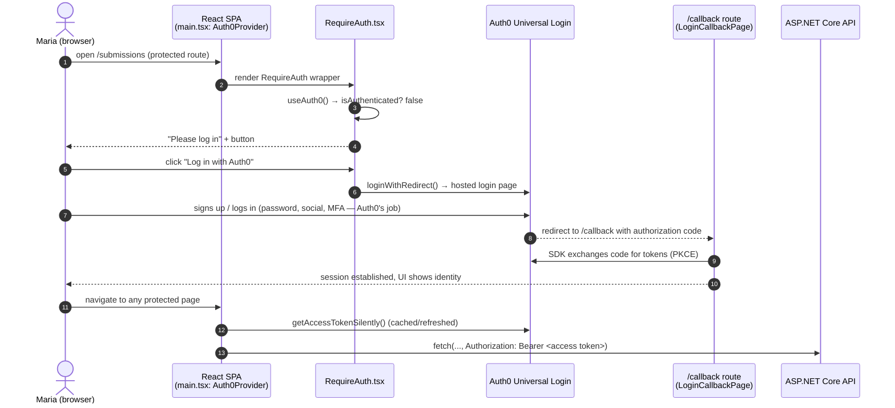
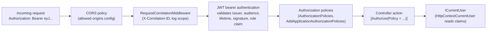

# Chapter 5 — Flow: Identity & Login

**Trigger:** a person opens the app and needs to prove who they are.
**Result:** every subsequent API call carries a verified identity + roles, and every use case can
ask "who is calling?" through one small port.

> **Analogy:** the app never checks passports itself. It partners with a **passport office**
> (Auth0). Visitors are sent to the office, come back with a tamper-proof passport (a signed JWT),
> and every desk in the building (API endpoint) has a UV lamp (token validation) plus a door
> policy ("underwriters only").

## Important honesty: there is no in-app registration form

Sign-up and login both happen on **Auth0's hosted Universal Login page**. The app never sees a
password. Roles (Customer, Broker, Underwriter, ClaimsAdjuster, Admin) are assigned in the Auth0
dashboard and delivered inside the access token's role claim. A future milestone (M48) may add
Cognito as a config-selectable alternative — the flow shape stays identical.

## Server-authoritative roles — the `GET /api/v1/me` endpoint

The **API is the single source of truth for roles**, not the token the browser holds. The SPA calls
**`GET /api/v1/me`** (`CurrentUserController`, `[Authorize]`), which returns the caller's identity +
roles read from the very same `ICurrentUser` the authorization policies use. The React `RequireRole`
guard reads roles from that endpoint (`useCurrentUser`, TanStack-Query-cached) — with explicit
loading / lookup-error / **no-roles-assigned** / wrong-role states — and the SPA **no longer parses
any token** for roles.

**Why this matters:** what the UI shows and what the API enforces can never drift, and the frontend
is **fully provider-neutral** — it doesn't care whether roles arrive via an Auth0 or (future M48)
Cognito token, because it never looks inside the token. The only tenant requirement is the roles
claim on the **access** token (present since M7) + roles assigned to users; the earlier "add roles to
the **ID** token" step is obsolete.

The same API-reported roles also drive the React dashboard and top navigation. Links and dashboard
cards are omitted when the signed-in role cannot use that workflow, and direct URL attempts are
checked by `RequireRole` before the protected page component mounts or starts its API query. This is
only a user-experience guard; the ASP.NET Core authorization policies remain the final security
boundary.

## The login flow, mirrored to the code

Code map:

- `src/LIAnsureProtect.Web/src/main.tsx` — wraps the app in `Auth0Provider` (domain, clientId,
  audience, callback URL from `lib/auth0Config.ts`).
- `src/LIAnsureProtect.Web/src/components/RequireAuth.tsx` — the route guard: loading state →
  login prompt → children.
- `src/LIAnsureProtect.Web/src/pages/LoginCallbackPage.tsx` — lands the redirect.
- Each feature's `api/*.ts` obtains the token and sends `Authorization: Bearer …`.

## What happens to that token on the API side

Configured in `src/LIAnsureProtect.Api/Program.cs`:

1. **Authentication** — `AddJwtBearer` trusts only the configured HTTPS `Authority` (issuer) and
   `Audience`; both are *required* at startup (the app refuses to boot without them). The role
   claim type is configurable (`Authentication:RoleClaimType`, default `roles`).
2. **Authorization** — every business endpoint carries `[Authorize(Policy = ...)]` with a policy
   from `ApplicationPolicies` (e.g. `Submissions.Create` for Customer/Broker/Admin,
   `Quotes.Underwrite` for Underwriter/Admin, `Notifications.Read` for
   Customer/Broker/Underwriter/Admin). Policies map roles → actions in **one** file:
   `src/LIAnsureProtect.Api/Security/AuthorizationPolicies.cs`.
3. **`ICurrentUser`** — the port (in `Platform.Abstractions.Security`) that Application handlers
   use to ask *who* is calling. `HttpContextCurrentUser` (Api) adapts the JWT claims. This is how
   **owner-scoping** works: `ListSubmissionsQueryHandler` filters by `ICurrentUser.UserId`, so
   Maria can never list someone else's submissions — even with a valid token.

## Scenario walk-through

> Maria (role: **Broker**) logs in and opens `/submissions`. `RequireAuth` sees a session, the
> submissions hook calls `GET /api/v1/submissions` with her token. The API validates the token,
> the `Submissions.Read` policy admits the Broker role, and the query handler filters
> `owner_user_id == maria's user id`. She sees exactly her book of business.
>
> A curious customer copies Maria's URL and replays it with **his** token: same endpoint, same
> policy — but owner-scoping returns *his* submissions, not hers. Authorization is enforced at
> both the door (policy) and the shelf (query filter).

## Testing this flow

Integration tests replace the Auth0 handler with a **test-only authentication handler** that
mints identities with chosen roles — so tests exercise the real policy pipeline
(anonymous → 401, wrong role → 403, owner-scoping) without a network call to Auth0.
