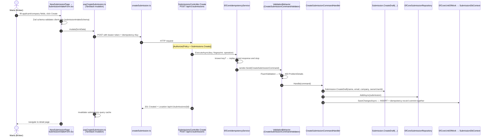
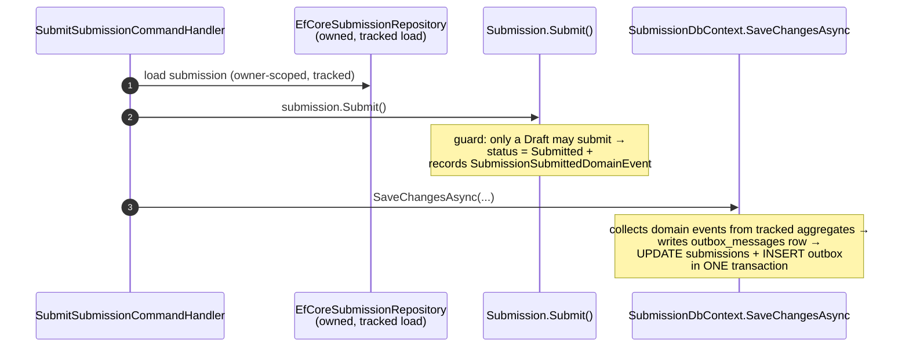

# Chapter 6 — Flow: Submission Intake

**Trigger:** a Customer/Broker fills the intake form (`/submissions/new`) — or later presses
**Submit** on a draft.
**Result:** a `submissions` row owned by the caller; on submit, a status change **plus** an
outbox event, committed together.

> **Analogy:** filling in a paper application (draft), then dropping it into the office mailbox
> (submit). The mailroom clerk (outbox + worker) guarantees the "new application!" memo reaches
> every department — even if the clerk was on a break when it was dropped.

## Part A — Creating a draft submission

Key points, mapped to code:

- **Two validation layers on purpose.** Zod (`schemas/submissionIntakeSchema.ts`) gives instant
  feedback; FluentValidation is the *authoritative* gate — the API never trusts the browser.
- **Ownership is stamped at birth.** The handler takes `ICurrentUser.UserId` as `OwnerUserId`;
  every later read is filtered by it (Chapter 5).
- **Idempotency** (`SubmissionsController.Create`, lines with `GetIdempotencyKey()`): with an
  `Idempotency-Key` header, the whole operation runs inside `EfCoreIdempotencyService.ExecuteAsync`
  — a SHA-256 **fingerprint** of method + route + body is stored, the response body/status/location
  are recorded, and an identical retry **replays** the stored response instead of creating a
  duplicate. Same key + *different* payload → `409 Conflict`.

## Part B — Reading (list & detail)

`GET /api/v1/submissions` → `ListSubmissionsQueryHandler`; `GET /api/v1/submissions/{id}` →
`GetSubmissionDetailQueryHandler`. Both are **no-tracking** EF Core projections filtered by
`ICurrentUser.UserId`, rendered by `SubmissionsPage.tsx` / `SubmissionDetailPage.tsx` via TanStack
Query hooks (`useSubmissions`, `useSubmissionDetail`).

## Part C — Submitting the draft (where events begin)

`POST /api/v1/submissions/{submissionId}/submit` (`SubmissionsController.Submit`, policy
`Submissions.Submit`, idempotent like create):

This is the **transactional outbox** in action (the pattern every later flow reuses):
`Submission.Submit()` records the event in memory; `SubmissionDbContext.SaveChangesAsync`
serializes it into `outbox_messages` inside the same transaction as the status change. What
happens to that row — the Worker, the dispatcher, notifications — is
[Chapter 10](10-flow-notifications-and-background.md).

**Failure honesty:** if the transaction fails, *both* the status change and the event vanish —
never one without the other. If the process crashes right after commit, the event is safely on
disk and dispatch happens after restart. Delayed, never lost.

## What can go wrong (and what the user sees)

| Situation | Where it's caught | Response |
|---|---|---|
| Invalid form data | Zod (browser), then `ValidationBehavior` | inline errors / `400` with field errors |
| Not logged in / wrong role | JWT middleware / policy | `401` / `403` |
| Submitting someone else's draft | owner-scoped load returns null | `404` (existence is not leaked) |
| Submitting a non-draft | `Submission.Submit()` guard throws `InvalidOperationException` | `409` ProblemDetails |
| Network retry / double click | idempotency replay | the original response, again |
