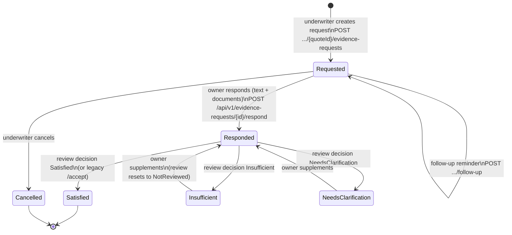
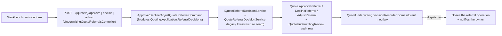

# Chapter 8 — Flow: Underwriting — Referrals, Evidence & AI

> **Current workbench/search contract (July 2026):** Underwriter/Admin referral search narrows the
> complete shared queue by quote/submission/owner identity, risk tier, priority, assignment, and
> evidence state. The one unfiltered 10-second cache entry remains authoritative; filter variants are
> not separately cached. Owner Evidence search is owner-scoped and supports request/quote/submission
> identity, human Submission reference, company, category, review decision, document requirement, and
> overdue state. Evidence requests explicitly declare `Required`, `Optional`, or `NarrativeOnly`, and
> the command handler—not the browser—enforces the document rule.

This is the richest area of the product and the heart of the **Underwriting module**
(`src/Modules/Underwriting`). It covers five sub-flows:

- A. How a referral reaches the workbench (event-driven projection)
- B. Working a referral (assign, triage, notes, tasks, timeline)
- C. Evidence requests — the request/respond/review loop
- D. Evidence documents — upload, security scan, gated download
- E. The advisory AI review
- F. The final decision (approve / decline / adjust)

> **Analogy:** the workbench is the **specialist's desk**. A conveyor belt (events) drops risky
> files onto it. The specialist can send questionnaires (evidence requests), receive sealed
> envelopes that must pass the mailroom X-ray before anyone opens them (document scanning),
> consult a well-read assistant who may advise but **whose pen has no ink** (AI review), and
> finally stamp the file — approve, adjust, or decline (Quoting module owns the stamp).

All underwriter endpoints live in `UnderwritingQuoteReferralsController`
(`/api/v1/underwriting/quote-referrals/...`, policy `Quotes.Underwrite` — Underwriter/Admin).
Owner-facing evidence endpoints live in `EvidenceRequestsController`
(`/api/v1/evidence-requests/...`, owner-scoped). The React workbench is
`features/underwriting/pages/UnderwritingQuoteReferralsPage.tsx`; the owner's evidence page is
`features/evidence/pages/EvidenceRequestsPage.tsx`.

## A. How a referral reaches the workbench

No code "calls underwriting" when a quote is referred — the module **reacts to the event**:

```mermaid
flowchart LR
    QG["QuoteGeneratedDomainEvent\n(status: Referred)\nin legacy outbox"] --> W["Worker → OutboxDispatcher"]
    W --> C["ReferralOperationOutboxMessageConsumer"]
    C --> M["QuoteGeneratedReferralOperationMapper\n(mapper registry)"]
    M --> P["ReferralOperationProjector\n(idempotent on outbox message id)"]
    P --> RO[("underwriting.quote_referral_operations\n+ timeline entry")]
    RO --> Q["ListQuoteReferralsQueryHandler\n(via IReferralOperationsReader)"]
    Q --> UI["Workbench queue UI"]
```



- The projection is **idempotent** (a dedupe table keyed on the source outbox message id) and
  **self-healing**: if an underwriter acts on a referral *before* the projection lands, module
  write-commands create the operation on the fly through `IUnderwritingQuoteContextReader`
  (create-if-missing), so nothing 404s during the eventual-consistency window.

## B. Working a referral (operations)

Synchronous MediatR commands inside the Underwriting module (`Referrals/Commands/ManageReferralOperations`):

| Action | Endpoint (under `/api/v1/underwriting/quote-referrals/{quoteId}`) | Effect |
|---|---|---|
| Assign to me / release | `POST /operations/assign-to-me`, `/operations/release-assignment` | sets/clears the assigned underwriter. **Assignment is a claim (M44.5):** a second underwriter is rejected in the domain, and an optimistic-concurrency `Version` token catches true races at save time — the loser gets **409** and the UI refetches to show the real assignee. Same-user re-clicks are idempotent; release is the explicit hand-over. |
| Triage | `POST /operations/triage` | priority + status |
| Work note | `POST /operations/notes` | append `quote_referral_work_notes` |
| Follow-up task | `POST /operations/tasks`, `/operations/tasks/{taskId}/complete` | tracked to-dos with due dates |
| Timeline | `GET /operations/timeline` | operational entries **merged with** the legacy decision audit |

Every action writes a **timeline entry** — the append-only story of the referral. Decision and
evidence events also project into this timeline (via the consumer in section A), so the timeline
is the single narrative an auditor reads.

## C. Evidence requests — the request/respond/review loop



- Aggregates: `QuoteEvidenceRequest` + append-only `QuoteEvidenceRequestReview` audit rows
  (with document-count snapshots) in the `underwriting` schema.
- Each lifecycle step raises one of the **six evidence domain events** into the **module
  outbox** (`underwriting.outbox_messages` — written transactionally by
  `UnderwritingDbContext`'s `ModuleDbContext` base). The dispatcher merge-orders them with
  legacy events by `CreatedAtUtc`, so notifications and timeline projections happen in causal
  order.
- The owner sees due/overdue indicators and remediation guidance on their evidence page; every
  unfavorable review (`Insufficient`/`NeedsClarification`) raises
  `QuoteEvidenceRequestRemediationRequiredDomainEvent` → an action-required notification.
- A response is an append-only fact, not an editable field. The first response creates an `Initial`
  `QuoteEvidenceResponse`; later meaningful submissions before review create `FollowUp` rows; a
  response after an unfavorable decision creates a `Remediation` row and resets the current review
  to `NotReviewed` while preserving the old review row. Name, title, and valid email identify the
  respondent; phone and `Other concerns` are optional supporting channels. Underwriters see the exact
  response/document history through a by-id module query rather than reconstructing it from a queue.
- Evidence workflow state and Quote lifecycle are deliberately separate. When Quote N+1 supersedes N,
  every request projected for N becomes `Historical`: its original response/review/document history
  remains readable, but domain guards reject new responses, files, reminders, acknowledgements, and
  review decisions. Current owner and Underwriter queues default to current-version requests; an
  explicit history filter exposes superseded evidence without presenting it as unfinished work.

### Reassessment approval queue

Underwriters also see durable `PendingReview` reassessment requests in the workbench. The row contains
the normalized owner assertion snapshot and base Quote version, but no provider result and no projected
Evidence because no new Quote exists yet. Approval revalidates that base version and creates the
successor Quote transactionally; decline records actor, time, and reason while leaving the current
Quote untouched. This review is a cost/governance gate, not a hidden rewrite of Quote history.

## D. Evidence documents — upload, scan, gated download

```mermaid
sequenceDiagram
    autonumber
    actor Owner
    participant Ctrl as EvidenceRequestsController.RespondWithDocuments<br/>POST /respond (multipart/form-data)
    participant H as RespondToQuoteEvidenceRequestCommand handler<br/>(Underwriting module Application)
    participant Store as IDocumentStorageService<br/>(Local filesystem or S3+SSE-KMS by profile)
    participant Scan as IEvidenceDocumentScanner<br/>(local deterministic scanner)
    participant Db as underwriting.quote_evidence_documents

    Owner->>Ctrl: response text + files
    Note over Ctrl: same route as JSON respond —<br/>[Consumes] picks the action by content type
    Ctrl->>H: command with EvidenceDocumentUpload streams
    H->>H: file governance (type/size checks)
    H->>Store: store private bytes (storage key, never exposed)
    H->>Scan: scan(document)
    Scan-->>H: Clean / Rejected / Failed
    H->>Db: metadata + scan status persisted
    Note over Db: download & accept gates are FAIL-CLOSED:<br/>only Clean documents can be downloaded or<br/>satisfy an evidence review; Rejected/Failed →<br/>owner uploads a replacement
```

Downloads (`.../documents/{documentId}/download` on both controllers) stream through the API with
ownership/role checks — file bytes are private; storage keys never leak to the browser. As of
**M42**, the adapter behind `IDocumentStorageService` is either the local filesystem
(`Platform:Profile=Local`) or **S3 with SSE-KMS** (`Platform:Profile=Aws`,
`S3DocumentStorageService`) — **this flow diagram stays valid** because only the adapter changes,
not the handlers. Browser-direct presigned "Valet Key" downloads are prepared for M47 (they need
CloudFront); until then, API streaming is the default for both adapters.

Automatically projected positive control assertions are material rating claims, so their Evidence
requests are `Required` and cannot be completed without at least one file. Manual Underwriting
requests still choose `Required`, `Optional`, or `NarrativeOnly`: an explanation may genuinely be the
right evidence for one question, while a policy, screenshot, report, or configuration export is the
right evidence for another. Contact data supports human verification but does not itself prove a
control. Automated scanning checks file safety and plausibility only; the human underwriter records
the insurance decision.

## E. The advisory AI review

`POST .../{quoteId}/ai-review` → `GenerateAiUnderwritingReviewCommand` (module Application) →
`IAiReviewService` (locally `LocalSimulatedAiReviewService`) → `underwriting.ai_underwriting_reviews`
with prompt/schema/input hashes for auditability. Output: structured advisory findings shown in a
workbench panel.

**The guardrail is structural, not a code review promise:** the Underwriting module has **no
project reference** to the legacy `Quote` aggregate — the AI code *cannot compile* a call that
mutates quote state. It reads quote context through the `IUnderwritingQuoteContextReader` port
only. Guardrail tests assert AI can never change decisions.

## F. The final decision (owned by the Quoting module)

Approve / decline / adjust route through **Quoting** (M39's decision boundary):



The decision is **always a human underwriter**. The event closes the workbench operation and
notifies the customer — again purely through the outbox, no direct cross-module calls.

## Scenario walk-through

> Ben (Underwriter) opens the workbench: the hospital-group referral from Chapter 7 is in the
> queue (projected from `QuoteGenerated`). He assigns it to himself, triages it high-priority,
> and requests evidence: "Confirm MFA for all privileged accounts". The customer responds with a
> PDF; the scan comes back **Clean**, so Ben can download it. Unsatisfied, he records
> `NeedsClarification` with guidance — the customer gets an action-required notification and
> supplements. Ben runs the AI review (advisory bullets note the backup posture), then records
> **Adjust** with a higher premium. The decision event closes his operation, writes the audit
> row, and the customer is notified — every step visible in the timeline.
