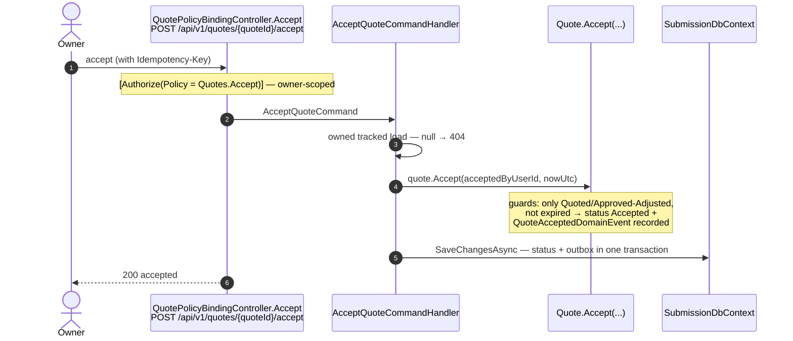
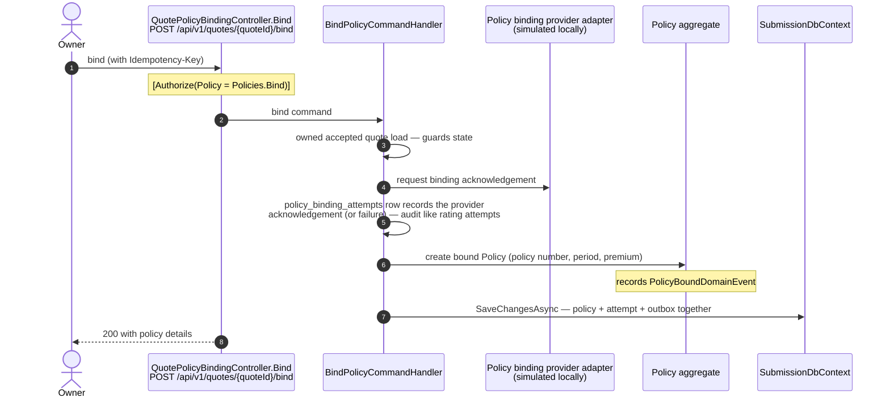

# Chapter 9 — Flow: Quote Acceptance & Policy Binding

**Trigger:** the owner accepts a quote, then binds it —
`POST /api/v1/quotes/{quoteId}/accept` and `POST /api/v1/quotes/{quoteId}/bind`
(`QuotePolicyBindingController`, both idempotent via `Idempotency-Key`).
**Result:** an accepted quote, then a `policies` row bound through a (simulated) binding
provider, with `QuoteAcceptedDomainEvent` and `PolicyBoundDomainEvent` fanning out notifications.

> **Analogy:** accepting is **signing the offer letter**; binding is the **notary stamping it**.
> Two distinct steps on purpose: acceptance is the customer's promise, binding makes coverage
> legally real (and involves the market counterparty — the binding provider).

## Step 1 — Accept

The event notifies the **binding-operations team inbox** ("a quote is ready to bind") — the
notification consumer maps `QuoteAcceptedDomainEvent` to the `binding-operations` audience
(Chapter 10 shows how team inboxes work).

## Step 2 — Bind

Same reliability recipe as quoting: the provider interaction is **audited per attempt**
(`policy_binding_attempts`), the domain event commits with the row, and notifications ride the
outbox — the owner gets "your policy is bound", the operations team sees it in their inbox.

The Customer/Broker submission detail page now drives this complete sequence: generate an eligible
quote, acknowledge subjectivities and accept it, then bind it. The latest Quote is returned with the
Submission detail so refreshes do not expose Generate again. The create-quote handler also returns
the existing owned Quote when one is already present, preventing duplicate QuoteGenerated events and
duplicate "Your quote is ready" notifications under retries or repeated clicks.

The records keep independent meanings:

- Submission status records the application (`Submitted` remains historically correct).
- Quote status records the offer (`Quoted`, `Accepted`, then `Bound`).
- Policy status/coverage dates record the contract.

The current notification action still opens the source Submission for both quote and policy events.
The approved policy-journey slice adds owner-scoped `/policies` pages and changes policy events to
**View policy** while showing all three lifecycle states on Submission detail.

## What can go wrong

| Situation | Guard | Response |
|---|---|---|
| Accepting an expired/withdrawn quote | `Quote.Accept` state guard | `409` ProblemDetails |
| Binding before acceptance | handler state guard | `409` |
| Double-click on accept/bind | idempotency replay | original response again |
| Binding provider failure | attempt recorded with failure category | error surfaced; retry is safe (idempotent) |
| Someone else's quote | owner-scoped load | `404` |
