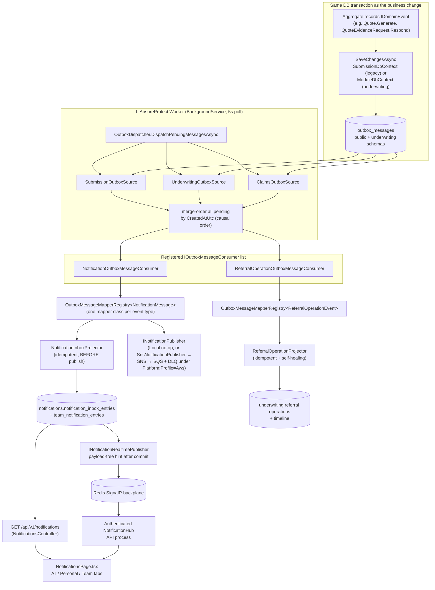

# Chapter 10 — Flow: Notifications & Background Processing

> **Current inbox/search contract (July 2026):** notification free-text search runs only over the
> caller's personal recipient scope and role-derived team audiences, then applies the 50-item display
> cap. Read-state filtering is available to every inbox role. Customer/Broker personal-only pages have
> no scope tabs; Underwriter, ClaimsAdjuster, and Admin retain All/Personal/Team. Unread count remains
> the total authorized unread count even when the displayed list is filtered. Exact subject IDs and
> safe snapshots keep Evidence, Quote, Submission, and Policy actions specific.

This chapter is the **event spine** every other flow plugs into: how a domain event recorded in a
transaction becomes a notification in someone's inbox (or a projection in another module) —
reliably, idempotently, and in order.

> **Analogy:** a hotel **pneumatic-tube mailroom**. Departments drop sealed memos into their own
> outbox tube *in the same motion* as filing the paperwork (transactional outbox). A mailroom
> clerk (the Worker) empties all tubes every few seconds, sorts memos by time stamp across tubes,
> and hands each to every specialist desk that recognizes it (consumers). Desks keep a "already
> handled" ledger (idempotency), and a memo that keeps failing is parked in a red tray with a
> note (poison message) instead of jamming the tubes.

## The full pipeline

## The guarantees, one by one

| Guarantee | Mechanism (code) |
|---|---|
| **Never lose an event** | The outbox row commits in the same transaction as the business change (`SubmissionDbContext.SaveChangesAsync` / `ModuleDbContext.CaptureDomainEventsAsync`). Crash after commit → the row waits for the next poll. |
| **Causal ordering across modules** | `OutboxDispatcher` merge-orders pending messages from *all* sources by `CreatedAtUtc` — an evidence event from the module outbox is processed before a later legacy decision event. |
| **At-least-once, safely** | Consumers/projections are idempotent on the source outbox message id (`NotificationInboxProjector` existence check; referral dedupe table). Re-delivery repeats no side effects. |
| **Retry with backoff** | A transient failure calls `OutboxMessage.MarkPublishFailed` — attempt count + `NextAttemptAtUtc` (+5 min). Sources only return rows whose next attempt is due. |
| **Poison messages don't jam the queue** | After 3 attempts (or a permanent failure) the row parks with `FailedAtUtc` + the error text, and dispatch moves on. |
| **A crashing consumer can't kill the batch** | The dispatcher converts consumer exceptions into transient failures on that message only; each source's `SaveChangesAsync` is isolated; the Worker loop catches and retries transient iteration failures instead of stopping the host. |
| **Project before publish** | The inbox entry is written *before* the publisher runs, so "the API shows it" never depends on the SNS publish succeeding. |
| **Realtime never replaces durability** | After projection commits, the Worker sends only `NotificationsChanged` through the Redis SignalR backplane. Failure is logged and ignored for outbox success; the browser always re-reads PostgreSQL-backed HTTP queries. |
| **Publish goes to a real bus (M43)** | Under `Platform:Profile=Aws`, `SnsNotificationPublisher` publishes a versioned JSON envelope to an SNS topic (with `type`/`audience` message attributes for subscription filters); the topic fans out to an SQS queue with a DLQ. The SNS message id is recorded on the outbox row's `ProviderMessageId`, and a transient SNS error reuses the existing retry/poison path. In-process projection is unchanged — only the outbound publish is networked. Locally, `LocalNotificationPublisher` is a no-op. |
| **Open for extension** | New side effects = a new mapper class + registration (`OutboxMessageMapperRegistry<TOutput>`), or a whole new `IOutboxMessageConsumer` — the dispatcher is never edited (M40). |

## Personal inbox vs team inbox

`NotificationInboxProjector.ProjectAsync` branches by audience:

- **`customer-or-broker`** → one `NotificationInboxEntry` **per recipient** (`OwnerUserId`).
- **`underwriting-operations` / `binding-operations` / `claims-operations`** → **one shared**
  `TeamNotificationEntry`, with per-user `TeamNotificationReadReceipt` rows created lazily on
  mark-read — so "Ben read it" doesn't mark it read for the whole team. (`claims-operations` was
  added in the Claims context — Chapter 12 — for filings and claimant responses; membership is
  role-additive via `NotificationTeamAudiences`, ClaimsAdjuster → claims-operations.)

The Claims context also registered **seven claim message types** (filed / assigned / information-
requested / information-response / accepted / denied / closed) through the same **M40 mapper
registry**, with **zero dispatcher changes** — the plug-in event spine paying off again.

Reading (`ListMyNotificationsQueryHandler`) merges personal + team entries for the caller's role
audiences with a combined unread count; `MarkNotificationReadCommandHandler` tries personal, then
team (gated by the caller's audiences — a customer can never mark a team entry).

Frontend: `features/notifications` — `useNotifications` loads the inbox on demand, while a separate
small query refreshes unread count; mark-read updates both caches. The page reads the existing
server-authoritative `/api/v1/me` capability result. Customer/Broker
personal-only users see one inbox with **no tabs at all**. Underwriter, ClaimsAdjuster, and Admin keep
**All / Personal / Team** tabs and the Team badge. These controls remain visible even when the selected
scope is empty, loading, or failed; scope-specific empty states appear below them. If capability changes
during a session, an invalid/stale filter resets safely.

Notification actions are subject-aware: Policy → **View policy** at `/policies/{policyId}`;
Quote → exact immutable Quote; Submission → **Open submission**; Evidence request → **Open evidence
request** for an owner, while an Underwriting team Evidence update deep-links to the exact request in
the authorized workbench; personal Claim → owner Claim detail; team Claim → the exact selected Claim in the
adjudication workbench. Subject type is
the primary decision, with scope/audience, `/me` capabilities, and safe attributes supplying related
ids. A caller without a usable capability receives a readable update without a broken action. API audience filtering remains the
security boundary; hiding tabs is role-correct UX, not authorization.

The header does not poll. `GET /api/v1/notifications/unread-count` applies the same personal/team
authorization rules and returns one number. React Query loads it with the signed-in shell. The Worker
then sends a payload-free SignalR invalidation only after its durable projection commits; the browser
invalidates the inbox/count queries on hint and reconnect. Focus/navigation refresh remains a safety
net. The hub is protected by `Notifications.Read`, groups are derived from the authenticated owner and
roles, and query-string bearer-token handling is accepted only on `/hubs/notifications`. No title,
identifier, owner, or insurance data travels in the hub event.

Safe `companyName` and `submissionReference` snapshots are captured by the originating event and
stored with the inbox entry. The UI groups a busy owner's notifications by that stable human context,
so four Evidence requests and one Quote-ready message from Submission A are visually separate from
the same five messages for Submission B. No notification read performs a cross-module join.

Notification read state and Quote lifecycle are independent. When a newer Quote notification is
projected, lower-version Quote/Evidence entries become `Historical`; their original `ReadAtUtc` value is
not forged or changed. Historical rows are muted and labelled in the inbox, remain available through
their exact immutable history links, and are excluded from active unread badges and operational counts.
Their actions open read-only Quote or Evidence history rather than allowing obsolete work. The same
rule applies to team inboxes, so Underwriters retain audit context without old versions competing in
the current queue.

Read acknowledgement belongs to the subject, not the Notifications page. After an authorized exact
Evidence, Quote, Policy, Claim, or Submission detail read succeeds, the UI posts the normalized subject
and scope to Notifications and refreshes the inbox/count caches. A recipient/subject
`ViewedThroughUtc` watermark prevents an older delayed projection from resurrecting unread state while
leaving genuinely newer updates unread. Evidence responses also acknowledge the owner's exact request
through an outbox/projector safety net for non-browser clients. Failed/unauthorized/not-found detail
reads acknowledge nothing. The command is idempotent, personal/team audiences remain separate, and
standalone **Mark as read** controls stay removed.

## The Worker's second job: idempotency cleanup

Once an hour, the same loop calls `IIdempotencyRecordCleanup.DeleteExpiredCompletedRecordsAsync`,
deleting **completed** idempotency records older than 7 days (index-backed query). Started
records are never deleted — an in-flight operation can't lose its lock.

## End-to-end trace of one memo

> `Quote.Generate` (Referred) commits with its event at 09:00:00.
> At 09:00:03 the Worker polls: `SubmissionOutboxSource` returns the row.
> `ReferralOperationOutboxMessageConsumer` maps it → projector creates the workbench operation.
> `NotificationOutboxMessageConsumer` maps it → inbox entry for Maria, then the local publisher
> "sends" it and returns a provider message id.
> The dispatcher calls `MarkPublishSucceeded`, saves the source — done, exactly once *in effect*.
> Had the inbox write succeeded but the publish failed, the retry 5 minutes later would skip the
> (idempotent) projection and only re-publish.
