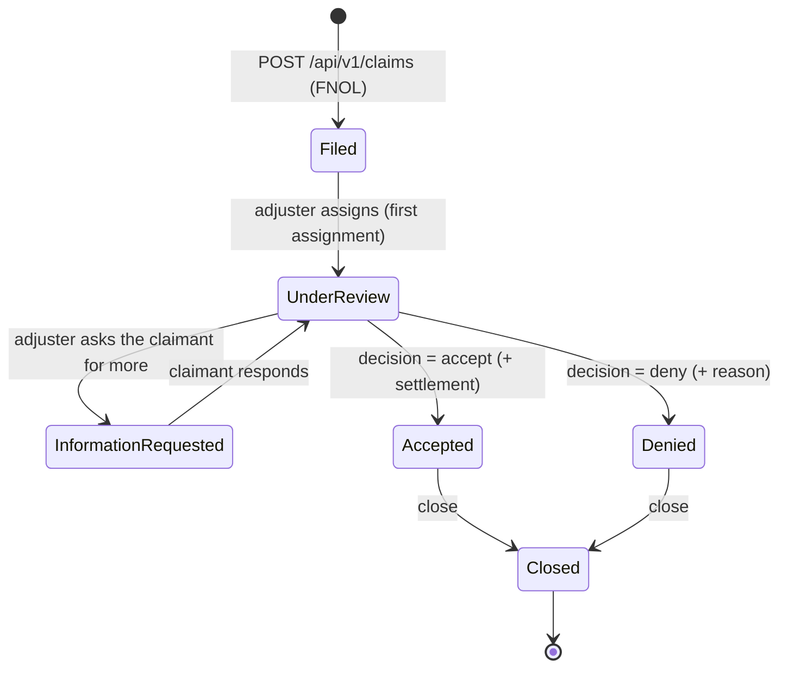

# Chapter 12 — Flow: Claims (FNOL → Adjudication → Settlement)

**Question this chapter answers:** after a policy is bound, what happens when something actually
goes wrong — the insured suffers a cyber incident and files a claim? Who handles it, how is money
reserved and paid, and where does every step live in the code?

> **Analogy:** binding a policy (Chapter 9) is buying a fire extinguisher. **Claims** is what
> happens when there's a fire: you call it in (FNOL — First Notice Of Loss), an **adjuster** is
> assigned, they ask for proof, set aside money to cover it (a **reserve**), and finally decide to
> pay (settle) or deny — all with a paper trail an auditor could follow years later.

Claims is the **Claims bounded context** (`src/Modules/Claims/{Domain,Application,Infrastructure}`),
its own `claims` PostgreSQL schema, its own transactional outbox source, and the first home of the
**ClaimsAdjuster** role. It reuses every pattern the rest of the app already proved — nothing new
was invented, which is why it slotted in cleanly.

The July 2026 search hardening keeps the two role views deliberately different. Claimants search
only their owner-scoped claim/policy identity and filter status/incident type. ClaimsAdjuster/Admin
search the operational queue by claim/policy/assigned adjuster and may filter assignment and open
claimant questions. The API policy and owner/operations reader establish scope before any filter is
applied. Claim list/detail and filing pages use semantic breadcrumbs; persisted timestamps remain UTC
while the browser presents friendly local dates.

## The cast

| Who | Role | What they do here |
|---|---|---|
| Claimant | Customer / Broker | Files the claim against their bound policy, answers the adjuster's questions, uploads proof, sees the verdict |
| Adjuster | **ClaimsAdjuster** | Works the queue: assigns, requests info, sets reserves, decides (accept/deny), closes |
| Admin | Admin | Superuser across both sides |

Authorization policies (added to `ApplicationPolicies` / `AuthorizationPolicies`):
`Claims.File`, `Claims.Read`, `Claims.Respond` (Customer/Broker/Admin) and **`Claims.Adjudicate`**
(ClaimsAdjuster/Admin).

## The claim lifecycle (domain-enforced)

Every transition is a method on the `Claim` aggregate that enforces its own rules (you cannot
decide a claim that isn't assigned, cannot settle over the limit, etc.) and appends a **timeline
entry** — the same append-only audit style as the underwriting referral timeline (Chapter 8).

## Sub-flow A — FNOL: filing a claim (CM1)

**Trigger:** claimant submits the `/claims/new` two-step wizard (pick a bound policy → incident
form).

1. `POST /api/v1/claims` (`Claims.File`, Idempotency-Key supported).
2. The handler validates the policy through the **read-only `IClaimsPolicyContextReader` port**
   (implemented on the legacy side — a claim references a policy **by id only**, no cross-schema
   FK, the modular-monolith rule): the policy must exist, be **bound**, be **owned by the caller**,
   and the incident date must fall within the policy period.
3. `Claim.File(...)` builds the aggregate with a **file-time policy snapshot** (number, period,
   limit, retention) — so a later policy change can never move the goalposts for this claim — plus
   a `Version` optimistic-concurrency token and a `ClaimFiledDomainEvent` into the module outbox.
4. Owner-scoped reads: `GET /api/v1/claims` (list) and `GET /api/v1/claims/{id}` (detail).

## Sub-flow B — Adjuster queue & assignment (CM2)

**Trigger:** an adjuster opens `/claims/adjudication`.

- `GET /api/v1/claims/adjudication` — the open-claims queue, a **pure SQL projection** (the
  open-question count comes from a subquery, not by materializing every information request — a
  post-CM8 performance fix).
- **Assign-to-me reuses the M44.5 guarded-claim pattern exactly:** the domain rejects a second
  adjuster; a true race fails on the `Version` token → **409** → the workbench refetches to show
  the real assignee. Same-adjuster re-clicks are idempotent; release is the explicit hand-over.
- First assignment moves `Filed → UnderReview`. Append-only **work notes** and **information
  requests** hang off the working file.

## Sub-flow C — The information loop (CM2)

The adjuster asks a question (`InformationRequested`); the claimant answers
(`POST /api/v1/claims/{id}/information-requests/{rid}/respond`, owner-scoped), which returns the
claim to `UnderReview`. Requests are **remediation-style** notifications (`actionRequired=true`) so
the claimant knows the ball is in their court.

## Sub-flow D — Scan-gated claim documents (CM3)

Identical trust model to underwriting evidence documents (Chapter 8), so it's **fail-closed**:

1. `POST /api/v1/claims/{id}/documents` (multipart, owner, `Claims.Respond`).
2. Store bytes via the shared Platform `IDocumentStorageService` → quarantine-scan via the
   module-owned `IClaimDocumentScanner` (local deterministic adapter; a filename containing
   `MALWARE-TEST-SIGNAL` is rejected, same as evidence) → persist metadata + SHA-256 in
   `claims.claim_documents`.
3. **Only `Clean` documents are downloadable** (owner *and* adjudication routes; `Rejected`/`Failed`
   → 409 for every role). Rejected originals stay for audit; replacements append. Uploads freeze
   once the claim is decided. Downloads use the shared authenticated fetch→blob helper
   (`lib/documentDownload.ts`).

## Sub-flow E — Reserves & financials (CM4)

The money picture on the claim:

- **`ClaimedAmount`** — the claimant's declaration (uncapped; the *settlement* is capped in CM5).
- **`ReserveAmount`** — money the insurer sets aside. `POST /api/v1/claims/adjudication/{id}/reserve`
  is **assigned-adjuster-only**, requires a reason, and writes append-only
  `claims.claim_reserve_changes` audit rows.
- **`PaidAmount`** — written at settlement (CM5).

> **Confidentiality rule:** the reserve amount and its history are **never serialized to the
> claimant** — they're internal to the adjudication side (endpoint-tested). A claimant seeing how
> much the insurer set aside would bias negotiation.

## Sub-flow F — Decision & settlement (CM5)

On `/api/v1/claims/adjudication/{id}`:

- **Accept** (`+ settlement + reason + notes`, Idempotency-Key) — writes `PaidAmount`.
- **Deny** (`+ reason category + narrative`, Idempotency-Key).
- **Close**.

Three **charter guardrails**, domain-enforced and endpoint-tested:

| Guardrail | Enforcement |
|---|---|
| **No decision without assignment** | 409 if the claim isn't assigned to the deciding adjuster |
| **No settlement over the limit** | settlement must be ≤ **limit net of retention**, judged against the *file-time snapshot* (boundary-tested both sides) |
| **Denial requires a reason** | 400 without a category + narrative |

Every outcome writes an append-only `claims.claim_decisions` audit row (snapshotting claimed +
reserve at decision time) and raises `ClaimAccepted` / `ClaimDenied` / `ClaimClosed` into the module
outbox. **Close auto-releases any outstanding reserve** with an audited change row (a post-CM8 fix —
the reserve used to freeze forever after a decision).

## Sub-flow G — Notifications (CM6)

Seven claim events map into the **existing** notification pipeline (Chapter 10) via the M40 mapper
registry — **zero dispatcher changes**: filed / assigned / information-requested / information-
response / accepted / denied / closed. Claimant messages go to the personal inbox; filings and
claimant responses also land in a new **`claims-operations` team inbox** (per-user read receipts,
the M34 machinery). `NotificationTeamAudiences` is role-additive (ClaimsAdjuster →
claims-operations), and `Notifications.Read` now admits ClaimsAdjuster.

## Where it plugs into the whole system

- **Fourth outbox source** — `ClaimsOutboxSource` joins Submission, Notifications, and Underwriting;
  the dispatcher drains all four in `CreatedAtUtc` order (Chapter 10), unchanged.
- **Fourth DbContext** — `ClaimsDbContext` owns the `claims` schema; a `claims-db` readiness check
  joins the other three (Chapter 11); CI applies its five migrations per-context.
- **Server-authoritative roles** — the SPA reads roles from **`GET /api/v1/me`** (Chapter 5), not
  the token, so what the UI shows and what the API enforces can never drift.

## Scenario — a ransomware claim, end to end

1. **Casey (customer)** files a claim on her bound policy: incident type `RansomwareExtortion`,
   claimed amount \$120,000 → status **Filed**, `ClaimFiled` queued.
2. **Charlie (ClaimsAdjuster)** opens the queue, **assigns** it (→ UnderReview), sets a **\$150,000
   reserve** with a reason (confidential), and **requests** the forensic report.
3. Casey **uploads** the forensic PDF → scanned **Clean** → downloadable by Charlie; she **answers**
   the question → back to UnderReview.
4. Charlie **accepts** with a \$90,000 settlement (under the policy limit net of retention) → status
   **Accepted**, `PaidAmount` recorded, `ClaimAccepted` queued → Casey gets an inbox notification →
   Charlie **closes** the claim, which auto-releases the remaining reserve.
5. Every step left an append-only row: timeline, reserve-change, decision — a complete audit trail.

## What's deliberately deferred (recorded, not missing)

Claim reopening after close; a real payment-provider port (the M19 typed-client shape); notification
deep links; queue caching via `ICacheableRequest` if the claims queue ever gets hot (the M44.5
precedent); an orphaned-blob janitor for uploads rejected after storage (shared with evidence).
